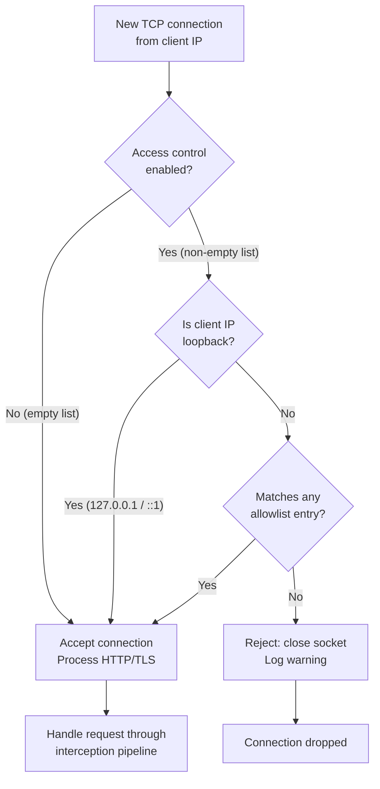
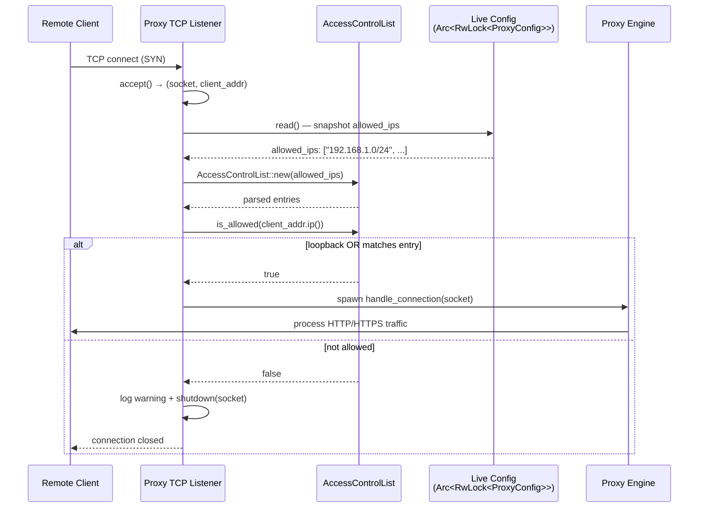
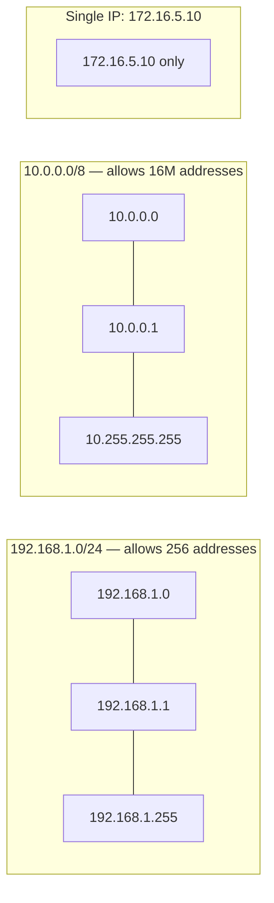
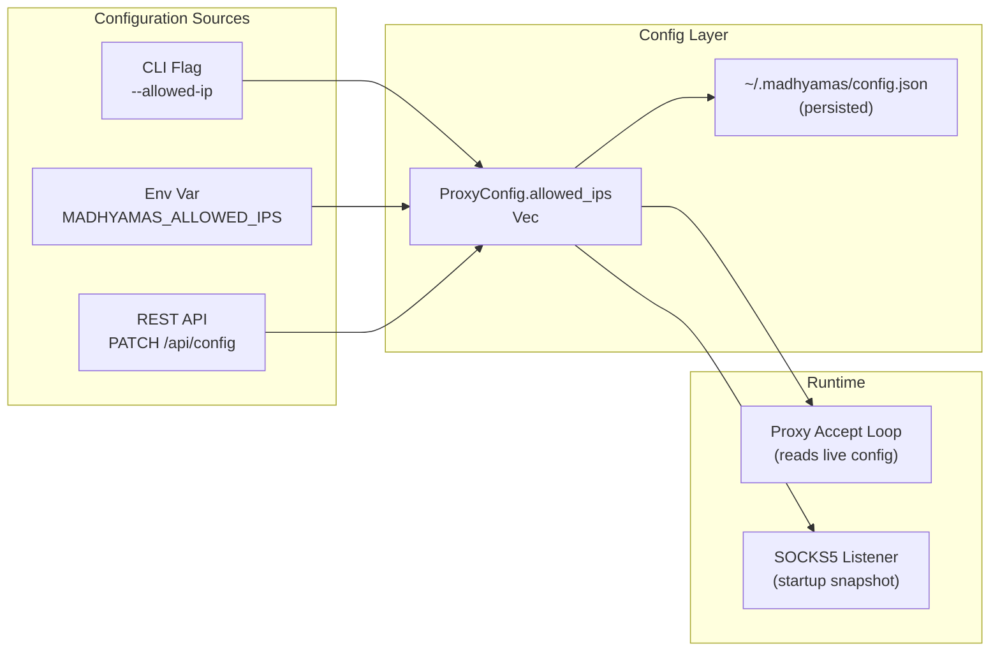
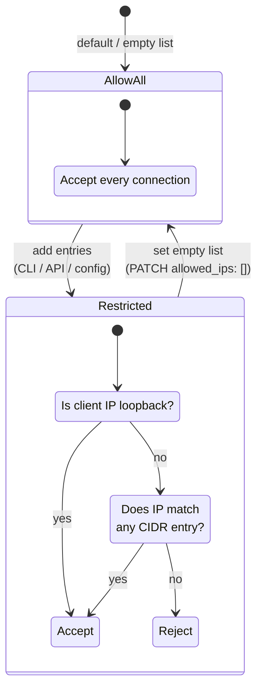
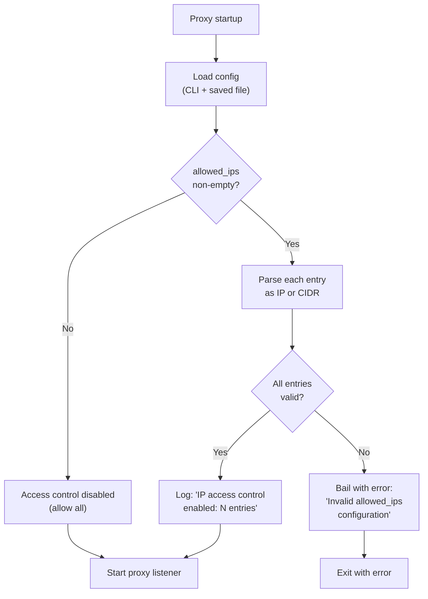

# Access Control (IP Allowlist)

> **Last verified:** 2026-08-12 against Madhyamas `0.1.6`.

Madhyamas can restrict which client IP addresses are allowed to connect to
the proxy. This is useful when you expose the proxy on a network (e.g. for
mobile-device testing, shared debugging, or remote access) and want to
ensure only trusted devices can route traffic through it.

This feature is the equivalent of Charles Proxy's **Access Control**
setting.

---

## How It Works

When the IP allowlist is **enabled** (non-empty), every incoming TCP
connection to the proxy is checked against the list *before* any HTTP/TLS
processing happens. Connections from addresses that don't match any entry
are immediately closed. Connections from loopback addresses
(`127.0.0.1`, `::1`) are **always allowed** — this prevents you from
accidentally locking yourself out of a locally-running proxy.

When the allowlist is **disabled** (empty, the default), all connections
are accepted regardless of source IP. This preserves backward
compatibility for existing deployments.



### Connection Evaluation Detail

The diagram below shows exactly how each connection is evaluated, including
the live-config read that makes API updates take effect immediately:



---

## Supported Entry Formats

Each entry in the allowlist can be:

| Format | Example | Matches |
|--------|---------|---------|
| Single IPv4 | `192.168.1.50` | Only that exact IP |
| IPv4 CIDR | `192.168.0.0/16` | Any IP in `192.168.0.0` – `192.168.255.255` |
| Single IPv6 | `fd00::1` | Only that exact IP |
| IPv6 CIDR | `fd00::/8` | Any IP in `fd00::` – `fdff:ffff:...:ffff` |
| All IPv4 | `0.0.0.0/0` | Any IPv4 address |
| All IPv6 | `::/0` | Any IPv6 address |

> **Note:** A bare IP address is treated as a `/32` (IPv4) or `/128` (IPv6)
> host route. You don't need to write `192.168.1.50/32` — just
> `192.168.1.50`.

### CIDR Range Visualization



---

## Configuration Methods

You can configure the IP allowlist in three ways. All three ultimately
update the same `allowed_ips` field in the proxy configuration.



### 1. CLI Flag (startup)

Use the `--allowed-ip` flag, which is **repeatable**. Each occurrence adds
one entry to the allowlist:

```bash
# Allow a /24 subnet and one specific IP
madhyamas serve --allowed-ip 192.168.1.0/24 --allowed-ip 10.0.0.5

# Allow an IPv6 range
madhyamas serve --allowed-ip fd00::/8

# Combine IPv4 and IPv6
madhyamas serve --allowed-ip 192.168.0.0/16 --allowed-ip fd00::/8
```

You can also use the `MADHYAMAS_ALLOWED_IPS` environment variable with
comma-separated values:

```bash
export MADHYAMAS_ALLOWED_IPS="192.168.1.0/24,10.0.0.5"
madhyamas serve
```

**Precedence:** CLI flags take precedence over the saved config file. When
no CLI flags are provided, the saved config's `allowed_ips` is used (so
runtime API changes persist across restarts).

### 2. REST API (live, no restart)

Update the allowlist at runtime via `PATCH /api/config`. Changes take
effect **immediately** for new connections — no restart needed.

```bash
# Enable access control — allow two subnets
curl -X PATCH http://127.0.0.1:3001/api/config \
  -H "Content-Type: application/json" \
  -d '{"allowed_ips": ["192.168.0.0/16", "10.0.0.0/8"]}'

# View current config
curl http://127.0.0.1:3001/api/config | jq '.access_control_enabled, .allowed_ips'

# Disable access control (allow all)
curl -X PATCH http://127.0.0.1:3001/api/config \
  -H "Content-Type: application/json" \
  -d '{"allowed_ips": []}'
```

**Validation:** Invalid entries (e.g. `"not-an-ip"`, `"10.0.0.0/33"`) are
rejected with `400 Bad Request` and the existing allowlist is left
unchanged.

**Persistence:** API changes are saved to `~/.madhyamas/config.json` and
survive restarts.

### 3. Config File (manual edit)

Edit `~/.madhyamas/config.json` directly:

```json
{
  "allowed_ips": ["192.168.1.0/24", "10.0.0.5", "fd00::/8"]
}
```

Restart the proxy for changes to take effect (the file is read at startup).

---

## API Reference

### `GET /api/config`

Returns the current configuration including access control fields:

```json
{
  "access_control_enabled": true,
  "allowed_ips": ["192.168.1.0/24", "10.0.0.5"]
}
```

| Field | Type | Description |
|-------|------|-------------|
| `access_control_enabled` | `boolean` | `true` when `allowed_ips` is non-empty |
| `allowed_ips` | `string[]` | List of IP/CIDR entries (empty = allow all) |

### `PATCH /api/config`

Update the allowlist. The `allowed_ips` field is optional — only include
it when you want to change access control.

**Request:**
```json
{
  "allowed_ips": ["10.0.0.0/8", "172.16.0.0/12"]
}
```

**Response (200 OK):**
```json
{
  "access_control_enabled": true,
  "allowed_ips": ["10.0.0.0/8", "172.16.0.0/12"]
}
```

**Error (400 Bad Request)** — invalid entry:
```json
{
  "error": "Invalid allowed_ips entry",
  "message": "Configuration error: Invalid IP address `not-an-ip`: ..."
}
```

---

## Behavior Summary



### Key Guarantees

| Scenario | Behavior |
|----------|----------|
| Empty `allowed_ips` | All connections accepted (default) |
| `127.0.0.1` connects | **Always accepted** (loopback) |
| `::1` connects | **Always accepted** (IPv6 loopback) |
| IP matches a CIDR entry | Accepted |
| IP doesn't match any entry | Connection closed immediately |
| Invalid entry in API request | `400 Bad Request`, config unchanged |
| Invalid entry in config file | Startup fails with error message |
| API update to `allowed_ips` | New connections checked immediately |
| SOCKS5 listener | Uses startup snapshot (restart to change) |

---

## Common Use Cases

### Mobile Device Testing

Allow your phone's IP to route traffic through the proxy for debugging:

```bash
# Find your phone's IP (e.g. 192.168.1.42 on your Wi-Fi)
madhyamas serve --allowed-ip 192.168.1.42

# Or allow the whole Wi-Fi subnet
madhyamas serve --allowed-ip 192.168.1.0/24
```

### Team Debugging

Allow multiple developers' machines:

```bash
madhyamas serve \
  --allowed-ip 10.0.1.10 \
  --allowed-ip 10.0.1.11 \
  --allowed-ip 10.0.1.12
```

Or allow the entire office VLAN:

```bash
madhyamas serve --allowed-ip 10.0.0.0/16
```

### Remote Server (SSH Tunnel)

When running Madhyamas on a remote server, restrict access to the server
itself (you'll connect via SSH tunnel, which appears as loopback):

```bash
# On the remote server — only allow local connections
# (SSH tunnel traffic appears as 127.0.0.1, which is always allowed)
madhyamas serve --host 0.0.0.0 --allowed-ip 127.0.0.1
```

### Temporarily Lock Down

If you accidentally exposed the proxy publicly, lock it down immediately
via the API without restarting:

```bash
# Only allow your current machine
curl -X PATCH http://127.0.0.1:3001/api/config \
  -H "Content-Type: application/json" \
  -d '{"allowed_ips": ["127.0.0.1"]}'
```

---

## Startup Validation Flow

When the proxy starts, the allowlist is validated early so a bad entry
fails fast rather than causing silent misbehavior:



---

## Troubleshooting

### "I can't connect to my own proxy"

Loopback (`127.0.0.1`, `::1`) is always allowed. If you can't connect
locally, the issue is not the allowlist — check the proxy port, host
binding, and firewall.

### "A remote device can't connect"

1. Verify the device's IP is in the allowlist: `curl http://127.0.0.1:3001/api/config | jq .allowed_ips`
2. Add the device's IP: `curl -X PATCH http://127.0.0.1:3001/api/config -H "Content-Type: application/json" -d '{"allowed_ips": ["<DEVICE_IP>"]}'`
3. Check the proxy logs for `Connection from <IP> rejected by IP access control` warnings.

### "Startup fails with 'Invalid allowed_ips configuration'"

One of your entries is malformed. Check `~/.madhyamas/config.json` for
the `allowed_ips` field and verify each entry is a valid IP or CIDR
range. Common mistakes:
- `192.168.1.0/33` — IPv4 prefix max is `/32`
- `fd00::/129` — IPv6 prefix max is `/128`
- `192.168.1` — incomplete IP (use `192.168.1.0`)
- `192.168.1.0/24/16` — extra slash

### "API returns 400 when updating allowed_ips"

The request contained an invalid entry. The error response includes the
specific reason. Fix the entry and retry — the existing allowlist is not
modified by a failed request.

---

## Technical Details

### Implementation

- **Module:** `crates/madhyamas-core/src/access_control.rs`
- **Config field:** `ProxyConfig.allowed_ips: Vec<String>`
- **Filter location:** Proxy accept loop (`proxy/engine.rs`) and SOCKS5
  accept loop (`proxy/socks.rs`)
- **No external dependency:** CIDR containment math is self-contained
  (no `ipnet` crate), mirroring the approach used for the upstream-proxy
  bypass list.

### Performance

The allowlist check runs once per accepted connection. For each
connection:
1. A read lock on the config is acquired (cheap, `parking_lot::RwLock`).
2. The `allowed_ips` strings are parsed into `AclEntry` structs.
3. Each entry is tested with a bitwise mask comparison (O(1) per entry).

For high-connection-rate scenarios, the parsing cost is proportional to
the number of entries. In practice this is negligible (allowlists rarely
exceed a few dozen entries).

### Live Updates

The proxy accept loop reads the live config on every `accept()`, so API
updates to `allowed_ips` take effect for **new** connections immediately.
Existing/already-connected clients are unaffected (the check only runs at
connection time, not per-request).

The SOCKS5 listener uses a config snapshot taken at startup (the listener
is bound at startup and requires a restart to rebind), so SOCKS access
control changes require a restart.

## See Also

- [NETWORK_CONFIGURATION.md](NETWORK_CONFIGURATION.md) — Network setup and IP detection
- [SOCKS_PROXY.md](SOCKS_PROXY.md) — SOCKS5 proxy listener (uses access control)
- [API_CONFIG.md](API_CONFIG.md) — Config endpoints (live ACL updates via PATCH /api/config)
- [ARCHITECTURE.md](ARCHITECTURE.md) — System architecture
