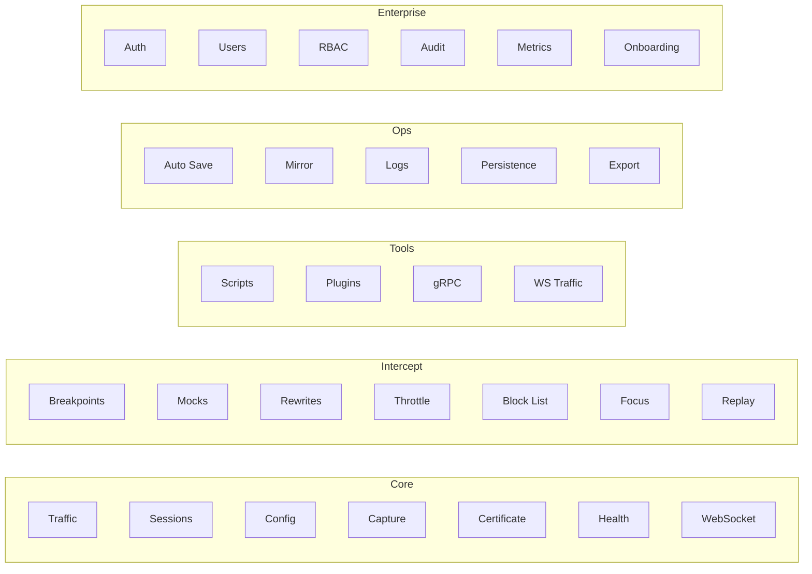

# Madhyamas API Reference

All endpoints are served under `/api` on the API server (default
`http://127.0.0.1:3001/api`). Real-time traffic updates are available via the
WebSocket at `/api/ws`.

The API is organized into domain groups. Each group has a dedicated reference
page; this file is the index.

## Endpoint Map



## Domain Reference

| Domain | File | Endpoints | Notes |
|--------|------|-----------|-------|
| Traffic | [API_TRAFFIC.md](API_TRAFFIC.md) | `/traffic`, `/sessions`, `/export`, `/cert` | Capture, list, filter, sessions, HAR/cURL export |
| WebSocket & gRPC | [API_WEBSOCKET_GRPC.md](API_WEBSOCKET_GRPC.md) | `/ws`, `/ws-traffic`, `/grpc` | Real-time updates, WS traffic inspection, gRPC streams |
| Intercept | [API_INTERCEPT.md](API_INTERCEPT.md) | `/breakpoints`, `/mocks`, `/rewrites`, `/throttle`, `/blocklist`, `/focus`, `/replay` | The intercept pipeline surface |
| Scripts & Plugins | [API_SCRIPTS_PLUGINS.md](API_SCRIPTS_PLUGINS.md) | `/scripts`, `/plugins` | Scripting + WASM plugin management |
| Config & Capture | [API_CONFIG.md](API_CONFIG.md) | `/config`, `/capture`, `/autosave`, `/mirror`, `/logs`, `/persistence`, `/health` | Runtime configuration and operational endpoints |
| Enterprise | [API_ENTERPRISE.md](API_ENTERPRISE.md) | `/auth`, `/users`, `/rbac`, `/audit`, `/metrics`, `/onboarding`, `/performance`, `/health/detailed` | Feature-gated (`enterprise`); JWT-protected |

## Conventions

- **Path parameters** use `{name}` syntax (e.g. `/traffic/{id}`).
- **Query parameters** are documented per-endpoint where applicable.
- All request/response bodies are JSON unless noted otherwise.
- Binary responses (e.g. CA cert, HAR export) use the appropriate content type.
- Enterprise endpoints are mounted only when built with the `enterprise` Cargo
  feature and enabled at startup; they are JWT-protected when an auth service is
  configured (see [ENTERPRISE.md](ENTERPRISE.md)).

## Common Query Parameters

### Traffic filtering

```
GET /api/traffic?method=GET&url=*https://example.com*&status_code=200&content_type=application/json
```

| Parameter | Type | Description |
|-----------|------|-------------|
| `method` | string | HTTP method (GET, POST, etc.) |
| `url` | string | URL pattern (supports wildcards and regex) |
| `status_code` | number | HTTP status code |
| `content_type` | string | Response content type |

### Pagination

```
GET /api/traffic?limit=100&offset=0
```

| Parameter | Type | Description |
|-----------|------|-------------|
| `limit` | number | Max results to return |
| `offset` | number | Number of results to skip |

## WebSocket Events

The WebSocket endpoint (`/api/ws`) sends `WsServerMessage` messages to clients.
See [API_WEBSOCKET_GRPC.md](API_WEBSOCKET_GRPC.md) for the full message schema.

## See Also

- [ARCHITECTURE.md](ARCHITECTURE.md) — System architecture
- [INTERCEPT_PIPELINE.md](INTERCEPT_PIPELINE.md) — Intercept handler priority model
- [ENTERPRISE.md](ENTERPRISE.md) — Enterprise auth/RBAC/audit
- [MCP-INTEGRATION.md](MCP-INTEGRATION.md) — MCP server for AI agent integration
