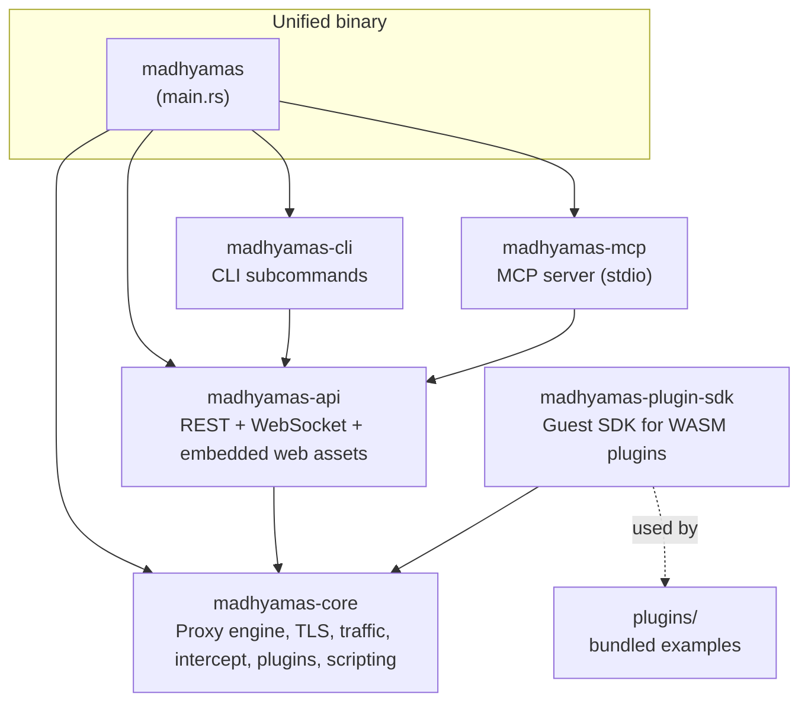
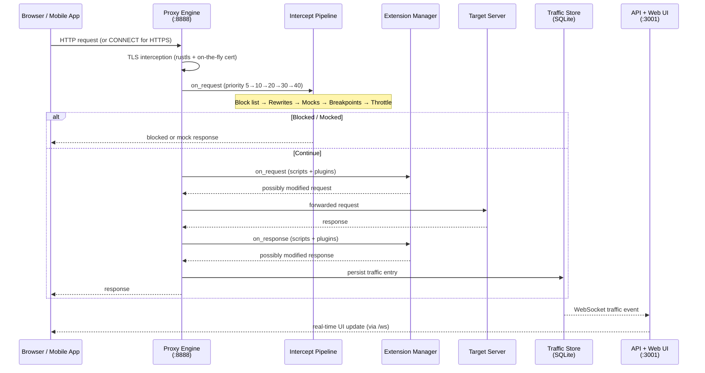

# Madhyamas Architecture

> **Last verified:** 2026-08-12 against Madhyamas `0.1.6`.

## Overview

Madhyamas is an open-source HTTP/HTTPS debugging proxy built in Rust with an
embedded React web UI. It is a single unified binary that combines a MITM
proxy, a REST/WebSocket API server, an MCP server (for AI agent integration),
and a CLI — all sharing one core engine.

## Unified Binary

One `madhyamas` binary exposes three execution modes via subcommands:

| Mode | Command | Description |
|------|---------|-------------|
| Proxy + Web UI | `madhyamas` or `madhyamas serve` | Starts the proxy (`:8888`) and API/web UI (`:3001`) |
| MCP server | `madhyamas mcp` | Runs as a Model Context Protocol server over stdio |
| CLI | `madhyamas traffic list`, `madhyamas export har`, ... | Talks to a running proxy via the REST API |

Web UI assets are embedded into the binary at compile time via `rust-embed`
(see `crates/madhyamas-api/src/embedded_assets.rs`), so the release binary is
fully self-contained — no external static files required.

## Workspace Layout

| Crate | Path | Responsibility |
|-------|------|----------------|
| `madhyamas` | `crates/madhyamas` | Unified entry point. Wires core + API + CLI + MCP into one binary with `serve` / `mcp` / CLI subcommands. |
| `madhyamas-core` | `crates/madhyamas-core` | The engine: proxy, TLS interception, traffic storage, intercept pipeline, scripting (boa), WASM plugins (wasmtime), persistence, enterprise, performance. |
| `madhyamas-api` | `crates/madhyamas-api` | axum REST API + WebSocket server, request handlers, auth middleware, and embedded web assets (rust-embed). |
| `madhyamas-cli` | `crates/madhyamas-cli` | CLI library re-exported by the main binary. Subcommands for traffic, mocks, breakpoints, scripts, plugins, etc. |
| `madhyamas-mcp` | `crates/madhyamas-mcp` | MCP server library re-exported by the main binary. Exposes proxy operations as MCP tools for AI agents. |
| `madhyamas-plugin-sdk` | `crates/madhyamas-plugin-sdk` | Guest SDK for writing WASM plugins: `Plugin` trait, `register_plugin!` macro, `Context`/`Outcome` types. |

## Request / Response Data Flow

### Intercept pipeline priority

Handlers run in ascending priority order. See
[INTERCEPT_PIPELINE.md](INTERCEPT_PIPELINE.md) for the full trait and extension
model, and [EXTENSION_SYSTEM.md](EXTENSION_SYSTEM.md) for the unified
scripting/plugin extension layer.

| Priority | Handler | Effect |
|----------|---------|--------|
| 5 | Block list | Returns a blocked response; request never reaches upstream |
| 10 | Rewrites | Modifies the request before subsequent handlers see it |
| 20 | Mocks | Short-circuits with a mock response |
| 30 | Breakpoints | Prompts the user (only for non-mocked traffic) |
| 40 | Throttle | Applies latency right before forwarding |

## Core Modules

| Module | Path | Description |
|--------|------|-------------|
| Proxy engine | `core/src/proxy/engine.rs` | Main MITM logic: accepts connections, intercepts TLS, runs the intercept pipeline + extensions, forwards upstream |
| TLS | `core/src/tls/certificate.rs` | On-the-fly CA certificate generation and per-host leaf cert signing (rustls + rcgen) |
| Traffic store | `core/src/traffic/store.rs` | SQLite-backed traffic persistence, sessions, focus hosts |
| Intercept | `core/src/intercept/` | Pipeline of `InterceptHandler` impls: block list, rewrite, mock, breakpoint, throttle |
| Extension | `core/src/extension.rs` | Unified `Extension` trait + `ExtensionManager` abstracting scripts and plugins |
| Scripting | `core/src/scripting/` | JavaScript (ES6+) runtime via boa_engine; sandboxed; SQLite-persisted |
| Plugin | `core/src/plugin/` | WASM plugins via wasmtime; fuel-metered; Ed25519-signed; hot-reload |
| Persistence | `core/src/persistence/` | Config and intercept-rule persistence (`config_store`, `intercept_store`) |
| Enterprise | `core/src/enterprise/` | Auth (JWT + API keys), RBAC, audit logging, user management (feature-gated) |
| Performance | `core/src/performance/` | Memory tracking, metrics collector, performance monitor, memory pool |
| Access control | `core/src/access_control.rs` | CIDR-based IP allowlist |
| Auto save | `core/src/auto_save.rs` | Periodic HAR/session backup with optional rotation |
| Mirror | `core/src/mirror.rs` | Saves response bodies to disk mirroring URL path structure |
| Log rotation | `core/src/log_rotation.rs` | Time/size/on-demand rotating file logger |
| gRPC | `core/src/grpc/` | gRPC traffic inspection (feature-gated) |
| WebSocket | `core/src/websocket.rs` | WebSocket traffic capture |

## Technology Stack

| Layer | Technology | Purpose |
|-------|-----------|---------|
| Proxy engine | manual TCP + tokio | HTTP/HTTPS interception |
| Upstream client | hyper / reqwest | Forwarding requests to target servers |
| TLS | rustls + rcgen | Certificate management and MITM |
| API server | axum | REST + WebSocket |
| Storage | rusqlite (SQLite) | Traffic, sessions, intercept rules, scripts, plugins |
| Scripting | boa_engine | Sandboxed JavaScript hooks |
| Plugins | wasmtime | Sandboxed WASM plugins |
| Web UI embedding | rust-embed | Compile-time asset embedding |
| Frontend | React 18, TypeScript, Vite, Tailwind, shadcn/ui, TanStack Query, Zustand | Web UI (see [WEB_FRONTEND.md](WEB_FRONTEND.md)) |

## Feature Flags

Core features are gated behind Cargo features so downstream builds can omit
unused functionality:

| Feature | Default | Enables |
|---------|---------|---------|
| `scripting` | yes | JavaScript scripting system (boa_engine) |
| `plugins` | yes | WASM plugin system (wasmtime) |
| `wasm-runtime` | yes | wasmtime execution runtime for plugins |
| `grpc` | yes | gRPC traffic inspection |
| `enterprise` | no | Auth, RBAC, audit, users, metrics (see [ENTERPRISE.md](ENTERPRISE.md)) |

## Deployment Options

1. **Docker** — containerized deployment (see [DEPLOYMENT.md](DEPLOYMENT.md))
2. **Binary** — standalone release executable (self-contained, web UI embedded)
3. **Package** — Homebrew, AUR, Snap (see [DEPLOYMENT.md](DEPLOYMENT.md))

## Extension Points

1. **Scripts** — JavaScript hooks for request/response modification (see [SCRIPTING.md](SCRIPTING.md))
2. **Plugins** — WASM plugins for custom protocols and logic (see [PLUGINS.md](PLUGINS.md))
3. **Intercept handlers** — Block list, rewrites, mocks, breakpoints, throttle (see [INTERCEPT_PIPELINE.md](INTERCEPT_PIPELINE.md))

Both scripts and plugins are unified under the `Extension` trait — see
[EXTENSION_SYSTEM.md](EXTENSION_SYSTEM.md).

## See Also

- [DEVELOPMENT.md](DEVELOPMENT.md) — Development environment setup and workflow
- [PROXY_FLOW.md](PROXY_FLOW.md) — End-to-end proxy flow with TLS interception detail
- [INTERCEPT_PIPELINE.md](INTERCEPT_PIPELINE.md) — Intercept handler trait and priority pipeline
- [EXTENSION_SYSTEM.md](EXTENSION_SYSTEM.md) — Unified scripting/plugin extension model
- [PERSISTENCE.md](PERSISTENCE.md) — SQLite storage schema and persistence layer
- [WEB_FRONTEND.md](WEB_FRONTEND.md) — Frontend architecture and build flow
- [ENTERPRISE.md](ENTERPRISE.md) — Auth, RBAC, audit (enterprise feature)
- [DEPLOYMENT.md](DEPLOYMENT.md) — Docker, Kubernetes, package deployment
