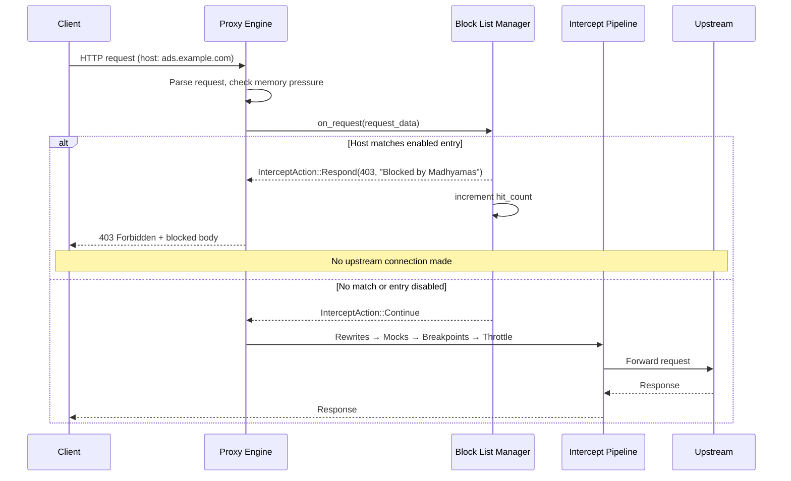
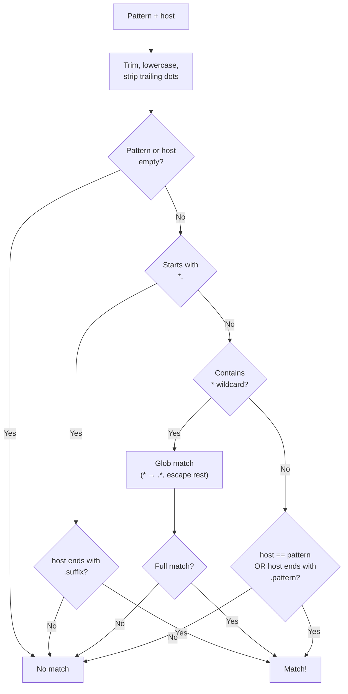
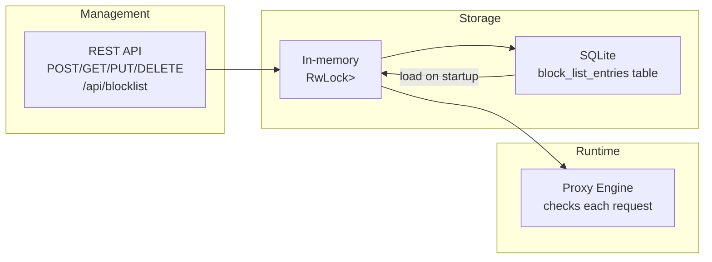
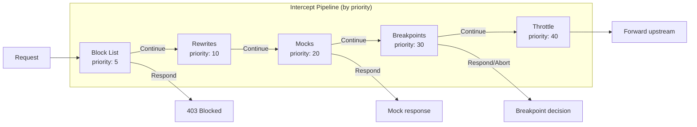
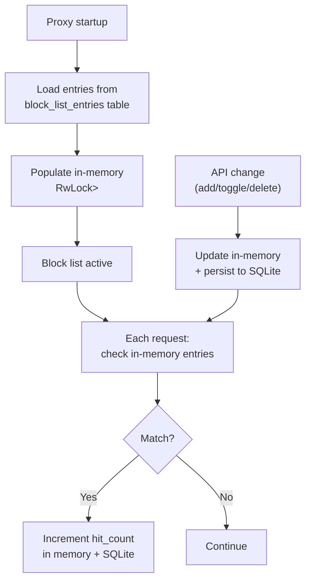

# Block List Tool

> **Last verified:** 2026-08-12 against Madhyamas `0.1.6`.

The Block List tool lets you block requests to specific domains or patterns
from reaching upstream servers. When a request's host matches a block list
entry, the proxy immediately returns a configurable response (default `403
Forbidden` with body `"Blocked by Madhyamas"`) instead of forwarding the
request. No upstream connection is made.

This is useful for:
- Blocking ads, trackers, and analytics scripts during development
- Testing how your app behaves when third-party services are unavailable
- Preventing unwanted external requests in isolated testing environments
- Simulating service outages with custom status codes

---

## How It Works

The block list runs at **priority 5** in the intercept pipeline — before
rewrites (10), mocks (20), breakpoints (30), and throttle (40). This means
blocked requests never reach any other intercept handler or the upstream
server. The check happens early in request processing, right after memory
pressure checks and before rewrite rules are applied.

```mermaid
flowchart TD
    REQ["Incoming request<br/>(host = example.com)"] --> BL{"Block list<br/>has entries?"}
    BL -- "No entries" --> PASS["Continue pipeline<br/>(rewrites → mocks → ...)"}
    BL -- "Has entries" --> MATCH{"Host matches<br/>an enabled entry?"}
    MATCH -- "Yes" --> BLOCK["Short-circuit:<br/>return status_code + body<br/>increment hit_count"]
    MATCH -- "No" --> PASS
    BLOCK --> DONE["Request blocked<br/>(no upstream connection)"]
    PASS --> FWD["Forward to upstream"]
```

### Request Processing Sequence

The diagram below shows exactly where the block list check sits in the
full request processing pipeline:



---

## Pattern Matching

Each block list entry has a `pattern` string that determines which request
hosts it matches. Matching is **case-insensitive** and trailing dots are
stripped.

| Pattern | Matches | Does NOT match |
|---------|---------|----------------|
| `example.com` | `example.com`, `api.example.com`, `www.example.com` | `notexample.com`, `example.org` |
| `*.example.com` | `api.example.com`, `www.example.com` | `example.com` (bare domain) |
| `ads.*` | `ads.com`, `ads.net`, `ads.example.co.uk` | `ads` (no dot) |
| `*ads*` | `doubleclick.ads.com`, `ads.example.com`, `my-ads-server.com` | `example.com` |
| `*` | Any host | (nothing) |

### Pattern Matching Logic



### Key Behaviors

- **Exact domain includes subdomains**: `example.com` matches both
  `example.com` and `api.example.com`. This is consistent with the
  passthrough-domains and upstream-proxy bypass behavior.
- **Leading wildcard excludes the bare domain**: `*.example.com` matches
  subdomains but not `example.com` itself.
- **General wildcards use glob semantics**: `*` matches any sequence of
  characters. Other regex metacharacters (`.`, `+`, `?`, etc.) are
  treated as literal characters, not regex operators.
- **First match wins**: If multiple entries match the same host, the
  first one in the list (by creation order) is used.

---

## Configuration

Block list entries are managed through the REST API. Changes take effect
**immediately** for new requests — no restart needed. Entries are persisted
to the SQLite intercept database and survive restarts.



### API Endpoints

| Method | Endpoint | Description |
|--------|----------|-------------|
| `GET` | `/api/blocklist` | List all entries |
| `POST` | `/api/blocklist` | Create a new entry |
| `GET` | `/api/blocklist/stats` | Get summary statistics |
| `GET` | `/api/blocklist/{id}` | Get a specific entry |
| `PUT` | `/api/blocklist/{id}` | Update an entry |
| `DELETE` | `/api/blocklist/{id}` | Delete an entry |
| `POST` | `/api/blocklist/{id}/toggle` | Enable/disable an entry |

### BlockListEntry Fields

| Field | Type | Default | Description |
|-------|------|---------|-------------|
| `id` | `string` | (auto-generated UUID) | Unique identifier |
| `pattern` | `string` | (required) | Domain or wildcard pattern |
| `note` | `string?` | `null` | Optional human-readable note |
| `enabled` | `boolean` | `true` | Whether the entry is active |
| `hit_count` | `u64` | `0` | Number of requests blocked by this entry |
| `status_code` | `u16` | `403` | HTTP status code returned to client |
| `response_body` | `string` | `"Blocked by Madhyamas"` | Response body text |
| `content_type` | `string` | `"text/plain"` | Response Content-Type header |
| `created_at` | `datetime` | (now) | Creation timestamp |
| `updated_at` | `datetime` | (now) | Last modification timestamp |

---

## Usage Examples

### Block a Single Domain

```bash
# Block all requests to ads.example.com (and its subdomains)
curl -X POST http://127.0.0.1:3001/api/blocklist \
  -H "Content-Type: application/json" \
  -d '{"pattern":"ads.example.com","note":"Block ad server"}'
```

### Block with Custom Response

```bash
# Return 503 Service Unavailable instead of 403
curl -X POST http://127.0.0.1:3001/api/blocklist \
  -H "Content-Type: application/json" \
  -d '{
    "pattern":"api.thirdparty.com",
    "status_code":503,
    "response_body":"{\"error\":\"Service unavailable\"}",
    "content_type":"application/json"
  }'
```

### Block All Subdomains (Wildcard)

```bash
# Block *.tracker.com but not tracker.com itself
curl -X POST http://127.0.0.1:3001/api/blocklist \
  -H "Content-Type: application/json" \
  -d '{"pattern":"*.tracker.com"}'
```

### Block Any Domain Containing "ads"

```bash
# Block doubleclick.ads.com, ads.google.com, my-ads-server.com, etc.
curl -X POST http://127.0.0.1:3001/api/blocklist \
  -H "Content-Type: application/json" \
  -d '{"pattern":"*ads*","note":"Block all ad-related domains"}'
```

### List All Entries

```bash
curl http://127.0.0.1:3001/api/blocklist | jq .
```

Response:
```json
[
  {
    "id": "3e88ba78-73ea-4425-86a3-82de178c8a36",
    "pattern": "ads.example.com",
    "note": "Block ad server",
    "enabled": true,
    "hit_count": 42,
    "status_code": 403,
    "response_body": "Blocked by Madhyamas",
    "content_type": "text/plain",
    "created_at": "2026-08-01T16:28:15.300239Z",
    "updated_at": "2026-08-01T16:28:15.300269Z"
  }
]
```

### View Statistics

```bash
curl http://127.0.0.1:3001/api/blocklist/stats | jq .
```

Response:
```json
{
  "total": 3,
  "enabled": 2,
  "disabled": 1,
  "total_hits": 156
}
```

### Toggle an Entry (Disable/Enable)

```bash
# Disable an entry (requests will pass through)
curl -X POST http://127.0.0.1:3001/api/blocklist/{id}/toggle \
  -H "Content-Type: application/json" \
  -d '{"enabled":false}'

# Re-enable an entry
curl -X POST http://127.0.0.1:3001/api/blocklist/{id}/toggle \
  -H "Content-Type: application/json" \
  -d '{"enabled":true}'
```

### Delete an Entry

```bash
curl -X DELETE http://127.0.0.1:3001/api/blocklist/{id}
```

### Update an Entry

```bash
curl -X PUT http://127.0.0.1:3001/api/blocklist/{id} \
  -H "Content-Type: application/json" \
  -d '{
    "id":"{id}",
    "pattern":"ads.example.com",
    "enabled":true,
    "hit_count":0,
    "status_code":451,
    "response_body":"Unavailable For Legal Reasons",
    "content_type":"text/plain",
    "created_at":"2026-01-01T00:00:00Z",
    "updated_at":"2026-01-01T00:00:00Z"
  }'
```

---

## Common Use Cases

### Blocking Ads and Trackers During Development

Prevent ad and analytics scripts from making external requests while
you're developing or testing your app:

```bash
# Block common ad/tracker domains
for domain in \
  "doubleclick.net" \
  "google-analytics.com" \
  "facebook.com/tr" \
  "adservice.google.com" \
  "scorecardresearch.com"; do
  curl -s -X POST http://127.0.0.1:3001/api/blocklist \
    -H "Content-Type: application/json" \
    -d "{\"pattern\":\"$domain\"}" > /dev/null
done
```

### Simulating API Outages

Test how your application handles third-party API failures:

```bash
# Simulate a 503 from a payment provider
curl -X POST http://127.0.0.1:3001/api/blocklist \
  -H "Content-Type: application/json" \
  -d '{
    "pattern":"api.stripe.com",
    "status_code":503,
    "response_body":"{\"error\":{\"type\":\"api_error\",\"message\":\"Service unavailable\"}}",
    "content_type":"application/json"
  }'
```

### Blocking All External Requests (Air-Gapped Testing)

Block all non-localhost traffic to test in an isolated environment:

```bash
# Block everything (use with caution — this blocks ALL external requests)
curl -X POST http://127.0.0.1:3001/api/blocklist \
  -H "Content-Type: application/json" \
  -d '{"pattern":"*","note":"Block all external traffic"}'
```

> **Note:** The block list checks the request `host` field. Localhost
> requests to Madhyamas's own API are not affected because the API is
> served on a separate port and the proxy pipeline excludes self-requests.

### Legal Compliance Blocking (HTTP 451)

```bash
curl -X POST http://127.0.0.1:3001/api/blocklist \
  -H "Content-Type: application/json" \
  -d '{
    "pattern":"blocked-content.example.com",
    "status_code":451,
    "response_body":"Unavailable For Legal Reasons",
    "note":"Court order #12345"
  }'
```

---

## Intercept Pipeline Priority

The block list runs first in the intercept pipeline, ensuring blocked
requests never trigger other handlers:



| Priority | Handler | Action on match |
|----------|---------|-----------------|
| 5 | **Block List** | Short-circuit with block response |
| 10 | Rewrites | Modify request/response in place |
| 20 | Mocks | Short-circuit with mock response |
| 30 | Breakpoints | Pause and wait for user decision |
| 40 | Throttle | Apply latency, then continue |

Because the block list runs at priority 5, a blocked domain will never
trigger rewrite rules, mock responses, or breakpoints — even if those
handlers have matching rules for the same domain.

---

## Persistence

Block list entries are stored in the SQLite intercept database
(`~/.madhyamas/intercept.db`) in the `block_list_entries` table.



### Persistence Behavior

| Action | In-memory | SQLite | Takes effect |
|--------|-----------|--------|--------------|
| Add entry | Immediately | Immediately | Next request |
| Toggle entry | Immediately | Immediately | Next request |
| Update entry | Immediately | Immediately | Next request |
| Delete entry | Immediately | Immediately | Next request |
| Proxy restart | Loaded from DB | — | At startup |
| `POST /api/persistence/save` | — | Saves all entries | — |
| `POST /api/persistence/load` | Replaced from DB | — | Next request |

---

## Response Format

When a request is blocked, the proxy returns:

```
HTTP/1.1 403 Forbidden
Content-Type: text/plain
X-Blocked-By: madhyamas-block-list:ads.example.com

Blocked by Madhyamas
```

- The `X-Blocked-By` header identifies which block list entry caused the
  block, making it easy to debug in the traffic view.
- The status code, body, and content type are all configurable per entry.
- The response is recorded in the traffic list like any other response,
  with `duration_ms: 0` (no upstream round-trip).

---

## Troubleshooting

### "My request isn't being blocked"

1. Verify the entry exists and is enabled:
   ```bash
   curl http://127.0.0.1:3001/api/blocklist | jq '.[] | {pattern, enabled}'
   ```
2. Check that the pattern matches the request host. Use the pattern
   matching rules above — remember that `*.example.com` does NOT match
   `example.com` (use `example.com` without the wildcard for that).
3. Check the traffic view — blocked requests appear with the configured
   status code and `X-Blocked-By` header.

### "A request is blocked but I didn't add that domain"

Block list entries persist across restarts. Check for leftover entries:
```bash
curl http://127.0.0.1:3001/api/blocklist | jq '.[] | {pattern, note, created_at}'
```

### "The hit count isn't incrementing"

The hit count only increments when a request is actually blocked (the
entry is enabled and the host matches). Verify the request is going
through the proxy (check the traffic view) and that the entry is enabled.

### "Toggle doesn't seem to work"

If multiple entries match the same host, toggling one off doesn't unblock
the domain if another enabled entry still matches. Check for duplicate
entries:
```bash
curl http://127.0.0.1:3001/api/blocklist | jq '[.[] | .pattern] | group_by(.) | map(select(length > 1))'
```

---

## Technical Details

### Implementation

- **Module:** `crates/madhyamas-core/src/intercept/block_list.rs`
- **Manager:** `BlockListManager` — holds `RwLock<Vec<BlockListEntry>>`
  with optional `Arc<InterceptStore>` for persistence
- **Trait:** Implements `InterceptHandler` with priority 5
- **Pipeline integration:** Direct call in
  `Pipeline::process_request()` before the rewrite step
- **Persistence:** `block_list_entries` table in `intercept.db`
- **Pattern matching:** Self-contained glob/suffix matching (no external
  regex dependency beyond the existing `regex_cache`)

### Performance

The block list check runs once per request. For each request:
1. A read lock on the entries vector is acquired (cheap,
   `parking_lot::RwLock`).
2. Each enabled entry is tested with a string comparison or glob match.
3. On first match, the response is built and the hit count is incremented.

For high-traffic scenarios with many entries, the linear scan is
proportional to the number of enabled entries. In practice, block lists
rarely exceed a few hundred entries, so this is negligible.

### Thread Safety

`BlockListManager` uses `parking_lot::RwLock` for thread-safe access:
- **Read lock** during request matching (multiple concurrent readers)
- **Write lock** for hit count increments and CRUD operations
- The `InterceptStore` uses its own `Mutex<Connection>` for SQLite access

## See Also

- [INTERCEPT_PIPELINE.md](INTERCEPT_PIPELINE.md) — Intercept handler priority model
- [API_INTERCEPT.md](API_INTERCEPT.md) — Block list API endpoints
- [REWRITE_TEMPLATES.md](REWRITE_TEMPLATES.md) — Built-in rewrite templates
- [PERSISTENCE.md](PERSISTENCE.md) — Block list persistence schema
