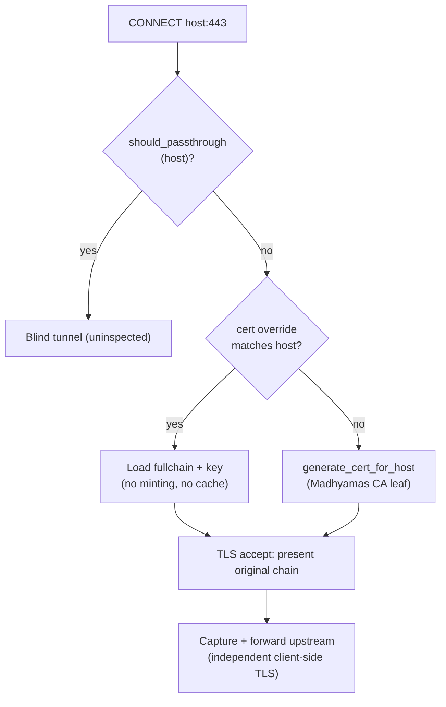

# Certificate Overrides for Pinned Apps (Analysis Document)

Status: draft for maintainer review
Roadmap item: "Certificate overrides for pinned apps" — Under exploration
  ([public roadmap](https://shristilabs.github.io/madhyamas/roadmap))
Tracking issue: none yet

## Summary

Apps with certificate pinning reject every leaf certificate Madhyamas mints,
because the minted chain is signed by the Madhyamas CA rather than the pinned
identity. Existing workarounds fight the app (APK patching, Frida, root
modules). There is, however, a category no current option addresses: when the
operator **holds the private key of the pinned identity** — a staging/test
backend you control, or an enterprise app pinning your organisation's
internal CA. In that case the clean interception exists in principle: present
the app the exact identity it pinned. This document analyses the options,
states the cryptographic boundary honestly, and recommends a per-host
certificate-override feature.

## The cryptographic boundary (why "same certificate" means "same private key")

A pin check compares **public material only** — the SHA-256 of a
SubjectPublicKeyInfo (SPKI pin, as used by OkHttp `CertificatePinner` and
Android Network Security Config `pin-set`), or a hash of the full
certificate. Possession scenarios:

| Pin type | You have | Result |
|---|---|---|
| Leaf SPKI (OkHttp / NSC) | leaf cert **+ its private key** | Works: proxy replays the original chain; pin matches and chain validation passes (it is the server's genuine identity) |
| Full-leaf-cert hash | cert + key | Works: byte-identical certificate |
| Intermediate/CA SPKI (enterprise apps pinning their internal CA) | **that CA's** cert + key | Works: mint leaves from that CA; OkHttp/NSC pass if *any* pin matches *any* cert in the presented chain |
| Any | certificate only (no key) | **Fails**: the TLS handshake requires a signature from the private key; it dies before the pin check is even evaluated |

Certificates are public artifacts (`openssl s_client -connect host:443
-showcerts` fetches the chain); only the key is secret. **Without the key of
the pinned identity, proxy-side interception is cryptographically impossible
— that is pinning working as designed**, and the app-side bypasses in
[ANDROID_CERT_PINNING.md](ANDROID_CERT_PINNING.md) remain the only options.

A second constraint: pinning layers **on top of** standard chain validation,
so the proxy must present the **entire original chain** (leaf + all
intermediates), not just the pinned certificate.

## Current-state inventory

| Concern | Where it lives today | Notes |
|---|---|---|
| CA lifecycle | `CertificateManager::new` / `new_with_ca_files` (`crates/madhyamas-core/src/tls/certificate.rs:48` / `:115`) | Generates or loads the Madhyamas CA; `--ca-cert-file`/`--ca-key-file` (`crates/madhyamas/src/main.rs:984`) let the operator substitute their own CA pair. |
| Leaf minting | `generate_cert_for_host` (`certificate.rs:264`) | **Always** mints a fresh rcgen ECDSA P-256 leaf signed by the Madhyamas CA. LRU cache, 10k entries / 24 h TTL. |
| CONNECT handling | `handle_https_tunnel` (`proxy/engine.rs:614`) | Passthrough check first (`:647`), then `generate_cert_for_host(host)` at `:655`, then TLS accept. |
| TLS server config | `create_tls_server_config` (`engine.rs:1064-1088`) | Parses the cert PEM with `rustls_pemfile::certs` — **already accepts a multi-cert chain** — and `rustls_pemfile::private_key` (PKCS#8 / PKCS#1 / SEC1). |
| Cert carrier type | `GeneratedCert { certificate: PEM, private_key: PEM }` (`tls/mod.rs:11-27`) | Exactly the shape an override must produce; no rustls-level changes needed. |
| Pinning failure UX | TLS-accept error branch (`engine.rs:670-707`) | Records a 502 entry with the CONNECT headers; message explicitly names certificate pinning. |
| SSL passthrough | `Config::should_passthrough` (`config.rs:1236-1242`) | Exact/suffix host match; tunnels without interception. |
| CA key on disk | 0600 permissions enforced (`certificate.rs:75-85`, `save_ca` `:161-194`) | Precedent for override key files. |

**Gap:** nothing between "mint from Madhyamas CA" and "don't intercept at
all". The override plugs into machinery that is already chain- and
key-format-capable.

## Options considered

### Option A — Per-host certificate override (recommended)

For selected hosts (exact names and wildcard suffixes), the operator supplies
the original **full-chain PEM** and the matching **private key PEM**; on
CONNECT the proxy presents that chain verbatim instead of minting.



**Pros**

- Defeats leaf SPKI pins, full-cert pins, and (when the supplied chain
  includes the pinned intermediate/CA) CA pins — with **no root access, no
  modified APK, no runtime hooks**.
- Zero new TLS machinery: `GeneratedCert` + `create_tls_server_config`
  already accept chain+key PEMs.
- Precedent: mitmproxy `--certs host=cert+key`, Charles Proxy custom
  certificates — a known, documented UX.

**Cons**

- Only usable by operators holding the key (the boundary above) — must be
  communicated clearly or users will expect a universal bypass.
- Private key files on the proxy host: new secret-handling surface
  (permissions, API exposure, exports — see Design).
- Interaction with cert expiry: an expired override leaf breaks chain
  validation even though the pin would match; needs load-time warnings.

### Option B — CA substitution via existing flags (works today)

Run Madhyamas with `--ca-cert-file`/`--ca-key-file` pointing at the pinned
**enterprise CA** (`main.rs:984` → `new_with_ca_files`). Minted leaves then
chain to that CA, so **CA/intermediate SPKI pins** match.

**Pros**: zero code; already shipped (built for multi-instance CA sharing).

**Cons**: affects *every* minted certificate fleet-wide (all hosts now chain
to your CA — usually fine in an enterprise, surprising otherwise); does
nothing for leaf pins; semantically overloads a flag documented for shared
CAs.

### Option C — App-side bypasses (status quo)

Frida, apk-mitm, LSPosed modules, reFlutter — see
[ANDROID_CERT_PINNING.md](ANDROID_CERT_PINNING.md) and
[CERT_PINNING_PLAIN_ENGLISH.md](CERT_PINNING_PLAIN_ENGLISH.md).

**Pros**: only path when you do **not** hold the key.

**Cons**: fights the app (root/repackage/hooks), anti-tamper arms race,
modified-app behaviour differs from production — all reasons a proxy-side
option is worth building for the key-holding case.

### Option D — Non-option: mirroring the server's public certificate

"Fetch the server's cert and present it" is **cryptographically impossible**:
the handshake requires a signature from the private key, which the public
certificate does not contain. Called out because it is the most commonly
proposed variant of this feature. Only variants that supply the key (Option
A) or the signing CA (Option B) can work.

## Tradeoff matrix

| Criterion | A per-host override | B CA substitution | C app-side bypass |
|---|---|---|---|
| Defeats leaf SPKI / full-cert pins | **yes** (with key) | no | usually |
| Defeats CA/intermediate pins | yes (chain includes it) | **yes** (with CA key) | usually |
| Needs root / modified app | no | no | often |
| Scope of effect | per-host | every minted cert | per-app install |
| New secret-handling surface | key files on proxy host | existing CA flags | none on proxy |
| Code required | small (config + lookup + loader) | none | none |
| Works without the pinned key | no (impossible) | no (impossible) | yes |

## Recommended approach — Option A, design sketch

**Configuration** (YAML + `PATCH /api/config`, mirroring `ignored_domains`):

```yaml
https:
  cert_overrides:
    - host: "api.staging.example.com"     # exact match wins
      cert_file: "/etc/madhyamas/certs/staging-fullchain.pem"
      key_file: "/etc/madhyamas/certs/staging-key.pem"
    - host: "*.internal.example.com"      # wildcard suffix, last
      cert_file: "/etc/madhyamas/certs/internal-fullchain.pem"
      key_file: "/etc/madhyamas/certs/internal-key.pem"
```

**Semantics**

1. **Matching**: exact hostname first, then longest wildcard suffix;
   first match wins. Reuse the matching style of `is_host_ignored`
   (`store.rs:467-494`) for consistency.
2. **Precedence**: passthrough list (`engine.rs:647`) **wins** over
   overrides — you cannot intercept a host you pass through; validate at
   load time and reject configs where both match.
3. **Lookup point**: inside `generate_cert_for_host` (`certificate.rs:264`)
   before the cache — overrides are loaded artifacts, not minted ones, so
   they bypass the LRU cache entirely; or (cleaner separation) a check in
   `handle_https_tunnel` (`engine.rs:655`) that skips minting. Either way
   the result is a `GeneratedCert` built from the loaded PEMs.
4. **Loading & reload**: parse and validate (chain order leaf-first, key
   matches leaf's public key, hostname covered by SAN/CN, expiry check)
   once at startup and on config change; cache the parsed `GeneratedCert`
   in memory. **Fail-closed at startup** on invalid overrides; a failed
   runtime reload warns and keeps the last-good chain.
5. **Security**: key files require 0600 and are never served via the API,
   never included in exports/backups/HAR, never logged; enterprise audit
   event on override load/reload (see [ENTERPRISE.md](ENTERPRISE.md)).
   Document that handing the proxy a staging key scopes the risk to what
   that key can sign.
6. **Upstream unaffected**: the proxy→server connection performs its own
   client-side TLS (`engine.rs:1401`); client certificate (mTLS) upstreams
   are a separate feature and explicitly out of scope here.

**Test plan (core cases)**

- Override presented: `openssl s_client` through the proxy shows the
  original chain, leaf SPKI equals the pinned SPKI.
- Wildcard and exact-match precedence; passthrough-override conflict
  rejected at load.
- Expired override leaf → startup warning, handshake behaviour documented.
- Key/cert mismatch, wrong chain order, unreadable files → startup errors.
- Config PATCH live-reload swaps chains without restart; last-good on bad
  reload.
- Cache interplay: overridden hosts never appear in the minted-cert cache.

**Phasing**

1. Core: config parsing, validation, lookup, presentation (OSS feature —
   it is a debugging capability, not multi-user infrastructure).
2. Live reload via `PATCH /api/config` + UI affordance in settings.
3. Docs: end-user page under HTTPS & Certificates; cross-link from the
   pinning guides; roadmap item updated to Built/shipped.

## Explicitly rejected

| Idea | Why rejected |
|---|---|
| Certificate mirroring without the key (Option D) | Cryptographically impossible; the handshake needs a private-key signature. |
| Keys stored in the config DB / settable via API | Concentrates long-term secrets in a lower-trust surface than the filesystem with 0600; config PATCH of key *paths* is the safe boundary. |
| Auto-fetching the server chain to "pre-fill" overrides | Public chain alone is useless (Option D) and invites the misconception that the feature works without the key. |
| Global "present original certs everywhere" mode | Impossible in general (you don't hold keys for arbitrary hosts) and would turn configuration errors into mysterious handshake failures. |

## Open questions (maintainers)

1. Config surface: `https.cert_overrides` as above, or CLI-only
   (`--cert-override host=cert:key`) first, mitmproxy-style?
2. Should overrides apply to plain-HTTP-in-TLS only, or also gate the
   SSL-passthrough decision (e.g., an override implies "intercept if you
   can")?
3. Per-listener overrides (ties into listener profiles — see
   [TRAFFIC_SCOPING_PER_APP.md](TRAFFIC_SCOPING_PER_APP.md)) — needed, or
   YAGNI for now?
4. UI: minimal settings list vs a "pinned app debugging" wizard that walks
   through extracting the chain and locating the key.

## Follow-up issues (not yet created)

1. "cert_overrides: per-host fullchain+key presentation for pinned hosts" —
   core feature per the design sketch.
2. "Load-time validation + audit events for certificate overrides".
3. "Docs: pinned-app interception with your own keys" — end-user guide +
   roadmap update.

## See also

- [ANDROID_CERT_PINNING.md](ANDROID_CERT_PINNING.md) /
  [CERT_PINNING_PLAIN_ENGLISH.md](CERT_PINNING_PLAIN_ENGLISH.md) — app-side
  bypass options (the path when you do not hold the key)
- [PROXY_FLOW.md](PROXY_FLOW.md) — where interception and cert generation
  sit in the CONNECT flow
- [ENTERPRISE_MULTI_INSTANCE.md](ENTERPRISE_MULTI_INSTANCE.md) — the shared
  CA flags this feature borrows precedence from
- Public roadmap item with the end-user framing:
  [Certificate overrides for pinned apps](https://shristilabs.github.io/madhyamas/roadmap#certificate-overrides-for-pinned-apps)
