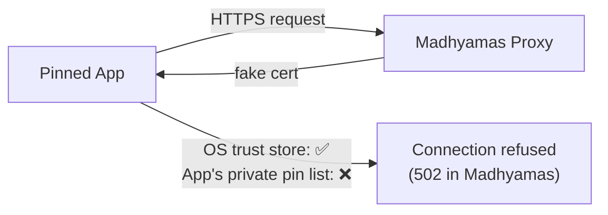
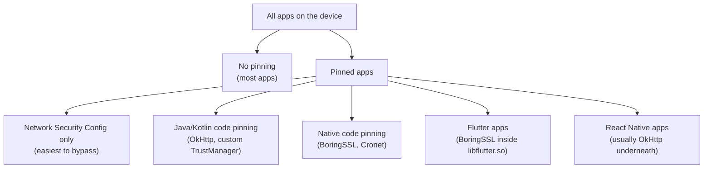
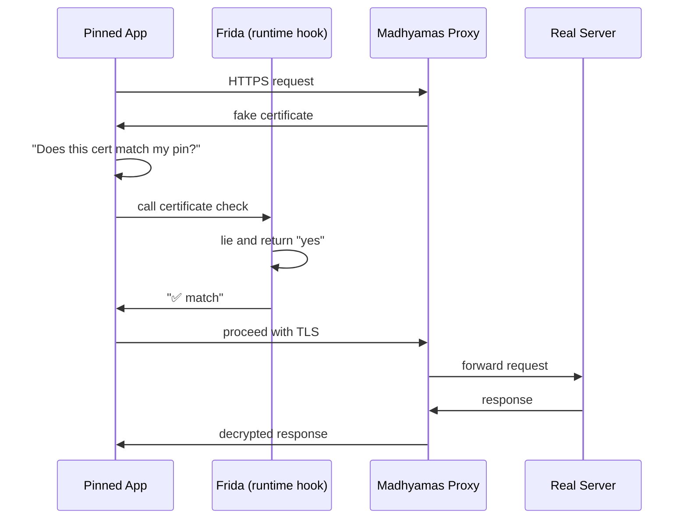
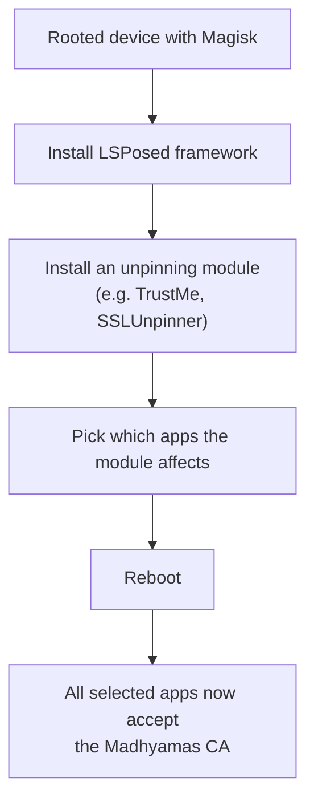
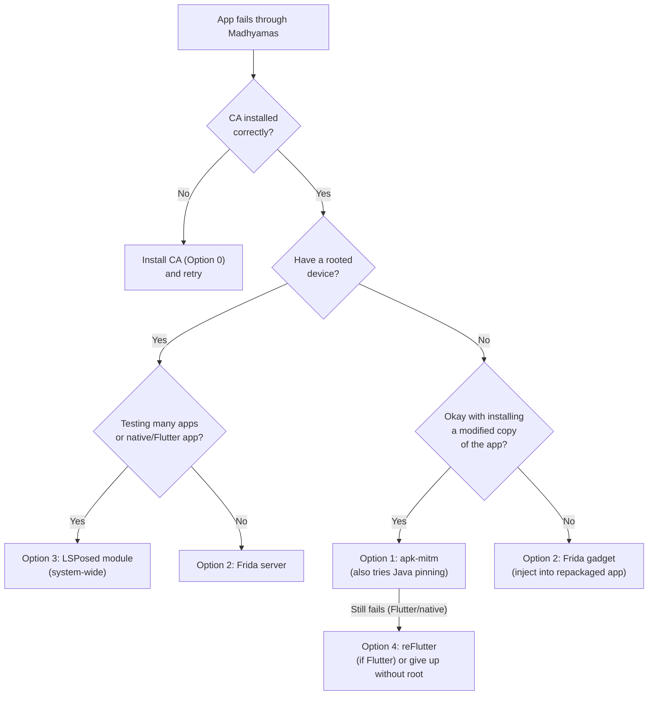
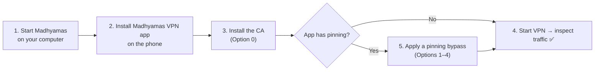

# App Certificate Pinning — A Plain‑English Guide

This guide explains what **certificate pinning** is, why it stops
Madhyamas (and every other debugging proxy) from seeing an app's HTTPS
traffic, and what your options are when you hit a pinned app. It is
written for people who are **not** developers — QA engineers, security
testers, product managers, and curious tinkerers.

> If you are a developer and want the exact commands, see the companion
> document: [ANDROID_CERT_PINNING.md](./ANDROID_CERT_PINNING.md).

---

## 1. The Problem in One Paragraph

When you point an app at the Madhyamas proxy to inspect its traffic, the
proxy has to pretend to be the real server. To do that convincingly it
shows the app a **fake certificate** signed by a Madhyamas "root
certificate" that you install on your device once. Most apps happily
accept this because they trust whatever certificates the operating system
trusts. **Certificate pinning** is an extra‑strict security feature some
apps add on top: instead of trusting the operating system, the app
hardcodes the *exact* certificate (or public key) it expects from the
real server. When the proxy presents its fake certificate, the app
notices the mismatch and refuses to connect. From your point of view the
request just fails silently — and in Madhyamas you will see a **502 Bad
Gateway** entry with the message *"TLS handshake failed: the client does
not trust the proxy CA certificate."*

---

## 2. A Real‑World Analogy

Imagine a nightclub with two layers of security:

| Layer | Who checks | What they check |
|-------|-----------|-----------------|
| **The bouncer at the door** | The operating system | "Is this ID on the government's approved list?" — this is the **system trust store**. Installing the Madhyamas CA is like adding Madhyamas to the government's list. |
| **A VIP list at the bar** | The app itself | "Is this person **specifically** on *my* private list?" — this is **certificate pinning**. Even if the bouncer lets you in, the bar can still turn you away. |

Installing the Madhyamas CA gets you past the bouncer. It does **not**
get you onto the VIP list. To drink at the bar you have to either:

- convince the bar to add you to its private list (modify the app), or
- sneak in through the kitchen while the bar staff look the other way
  (hook the app at runtime).

That is exactly what the rest of this guide covers.

---

## 3. How Madhyamas Normally Intercepts HTTPS

Step by step, in plain English:

1. The app tries to open an HTTPS connection to `api.example.com`.
2. Because the app is configured to use the Madhyamas proxy, the
   connection first goes to the proxy.
3. The proxy makes up a fake certificate for `api.example.com` on the
   spot, signed by the Madhyamas CA you installed.
4. The app checks this certificate against the **operating system's**
   list of trusted CAs, finds the Madhyamas CA, and says "OK, I trust
   you."
5. The proxy now decrypts the traffic, records it, and forwards it to
   the real server.

With pinning, step 4 fails. The app does an **extra** check against its
own private list, does not find the proxy's certificate there, and
aborts the connection.

---

## 4. The Tell‑Tale Signs of Pinning

You do not need to be a developer to recognise pinning. Look for these
clues:

- **In Madhyamas**, the request shows up as a **502 Bad Gateway** with a
  body that starts with *"TLS handshake failed: the client does not
  trust the proxy CA certificate."* This is the proxy telling you the
  app rejected its fake certificate.
- **The app itself** shows a network error, "no internet connection,"
  or simply fails to load data — even though every other app on the
  phone works fine through the proxy.
- **Only specific apps** fail. If your browser, email, and random apps
  all work but one banking or streaming app refuses, pinning is the
  most likely culprit.
- **The failure is instant.** Pinning rejects the connection during the
  TLS handshake, so the 502 appears almost immediately — there is no
  long timeout.

> Tip: If you see 502s for **every** HTTPS site, that usually means you
> have **not** installed the Madhyamas CA at all, not that every site is
> pinned. Install the CA first (see section 6) before concluding
> pinning is the problem.

---

## 5. The Landscape: Apps That Pin vs Apps That Don't

| App category | Examples | How hard to bypass? |
|--------------|----------|---------------------|
| **No pinning** | Most casual apps, many internal tools | Easy — just install the CA. |
| **NSC‑only pinning** | Some enterprise apps | Easy — modify a config file inside the app. |
| **Java/Kotlin pinning** | Many banking, fintech, social apps | Medium — needs an automated patcher or a runtime hook. |
| **Native pinning** | Some games, Google‑using apps | Hard — needs low‑level hooking. |
| **Flutter apps** | Apps built with the Flutter toolkit | Hard — the SSL check is baked into a binary blob. |
| **React Native apps** | Apps built with React Native | Usually medium — most use OkHttp under the hood. |

The harder the pinning, the more likely you need a **rooted** device or
a **modified copy** of the app.

---

## 6. Option 0 — Before Anything Else: Install the CA Properly

This is not a pinning bypass, but it is the foundation for every other
option. Without it, nothing works.

**What happens behind the scenes:** the Madhyamas VPN app downloads the
CA from `http://<your-computer>:3001/api/cert/ca` and hands it to
Android's built‑in certificate installer. You will see a scary Android
warning that says the CA is not trusted by all apps — that is normal and
expected.

<ref_file file="/Users/harikiranbavineni/madhyamas/android/app/src/main/java/com/madhyamas/vpn/vpn/CertInstallActivity.kt" />

> **Important distinction:** Android keeps **user** certificates and
> **system** certificates in two separate stores. By default, apps only
> trust the **system** store. Installing the CA as a user certificate
> works for apps that follow the default rules, but **not** for apps
> that explicitly demand system‑level trust. That is why some of the
> options below exist.

---

## 7. Option 1 — Modify the App's Config File (No Root Needed)

**Best for:** apps whose pinning lives in a single XML config file
(Network Security Config).

**The idea in plain English:** some apps do not hardcode the pin in
their code. Instead they ship a small text file that says "only trust
these specific certificates." If you can open the app's package, edit
that text file to say "actually, trust user certificates too," and
repack it, the app will accept the Madhyamas CA.

**What you need:**
- A computer (any OS).
- The app's installer file (the `.apk`).
- A free tool called **apk‑mitm** (it does the unpack/edit/repack
  automatically — see the developer guide for the one‑line command).

**Good news:** `apk‑mitm` also tries to disable common code‑level
pinning at the same time, so it is worth trying even if you are not sure
whether the app uses NSC or Java pinning.

**Bad news:**
- Does **not** work for Flutter or React Native apps that pin at the
  native level.
- Some heavily protected apps detect that they have been repacked and
  refuse to run.
- You are installing a **modified** copy of the app, not the original —
  fine for testing, not for production use.

---

## 8. Option 2 — Runtime Hooking with Frida (Root or Gadget)

**Best for:** most Java/Kotlin pinning and some native pinning.

**The idea in plain English:** instead of modifying the app's files, you
let the app start up normally and then **intercept its decisions in real
time**. A tool called **Frida** sits between the app and the operating
system. Every time the app asks "does this certificate match my pin?"
Frida jumps in and answers "yes, definitely, carry on." The app never
realises it has been lied to.

**Two flavours of Frida:**

| Flavour | Requires root? | How it gets in |
|---------|---------------|----------------|
| **Frida server** | Yes | A small program runs on the device with full privileges and attaches to any app. |
| **Frida gadget** | No | You inject Frida into the app's package (similar to Option 1) and the app loads it on startup. |

**Good news:**
- The most reliable approach for Java/Kotlin pinning.
- Works on the **original** app (with the server flavour) — no
  repackaging needed.
- A single community script handles OkHttp, Conscrypt, WebView, custom
  TrustManagers, and more.

**Bad news:**
- The server flavour needs a **rooted** device.
- The gadget flavour still needs you to repackage the app.
- Some apps detect Frida and refuse to run (there are anti‑detection
  tools, but it becomes an arms race).
- Native pinning (Flutter, Cronet) needs extra, app‑specific scripts.

---

## 9. Option 3 — System‑Wide Modules (Rooted Devices Only)

**Best for:** testing many apps on the same device, or apps that use
native pinning you cannot hook any other way.

**The idea in plain English:** instead of fighting each app one at a
time, you install a **module** on a rooted device that patches SSL
verification for **every** app at once. Think of it as installing a
"trust everything" switch at the operating system level.

**Popular modules (you only need one):**

| Module | Strengths |
|--------|-----------|
| **TrustMe** | Widest coverage — 37+ hook targets including OkHttp, Conscrypt, WebView, Cronet, Jetpack Compose. |
| **ssl‑kill‑switch‑lsposed** | Also handles Flutter and React Native native pinning. |
| **SSLUnpinner** | Multi‑architecture Flutter patching. |

A second, related trick is to install the Madhyamas CA into the
**system** certificate store (instead of the user store) using a Magisk
module like **MagiskTrustUserCerts**. This alone does **not** defeat
code‑level pinning, but it fixes the "app only trusts system CAs"
problem without you having to modify the app.

**Good news:**
- Set it up once, test many apps.
- Handles native pinning that other options cannot.
- Works on the original, unmodified apps.

**Bad news:**
- Requires a **rooted** device (or an emulator you control).
- On Android 14+, the system CA store moved into a sealed container and
  needs a specialised module (e.g. **Cert‑Fixer**, **TrustAnyCert**).
- Rooting a personal device has security and warranty implications —
  use a dedicated test device or emulator.

---

## 10. Option 4 — Flutter Apps (Special Case)

Flutter apps are awkward because the SSL check does not live in Java
land at all — it lives inside a precompiled binary blob called
`libflutter.so` that ships with the app. The Java‑level hooks in Options
2 and 3 do not reach it.

**Two ways forward:**

| Approach | Root needed? | How it works |
|----------|-------------|--------------|
| **reFlutter** | No | Repackages the app with a patched Flutter engine that skips SSL verification. Only works for supported Flutter versions. |
| **Frida native hook** | Yes | Searches `libflutter.so` for the SSL verification function and forces it to return "OK." Needs a Frida script tailored to the Flutter version. |

**Good news:** reFlutter needs no root and is fully automatic.

**Bad news:** reFlutter only supports specific Flutter engine versions.
If the app was built with an unsupported version, you fall back to the
Frida native approach, which needs root and some trial and error.

---

## 11. Option 5 — React Native Apps (Special Case)

Most React Native apps do **not** implement their own pinning — they
inherit whatever the underlying Android networking library does, which
is usually **OkHttp**. That means the standard Java‑level bypasses
(Option 2 or 3) usually work.

If the app's developers went out of their way to add native pinning on
top of OkHttp, treat it like a native pinning case (Option 3 or 4).

---

## 12. Decision Guide — Which Option Should I Try?

Read this as a flowchart of questions:

1. **Is the CA installed correctly?** If not, do Option 0 first. Most
   "pinning" reports turn out to be a missing CA.
2. **Do you have a rooted device?** If yes, you have the most options.
   For testing many apps or for native/Flutter apps, go straight to
   Option 3 (LSPosed module). For a single Java/Kotlin app, Option 2
   (Frida server) is fast and reliable.
3. **No root?** Are you willing to install a **modified copy** of the
   app? If yes, try Option 1 (`apk‑mitm`) — it is the easiest no‑root
   path and often works in one shot. If `apk‑mitm` does not work and
   the app is Flutter, try Option 4 (`reFlutter`). If the app is too
   heavily protected, you will likely need root.

---

## 13. Quick Comparison Table

| Option | Root needed? | Modifies the app? | Works for | Effort |
|--------|-------------|-------------------|-----------|--------|
| **0. Install CA** | No | No | Apps with no pinning | Trivial |
| **1. APK patching (apk‑mitm)** | No | Yes (repack) | NSC + most Java pinning | Low |
| **2. Frida (server)** | Yes | No | Java/Kotlin pinning, some native | Medium |
| **2. Frida (gadget)** | No | Yes (inject) | Same as above | Medium |
| **3. LSPosed module** | Yes | No | System‑wide, including native/Cronet | Medium (one‑time setup) |
| **3. Magisk CA module** | Yes | No | Apps that only need system‑level trust | Low |
| **4. reFlutter** | No | Yes (repack) | Flutter apps (supported versions) | Low |
| **4. Frida native hook** | Yes | No | Flutter apps (any version) | High |
| **5. Standard Java bypass** | Depends | Depends | Most React Native apps | Low–Medium |

---

## 14. Combining Everything with the Madhyamas VPN App

The Madhyamas VPN companion app handles **one job only**: routing the
phone's traffic to your Madhyamas proxy. It does **not** bypass pinning
by itself. The typical workflow is:

1. Start Madhyamas on your computer (`madhyamas serve`).
2. Install the Madhyamas VPN app on the phone and point it at your
   computer's IP.
3. Install the CA through the VPN app (Option 0).
4. If the target app has pinning, apply one of Options 1–4 **in
   addition** to the VPN.
5. Start the VPN. Traffic now flows: app → VPN → Madhyamas proxy →
   internet.

The VPN is what makes the traffic reach Madhyamas at all; the pinning
bypass is what makes the app willing to talk to Madhyamas once it gets
there.

---

## 15. Things to Watch Out For

- **Anti‑debugging and anti‑Frida detection.** Some apps look for signs
  of Frida, root, or repackaging and crash on purpose. There are
  counter‑tools (e.g. **phantom‑frida**) but this becomes a cat‑and‑
  mouse game. If you hit this, an LSPosed module (Option 3) is usually
  the most robust path.
- **Android 14+ system CA store.** The system certificate store moved
  into a sealed APEX container. Older Magisk CA modules stop working.
  Use a module that explicitly supports Android 14 (e.g. **Cert‑Fixer**,
  **TrustAnyCert**).
- **Emulators are your friend.** An Android emulator with a writable
  system partition lets you install the CA directly into the system
  store without rooting a real device. This is the cleanest setup for
  repeatable testing.
- **Legal and ethical scope.** Only intercept traffic from apps and
  devices you own or are authorised to test. Bypassing pinning on apps
  you do not control may violate terms of service or local law.
- **Modified apps are not the real app.** A repackaged app may behave
  slightly differently (e.g. some anti‑tamper checks disable features).
  Always confirm findings on a real, unmodified install where possible.

---

## 16. Where to Go Next

- **Developer‑level commands** for every option described here:
  [ANDROID_CERT_PINNING.md](./ANDROID_CERT_PINNING.md)
- **How the proxy and TLS interception work internally**:
  [PROXY_FLOW.md](./PROXY_FLOW.md)
- **Android VPN companion app setup**:
  [android/README.md](../android/README.md)
- **General Madhyamas usage**: [README.md](../README.md)

---

## 17. Glossary

| Term | Plain‑English meaning |
|------|----------------------|
| **CA (Certificate Authority)** | A "stamp of approval" issuer. The Madhyamas CA is a custom one you create and install on your device. |
| **Certificate** | A digital ID card a server presents to prove who it is. |
| **Pinning** | An app keeping its own private list of acceptable certificates, ignoring the operating system's list. |
| **APK** | The installer file for an Android app (like a `.exe` on Windows). |
| **Root / rooting** | Getting administrator‑level access on an Android device so you can modify the operating system. |
| **Magisk** | A popular tool for rooting Android devices and installing system‑level modules without permanently altering the OS. |
| **LSPosed** | A framework that lets modules hook into apps system‑wide on rooted devices. |
| **Frida** | A runtime hooking tool that lets you change an app's behaviour while it is running. |
| **NSC (Network Security Config)** | An Android config file inside the app that declares which CAs the app trusts. |
| **OkHttp** | A common Android networking library that many apps use under the hood. |
| **Flutter** | A Google toolkit for building apps; ships its own SSL code that ignores Android's trust store. |
| **React Native** | A Facebook/Meta toolkit for building apps with JavaScript; usually uses OkHttp underneath. |
| **BoringSSL** | Google's fork of OpenSSL; the actual SSL library inside Flutter and Cronet. |
| **Cronet** | Google's native networking library used by some apps (e.g. Chrome, YouTube). |
