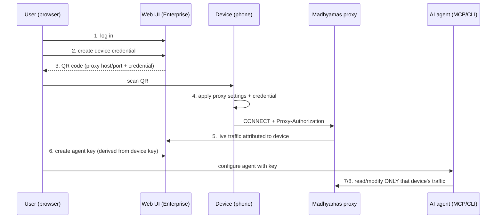
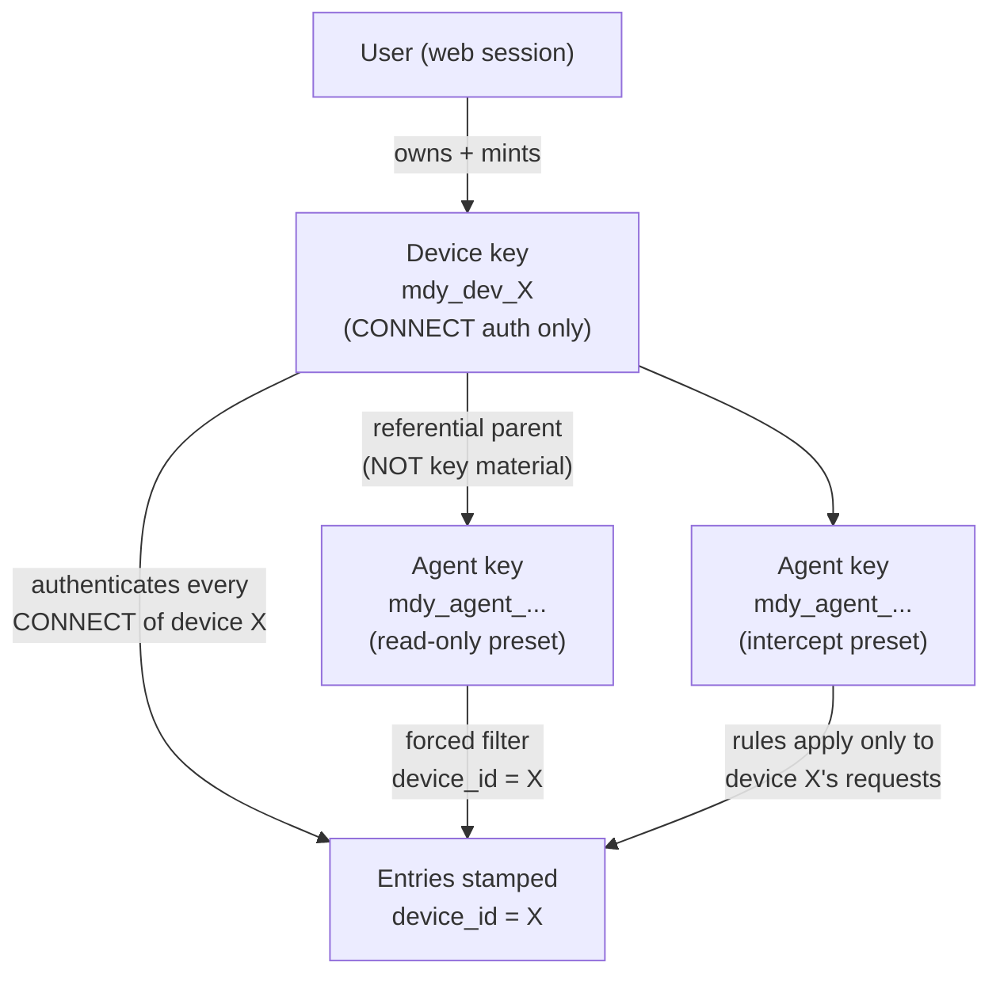

# Credential-Based Onboarding: Devices and AI Agents (Analysis Document)

Status: draft for maintainer review
Origin: maintainer flow proposal, 2026-09
Builds on: [TRAFFIC_SCOPING_PER_DEVICE.md](TRAFFIC_SCOPING_PER_DEVICE.md)
  (credential identity mechanism) and
  [ENTERPRISE_AI_AGENTS.md](ENTERPRISE_AI_AGENTS.md) (agent access gaps)
Tracking issue: none yet

## Summary

The proposed user journey: Madhyamas Enterprise runs on a server; an
enterprise user logs in to the web UI, generates a device credential,
transfers it to a phone by QR code, applies the proxy settings, and
immediately sees that device's HTTP traffic. The user then generates
further API keys to connect AI agents (MCP/CLI) that monitor and modify
the same traffic. **Refinement (maintainer, 2026-09): agent keys are
derived *from* a device key, and an agent's monitoring/modification
applies only to the requests that arrived with that same device key.**
**Scope (maintainer, 2026-09): the entire credential hierarchy and its
enforcement are Enterprise-tier only** — they exist precisely because
multiple users share one instance. OSS single-user deployments are
unchanged: no login, no keys, no scoping (see *Tier placement* below).
This document walks the journey step by step, marks what exists today,
identifies the gaps, proposes the design (QR payload, key hierarchy,
per-platform application), and maps the required changes by component.

**Headline findings**

- The scaffolding largely exists: enterprise login, API-key endpoints and
  panel (`POST /auth/api-keys`, `web/src/features/admin/ApiKeysPanel.tsx`),
  a QR renderer already in the web app (`qrcode.react`, used in
  `CertificateHelper.tsx`), an onboarding wizard
  (`web/src/features/onboarding/OnboardingWizard.tsx`), and proxy-credential
  parsing in the engine (`engine.rs:588-611`).
- **Agent transport and auth are already built** (Phases 8a/8b/8d/9.6 —
  now closed issues): the API middleware validates `X-API-Key` with
  per-route scope checks (`middleware.rs:250-277`), MCP/CLI carry
  credentials with an HTTP transport, and the engine's CONNECT auth
  bridges to `AuthManager` (`auth.rs:620-642`,
  `impl ProxyAuthValidator`). The *current-state* section of
  [ENTERPRISE_AI_AGENTS.md](ENTERPRISE_AI_AGENTS.md) predates those
  phases and is historical.
- The structural gaps that remain: the validated proxy identity is
  **discarded** (`ProxyAuthValidator::validate` returns
  `Result<(), String>` — no attribution), there are **no device
  principals** (keys map to users only), the scope model is user-RBAC
  only (no feature-scope taxonomy mapped to endpoints/tools, no MCP tool
  filtering by key scopes), and no device-bound minting/cascade.
- One security gap has no existing mitigation: the proxy listener is
  plaintext, so Basic credentials cross untrusted networks in cleartext.

## The proposed journey



## Step-by-step analysis

### Step 1 — User logs in — EXISTS

JWT login/refresh, roles, audit events — see
[ENTERPRISE.md](ENTERPRISE.md) / [ENTERPRISE_WEB_UI.md](ENTERPRISE_WEB_UI.md).
No gap for this flow.

### Step 2 — Generate device credential — PARTIAL

**Exists:** `GET/POST /auth/api-keys`, `DELETE /auth/api-keys/{id}`
([API_ENTERPRISE.md](API_ENTERPRISE.md)); key format `mad_{uuid}` via
`X-API-Key`; audit events `ApiKeyCreated` / `ApiKeyRevoked`; management UI
in `web/src/features/admin/ApiKeysPanel.tsx`.

**Gaps**

| Gap | Why it matters |
|---|---|
| Keys are **user-typed only** (`api_keys.user_id`, `auth.rs:82-102`) | No device principal: a device key would grant *user* powers and attribute traffic to the user, not the device. |
| No **credential-purpose scopes** | A device key must never call the REST API; an agent key must never manage keys. Today scopes exist but no connect-only preset. |
| No device metadata | Name ("Hari's Pixel"), install UUID, last-seen, owner relationship — the traffic view needs the friendly name from the first captured byte. |
| No expiry/rotation options for device keys | Long-lived secrets need lifecycle controls. |

### Step 3 — Show credential as QR code — SMALL GAP

**Exists:** `qrcode.react` is already a dependency
(`web/package.json`), rendering QRs in `CertificateHelper.tsx`.

**Gaps:** no QR payload format; no one-time/short-lived display policy.
The QR encodes a **long-lived secret** — see Security below; prefer an
enrollment-token exchange when the scanning client can perform one
(companion app), with show-once raw credential as the manual fallback.

### Step 4 — Apply proxy details on the device — PLATFORM-SPLIT

This is the hardest step, and it is **not uniform across platforms**
(analysed in [TRAFFIC_SCOPING_PER_DEVICE.md](TRAFFIC_SCOPING_PER_DEVICE.md)):

| Path | How "apply" works | Works for |
|---|---|---|
| A. Companion deep link | QR is `madhyamas://connect?...`; companion stores credential, activates VPN + injection | Android (existing companion), iOS (future companion) |
| B. Manual entry | QR also displays the values as text; user types host/port/user/password into WiFi proxy settings | iOS (auth fields exist); OEM Android skins (Samsung One UI, MIUI) |
| C. iOS configuration profile | Web UI offers a `.mobileconfig` (Wi-Fi payload embeds proxy + credential); user installs profile | Supervised/managed iOS fleets |
| D. Unique port per device | Each device key is bound to a dedicated proxy port; **the port is the identity** — no auth header needed | Stock Android (no auth fields) and anything that can set host/port only |

**Option D tradeoffs** — it neatly sidesteps the stock-Android auth-field
gap, but: a bare port is a weak bearer secret (any LAN scanner inherits
the device identity), it multiplies listeners/firewall rules, and it
conflicts with shared-deployment NAT (port must be exposed publicly per
device). Recommend keeping D as an explicitly-labelled "insecure LAN
convenience" mode or rejecting it; A/B/C are the real paths.

### Step 5 — See the device's HTTP calls — STRUCTURAL GAP

Requires the per-device attribution work from the scoping docs:

1. Stop discarding the validated proxy identity at CONNECT
   (`engine.rs:588-611`): resolve device principal, stamp entries
   (`device_id`), **persist `client_addr`** as metadata
   ([TRAFFIC_SCOPING_PER_APP.md](TRAFFIC_SCOPING_PER_APP.md) Option B).
2. Stable per-device session (created at first connect, human name from
   the registered device record) instead of the single global
   `current_session_id` (`store.rs:33`).
3. Traffic filter dimension `device_id` end-to-end: `TrafficFilter` →
   SQL → `TrafficQuery` → `useTraffic.ts` → toolbar.
4. UX closure: a live "device connected" indicator (first CONNECT with
   the credential flips the device card from *pending* to *capturing*) —
   this is what makes the QR flow feel magical instead of hopeful.

### Step 6 — Generate API keys for AI agents — PARTIAL, KNOWN GAPS

**Exists:** same key endpoints/panel as step 2 — plus, since Phases
8a/8b/8d/9.6, the transport story: middleware `X-API-Key` validation
with scope checks (`middleware.rs:250-277`), MCP/CLI credential support
with a Streamable HTTP transport, and the engine CONNECT bridge
(`auth.rs:620-642`). The gap table in
[ENTERPRISE_AI_AGENTS.md](ENTERPRISE_AI_AGENTS.md) §3 predates those
phases.

**Gaps (current):**

| Surface | Gap |
|---|---|
| Scope model | User-RBAC scopes only — no **feature-scope taxonomy** mapped to traffic/intercept endpoints, no per-feature read/write split |
| MCP server | Tool list is not filtered by the key's scopes; no `annotations` carrying required scopes |
| Minting | No device-context minting (`POST /api/devices/{id}/agent-keys`), no device binding, no cascade lifecycle |

Plus this flow's additions: agent keys are **minted in a device context**
(`POST /api/devices/{id}/agent-keys`) with **user-selected feature
scopes** — at mint time the user picks which capabilities the agent may
use (traffic read, mocks, rewrites, breakpoints, ...), with presets as
one-click starting points — see the hierarchy section below for the
derivation, scope taxonomy, and enforcement design.

### Steps 7/8 — Agent monitors / modifies traffic — DEPENDS ON 5 + 6

The interception surface itself is rich and agent-ready (135 MCP tools;
breakpoints, rewrites, mocks via REST — [TOOL_COVERAGE.md](TOOL_COVERAGE.md)).
Gaps once access works:

- **Scoping**: with the device-bound refinement, agent enforcement is a
  forced `device_id` equality (see hierarchy section) — **simpler than
  and independent of per-user scoping**, which remains needed only for
  *human* visibility on shared instances
  ([TRAFFIC_SCOPING_PER_USER.md](TRAFFIC_SCOPING_PER_USER.md)). The
  genuinely new work is on the **modify** side: intercept rules need a
  device scope, and the pipeline needs the attribution context at match
  time.
- **Conflict visibility**: two agents editing mocks/breakpoints
  simultaneously need last-writer-wins plus audit attribution
  (`audit_events` exist; add `api_key_id` on intercept mutations —
  partially present per [API_ENTERPRISE.md](API_ENTERPRISE.md) event
  schema).
- **Audit**: every agent mutation should record which key did it
  (`ApiKeyUsed`-style events).

## Gap summary

| # | Gap | Component | Blocking for |
|---|---|---|---|
| 1 | Proxy identity discarded at CONNECT | `madhyamas-core/engine.rs` | Step 5 |
| 2 | No device principals / device metadata | `madhyamas-enterprise` | Steps 2, 5 |
| 3 | No per-device sessions / `device_id` filter | core store + API + web | Step 5 |
| 4 | QR payload + enrollment policy | web UI (+ API) | Step 3 |
| 5 | Platform apply paths (deep link, profile, manual copy) | companion, web UI | Step 4 |
| 6 | Scope model is user-RBAC only — no feature-scope taxonomy per endpoint/tool; MCP tools not filtered by key scopes | enterprise + mcp | Step 6 |
| 7 | *(Superseded)* agent transport/auth — resolved by Phases 8a/8b/8d/9.6 | — | — |
| 8 | Feature-scope taxonomy + per-endpoint/tool mapping + mint-time scope picker | enterprise + API + MCP | Steps 6-8 |
| 9 | Plaintext proxy listener (Basic auth cleartext) | `madhyamas-core` | Security |
| 10 | Agent keys have no parent-device binding (mint-in-device-context, cascade lifecycle) | enterprise | Steps 6-8 |
| 11 | Intercept rules are global — no `device_id` scope; pipeline lacks attribution context at match time (`pipeline.rs:199-201, 239, 594`) | core `intercept/` + `proxy/pipeline.rs` | Step 8 (modify) |
| 12 | WebSocket event stream (`traffic_tx`) is unscoped per subscriber | api | Step 7 (live) |
| 13 | SOCKS listener performs no auth — device traffic via SOCKS is unattributable (`socks.rs:627-642`) | core `proxy/socks.rs` | Step 5 via SOCKS steering |

## Design

### QR payload

A URI scheme the companion can own, degraded gracefully to text:

```text
madhyamas://connect?host=proxy.example.com&port=8888&tls=0
  &key=mdy_dev_8f3a...          (or token=mdy_enroll_... for exchange)
  &name=Hari%27s%20Pixel
  &ca=http://proxy.example.com:3001/api/cert/ca
  &api=http://proxy.example.com:3001/api
```

Alongside the QR, always render the raw values (host, port, username,
password) for manual entry, exactly as `CertificateHelper.tsx` pairs the
CA QR with instructions.

**Two provisioning modes.**

1. **Enrollment token (preferred, companion path):** the QR carries a
   short-lived (e.g., 15 min), single-use token; the companion exchanges
   it (authenticated device registration) for the real long-lived key.
   The QR itself is then not a standing credential — a photographed
   screen expires.
2. **Show-once credential (manual path):** for devices that cannot run
   an exchange (manual proxy entry), display the password once at
   creation, warn against screenshotting, and offer instant rotation.

### Key types and scopes

| Key type | Principal | Auth surface | Scopes | Lifetime |
|---|---|---|---|---|
| Device key (`mdy_dev_...`) | device (belongs to user) | `Proxy-Authorization` at CONNECT | connect-only — **no REST API** | long, rotatable |
| Agent key (`mdy_agent_...`) | **device** (derived from a device key) | `X-API-Key` on REST / MCP HTTP | **user-selected feature scopes** (`traffic:read`, `mocks:write`, ...) — **all forced to the parent device's traffic**; presets as shortcuts (read-only agent, intercept agent) | medium, expiry recommended; cascades with device |
| User key (today's `mad_...`) | user | REST | existing RBAC scopes (device management, other-device access) | unchanged |

Distinct prefixes let middleware and audit classify keys without a DB
hit on the hot path.

## Device-bound agent keys: hierarchy and scoped enforcement

### Tier placement: Enterprise-only (OSS unchanged)

This flow and everything in this section is gated to the Enterprise tier,
applying the same principle [GATEWAY_SCOPING.md](GATEWAY_SCOPING.md) uses
for capability decisions: **behaviour that only matters when several
people share one system is Enterprise; single-user local behaviour is
OSS.** Concretely:

| Capability | Tier | Notes |
|---|---|---|
| Login, device principals, device/agent key hierarchy, minting, cascade lifecycle, forced filters, scoped rules enforcement, audit events | **Enterprise** (`madhyamas-enterprise`) | Meaningless without multiple principals |
| Attribution context struct, `client_addr` / `device_id` columns (nullable), `device_id` scope field on intercept rules (`None` = global) | Core, **inert in OSS** | Schema/pipeline plumbing only; OSS never populates them, rules stay `None`/global — zero behavioural change |
| OSS behaviour today | Unchanged | No auth on the proxy path, single implicit user sees all traffic; nothing in this design adds mandatory auth to OSS |

Two consequences worth stating:

1. **Solo enterprise deployments still benefit**: one user debugging
   alone gets device isolation (phone vs laptop timelines), scoped
   agents, and audit — the tier is about *capability*, not team size.
2. **The core primitives land ungated but unused** — this follows the
   existing pattern where core carries machinery and enterprise carries
   identity/enforcement (`AuthProvider`/`Authorizer` traits,
   [ENTERPRISE_API_INTEGRATION.md](ENTERPRISE_API_INTEGRATION.md)).

The maintainer refinement turns the flat key list into a **credential
hierarchy rooted at the device**, and makes agent scoping a simple
equality instead of the full per-user machinery:



### What "based on the device key" means — derivation options

| Option | Mechanism | Verdict |
|---|---|---|
| **Referential binding (recommended)** | Agent key row carries `parent_device_id`; key material is independent random. Resolution: `X-API-Key` -> key row -> device. | **Recommended.** Survives device-key rotation (agents reference the *device*, not the material); minting is a user-authenticated API action, so possession of a device key can never self-mint agent keys; trivially auditable. |
| Cryptographic derivation (HKDF from device key material) | Agent token mathematically derived from the device secret. | Rejected: rotation invalidates every derived key; anyone holding the device key (the phone, a snatcher) could derive/mint capabilities offline — escalation without authorization; no benefit since issuance is server-side anyway. |
| Chained JWT-style signed claims | Agent key embeds a signed claim binding it to device X. | Unnecessary indirection: the claim still needs server-side revocation state, which is exactly what the DB reference already provides. |

### Scoping semantics — "requests containing the same API key"

Precise definition: an agent key bound to device X may read or modify
**only entries produced by connections authenticated with device X's key**
(at CONNECT, `engine.rs:588-611`). Consequences and edge cases:

| Case | Behaviour | Why |
|---|---|---|
| Device key rotated mid-debug | Agents keep working; see full history | Scope is `device_id`, not key material (referential binding) |
| Device reconnects (new IP, same key) | Same scope | Identity is the key, never the address |
| Traffic from another device (same user) | **Invisible/untouchable** | `device_id != X` — even though the owner is the same user |
| Unauthenticated traffic (no device key) | Invisible to agents | No `device_id`; only the owner/admin sees it |
| Device key revoked / device deleted | **Cascade**: agent keys die with it | The device is gone; debugging it is meaningless — safe default, and it makes cleanup one action |
| Traffic via the SOCKS listener | Gap — see below | SOCKS path carries no credentials today |

**SOCKS gap.** The blind-tunnel listener (`proxy/socks.rs:627-642`)
performs no authentication, so device traffic steered via SOCKS would be
unattributed and invisible to agents. Fix options: require
device-carrying traffic to use the HTTP proxy listener only (document),
or implement RFC 1929 SOCKS5 username/password auth mapped to device
credentials (small, standards-based).

### Enforcement — two axes, one resolver

Middleware resolves any `X-API-Key` to `(user, device?, scopes)` once;
every request is then authorized on **two orthogonal axes**:

- **Data axis (device binding)**: *whose traffic* — forced
  `device_id = key.device_id`, from the hierarchy.
- **Capability axis (feature scopes)**: *what actions* — the
  user-selected feature scopes, checked per endpoint/tool.

```text
              feature scopes (capability)
              traffic:read  mocks:write  breakpoints:write  ...
             +------------+------------+--------------------+
   device X  |     Y      |     Y      |        Y           |  <- key allows
   device Y  |     N      |     N      |        N           |  <- device binding denies
   global    |     N      |     N      |        N           |
             +------------+------------+--------------------+
```

Per path:

1. **Read (REST/MCP queries).** Requires `traffic:read` (capability),
   then a forced filter — `device_id = key.device_id` — is injected into
   `TrafficFilter` regardless of what the caller asks for;
   caller-supplied `device` params are intersected, never widened.
   Server-side, so an agent cannot escape either axis even by trying.
2. **Live (WebSocket `GET /ws`).** Requires `traffic:read`; the event
   stream (`traffic_tx`) is filtered per connection by the key's device
   before emission — an agent's subscription only ever receives its
   device's entries.
3. **Modify (interception rules — the real work).** Requires the
   matching feature scope (`mocks:write`, `rewrites:write`,
   `breakpoints:write`, `blocklist:write`, `throttle:write`). Today's
   rules (rewrites, mocks, breakpoints, block list —
   `intercept/rewrite.rs`, `mock.rs`, `block_list.rs`, `breakpoint.rs`)
   are **global**: they match every request. Device-bound agents require
   a `device_id` scope on rules and the device context at match time:
   - Rule model: `device_id: Option<DeviceId>` — `None` = user-global
     (owner/admin only), `Some(X)` = applies only to device X's requests,
     visible/editable by X's agents and the owner.
   - Pipeline context: the pipeline entry points
     (`proxy/pipeline.rs:199-201, 239, 594`) currently receive only
     `RequestData` + session. An **attribution context**
     (`device_id`, `client_addr`, `listener` — the same struct the
     scoping docs need) must be resolved at CONNECT and flow through to
     rule matching, so `device_id = Some(X)` rules are skipped for every
     other device.
   - Breakpoints: an agent's breakpoint pauses only device X's matching
     request; other devices flow through unaffected.
   - Audit: every rule mutation records `api_key_id` (which agent) and
     the rule's device scope.

### Feature scopes: the taxonomy

Scope strings use `{feature}:{action}` and unify with the existing
enterprise scope mechanism (`api_keys.scopes`, `auth.rs:82-102`;
`required_scope` mapping, `middleware.rs:145`) so **one enforcement path
serves user keys and agent keys alike**. Proposed taxonomy, mapped to the
real API surface ([API_INTERCEPT.md](API_INTERCEPT.md),
[TOOL_COVERAGE.md](TOOL_COVERAGE.md)):

| Scope | Gates | Risk note |
|---|---|---|
| `traffic:read` | `GET /api/traffic*`, count, entry detail, live ws stream | Sees request/response bodies — secrets included |
| `traffic:export` | HAR / curl export | Bulk exfiltration path; separate from read on purpose |
| `mocks:read` / `mocks:write` | Mock CRUD, collections | Write shapes device traffic |
| `rewrites:read` / `rewrites:write` | Rewrite rules CRUD | Write mutates live requests |
| `breakpoints:read` / `breakpoints:write` | Breakpoint set/pause/resume | Pausing holds device requests |
| `blocklist:read` / `blocklist:write` | Block rules | Denies device requests |
| `throttle:read` / `throttle:write` | Throttle profiles | Degrades device traffic |
| `replay:execute` | Repeat / replay (sends requests upstream!) | Active traffic generation — side effects leave the proxy |
| `config:read` | `GET /api/config`, capture stats | Needed to reason about setup |
| `config:write` | `PATCH /api/config` (ignored-domains, recording limits) | Global-ish state; useful for noise control during debugging |
| `sessions:read` | Session list/export for the bound device | Session *switching* excluded — global state, owner-only |

**Deliberately excluded from agent keys**: key/device management,
user/admin endpoints, scripts and plugin management (code-execution
adjacent), traffic deletion, session switching. Those stay with the
owner's web session / user keys.

**Deny-by-default**: a key with no matching scope is rejected at the
endpoint — unscoped access is never implicit.

**MCP integration**: the MCP server filters its tool list by the key's
scopes (an agent literally cannot see the 100 tools it lacks scope for —
progressive disclosure, and tool `annotations` carry the required scope
per [ENTERPRISE_AI_AGENTS.md](ENTERPRISE_AI_AGENTS.md)).

### Minting flow and agent UX

```mermaid
sequenceDiagram
    participant U as User (browser)
    participant W as Web UI
    participant E as Enterprise API
    participant A as Agent (MCP/CLI)

    U->>W: Devices panel -> device "Pixel" -> Connect an AI agent
    U->>W: pick feature scopes (preset chips or per-feature<br/>read/write checkboxes); optional expiry
    W->>E: POST /api/devices/{id}/agent-keys {scopes, expiry}
    E->>E: create key row {parent_device_id, scopes, audit}<br/>deny-by-default on every endpoint
    E-->>U: mdy_agent_... (show once)
    U->>A: MADHYAMAS_API_URL=... MADHYAMAS_API_KEY=mdy_agent_...
    A->>E: GET /api/traffic (X-API-Key)
    E->>E: scope check traffic:read<br/>+ forced filter device_id = Pixel
    E-->>A: only Pixel's entries
    A->>E: POST /api/mocks (device-scoped rule)
    E->>E: scope check mocks:write<br/>rule applies to Pixel's requests only<br/>audit: key, device, rule
```

Minting happens **in the device's context** (Devices panel row action),
not in the generic key list — the hierarchy should be visible in the UI:
device card showing its agents, with per-agent revoke. The mint dialog
is a **scope picker**: preset chips ("Read-only agent", "Intercept
agent") as starting points, then per-feature read/write checkboxes from
the taxonomy above, plus optional expiry — validated to require at least
one scope. Agent handoff is copy-paste/env-var (agents are remote; QR
adds nothing), and the CLI/MCP just need the two env vars from
[ENTERPRISE_AI_AGENTS.md](ENTERPRISE_AI_AGENTS.md).

### Security properties

| Compromise | Attacker gets | Cannot get |
|---|---|---|
| Device key (`mdy_dev_`) | Device X's traffic attribution (connects "as" the device) | Any REST access; **cannot mint agent keys** (minting requires the user's web session) |
| Agent key (`mdy_agent_`) | Read/modify of exactly one device's traffic, within preset scopes | Other devices, key management, config |
| User web session | Everything the user owns (unchanged from today) | — |

The hierarchy also gives clean per-incident response: kill the device key
(cascades to its agents), or kill one noisy agent without disturbing the
device or its sibling agents.

### Transport security for device credentials

The proxy listener is plaintext HTTP CONNECT — Basic credentials are
base64 **in the clear** on any hostile network. Mitigations, in order:

1. **Companion VPN path** — the tunnel encrypts to the proxy (when the
   companion speaks TLS to the server or via WSS-ish relay; verify).
2. **TLS-wrapped proxy listener** — new core feature (rustls server
   machinery already exists for MITM; a `tls: true` listener option for
   the proxy port itself). Needed before device credentials are used on
   untrusted networks at all.
3. **Deployment guidance** — until then, document: device credentials
   are for controlled networks (lab WiFi, VPN-fronted exposure), not raw
   public internet.

### Device lifecycle

Register (name, owner, optional install UUID) → issue credential (QR /
show-once) → **first CONNECT flips status to capturing** (the closure
signal) → heartbeat/last-seen derived from proxy-auth events → rotate /
revoke (audit: `DeviceRegistered`, `DeviceKeyRotated`, `DeviceRevoked`).
The web UI gains a **Devices** panel: list with live status, per-device
traffic view (filtered), revoke/re-issue actions.

## Improvements beyond the stated flow

- **Name before QR**: require (or suggest) the device name at key
  creation, so the traffic view is human-readable from the first entry —
  no "unknown device" cleanup pass.
- **Closing the loop**: keep the QR dialog open with a live status line
  ("waiting for device… connected — capturing") driven by the existing
  WebSocket events; auto-navigate to the device's traffic view.
- **Scope-picker mint dialog**: preset chips plus per-feature read/write
  checkboxes (deny-by-default) — presets are shortcuts, never the only
  choice.
- **Per-device shareable view**: `?device=` URL on the traffic view,
  composing with per-user scoping when it lands.
- **Onboarding wizard step**: add "connect a device" to
  `OnboardingWizard.tsx` steps (`/onboarding` API already models steps).
- **Rotation nudge**: banner when a device key is older than policy.

## Changes needed (component map)

| Component | Change | Size |
|---|---|---|
| `madhyamas-core` engine | Stamp principal at CONNECT; persist `client_addr`; build the **attribution context** and thread it into the pipeline | medium (shared foundation — scoping docs Stage 1/2) |
| `madhyamas-core` store | `device_id` on entries + device sessions + filter (SQLite + PG) | medium |
| `madhyamas-core` intercept | `device_id` scope on rewrite/mock/breakpoint/block rules; skip non-matching devices at pipeline match time; audit rule mutations with `api_key_id` | medium-large (the modify-side core of agent scoping) |
| `madhyamas-core` api (ws) | Per-subscriber device filtering of `traffic_tx` events | small |
| `madhyamas-enterprise` | Device principals + **agent-key rows with `parent_device_id` + cascade lifecycle** + mint endpoint + **feature-scope taxonomy mapped per endpoint** + middleware `X-API-Key` branch resolving `(user, device?, scopes)` | medium-large |
| `madhyamas-api` | `/api/devices` CRUD + last-seen + `/api/devices/{id}/agent-keys`; traffic `device_id` param with forced filtering for agent keys | small-medium |
| web UI | Devices panel with per-device agent list + mint dialog (presets) + QR dialog (reuse `qrcode.react`) + per-device view + wizard step | medium |
| `madhyamas-mcp` / `madhyamas-cli` | `--api-key` / `MADHYAMAS_API_KEY` env; MCP Streamable HTTP transport (already planned in [ENTERPRISE_AI_AGENTS.md](ENTERPRISE_AI_AGENTS.md)); **MCP tool list filtered by the key's scopes** with `annotations` carrying required scopes | per that doc |
| companion (later phase) | Deep link, enrollment exchange, credential injection ([TRAFFIC_SCOPING_PER_DEVICE.md](TRAFFIC_SCOPING_PER_DEVICE.md)) | medium |
| `madhyamas-core` (follow-up) | TLS-wrapped proxy listener option | medium |

Tier note: the two `madhyamas-core` intercept/store rows and the engine's
attribution-context row are the **inert primitives** from *Tier
placement* — they ship in core with no OSS behaviour change; every other
row is Enterprise-gated (`madhyamas-enterprise`, runtime-gated web UI
per [ENTERPRISE_WEB_UI.md](ENTERPRISE_WEB_UI.md)).

**Phasing:** (1) core attribution + device principals + devices API/panel
with show-once credentials and manual apply paths — the whole journey
works manually; (2) QR + enrollment tokens + status loop; (3)
device-derived agent keys with forced read filtering + feature-scope
taxonomy/tool filtering (agent transport/auth already built — Phases
8a/8b/9.6); (4) device-scoped intercept rules + pipeline attribution
context (agent *modification*); (5) companion deep link + TLS listener.

## Open questions (maintainers)

1. `api_keys` extension vs a dedicated `devices` table (recommendation
   pending — see also TRAFFIC_SCOPING_PER_DEVICE open question 1).
2. Enrollment-token exchange vs QR-carries-key as the default mode?
   (Exchange only works with a smart client; manual is the fallback.)
3. Unique-port-per-device (Option D): insecure-LAN convenience mode or
   rejected outright?
4. TLS proxy listener: priority now (prerequisite for public-network
   device credentials) or documented-limits later?
5. Default device-key TTL and rotation policy?
6. Is an **owner-wide agent variant** needed (`parent_device_id = null`
   → all owned devices), as an explicit higher-privilege tier above the
   device-bound default? Useful for multi-device debugging; weakens the
   blast-radius story — recommend keeping it out until asked for.
7. Cascade semantics on device-key revocation — proposed default:
   cascade to the device's agent keys. Confirm.
8. SOCKS steering for authenticated devices: document "HTTP listener
   only", or implement RFC 1929 username/password mapped to device keys?
9. Device-scoped rule namespace: one shared namespace per device (any of
   the device's agents can edit each other's rules — proposed) vs
   per-agent rule ownership (stricter, more UI)?
10. Scope granularity: is the per-feature `read`/`write` split right, or
    bundle coarser (`traffic`, `intercept`)? Proposed: keep the split —
    it is cheap to enforce and the read/write line is exactly the
    risk line.
11. Taxonomy edge confirmations: `config:write` for agents (noise
    control during debugging — proposed in), `replay:execute` (active
    side effects — proposed opt-in only), and confirming the exclusion
    list (key/device management, scripts/plugins, traffic deletion,
    session switching).

## Follow-up issues (not yet created)

1. "Stamp proxy-auth principal + client_addr on entries; attribution
   context into the pipeline" (shared with the scoping docs'
   follow-ups).
2. "Device principals, devices API, and Devices panel (show-once
   credentials)".
3. "QR enrollment: payload format, token exchange, status loop".
4. "Agent access: API-key middleware branch + CLI/MCP credentials"
   (overlaps the ENTERPRISE_AI_AGENTS implementation plan — dedupe when
   creating).
5. "Device-derived agent keys: mint endpoint, forced read filter,
   cascade lifecycle, per-subscriber ws filtering".
6. "Device-scoped intercept rules + pipeline match-time device context".
7. "TLS-wrapped proxy listener option".

## See also

- [TRAFFIC_SCOPING_PER_DEVICE.md](TRAFFIC_SCOPING_PER_DEVICE.md) — the
  identity mechanism and steering-mode analysis this flow implements
- [TRAFFIC_SCOPING_PER_USER.md](TRAFFIC_SCOPING_PER_USER.md) — the
  query-side scoping agent keys must respect
- [ENTERPRISE_AI_AGENTS.md](ENTERPRISE_AI_AGENTS.md) — agent-access gap
  analysis and implementation plan
- [API_ENTERPRISE.md](API_ENTERPRISE.md) — existing key endpoints and
  audit events
- [ENTERPRISE_WEB_UI.md](ENTERPRISE_WEB_UI.md) — admin panel patterns
  for the Devices panel
