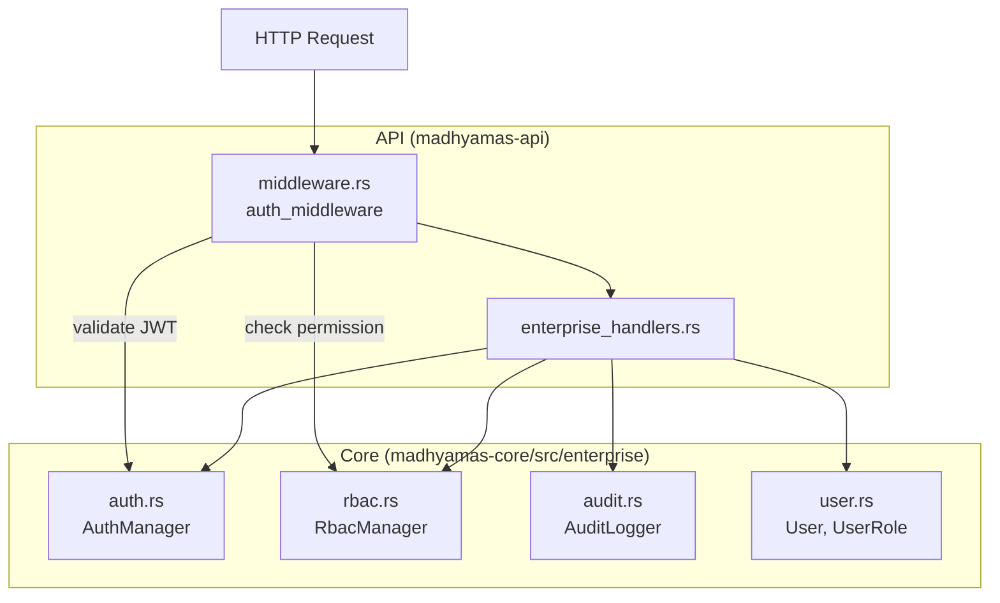

# Enterprise Features

> **Last verified:** 2025-01 against Madhyamas `0.1.6` (enterprise crate fully implemented).

## Overview

Enterprise features provide authentication, role-based access control, audit
logging, user management, and performance monitoring. They are feature-gated
behind the `enterprise` Cargo feature and conditionally enabled at startup via
`create_routes_with_enterprise`. When an auth service is provided, enterprise
endpoints are JWT-protected via `auth_middleware`.

Source: `crates/madhyamas-core/src/enterprise/` and
`crates/madhyamas-api/src/enterprise_handlers.rs`,
`crates/madhyamas-api/src/middleware.rs`.

## Architecture

## Authentication

Source: `enterprise/auth.rs`

`AuthManager` supports two authentication mechanisms:

### JWT (HMAC-SHA256)

- **Login** — `POST /api/auth/login` validates credentials and returns a JWT.
- **Claims**: `sub` (user ID), `iss` ("madhyamas"), `aud` ("madhyamas-api"),
  `exp`, `iat`, `role`, `sid` (session ID).
- **Validation** — `AuthManager::validate_jwt()` checks signature and expiry.
- **Transport** — clients send `Authorization: Bearer <token>`.
- **Logout** — `POST /api/auth/logout` invalidates the session.

### API Keys

- **Format**: `mad_{uuid}`.
- **Transport** — clients send the key via the `X-API-Key` header (header name
  is configurable via `AuthConfig.api_key_header`).
- **Lifecycle** — create via `POST /api/auth/api-keys`, revoke via
  `DELETE /api/auth/api-keys/{id}`. Each key tracks `last_used` and
  `expires_at`.

### Auth middleware

`auth_middleware` (in `middleware.rs`) runs on enterprise routes when an auth
service is configured:

1. Extracts the `Authorization: Bearer <token>` header.
2. Validates the JWT via `AuthManager::validate_jwt()`.
3. Injects `JwtClaims` into request extensions for downstream handlers.
4. Returns `401` on missing/invalid tokens.

**Public paths** that bypass auth: `/health`, `/api/health`,
`/api/health/detailed`, `/api/auth/login`. Non-`/api` paths (static web assets)
also bypass auth.

### Configuration

`AuthConfig` fields:

| Field | Default | Description |
|-------|---------|-------------|
| `enabled` | - | Enable authentication |
| `jwt_secret` | - | HMAC-SHA256 secret |
| `jwt_expiration_secs` | 3600 | Token lifetime |
| `api_key_header` | `X-API-Key` | API key header name |
| `require_auth` | - | Require auth for all requests |
| `refresh_interval_secs` | 300 | Token refresh interval |

Presets: `AuthConfig::development()` (no secret) and
`AuthConfig::production(jwt_secret)`.

## Role-Based Access Control

Source: `enterprise/rbac.rs`

`RbacManager` holds a `role_permissions` map. Roles and their default
permissions:

| Role | Resources | Permissions |
|------|-----------|-------------|
| Admin | Traffic, Session, Mock, Rewrite, Breakpoint, Script, Plugin, Config | Read, Write, Delete (+ Execute for Script/Plugin) |
| User | Traffic, Session, Mock, Rewrite, Breakpoint, Script | Read, Write (+ Execute for Script) |
| Viewer | Traffic, Session, Mock, Rewrite, Breakpoint, Script, Plugin | Read |
| ReadOnly | Traffic, Session, Mock, Rewrite, Breakpoint, Script, Plugin | Read |

**Resources**: `Traffic`, `Session`, `Mock`, `Rewrite`, `Breakpoint`,
`Script`, `Plugin`, `Config`.
**Permissions**: `Read`, `Write`, `Delete`, `Execute`.

Permissions can be granted/revoked at runtime via `RbacManager::grant_permission`
and `revoke_permission`. The `require_permission_middleware` checks the
authenticated user's role against a required `(ResourceType, Permission)` pair,
returning `403` on insufficient permissions.

## Audit Logging

Source: `crates/madhyamas-enterprise/src/audit.rs`

`AuditLogger` records security-relevant events in PostgreSQL with a
SHA-256 hash chain for tamper evidence. Each event's `prev_hash` field
contains the hash of the previous event, making any modification or
deletion detectable. Insertion is serialized across instances using a
PostgreSQL advisory lock (`pg_advisory_xact_lock`).

### Event types

`Login`, `Logout`, `ApiKeyCreated`, `ApiKeyRevoked`, `TrafficExported`,
`SessionCreated`, `SessionDeleted`, `MockCreated`, `MockDeleted`,
`BreakpointCreated`, `BreakpointDeleted`, `ConfigChanged`, `Custom`.

### Event fields

| Field | Description |
|-------|-------------|
| `id` | UUID |
| `event_type` | One of the types above |
| `timestamp` | `DateTime<Utc>` |
| `user_id` | Who performed the action (optional) |
| `api_key_id` | API key used (optional) |
| `client_ip` | Client IP address (optional) |
| `description` | Human-readable description |
| `metadata` | Arbitrary `HashMap<String, serde_json::Value>` |
| `prev_hash` | SHA-256 hash of the previous event (tamper-evidence chain) |

Events are queried via `AuditFilter` (by type, user, time range, limit/offset).

## User Management

Source: `crates/madhyamas-enterprise/src/user.rs`

| Type | Variants / Fields |
|------|-------------------|
| `UserRole` | `Admin`, `User`, `Viewer`, `ReadOnly` (default) |
| `UserStatus` | `Active` (default), `Inactive`, `Suspended`, `PendingVerification` |
| `User` | `id`, `username`, `email`, `display_name`, `role`, `status`, `created_at`, `last_login`, `preferences` |

Helper constructors: `User::create_admin()`, `User::create_viewer()`.

## Error Types

`EnterpriseError` variants: `AuthFailed`, `TokenExpired`, `JwtError`,
`PermissionDenied`, `UserNotFound`, `AuditError`, `RoleNotFound`,
`InvalidConfig`.

## API Endpoints

See [API_ENTERPRISE.md](API_ENTERPRISE.md) for the full endpoint reference.

## See Also

- [API_ENTERPRISE.md](API_ENTERPRISE.md) — Enterprise API endpoints
- [ENTERPRISE_CRATE_GUIDE.md](ENTERPRISE_CRATE_GUIDE.md) — Enterprise crate developer guide
- [ENTERPRISE_API_INTEGRATION.md](ENTERPRISE_API_INTEGRATION.md) — API layer trait abstractions
- [ENTERPRISE_STARTUP_FLOW.md](ENTERPRISE_STARTUP_FLOW.md) — Startup initialization sequence
- [PERFORMANCE.md](PERFORMANCE.md) — Performance monitoring (exposed via enterprise endpoints)
- [ARCHITECTURE.md](ARCHITECTURE.md) — System architecture
