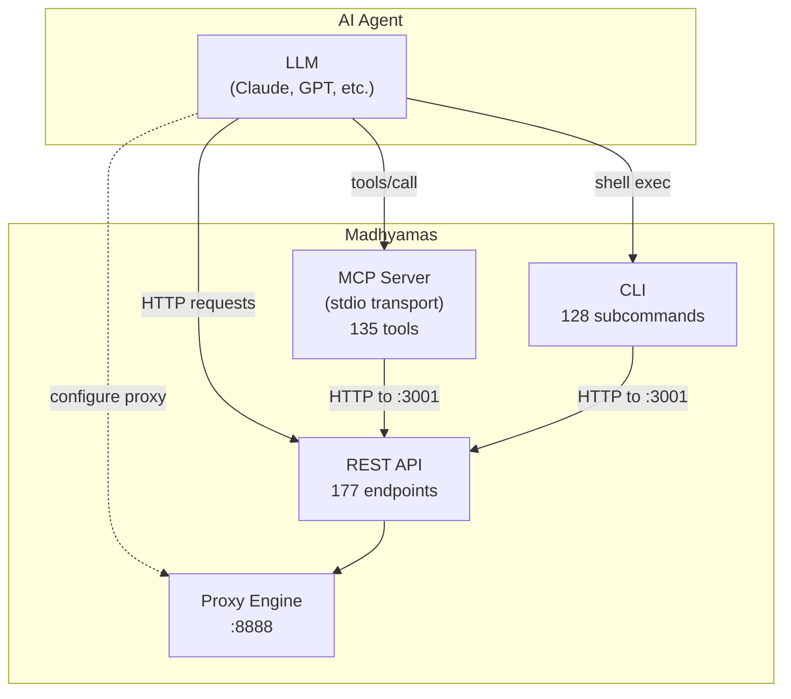
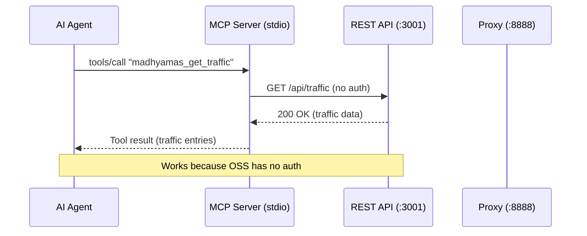
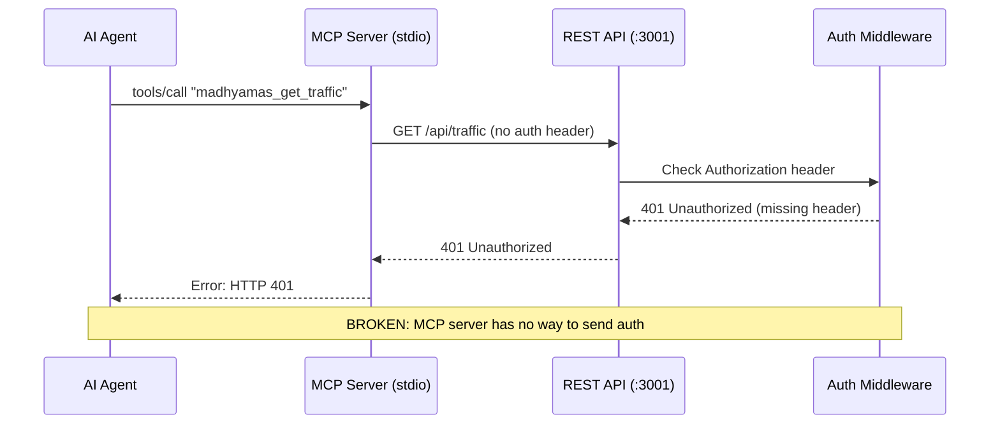
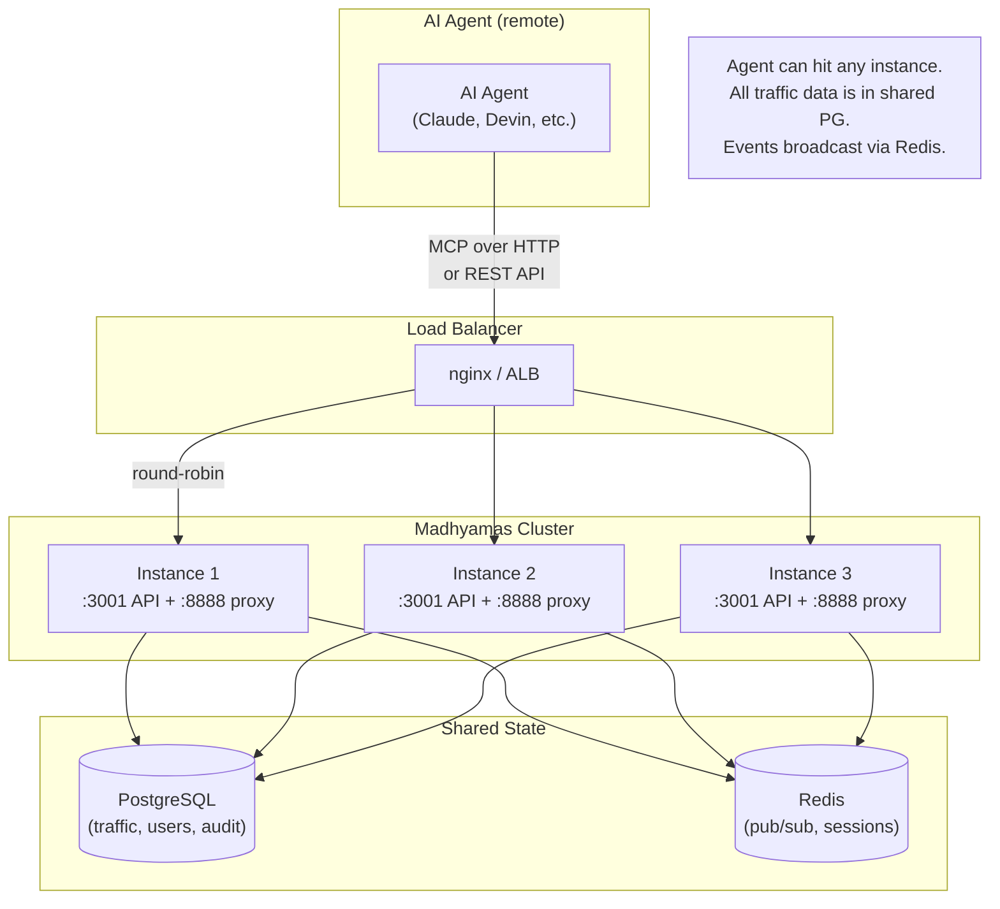
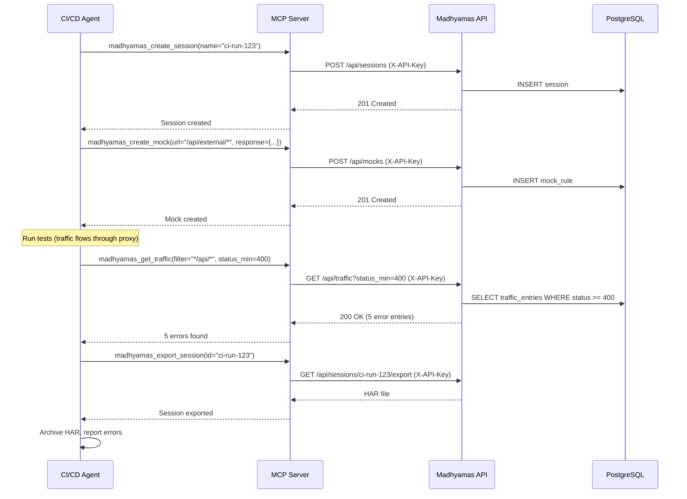
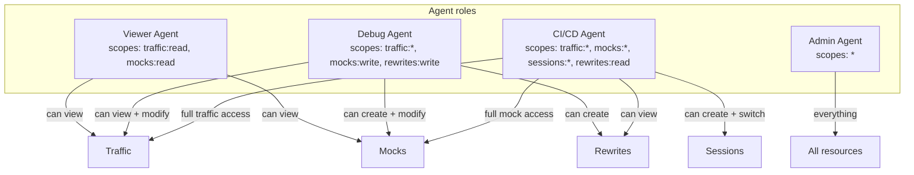

# Enterprise AI Agent Integration

> Part of: [Enterprise Analysis Overview](ENTERPRISE_OVERVIEW.md)

This document analyzes how AI agents (Claude, GPT, Cursor, Windsurf,
Devin, etc.) can use Madhyamas in an enterprise deployment. It
examines the current state of the three agent-facing interfaces
(MCP, CLI, REST API), identifies gaps that block enterprise use, and
proposes solutions for each gap.

---

## Table of Contents

1. [Executive Summary](#1-executive-summary)
2. [Current State: Three Agent-Facing Interfaces](#2-current-state-three-agent-facing-interfaces)
3. [The Core Problem: No Auth in Agent Interfaces](#3-the-core-problem-no-auth-in-agent-interfaces)
4. [Gap Analysis](#4-gap-analysis)
5. [MCP Server: Required Changes](#5-mcp-server-required-changes)
6. [CLI: Required Changes](#6-cli-required-changes)
7. [REST API: Required Changes](#7-rest-api-required-changes)
8. [Enterprise-Only MCP Tools](#8-enterprise-only-mcp-tools)
9. [Multi-Instance AI Agent Access](#9-multi-instance-ai-agent-access)
10. [AI Agent Workflows in Enterprise](#10-ai-agent-workflows-in-enterprise)
11. [Security Considerations](#11-security-considerations)
12. [Implementation Plan](#12-implementation-plan)
13. [Comparison: OSS vs Enterprise Agent Experience](#13-comparison-oss-vs-enterprise-agent-experience)

---

## 1. Executive Summary

### The verdict

**The API interface is not sufficient for enterprise AI agent use.**
The current MCP server, CLI, and API client all lack authentication
support. In an OSS deployment (localhost, no auth), this is fine. In
an enterprise deployment (JWT auth, RBAC, network-accessible), every
agent request will receive `401 Unauthorized`.

### What needs to change

| Area | Current | Required for enterprise | Effort |
|---|---|---|---|
| MCP server auth | No auth support | API key or JWT in MCP config, injected as `Authorization` header | Medium |
| CLI auth | No auth support | `--api-key` / `--token` flag, `MADHYAMAS_API_KEY` env var | Small |
| API auth middleware | JWT-only (`Bearer` token) | Add `X-API-Key` header branch | Small |
| MCP transport | stdio only | Add Streamable HTTP transport for remote agents | Medium |
| MCP enterprise tools | None | User, audit, license, config-export tools | Medium |
| MCP resources/prompts | 3 static resources | Dynamic resources (sessions, traffic entries), debugging prompts | Medium |
| Multi-instance routing | N/A | Agent connects to LB; MCP server routes to correct instance | Small |
| RBAC enforcement on MCP | N/A | Per-tool permission checks (e.g., `mocks:create` requires `Write`) | Medium |

### Design principle

**AI agents are first-class users in the enterprise tier.** An AI
agent should be able to authenticate, be authorized via RBAC, have
its actions audited, and be rate-limited — just like a human user.
The agent's API key is its identity; its role determines what it can
do; its actions are logged in the audit trail.

---

## 2. Current State: Three Agent-Facing Interfaces

Madhyamas exposes three interfaces that AI agents can use:



### 2.1 MCP server (primary agent interface)

| Property | Value |
|---|---|
| Protocol | MCP 2024-11-05 (JSON-RPC 2.0 over stdio) |
| Transport | stdio only |
| Tools | 135 (traffic, sessions, mocks, breakpoints, rewrites, throttle, scripts, plugins, gRPC, WS, etc.) |
| Resources | 3 static (`madhyamas://traffic`, `madhyamas://sessions`, `madhyamas://config`) |
| Prompts | 0 (returns empty list) |
| Auth | **None** — `McpConfig` has only `api_url` and `timeout_secs` |
| How it calls API | `reqwest::Client` HTTP GET/POST to `api_url/api/*` — no auth headers |
| Enterprise tools | **0** (no user, audit, license, or RBAC tools) |

### 2.2 CLI (secondary agent interface)

| Property | Value |
|---|---|
| Commands | 128 subcommands across 17 command groups |
| Auth | **None** — `ApiClient` has only `client` and `base_url` |
| How it calls API | `reqwest::Client` HTTP GET/POST/PUT/DELETE to `base_url/api/*` — no auth headers |
| Enterprise commands | **0** (stubbed in `enterprise.rs`, never wired) |

### 2.3 REST API (lowest-level agent interface)

| Property | Value |
|---|---|
| Endpoints | 177 (traffic, sessions, intercept, config, export, WS, gRPC) |
| Enterprise endpoints | 30+ (auth, users, RBAC, audit, metrics, onboarding) |
| Auth middleware | JWT-only (`Authorization: Bearer <token>`) |
| API key support | **None** — middleware only checks `Bearer` JWT, not `X-API-Key` |
| RBAC enforcement | `require_permission_middleware` (functional but not wired to routes) |

### 2.4 How agents connect today (OSS)



### 2.5 How agents connect today (Enterprise — broken)



---

## 3. The Core Problem: No Auth in Agent Interfaces

### 3.1 MCP server: no auth in config or tool execution

```rust
// CURRENT (broken for enterprise)
pub struct McpConfig {
    pub api_url: String,        // No auth field
    pub timeout_secs: u64,
}

// Tool execute signature — no auth context
async fn execute(
    &self,
    client: &Client,
    api_url: &str,              // No auth token
    arguments: &Value,
) -> Result<Vec<ContentBlock>, McpError>;
```

Every MCP tool builds HTTP requests without any `Authorization`
header. When the enterprise auth middleware is active, every request
returns `401 Unauthorized`.

### 3.2 CLI: no auth in ApiClient

```rust
// CURRENT (broken for enterprise)
pub struct ApiClient {
    client: reqwest::Client,
    base_url: String,           // No auth field
}

// Every request — no auth header
let response = self.client
    .get(&url)
    .send()
    .await?;
```

### 3.3 API middleware: JWT-only, no API key branch

```rust
// CURRENT — only checks Bearer JWT, not X-API-Key
let token = request
    .headers()
    .get(header::AUTHORIZATION)
    .and_then(|s| s.strip_prefix("Bearer "))
    .map(|t| t.to_string());

// No fallback to X-API-Key header
// No fallback to ?api_key= query param
```

This means even if the MCP server or CLI tried to send an API key
via `X-API-Key`, the middleware would reject it because it only
looks for `Authorization: Bearer <jwt>`.

---

## 4. Gap Analysis

### 4.1 Critical gaps (block all enterprise agent use)

| # | Gap | Impact | Affected interfaces |
|---|---|---|---|
| G1 | MCP server has no auth config | All MCP tool calls return 401 | MCP |
| G2 | CLI ApiClient has no auth config | All CLI commands return 401 | CLI |
| G3 | API middleware doesn't accept `X-API-Key` | API keys can't be used by agents | API, MCP, CLI |
| G4 | MCP transport is stdio-only | Remote agents can't connect over network | MCP |

### 4.2 Important gaps (limit enterprise agent capabilities)

| # | Gap | Impact | Affected interfaces |
|---|---|---|---|
| G5 | No enterprise MCP tools | Agents can't manage users, view audit logs, or check license | MCP |
| G6 | No enterprise CLI commands | Agents can't manage users or audit via CLI | CLI |
| G7 | No RBAC enforcement on MCP tools | Any authenticated agent can do anything | MCP, API |
| G8 | No dynamic MCP resources | Agents can't read individual sessions or traffic entries as resources | MCP |
| G9 | No MCP prompts | Agents don't have guided debugging workflows | MCP |
| G10 | No agent-specific audit logging | Agent actions aren't distinguishable from human actions | API, MCP, CLI |

### 4.3 Nice-to-have gaps (improve agent experience)

| # | Gap | Impact | Affected interfaces |
|---|---|---|---|
| G11 | No MCP tool annotations (readOnly/readWrite/destructive) | Agents can't assess risk before calling tools | MCP |
| G12 | No MCP resource subscriptions | Agents must poll for traffic updates | MCP |
| G13 | No streaming tool results | Large traffic lists must be fetched in one call | MCP |
| G14 | No MCP batch tool calls | Agents must call tools one at a time | MCP |
| G15 | No WebSocket support in MCP | Agents can't get real-time traffic events | MCP |

---

## 5. MCP Server: Required Changes

### 5.1 Fix G1: Add auth to MCP config

```rust
// PROPOSED
pub struct McpConfig {
    pub api_url: String,
    pub timeout_secs: u64,
    /// Authentication method for enterprise deployments.
    /// In OSS mode, this is None and requests are sent without auth.
    pub auth: Option<McpAuth>,
}

/// Authentication configuration for MCP server.
pub enum McpAuth {
    /// API key sent as `X-API-Key` header.
    /// Recommended for AI agents — long-lived, scoped, revocable.
    ApiKey(String),
    /// JWT sent as `Authorization: Bearer <token>` header.
    /// Short-lived (15min); requires refresh logic.
    Jwt { token: String, refresh_token: Option<String> },
    /// OIDC token from external identity provider.
    /// Sent as `Authorization: Bearer <token>` header.
    /// Requires token refresh via OIDC refresh flow.
    Oidc { token: String, client_id: String, client_secret: String, token_url: String, refresh_token: String },
}

impl McpConfig {
    /// Build authenticated reqwest client (injects auth headers on every request)
    pub fn http_client(&self) -> Result<reqwest::Client, McpError> {
        let mut builder = reqwest::Client::builder()
            .timeout(std::time::Duration::from_secs(self.timeout_secs));

        // For API key auth, use a default header middleware
        // (reqwest doesn't have built-in default headers, so we use
        // reqwest-middleware or set headers per-request in tools)
        builder.build().map_err(|e| McpError::Http(e.to_string()))
    }

    /// Returns auth headers to inject on every API request.
    pub fn auth_headers(&self) -> Vec<(String, String)> {
        match &self.auth {
            None => vec![],
            Some(McpAuth::ApiKey(key)) => vec![("X-API-Key".to_string(), key.clone())],
            Some(McpAuth::Jwt { token, .. }) => {
                vec![("Authorization".to_string(), format!("Bearer {}", token))]
            }
            Some(McpAuth::Oidc { token, .. }) => {
                vec![("Authorization".to_string(), format!("Bearer {}", token))]
            }
        }
    }
}
```

### 5.2 Update tool trait to receive auth headers

```rust
// PROPOSED — auth headers passed to every tool execution
#[async_trait::async_trait]
pub trait McpTool: Send + Sync {
    fn name(&self) -> &str;
    fn description(&self) -> &str;
    fn input_schema(&self) -> Value;

    async fn execute(
        &self,
        client: &Client,
        api_url: &str,
        auth_headers: &[(String, String)],  // NEW
        arguments: &Value,
    ) -> Result<Vec<ContentBlock>, McpError>;
}
```

### 5.3 Update tool implementations to inject auth headers

```rust
// PROPOSED — every HTTP request includes auth headers
pub(super) async fn get_traffic_filtered(
    client: &Client,
    api_url: &str,
    auth_headers: &[(String, String)],  // NEW
    filter: TrafficFilter,
) -> Result<Value, McpError> {
    let url = format!("{}/api/traffic", api_url);
    let mut request = client.get(&url);

    // Inject auth headers
    for (key, value) in auth_headers {
        request = request.header(key, value);
    }

    let response = request
        .query(&params)
        .send()
        .await
        .map_err(|e| McpError::Http(e.to_string()))?;

    // ... rest unchanged
}
```

### 5.4 Fix G4: Add Streamable HTTP transport

The current MCP server only supports stdio transport, which requires
the MCP client (e.g., Claude Desktop) to spawn the `madhyamas mcp`
process locally. In an enterprise deployment, the AI agent may be
running on a different machine (e.g., a cloud-hosted agent). The MCP
protocol supports a Streamable HTTP transport for this use case.

```rust
// PROPOSED — add HTTP transport alongside stdio
pub enum McpTransport {
    /// Standard stdio transport (local agents).
    Stdio,
    /// Streamable HTTP transport (remote agents).
    /// Listens on the specified port; MCP clients connect via HTTP POST.
    Http { port: u16, auth: Option<McpAuth> },
}

impl McpServer {
    pub fn run(&self, transport: McpTransport) -> Result<(), McpError> {
        match transport {
            McpTransport::Stdio => self.run_stdio(),
            McpTransport::Http { port, auth } => self.run_http(port, auth),
        }
    }

    fn run_stdio(&self) -> Result<(), McpError> {
        // ... existing implementation
    }

    fn run_http(&self, port: u16, auth: Option<McpAuth>) -> Result<(), McpError> {
        // Use axum or hyper to serve MCP over HTTP
        // POST /mcp — JSON-RPC request/response
        // GET /mcp/sse — Server-Sent Events for streaming responses
        // Auth: validate X-API-Key or Bearer token on every request
        // ...
    }
}
```

```bash
# Enterprise agent connects to remote MCP server
madhyamas mcp --transport http --port 3002 --api-key ak_live_xxx

# Agent configuration (e.g., Claude Desktop config)
{
  "mcpServers": {
    "madhyamas-enterprise": {
      "url": "https://madhyamas.internal:3002/mcp",
      "headers": {
        "X-API-Key": "ak_live_xxx"
      }
    }
  }
}
```

### 5.5 Fix G8: Dynamic MCP resources

Currently, the MCP server exposes 3 static resources. Enterprise
agents benefit from dynamic resources that can be read by URI:

```rust
// PROPOSED — dynamic resource URIs
fn handle_read_resource(&self, request: JsonRpcRequest) -> JsonRpcResponse {
    let uri = params["uri"].as_str();

    match uri {
        // Static resources (existing)
        "madhyamas://traffic" => fetch_all_traffic(),
        "madhyamas://sessions" => fetch_all_sessions(),
        "madhyamas://config" => fetch_config(),

        // Dynamic resources (new)
        u if u.starts_with("madhyamas://session/") => {
            let session_id = u.strip_prefix("madhyamas://session/").unwrap();
            fetch_session(session_id)  // GET /api/sessions/{id}
        }
        u if u.starts_with("madhyamas://traffic/") => {
            let entry_id = u.strip_prefix("madhyamas://traffic/").unwrap();
            fetch_traffic_entry(entry_id)  // GET /api/traffic/{id}
        }
        u if u.starts_with("madhyamas://mock/") => {
            let mock_id = u.strip_prefix("madhyamas://mock/").unwrap();
            fetch_mock(mock_id)  // GET /api/mocks/{id}
        }
        u if u.starts_with("madhyamas://script/") => {
            let script_id = u.strip_prefix("madhyamas://script/").unwrap();
            fetch_script(script_id)  // GET /api/scripts/{id}
        }
        // Enterprise resources (new)
        "madhyamas://audit" => fetch_audit_events(),  // Enterprise only
        "madhyamas://license" => fetch_license_info(),  // Enterprise only
        "madhyamas://metrics" => fetch_metrics(),  // Enterprise only
        _ => error_response(-32602, "Unknown resource URI"),
    }
}
```

### 5.6 Fix G9: MCP prompts for guided debugging

MCP prompts are pre-built templates that guide an AI agent through a
common workflow. They're especially useful for enterprise agents that
need to follow standardized debugging procedures.

```rust
// PROPOSED — debugging prompts
fn handle_list_prompts(&self, request: JsonRpcRequest) -> JsonRpcResponse {
    let prompts = vec![
        Prompt {
            name: "debug-4xx-errors".to_string(),
            description: "Find and analyze all 4xx client errors in recent traffic".to_string(),
            arguments: vec![
                PromptArgument {
                    name: "session".to_string(),
                    description: "Session name or ID (optional, uses current session if omitted)".to_string(),
                    required: false,
                },
            ],
        },
        Prompt {
            name: "debug-5xx-errors".to_string(),
            description: "Find and analyze all 5xx server errors in recent traffic".to_string(),
            arguments: vec![],
        },
        Prompt {
            name: "find-auth-issues".to_string(),
            description: "Search traffic for authentication-related issues (missing tokens, expired JWTs, 401/403 responses)".to_string(),
            arguments: vec![],
        },
        Prompt {
            name: "mock-missing-endpoint".to_string(),
            description: "Create a mock for an endpoint that returns 404, based on the request pattern".to_string(),
            arguments: vec![
                PromptArgument {
                    name: "url_pattern".to_string(),
                    description: "URL pattern to match (e.g., '/api/v1/users/*')".to_string(),
                    required: true,
                },
            ],
        },
        Prompt {
            name: "compare-staging-prod".to_string(),
            description: "Compare traffic between two sessions (e.g., staging vs production) to find differences".to_string(),
            arguments: vec![
                PromptArgument {
                    name: "session1".to_string(),
                    description: "First session (e.g., staging)".to_string(),
                    required: true,
                },
                PromptArgument {
                    name: "session2".to_string(),
                    description: "Second session (e.g., production)".to_string(),
                    required: true,
                },
            ],
        },
        Prompt {
            name: "audit-trail".to_string(),
            description: "Retrieve and summarize audit events for a specific user or time range (enterprise)".to_string(),
            arguments: vec![
                PromptArgument {
                    name: "user".to_string(),
                    description: "Username to filter by (optional)".to_string(),
                    required: false,
                },
                PromptArgument {
                    name: "since".to_string(),
                    description: "Start time (ISO 8601, optional)".to_string(),
                    required: false,
                },
            ],
        },
    ];

    // ... return prompts
}
```

### 5.7 Fix G11: MCP tool annotations

The MCP 2024-11-05 protocol supports tool annotations that tell the
agent whether a tool is read-only, destructive, etc. This helps
agents make safer decisions about which tools to call.

```rust
// PROPOSED — add annotations to McpTool trait
#[async_trait::async_trait]
pub trait McpTool: Send + Sync {
    fn name(&self) -> &str;
    fn description(&self) -> &str;
    fn input_schema(&self) -> Value;

    /// Tool annotations — tells the agent about the tool's behavior.
    fn annotations(&self) -> ToolAnnotations {
        ToolAnnotations::default()  // ReadOnly by default
    }

    async fn execute(/* ... */) -> Result<Vec<ContentBlock>, McpError>;
}

pub struct ToolAnnotations {
    /// This tool only reads data (no side effects).
    pub read_only: bool,
    /// This tool modifies data.
    pub destructive: bool,
    /// This tool is idempotent (safe to retry).
    pub idempotent: bool,
    /// This tool interacts with external systems (sends requests to upstream).
    pub open_world: bool,
    /// Required RBAC permission (enterprise only).
    pub required_permission: Option<(&'static str, &'static str)>,  // (resource, permission)
}

// Example: GetTrafficTool — read-only
impl McpTool for GetTrafficTool {
    fn annotations(&self) -> ToolAnnotations {
        ToolAnnotations {
            read_only: true,
            destructive: false,
            idempotent: true,
            open_world: false,
            required_permission: None,  // Any authenticated user
        }
    }
}

// Example: CreateMockTool — modifies config
impl McpTool for CreateMockTool {
    fn annotations(&self) -> ToolAnnotations {
        ToolAnnotations {
            read_only: false,
            destructive: false,
            idempotent: false,
            open_world: false,
            required_permission: Some(("mocks", "write")),  // Requires mocks:write
        }
    }
}

// Example: ClearTrafficTool — destructive
impl McpTool for ClearTrafficTool {
    fn annotations(&self) -> ToolAnnotations {
        ToolAnnotations {
            read_only: false,
            destructive: true,
            idempotent: true,
            open_world: false,
            required_permission: Some(("traffic", "delete")),
        }
    }
}
```

---

## 6. CLI: Required Changes

### 6.1 Fix G2: Add auth to ApiClient

```rust
// PROPOSED
pub struct ApiClient {
    client: reqwest::Client,
    base_url: String,
    auth_headers: Vec<(String, String)>,  // NEW
}

impl ApiClient {
    pub fn new(base_url: String) -> Self {
        // OSS mode — no auth
        Self {
            client: reqwest::Client::new(),
            base_url,
            auth_headers: vec![],
        }
    }

    pub fn new_with_auth(base_url: String, auth: CliAuth) -> Self {
        let auth_headers = match auth {
            CliAuth::None => vec![],
            CliAuth::ApiKey(key) => vec![("X-API-Key".to_string(), key)],
            CliAuth::Token(token) => vec![("Authorization".to_string(), format!("Bearer {}", token))],
        };
        Self {
            client: reqwest::Client::new(),
            base_url,
            auth_headers,
        }
    }

    pub async fn get(&self, path: &str) -> Result<serde_json::Value> {
        let url = format!("{}/api/{}", self.base_url, path);
        let mut request = self.client.get(&url);
        for (key, value) in &self.auth_headers {
            request = request.header(key, value);
        }
        let response = request.send().await?;
        // ... rest unchanged
    }

    // Same pattern for post, put, delete
}

pub enum CliAuth {
    None,
    ApiKey(String),
    Token(String),
}
```

### 6.2 Add CLI auth flags

```rust
// PROPOSED — CLI flags for auth
#[derive(Args)]
pub struct GlobalArgs {
    /// API key for enterprise authentication.
    /// Can also be set via MADHYAMAS_API_KEY env var.
    #[arg(long, env = "MADHYAMAS_API_KEY")]
    pub api_key: Option<String>,

    /// JWT token for enterprise authentication.
    /// Can also be set via MADHYAMAS_TOKEN env var.
    /// If both --api-key and --token are provided, --api-key takes precedence.
    #[arg(long, env = "MADHYAMAS_TOKEN")]
    pub token: Option<String>,
}

// In main.rs CLI dispatch:
let auth = if let Some(key) = args.api_key {
    CliAuth::ApiKey(key)
} else if let Some(token) = args.token {
    CliAuth::Token(token)
} else {
    CliAuth::None
};

let client = ApiClient::new_with_auth(api_url, auth);
```

### 6.3 Add enterprise CLI commands

```rust
// PROPOSED — enterprise CLI subcommands
pub enum Commands {
    // ... existing commands ...

    // Enterprise (only available in enterprise build)
    #[cfg(feature = "enterprise")]
    Users(UsersArgs),
    #[cfg(feature = "enterprise")]
    Audit(AuditArgs),
    #[cfg(feature = "enterprise")]
    License(LicenseArgs),
    #[cfg(feature = "enterprise")]
    Auth(AuthArgs),
}

#[cfg(feature = "enterprise")]
#[derive(Args)]
pub struct UsersArgs {
    #[command(subcommand)]
    pub command: UsersCommands,
}

#[cfg(feature = "enterprise")]
#[derive(Subcommand)]
pub enum UsersCommands {
    /// List all users
    List,
    /// Create a new user
    Create { username: String, role: String, password: String },
    /// Delete a user
    Delete { id: String },
    /// Update user role
    UpdateRole { id: String, role: String },
}

// Similar for Audit, License, Auth
```

---

## 7. REST API: Required Changes

### 7.1 Fix G3: Add API key branch to auth middleware

```rust
// PROPOSED — auth middleware accepts both JWT and API key
pub async fn auth_middleware(
    State(state): State<Arc<AuthManager>>,
    mut request: Request,
    next: Next,
) -> Response {
    if is_public_path(request.uri()) {
        return next.run(request).await;
    }

    // 1. Try Authorization: Bearer <jwt> (existing)
    let jwt_token = request
        .headers()
        .get(header::AUTHORIZATION)
        .and_then(|v| v.to_str().ok())
        .and_then(|s| s.strip_prefix("Bearer "))
        .map(|t| t.to_string());

    if let Some(token) = jwt_token {
        match state.validate_jwt(&token) {
            Ok(claims) => {
                request.extensions_mut().insert(claims);
                return next.run(request).await;
            }
            Err(err) => return unauthorized(&err.to_string()),
        }
    }

    // 2. Try X-API-Key: <key> (NEW)
    let api_key = request
        .headers()
        .get("X-API-Key")
        .and_then(|v| v.to_str().ok())
        .map(|t| t.to_string());

    if let Some(key) = api_key {
        match state.validate_api_key(&key).await {
            Ok(claims) => {
                // Inject claims with api_key_id for audit
                request.extensions_mut().insert(claims);
                return next.run(request).await;
            }
            Err(err) => return unauthorized(&err.to_string()),
        }
    }

    // 3. Try ?api_key= query param (NEW — for browser-based agents)
    let api_key_query = request
        .uri()
        .query()
        .and_then(|q| {
            q.split('&')
                .find_map(|kv| {
                    let (k, v) = kv.split_once('=')?;
                    if k == "api_key" { Some(v.to_string()) } else { None }
                })
        });

    if let Some(key) = api_key_query {
        match state.validate_api_key(&key).await {
            Ok(claims) => {
                request.extensions_mut().insert(claims);
                return next.run(request).await;
            }
            Err(err) => return unauthorized(&err.to_string()),
        }
    }

    unauthorized("Missing Authorization header or X-API-Key")
}
```

### 7.2 Implement API key validation in AuthManager

```rust
// PROPOSED — add to AuthManager
impl AuthManager {
    /// Validate an API key and return the associated user's claims.
    pub async fn validate_api_key(&self, key: &str) -> Result<JwtClaims, AuthError> {
        // 1. Hash the key (SHA-256) — keys are stored hashed, not plaintext
        let key_hash = sha256(key);

        // 2. Look up the key in the database
        let api_key = self.store.find_api_key(&key_hash).await?
            .ok_or(AuthError::InvalidApiKey)?;

        // 3. Check expiry
        if let Some(expires_at) = api_key.expires_at {
            if Utc::now() > expires_at {
                return Err(AuthError::ExpiredApiKey);
            }
        }

        // 4. Build JWT claims from the API key's associated user
        let user = self.store.get_user(&api_key.user_id).await?;
        Ok(JwtClaims {
            sub: user.id.to_string(),
            username: user.username,
            role: user.role.to_string(),
            api_key_id: Some(api_key.id.to_string()),  // For audit
            // No exp — API keys have their own expiry
            ..Default::default()
        })
    }
}
```

### 7.3 API key management endpoints

The enterprise API already has stubbed endpoints for API key
management. They need real implementations:

| Endpoint | Method | Purpose | Status |
|---|---|---|---|
| `/api/auth/api-keys` | GET | List current user's API keys | Stubbed (501) |
| `/api/auth/api-keys` | POST | Create new API key | Stubbed (501) |
| `/api/auth/api-keys/{id}` | DELETE | Revoke an API key | Stubbed (501) |

**API key creation response** should return the plaintext key once
(only at creation time; subsequent reads return only the hash prefix):

```json
{
  "id": "ak_abc123",
  "key": "ak_live_xxxxxxxxxxxxxxxxxxxxxxxxxxxx",
  "name": "CI/CD Agent",
  "scopes": ["traffic:read", "mocks:write"],
  "expires_at": "2026-12-01T00:00:00Z",
  "created_at": "2026-01-01T00:00:00Z"
}
```

### 7.4 API key scopes (G7)

API keys should support scoped permissions, more granular than RBAC
roles. This allows creating restricted keys for specific agents:

```rust
// PROPOSED — API key scopes
pub struct ApiKey {
    pub id: Uuid,
    pub user_id: Uuid,
    pub name: String,           // Human-readable label
    pub key_hash: String,       // SHA-256 hash (plaintext never stored)
    pub key_prefix: String,     // First 8 chars (for display: "ak_live_abc...")
    pub scopes: Vec<String>,    // e.g., ["traffic:read", "mocks:write"]
    pub expires_at: Option<DateTime<Utc>>,
    pub last_used_at: Option<DateTime<Utc>>,
    pub created_at: DateTime<Utc>,
}

// Scope format: "<resource>:<permission>"
// Examples:
//   "traffic:read"     — can view traffic
//   "traffic:delete"   — can clear traffic
//   "mocks:write"      — can create/update/delete mocks
//   "mocks:read"       — can view mocks
//   "config:write"     — can change proxy config
//   "audit:read"       — can view audit logs (admin only)
//   "users:write"      — can manage users (admin only)
//   "*"                — all permissions (admin key)

// In auth middleware: check scope after validating key
if let Some(required_scope) = get_required_scope(request.uri(), request.method()) {
    if !claims.scopes.contains(&required_scope) && !claims.scopes.contains(&"*") {
        return forbidden("API key lacks required scope");
    }
}
```

---

## 8. Enterprise-Only MCP Tools

### 8.1 Proposed enterprise MCP tools

These tools are only registered when the MCP server detects it's
connected to an enterprise proxy (via `GET /api/health/detailed`
returning `tier: "enterprise"`):

| Tool | Purpose | RBAC permission |
|---|---|---|
| `madhyamas_list_users` | List all users | `users:read` |
| `madhyamas_create_user` | Create a new user | `users:write` |
| `madhyamas_delete_user` | Delete a user | `users:write` |
| `madhyamas_update_user_role` | Change a user's role | `users:write` |
| `madhyamas_get_audit_events` | Query audit log | `audit:read` |
| `madhyamas_export_audit` | Export audit log as JSON/CSV | `audit:read` |
| `madhyamas_get_license_info` | View license details (seats, expiry, plan) | `license:read` |
| `madhyamas_get_metrics` | Get performance metrics | `metrics:read` |
| `madhyamas_get_health` | Get detailed health (DB, Redis, license status) | None (any auth) |
| `madhyamas_export_config` | Export proxy configuration | `config:read` |
| `madhyamas_import_config` | Import proxy configuration | `config:write` |

### 8.2 Tier detection in MCP server

```rust
// PROPOSED — MCP server detects tier at startup
impl McpServer {
    pub fn new(config: McpConfig) -> Result<Self, McpError> {
        let http_client = build_http_client(&config)?;
        let api_url = &config.api_url;

        // Detect tier by calling /api/health/detailed
        // (returns 404 on OSS, JSON on enterprise)
        let tier = detect_tier(http_client.clone(), api_url, &config.auth_headers());

        let mut registry = DynToolRegistry::new();

        // Register common tools (always available)
        register_common_tools(&mut registry);

        // Register enterprise tools (only if enterprise tier detected)
        if tier == Tier::Enterprise {
            register_enterprise_tools(&mut registry);
        }

        Ok(Self {
            dyn_registry: registry,
            // ...
        })
    }
}

fn detect_tier(
    client: reqwest::Client,
    api_url: &str,
    auth_headers: &[(String, String)],
) -> Tier {
    let url = format!("{}/api/health/detailed", api_url);
    let mut req = client.get(&url);
    for (k, v) in auth_headers {
        req = req.header(k, v);
    }

    match req.blocking_send() {  // At startup, blocking is OK
        Ok(resp) if resp.status().is_success() => {
            let body: serde_json::Value = resp.blocking_json().unwrap_or_default();
            if body.get("tier").and_then(|t| t.as_str()) == Some("enterprise") {
                Tier::Enterprise
            } else {
                Tier::Community
            }
        }
        _ => Tier::Community,  // 404 or error → OSS
    }
}
```

### 8.3 Enterprise tool example

```rust
// PROPOSED — enterprise MCP tool
pub struct GetAuditEventsTool;

#[async_trait::async_trait]
impl McpTool for GetAuditEventsTool {
    fn name(&self) -> &str { "madhyamas_get_audit_events" }

    fn description(&self) -> &str {
        "Query the enterprise audit log. Filter by user, action type, or time range. \
         Requires audit:read permission."
    }

    fn input_schema(&self) -> Value {
        json!({
            "type": "object",
            "properties": {
                "user": { "type": "string", "description": "Filter by username" },
                "action": { "type": "string", "description": "Filter by action type" },
                "since": { "type": "string", "description": "ISO 8601 start time" },
                "until": { "type": "string", "description": "ISO 8601 end time" },
                "limit": { "type": "integer", "description": "Max results (default 100)" }
            }
        })
    }

    fn annotations(&self) -> ToolAnnotations {
        ToolAnnotations {
            read_only: true,
            destructive: false,
            idempotent: true,
            open_world: false,
            required_permission: Some(("audit", "read")),
        }
    }

    async fn execute(
        &self,
        client: &Client,
        api_url: &str,
        auth_headers: &[(String, String)],
        arguments: &Value,
    ) -> Result<Vec<ContentBlock>, McpError> {
        let mut url = format!("{}/api/audit", api_url);
        // Build query params from arguments...
        let mut req = client.get(&url);
        for (k, v) in auth_headers {
            req = req.header(k, v);
        }
        let resp = req.send().await?;
        // ... parse and return
    }
}
```

---

## 9. Multi-Instance AI Agent Access

### 9.1 The problem

In a multi-instance enterprise deployment, traffic is distributed
across instances by the load balancer. An AI agent connecting to the
MCP server or REST API may hit any instance. But traffic captured by
instance A is in the shared PostgreSQL database, so any instance can
read it. The main concern is **WebSocket events** — real-time traffic
events are broadcast via Redis pub/sub, so an agent connected to any
instance's WebSocket will receive events from all instances.

### 9.2 Agent connection topology



### 9.3 What works and what doesn't

| Agent action | Multi-instance? | Notes |
|---|---|---|
| List traffic | ✅ | Reads from shared PostgreSQL — any instance returns all traffic |
| Get traffic entry | ✅ | Same — shared PG |
| Create mock rule | ✅ | Writes to PG; config sync propagates to all instances via Redis |
| Create rewrite rule | ✅ | Same — PG write + Redis config sync |
| Create breakpoint | ✅ | Same |
| Clear traffic | ✅ | Deletes from PG; all instances see the change |
| Get audit events | ✅ | Reads from shared PG |
| Get metrics | ⚠️ | Returns metrics for the instance the agent hit, not cluster-wide |
| Get health | ⚠️ | Returns health for one instance; need cluster health endpoint |
| WebSocket events | ✅ | Redis pub/sub broadcasts to all instances; agent gets all events |

### 9.4 Cluster-wide metrics

For metrics and health, the agent should call a cluster-level
endpoint that aggregates across instances:

```rust
// PROPOSED — cluster metrics endpoint
// GET /api/metrics/cluster
// Returns aggregated metrics from all instances via InstanceRegistry
pub async fn get_cluster_metrics(
    State(state): State<Arc<AppState>>,
) -> Json<ClusterMetrics> {
    let instances = state.instance_registry.list_active().await;
    let mut aggregated = ClusterMetrics::default();

    for instance in &instances {
        if let Ok(metrics) = state.instance_registry.get_metrics(&instance.id).await {
            aggregated.merge(metrics);
        }
    }

    Json(aggregated)
}
```

---

## 10. AI Agent Workflows in Enterprise

### 10.1 CI/CD integration

An AI agent in a CI/CD pipeline can use Madhyamas to:
1. Start a named session before the test run
2. Configure mocks for external dependencies
3. Run the test suite (traffic flows through the proxy)
4. Analyze captured traffic for errors
5. Export the session as HAR for archival
6. Clear the session



### 10.2 Automated debugging

An AI agent debugging a failing API can:
1. Search captured traffic for the failing request
2. Examine the request/response details
3. Identify the issue (wrong header, malformed body, etc.)
4. Create a rewrite rule to fix the request
5. Replay the modified request
6. Verify the fix

### 10.3 Security audit

An AI agent performing a security audit can:
1. Search traffic for authentication-related requests
2. Check for tokens in URLs (insecure)
3. Check for missing security headers
4. Review audit logs for suspicious activity
5. Export findings as a report

### 10.4 Performance analysis

An AI agent analyzing performance can:
1. Get performance metrics
2. Identify slow endpoints (filter by `min_time=2000`)
3. Check for N+1 query patterns (repeated requests to same endpoint)
4. Analyze response sizes (filter by `min_size=1000000`)
5. Suggest optimizations

---

## 11. Security Considerations

### 11.1 API key management for agents

| Practice | Rationale |
|---|---|
| Use API keys, not JWTs, for agents | API keys are long-lived; JWTs expire in 15min and require refresh logic |
| Scope API keys minimally | An agent that only reads traffic should get `traffic:read` only |
| Set expiry on agent API keys | Force key rotation (e.g., 90 days) |
| Log API key usage in audit log | `api_key_id` in JwtClaims enables per-key audit trail |
| Store keys in secret manager | Don't hardcode keys in agent config; use env vars or vault |
| Revoke keys when agent is decommissioned | Prevent orphaned keys |

### 11.2 Agent permission model



### 11.3 Rate limiting for agents

AI agents can generate high request volumes (e.g., polling traffic
every second). Per-user rate limiting (keyed on JWT `sub` or API key
ID) prevents a single agent from overwhelming the API:

```rust
// PROPOSED — per-user rate limiting (enterprise)
// Keyed on JWT sub or API key ID, not just IP
pub async fn rate_limit_middleware(
    State(state): State<Arc<AppState>>,
    request: Request,
    next: Next,
) -> Response {
    let claims = request.extensions().get::<JwtClaims>();
    let key = claims
        .map(|c| c.sub.clone())
        .or_else(|| {
            // Fall back to IP for unauthenticated (OSS) requests
            request.headers()
                .get("x-forwarded-for")
                .and_then(|v| v.to_str().ok())
                .map(|s| s.to_string())
        })
        .unwrap_or_else(|| {
            request.extensions()
                .get::<ConnectInfo<SocketAddr>>()
                .map(|ci| ci.0.ip().to_string())
                .unwrap_or_default()
        });

    if let Err(_) = state.rate_limiter.check_rate(&key) {
        return too_many_requests();
    }

    next.run(request).await
}
```

### 11.4 Audit trail for agent actions

Every agent action should be auditable. The `api_key_id` field in
JWT claims (set when authenticating via API key) enables this:

```rust
// In audit logger — automatically logs agent actions
pub async fn log_api_call(claims: &JwtClaims, method: &str, path: &str, status: u16) {
    let event = AuditEvent {
        user_id: claims.sub.clone(),
        username: claims.username.clone(),
        action: format!("{} {}", method, path),
        api_key_id: claims.api_key_id.clone(),  // If authenticated via API key
        // ...
    };
    audit_sink.log(event).await;
}
```

The audit log can then distinguish between human and agent actions:
- Human actions: `api_key_id = NULL` (authenticated via JWT from login)
- Agent actions: `api_key_id = "ak_abc123"` (authenticated via API key)

---

## 12. Implementation Plan

### 12.1 Phase AI-1: Auth foundation (critical)

| Task | Effort | Files |
|---|---|---|
| Add `McpAuth` to `McpConfig` | Small | `madhyamas-mcp/src/types.rs` |
| Update `McpTool::execute` signature with auth headers | Medium (135 tools) | `madhyamas-mcp/src/tools/*.rs` |
| Add `X-API-Key` branch to auth middleware | Small | `madhyamas-api/src/middleware.rs` |
| Implement `AuthManager::validate_api_key` | Small | `madhyamas-core/src/enterprise/auth.rs` |
| Add `CliAuth` to `ApiClient` | Small | `madhyamas-cli/src/commands/mod.rs` |
| Add `--api-key` / `--token` CLI flags | Small | `madhyamas/src/main.rs` |
| Add `MADHYAMAS_API_KEY` env var support | Small | `madhyamas/src/main.rs` |
| Implement API key CRUD endpoints (de-stub) | Medium | `madhyamas-api/src/enterprise_handlers.rs` |

### 12.2 Phase AI-2: Enterprise MCP tools

| Task | Effort | Files |
|---|---|---|
| Tier detection in MCP server | Small | `madhyamas-mcp/src/server.rs` |
| Register enterprise tools conditionally | Small | `madhyamas-mcp/src/tools/mod.rs` |
| Implement user management MCP tools | Medium | `madhyamas-mcp/src/tools/users.rs` (new) |
| Implement audit MCP tools | Medium | `madhyamas-mcp/src/tools/audit.rs` (new) |
| Implement license/metrics MCP tools | Small | `madhyamas-mcp/src/tools/enterprise.rs` (new) |
| Add enterprise CLI commands | Medium | `madhyamas-cli/src/commands/enterprise.rs` |
| Update skill package with enterprise tools | Small | `skills/madhyamas/references/mcp-tools.md` |

### 12.3 Phase AI-3: MCP protocol enhancements

| Task | Effort | Files |
|---|---|---|
| Add Streamable HTTP transport | Medium | `madhyamas-mcp/src/server.rs` |
| Add tool annotations (readOnly, destructive) | Medium (135 tools) | `madhyamas-mcp/src/tools/*.rs` |
| Add dynamic resources (session, traffic entry) | Small | `madhyamas-mcp/src/server.rs` |
| Add debugging prompts | Small | `madhyamas-mcp/src/server.rs` |
| Add MCP resource subscriptions | Medium | `madhyamas-mcp/src/server.rs` |

### 12.4 Phase AI-4: RBAC and security

| Task | Effort | Files |
|---|---|---|
| Add scope field to API keys | Small | `madhyamas-core/src/enterprise/auth.rs` |
| Enforce scopes in auth middleware | Medium | `madhyamas-api/src/middleware.rs` |
| Add per-user rate limiting | Medium | `madhyamas-api/src/middleware.rs` (new) |
| Audit-log agent actions (api_key_id) | Small | `madhyamas-api/src/enterprise_handlers.rs` |
| Cluster metrics endpoint | Small | `madhyamas-api/src/enterprise_handlers.rs` |

### 12.5 Timeline

```mermaid
gantt
    title AI Agent Integration Phases
    dateFormat YYYY-MM-DD
    axisFormat %b %d

    section AI-1: Auth foundation
    MCP auth config                 :a1, 2d
    Update 135 tool signatures      :a2, 3d
    API key middleware branch       :a3, 1d
    CLI auth flags                  :a4, 1d
    API key CRUD endpoints          :a5, 2d

    section AI-2: Enterprise tools
    Tier detection                  :b1, after a1, 1d
    Enterprise MCP tools            :b2, after b1, 3d
    Enterprise CLI commands         :b3, after b2, 2d
    Skill package update            :b4, after b3, 1d

    section AI-3: Protocol
    Streamable HTTP transport       :c1, after b4, 3d
    Tool annotations                :c2, after b4, 2d
    Dynamic resources + prompts     :c3, after c2, 2d

    section AI-4: RBAC + security
    API key scopes                  :d1, after c3, 2d
    Per-user rate limiting          :d2, after d1, 2d
    Audit trail for agents          :d3, after d2, 1d
```

---

## 13. Comparison: OSS vs Enterprise Agent Experience

| Aspect | OSS | Enterprise (current) | Enterprise (proposed) |
|---|---|---|---|
| MCP tools | 135 | 135 (but all return 401) | 135 + 11 enterprise = 146 |
| MCP auth | None needed | **Broken** (no auth support) | API key or JWT |
| MCP transport | stdio | stdio | stdio + Streamable HTTP |
| CLI auth | None needed | **Broken** (no auth support) | `--api-key` / `--token` |
| REST API auth | None | JWT only (no API key) | JWT + API key + query param |
| RBAC on agent actions | N/A | Not enforced | Per-tool permission checks |
| Agent audit trail | N/A | Not available | `api_key_id` in audit log |
| Agent rate limiting | Per-IP | Per-IP | Per-user (JWT sub or API key ID) |
| Remote agent access | Local only | **Broken** | Streamable HTTP transport |
| Enterprise tools | N/A | 0 | 11 (users, audit, license, metrics) |
| MCP resources | 3 static | 3 static | 3 static + dynamic (session, traffic, mock) |
| MCP prompts | 0 | 0 | 6 (debug-4xx, debug-5xx, find-auth, mock-missing, compare, audit-trail) |
| Tool annotations | None | None | readOnly/destructive/idempotent + required permission |
| Multi-instance | N/A | **Broken** (any instance works for reads; metrics per-instance) | Works + cluster metrics endpoint |

---

## See Also

- [Enterprise Analysis Overview](ENTERPRISE_OVERVIEW.md) — Master document
- [Enterprise Auth, RBAC, and IdP](ENTERPRISE_AUTH_RBAC.md) — Auth design details
- [Enterprise Web UI](ENTERPRISE_WEB_UI.md) — Frontend tier detection
- [Enterprise Multi-Instance](ENTERPRISE_MULTI_INSTANCE.md) — Multi-instance deployment
- [Enterprise Performance & Security](ENTERPRISE_PERF_SECURITY.md) — Security gaps (WebSocket auth, Redis auth)
- [Enterprise OSS Comparison](ENTERPRISE_OSS_COMPARISON.md) — OSS vs Enterprise feature comparison
- [MCP Tools Reference](../skills/madhyamas/references/mcp-tools.md) — Current 135 MCP tools
- [CLI Commands Reference](../skills/madhyamas/references/cli-commands.md) — Current 128 CLI subcommands
- [API Enterprise](API_ENTERPRISE.md) — Enterprise API endpoint reference
