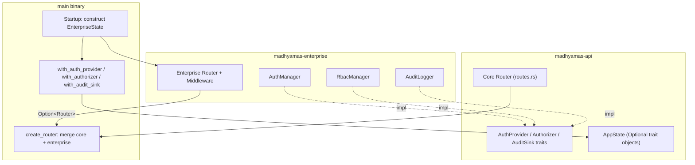
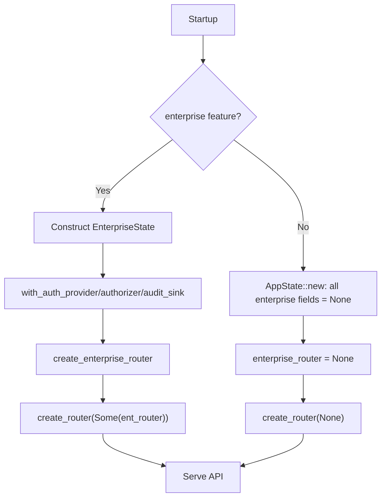
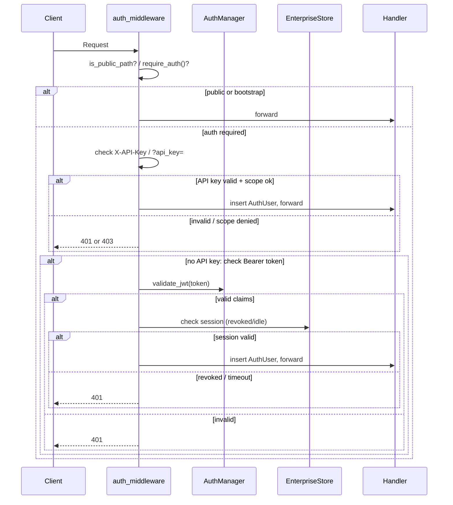
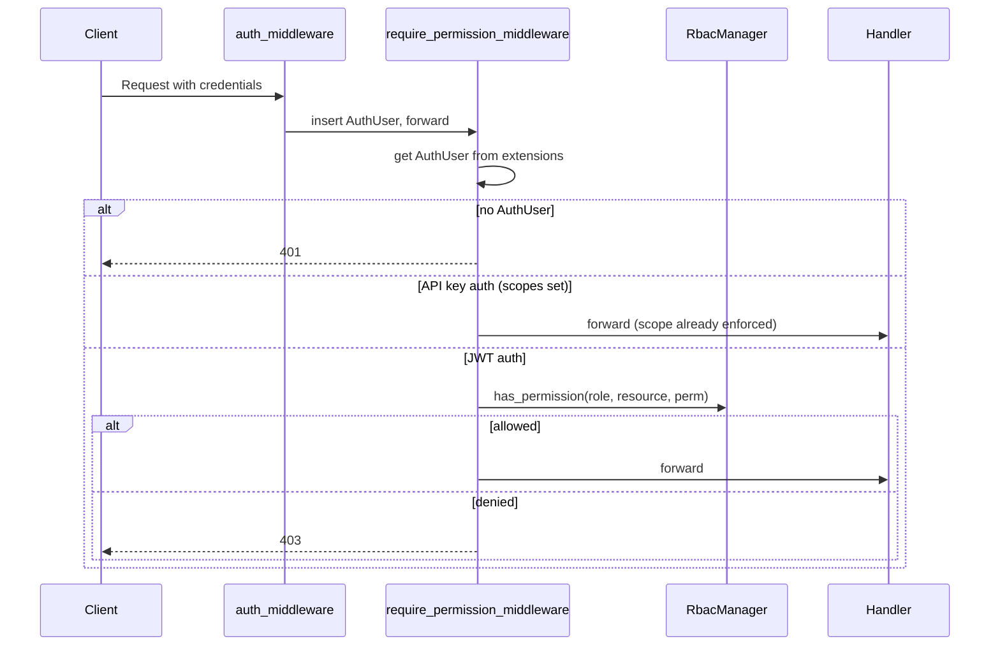

# Enterprise API Integration

> **Last verified: 2025-01**

## Overview

The `madhyamas-api` crate exposes three trait abstractions — `AuthProvider`,
`Authorizer`, and `AuditSink` — that decouple the API layer from enterprise
concrete types. The `madhyamas-enterprise` crate implements these traits with
`AuthManager`, `RbacManager`, and `AuditLogger`, then injects them into
`AppState` at startup via builder methods. In the OSS/community tier the
enterprise fields are `None`, so no authentication, authorization, or audit
logging is enforced.

This keeps `madhyamas-api` free of any dependency on enterprise code: all
`#[cfg(feature = "enterprise")]` gates live in the main binary, which decides
at compile time whether to construct and inject enterprise state.



## Trait Abstractions

All three traits live in `crates/madhyamas-api/src/auth.rs`. Signatures mirror
the enterprise crate's concrete types so adapters need minimal code.

### AuthProvider

Validates credentials (JWT, API key, password) and issues tokens. When
`AppState.auth_provider` is `None`, no authentication is enforced.

```rust
#[async_trait]
pub trait AuthProvider: Send + Sync {
    async fn validate_token(&self, token: &str) -> Result<Identity, AuthError>;
    async fn validate_api_key(&self, key: &str) -> Result<Identity, AuthError>;
    async fn authenticate_password(&self, username: &str, password: &str) -> Result<String, AuthError>;
    async fn generate_token(&self, user_id: &str, role: &str) -> Result<String, AuthError>;
    async fn create_api_key(&self, user_id: &str, name: &str) -> Result<String, AuthError>;
    async fn revoke_api_key(&self, key_id: &str) -> Result<(), AuthError>;
    /// Returns true when auth is strictly required. Default: true.
    fn auth_required(&self) -> bool { true }
}
```

Custom implementation (e.g. LDAP-backed) — implement the trait, then inject:

```rust
#[async_trait]
impl AuthProvider for LdapAuthProvider {
    async fn validate_token(&self, _token: &str) -> Result<Identity, AuthError> {
        Err(AuthError::AuthFailed { message: "LDAP does not issue JWTs".into() })
    }
    async fn validate_api_key(&self, _key: &str) -> Result<Identity, AuthError> { /* ... */ }
    async fn authenticate_password(&self, username: &str, password: &str) -> Result<String, AuthError> {
        // Bind to LDAP, verify credentials, issue a JWT.
        Ok("issued-jwt".to_string())
    }
    async fn generate_token(&self, _user_id: &str, _role: &str) -> Result<String, AuthError> { /* ... */ }
    async fn create_api_key(&self, _user_id: &str, _name: &str) -> Result<String, AuthError> { /* ... */ }
    async fn revoke_api_key(&self, _key_id: &str) -> Result<(), AuthError> { Ok(()) }
}

let state = AppState::new(traffic_store)
    .with_auth_provider(Arc::new(LdapAuthProvider { /* ... */ }));
```

### Authorizer

Checks whether a role has a permission on a resource type. When
`AppState.authorizer` is `None`, authorization is allow-all.

```rust
pub trait Authorizer: Send + Sync {
    fn has_permission(&self, role: &str, resource: ResourceType, permission: Permission) -> bool;

    fn check_permission(&self, role: &str, resource: ResourceType, permission: Permission)
        -> Result<(), AuthError>
    {
        if self.has_permission(role, resource, permission) { Ok(()) }
        else { Err(AuthError::PermissionDenied {
            message: format!("Role '{role}' lacks {:?} on {:?}", permission, resource),
        }) }
    }

    fn get_user_role(&self, user_id: &str) -> Option<String>;
    fn list_roles(&self) -> Vec<String>;
}
```

Custom implementation (e.g. OPA-backed):

```rust
impl Authorizer for OpaAuthorizer {
    fn has_permission(&self, role: &str, resource: ResourceType, perm: Permission) -> bool {
        // Query OPA: data.madhyamas.allow { role; resource; perm }
        true
    }
    fn get_user_role(&self, _user_id: &str) -> Option<String> { Some("user".into()) }
    fn list_roles(&self) -> Vec<String> { vec!["admin".into(), "user".into(), "viewer".into()] }
}

let state = AppState::new(traffic_store)
    .with_authorizer(Arc::new(OpaAuthorizer { /* ... */ }));
```

### AuditSink

Persists and queries audit events. When `AppState.audit_sink` is `None`,
events are silently dropped.

```rust
#[async_trait]
pub trait AuditSink: Send + Sync {
    async fn log_event(&self, event: AuditEvent) -> Result<(), AuditError>;
    async fn query_events(&self, filter: &AuditFilter) -> Result<Vec<AuditEvent>, AuditError>;
    async fn export_events(&self, filter: &AuditFilter) -> Result<Vec<u8>, AuditError>;
}
```

Custom implementation (e.g. SIEM forwarding):

```rust
#[async_trait]
impl AuditSink for SplunkAuditSink {
    async fn log_event(&self, event: AuditEvent) -> Result<(), AuditError> {
        // POST event as JSON to Splunk HEC endpoint.
        Ok(())
    }
    async fn query_events(&self, _filter: &AuditFilter) -> Result<Vec<AuditEvent>, AuditError> { Ok(vec![]) }
    async fn export_events(&self, _filter: &AuditFilter) -> Result<Vec<u8>, AuditError> { Ok(Vec::new()) }
}

let state = AppState::new(traffic_store)
    .with_audit_sink(Arc::new(SplunkAuditSink { /* ... */ }));
```

## AppState Integration

### AppState struct

The enterprise fields on `AppState` are `Option<Arc<dyn Trait + Send + Sync>>`,
allowing the same struct to serve both OSS and enterprise builds without
`#[cfg]` gates inside the API crate:

```rust
#[derive(Clone)]
pub struct AppState {
    // ... core fields (traffic_store, breakpoint_manager, etc.) ...

    /// Pluggable authentication provider. None in OSS tier.
    pub auth_provider: Option<Arc<dyn AuthProvider + Send + Sync>>,
    /// Pluggable authorization checker. None in OSS tier (allow-all).
    pub authorizer: Option<Arc<dyn Authorizer + Send + Sync>>,
    /// Pluggable audit sink. None in OSS tier (events dropped).
    pub audit_sink: Option<Arc<dyn AuditSink + Send + Sync>>,
    /// Cross-instance event publisher. None in single-instance mode.
    pub event_publisher: Option<Arc<dyn EventPublisher + Send + Sync>>,
    /// Cross-instance traffic event sender. None in single-instance mode.
    pub cross_instance_sender: Option<broadcast::Sender<TrafficEvent>>,
}
```

### Enterprise state injection at startup

The main binary (`crates/madhyamas/src/main.rs`) constructs an
`EnterpriseState` when the `enterprise` feature is enabled, then injects the
three managers via builder methods:

```rust
// main.rs (enterprise feature enabled)
let api_state = api_state
    .with_auth_provider(auth.clone())         // Arc<AuthManager>
    .with_authorizer(enterprise.rbac.clone()) // Arc<RbacManager>
    .with_audit_sink(audit.clone());          // Arc<AuditLogger>
```

Each builder method wraps the concrete type in `Arc<dyn Trait>`. The
enterprise crate implements the trait conversions so `AuthManager`,
`RbacManager`, and `AuditLogger` are accepted as `AuthProvider`,
`Authorizer`, and `AuditSink` respectively.

### OSS mode

When the `enterprise` feature is not compiled, the main binary never calls
the builder methods, so all enterprise fields remain `None` (the default from
`AppState::new`). Handlers see `None` and skip auth/RBAC/audit gracefully:
`auth_provider` None = no auth; `authorizer` None = allow-all; `audit_sink`
None = events dropped.



## Router Merging

### Core router (always compiled)

`crates/madhyamas-api/src/routes.rs` defines `create_routes()`, returning a
`Router<Arc<AppState>>` with all core endpoints: traffic, sessions, mocks,
rewrites, breakpoints, throttle, block list, replay, config, and (when
features are enabled) gRPC, scripting, and plugin routes.

### Enterprise router (feature-gated)

`crates/madhyamas-enterprise/src/router.rs` defines
`create_enterprise_router()`, returning a `Router<Arc<AppState>>` with
enterprise endpoints: auth, users, RBAC, audit, metrics, license, onboarding.
Only compiled when the `enterprise` feature is enabled.

### Merging at startup

`create_router()` in `crates/madhyamas-api/src/lib.rs` accepts an
`Option<Router<Arc<AppState>>>`. When `Some`, enterprise routes merge into the
core API routes before nesting under `/api`. When `None` (OSS build), a
community-tier `/health/detailed` endpoint is added inline:

```rust
pub fn create_router(
    state: AppState,
    rate_limit: RateLimitConfig,
    enterprise_router: Option<Router<Arc<AppState>>>,
    base_path: &str,
) -> Router<()> {
    let state = Arc::new(state);
    let mut api_routes = routes::create_routes();
    if let Some(ent) = enterprise_router {
        api_routes = api_routes.merge(ent);
    } else {
        // OSS build: community-tier health endpoint.
        api_routes = api_routes.route("/health/detailed", /* ... */);
    }
    // ... CORS, security headers, rate limiting layers ...
}
```

### Adding custom enterprise routes

Add routes inside `create_enterprise_router()`. Handlers receive
`State<Arc<AppState>>` plus injected extensions (`store`, `auth`, `audit`).
The route is automatically merged under `/api` by `create_router()`.

## Middleware

### auth_middleware: JWT/API key validation flow

`auth_middleware` (`crates/madhyamas-enterprise/src/middleware.rs`) enforces
authentication on enterprise routes. Credentials are checked in order:
`X-API-Key` header, `?api_key=` query param, then `Authorization: Bearer`.
Public paths bypass the check. When `require_auth()` returns `false`
(bootstrap mode), all requests pass through.



### require_permission_middleware: RBAC check flow

`require_permission_middleware` checks the user's role against the RBAC
matrix. It runs after `auth_middleware` (reads `AuthUser` from extensions).
For API-key users, scope enforcement already happened in `auth_middleware`.



### Public paths that bypass auth

The `PUBLIC_PATHS` constant in `middleware.rs`:

```rust
const PUBLIC_PATHS: &[&str] = &[
    "/health",
    "/api/health",
    "/api/health/detailed",
    "/api/auth/login",
    "/api/auth/refresh",
    "/api/license",
];
```

The `is_public_path()` function checks both the full path and the path with
`/api` stripped (axum's `.nest("/api", ...)` strips the prefix before the
nested router processes the request).

### Applying middleware to custom routes

Both middleware are `async fn` items; apply them inline with
`from_fn_with_state`:

```rust
// Auth: outer layer on the enterprise router.
router.layer(axum::middleware::from_fn(auth_middleware));

// RBAC: per-route-group via route_layer.
router.route_layer(from_fn_with_state(
    require_permission(ResourceType::Config, Permission::Read),
    require_permission_middleware,
));
```

## Error Handling

### EnterpriseError to API error mapping

`EnterpriseError` converts to the API layer's `AuthError` and `AuditError`
via `From` impls in `crates/madhyamas-enterprise/src/lib.rs`. `ApiError` then
maps error codes to HTTP status codes in
`crates/madhyamas-api/src/error.rs::status_for_code()`:

| EnterpriseError variant | Error code prefix | HTTP status |
|-------------------------|-------------------|-------------|
| `AuthFailed` | `ENTERPRISE_AUTH_FAILED` | 401 Unauthorized |
| `TokenExpired` | `ENTERPRISE_TOKEN_EXPIRED` | 401 Unauthorized |
| `JwtError` | `ENTERPRISE_JWT_ERROR` | 401 Unauthorized |
| `PermissionDenied` | `ENTERPRISE_PERMISSION_DENIED` | 403 Forbidden |
| `UserNotFound` | `ENTERPRISE_USER_NOT_FOUND` | 404 Not Found |
| `RoleNotFound` | `ENTERPRISE_ROLE_NOT_FOUND` | 404 Not Found |
| `AuditError` | `ENTERPRISE_AUDIT_ERROR` | 500 Internal Server Error |
| `InvalidConfig` | `ENTERPRISE_INVALID_CONFIG` | 400 Bad Request |

### 401 vs 403 vs 500

- **401 Unauthorized**: Auth failed or missing. Client must provide valid
  credentials. Returned by `auth_middleware` (no token, expired token,
  revoked session).
- **403 Forbidden**: Auth succeeded but user lacks permission. Returned by
  `require_permission_middleware` (RBAC failure) or `auth_middleware`
  (API key scope mismatch).
- **500 Internal Server Error**: Internal failure (database/audit write).
  Returned by handlers when the enterprise store operation fails.

Middleware builds JSON error responses with a consistent shape:
`{ "error": "unauthorized", "message": "..." }`.

## Code Examples

### Adding a new authenticated endpoint

Requires a valid JWT or API key but no specific RBAC permission. Add the route
to the enterprise router; `auth_middleware` is already applied as an outer
layer. Use the `AuthUser` extractor in the handler:

```rust
// In router.rs:
let router = Router::new().route("/my-data", get(handlers::get_my_data));

// In handlers.rs:
pub async fn get_my_data(
    State(_state): State<Arc<AppState>>,
    Extension(store): Extension<Arc<dyn EnterpriseStore>>,
    claims: axum::Extension<crate::middleware::AuthUser>,
) -> Result<Json<MyData>, StatusCode> {
    let data = store.get_user_data(&claims.user_id).await
        .map_err(|_| StatusCode::INTERNAL_SERVER_ERROR)?;
    Ok(Json(data))
}
```

### Adding a new RBAC-gated endpoint

Requires both authentication and a specific permission. Apply
`require_permission_middleware` to the route group:

```rust
let admin_routes = Router::new()
    .route("/admin/settings", get(handlers::get_admin_settings))
    .route("/admin/settings", patch(handlers::update_admin_settings))
    .layer(from_fn_with_state(
        PermissionState {
            rbac: Arc::new(RbacManager::new()),
            resource_type: ResourceType::Config,
            permission: Permission::Admin,
        },
        require_permission_middleware,
    ));

let router = Router::new().merge(admin_routes);
```

Only roles with `Permission::Admin` on `ResourceType::Config` pass; others
get `403 Forbidden`.

### Adding a new audit-logged action

Extract the `AuditLogger` from request extensions and call `audit.log()` with
an `AuditEvent`:

```rust
pub async fn delete_mock_rule(
    State(_state): State<Arc<AppState>>,
    Extension(store): Extension<Arc<dyn EnterpriseStore>>,
    Extension(audit): Extension<Arc<AuditLogger>>,
    claims: axum::Extension<crate::middleware::AuthUser>,
    Path(id): Path<String>,
) -> Result<StatusCode, StatusCode> {
    store.delete_mock(&id).await.map_err(|_| StatusCode::INTERNAL_SERVER_ERROR)?;
    audit.log(AuditEvent::new(AuditEventType::MockDeleted, "Mock rule deleted")
        .with_user(claims.user_id.clone())
        .with_metadata("mock_id", serde_json::json!(id)));
    Ok(StatusCode::NO_CONTENT)
}
```

The `AuditLogger` is injected as an `Extension` in `create_enterprise_router()`.
In OSS mode this code is not compiled.

## See Also

- [ENTERPRISE_OVERVIEW.md](ENTERPRISE_OVERVIEW.md) — Two-tier model and crate architecture
- [ENTERPRISE_CRATE_MIGRATION.md](ENTERPRISE_CRATE_MIGRATION.md) — Trait abstractions and migration plan
- [ENTERPRISE_AUTH_RBAC.md](ENTERPRISE_AUTH_RBAC.md) — Auth modes and RBAC model
- [API_ENTERPRISE.md](API_ENTERPRISE.md) — Enterprise API endpoint reference
- [ARCHITECTURE.md](ARCHITECTURE.md) — System architecture
