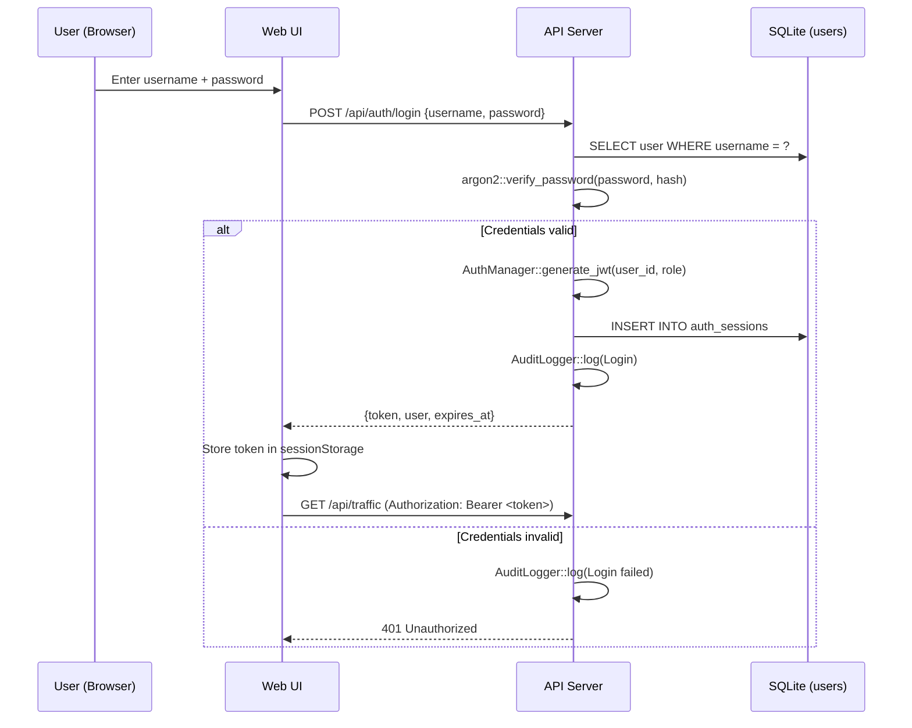
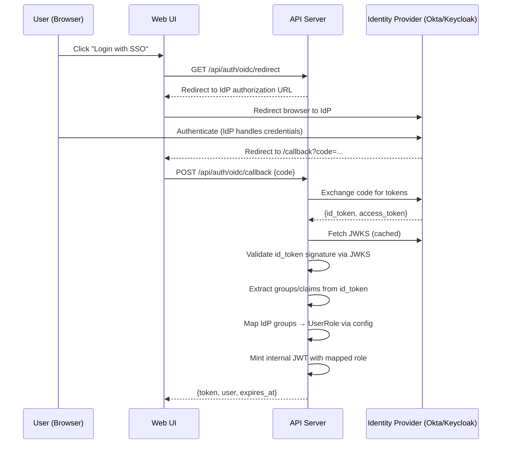

# Enterprise Authentication, Authorization, and Identity Provider Integration

This document details the authentication, authorization, and external identity provider integration design for the Madhyamas enterprise tier. It is a sub-document of the enterprise analysis.

Part of: [Enterprise Analysis Overview](ENTERPRISE_OVERVIEW.md)

---

## 1. Authentication Design

### 1.1 Authentication modes

The `--auth-mode` flag (or `MADHYAMAS_AUTH_MODE` env var) selects the
authentication mechanism. All modes feed into the same internal
`JwtClaims` / `UserRole` so downstream RBAC is uniform.

| Mode | Use case | Mechanism |
|---|---|---|
| `local` (default) | Self-hosted, small teams | Built-in user store, argon2 passwords, JWT issuance |
| `oidc` | Enterprise SSO | Delegate to external IdP (Okta, Auth0, Keycloak, Google) |
| `header` | Reverse proxy auth | Trust `X-Forwarded-User` / `X-Forwarded-Groups` from authentik/authelia/Cloudflare Access |
| `ldap` | On-prem, legacy AD | LDAP bind authentication |
| `disabled` | Simple tier | No auth (enterprise code not compiled or no license) |

### 1.2 Local mode (built-in IdP)



- **Password storage:** argon2id hashes in `users.password_hash` column.
- **JWT issuance:** `AuthManager::generate_jwt(user_id, role)` using
  HMAC-SHA256 with the configured `jwt_secret`.
- **JWT claims:** `sub` (user ID), `iss` ("madhyamas"), `aud`
  ("madhyamas-api"), `exp`, `iat`, `role`, `sid` (session ID).
- **Token transport:** `Authorization: Bearer <token>`.
- **Token lifetime:** 1 hour (configurable via `jwt_expiration_secs`).
- **Refresh:** `POST /auth/refresh` with valid unexpired token issues a
  new one. Refresh tokens (longer-lived, server-side revocable) are a
  recommended enhancement.
- **Logout:** `POST /auth/logout` invalidates the session, records audit
  event.

### 1.3 API keys (automation / CLI / MCP)

- **Format:** `mad_{uuid}` (no dashes).
- **Transport:** `X-API-Key` header (configurable via
  `AuthConfig.api_key_header`).
- **Lifecycle:** create via `POST /api/auth/api-keys` (requires JWT
  auth), revoke via `DELETE /api/auth/api-keys/{id}`. Each key tracks
  `last_used` and `expires_at`.
- **Middleware:** `auth_middleware` must be extended to check
  `X-API-Key` when no `Authorization: Bearer` header is present.
  `AuthManager::validate_api_key` returns the user ID; the user's role
  is looked up and injected as `JwtClaims` for downstream RBAC.
- **Scoping:** API keys inherit the creating user's role. Future
  enhancement: per-key role override or scope restriction.

### 1.4 Bootstrap / first-run

On an empty `users` table (first enterprise startup):

1. If `--admin-username` and `--admin-password` are provided via CLI or
   env, create an admin user with those credentials.
2. If not provided, generate a random admin password, print it once to
   stderr, and require a password change on first login.
3. Record a `ConfigChanged` audit event noting admin bootstrap.

### 1.5 Security requirements

> **Note:** For a comprehensive security analysis including JWT clock
> skew, algorithm confusion, WebSocket auth, CSP headers, and session
> timeout gaps, see
> [ENTERPRISE_PERF_SECURITY.md §3](ENTERPRISE_PERF_SECURITY.md#3-security-gaps-and-remediations).

- **Reject default JWT secret in production.** If `enabled == true` and
  `jwt_secret == "madhyamas-secret-key-change-me"`, refuse to start.
- **Constant-time password comparison** (argon2 handles this).
- **Rate-limit login attempts** (per-IP and per-username) to prevent
  brute force. Reuse the existing `tower_governor` rate limiter.
- **No password in logs, audit events, or error messages.**
- **JWT secret from file or env, never in config DB.**

---

## 2. Authorization Design

### 2.1 RBAC model (existing, needs enforcement)

The `RbacManager` maps `UserRole` to a set of `(ResourceType,
Permission)` pairs. The model is already defined and sound.

#### Roles

| Role | Description |
|---|---|
| `Admin` | Full CRUD on all resources + Script/Plugin Execute + Config Read/Write |
| `User` | Read/Write on Traffic, Session, Mock, Rewrite, Breakpoint; Script Read/Execute |
| `Viewer` | Read on all resources |
| `ReadOnly` | Read on all resources (alias of Viewer) |

#### Resources

`Traffic`, `Session`, `Mock`, `Rewrite`, `Breakpoint`, `Script`,
`Plugin`, `Config`.

#### Permissions

`Read`, `Write`, `Delete`, `Execute`.

### 2.2 What needs to be built

1. **Apply `require_permission_middleware` per route group** with the
   correct `(ResourceType, Permission)`:

   | Route group | Resource | Permission |
   |---|---|---|
   | `GET /api/traffic` | Traffic | Read |
   | `POST /api/traffic/clear` | Traffic | Delete |
   | `POST /api/sessions` | Session | Write |
   | `DELETE /api/sessions/{id}` | Session | Delete |
   | `POST /api/mocks` | Mock | Write |
   | `DELETE /api/mocks/{id}` | Mock | Delete |
   | `POST /api/scripts/execute` | Script | Execute |
   | `PATCH /api/config` | Config | Write |
   | `GET /api/users` | (admin gate) | Admin-only |
   | `POST /api/users` | (admin gate) | Admin-only |
   | `DELETE /api/audit/clear` | (admin gate) | Admin-only |

2. **API-key identity to role** — keys need an associated role. Currently
   `ApiKey` has `user_id` but no role. Derive the role from the
   associated user at validation time.

3. **Admin-only route guard** — enterprise admin routes (`/users`,
   `/rbac`, `/audit/clear`) should require `UserRole::Admin`. Add a
   simple `require_admin_middleware` or check `claims.role == "admin"`
   in the handler.

4. **Resource-level isolation (future, multi-tenant)** — scope queries
   by `user_id` or `workspace_id` so users only see their own traffic.
   Today all users share one traffic DB. This is a larger architectural
   change and is not needed for the initial enterprise tier.

5. **ABAC overlay (future)** — for fine-grained rules ("user can only
   delete mocks they created"). Add `owner_id` columns and a check.
   Keep RBAC as the coarse gate.

### 2.3 Permission check flow

```mermaid
flowchart TD
    A[Incoming API request] --> B{Public path?}
    B -->|Yes| C[Pass through]
    B -->|No| D{Authorization: Bearer\nheader present?}
    D -->|Yes| E[Validate JWT]
    D -->|No| F{X-API-Key\nheader present?}
    F -->|Yes| G[Validate API key\n→ derive user + role]
    F -->|No| H[401 Unauthorized]
    E -->|Valid| I[Inject JwtClaims]
    E -->|Invalid| H
    G -->|Valid| I
    G -->|Invalid| H
    I --> J{require_permission_middleware\nfor this route?}
    J -->|No| K[Handler executes]
    J -->|Yes| L[Check role has\n(Resource, Permission)]
    L -->|Allowed| K
    L -->|Denied| M[403 Forbidden]
```

---

## 3. External Identity Provider Integration

### 3.1 Option comparison

| Option | Protocol | Complexity | When to use |
|---|---|---|---|
| Built-in (local) | — | Low | Small teams, self-hosted, no existing IdP |
| OIDC / OAuth2 | OIDC | Medium | Enterprise SSO (Okta, Auth0, Keycloak, Google) |
| Header-based | — | Low | Reverse proxy auth (authentik, authelia, Cloudflare Access) |
| LDAP / AD bind | LDAP | Medium | On-prem, legacy AD, air-gapped |
| SAML 2.0 | SAML | High | Legacy enterprises that require SAML (rare for debugging tools) |

### 3.2 OIDC / OAuth2 (recommended for enterprise SSO)



#### Configuration

```toml
# ~/.madhyamas/auth.toml (or via env vars)
[oidc]
issuer_url = "https://acme.okta.com"
client_id = "madhyamas-client"
client_secret = "..."  # or from env: MADHYAMAS_OIDC_CLIENT_SECRET
scopes = ["openid", "profile", "email", "groups"]
redirect_uri = "http://localhost:3001/api/auth/oidc/callback"

[oidc.group_mapping]
"madhyamas-admins" = "admin"
"madhyamas-users" = "user"
"madhyama-viewers" = "viewer"
```

#### Implementation notes

- Add `openidconnect` crate (or hand-rolled JWKS fetch + `jsonwebtoken`
  with RS256/ES256 validation — `jsonwebtoken` already supports
  asymmetric algorithms).
- JWKS are fetched once and cached with TTL. Fallback to re-fetch on
  key ID mismatch.
- The internal JWT (HMAC-SHA256) is still issued by Madhyamas so
  downstream middleware doesn't need to know about OIDC. The IdP token
  is only used at login time.
- API keys remain local (IdPs rarely issue long-lived bearer tokens
  suitable for CLI usage).

#### New dependencies

- `openidconnect` crate (Rust OIDC client library), or
- Manual: `jsonwebtoken` (already available) + `reqwest` (already
  available) for JWKS fetch. This avoids adding a new crate but
  requires more code.

**Recommendation:** Use `openidconnect` for correctness (PKCE, token
refresh, discovery document parsing). The crate is well-maintained and
handles edge cases.

### 3.3 Header-based auth (reverse proxy)

Cheapest SSO option for self-hosters. A reverse proxy (authentik,
authelia, Cloudflare Access, nginx + oauth2-proxy) handles
authentication and forwards identity headers.

```toml
[auth]
mode = "header"
header_user = "X-Forwarded-User"
header_groups = "X-Forwarded-Groups"
trusted_proxies = ["127.0.0.1/8", "10.0.0.0/8"]
```

- `auth_middleware` reads `X-Forwarded-User` as the username, maps
  `X-Forwarded-Groups` to roles via the same group mapping config.
- Only accepts these headers from trusted proxy IPs (prevents spoofing).
- No JWT issuance — the proxy is trusted, Madhyamas just reads the
  headers and synthesizes `JwtClaims` for downstream RBAC.

### 3.4 LDAP / AD bind

For on-prem, air-gapped environments with existing Active Directory.

- Add `ldap3` workspace dependency.
- `login` handler binds to LDAP server with `user@domain` + password.
  On success, queries user's group memberships and maps to roles.
- No password storage in Madhyamas — LDAP is the source of truth.
- Configuration: `ldap_url`, `bind_dn_template`, `group_base_dn`,
  `group_mapping`.

### 3.5 SAML 2.0

Only on customer request. SAML is heavier (XML signing, metadata
exchange, SP-initiated vs IdP-initiated flows). The `saml2` crate or
manual XML signing via `openssl` would be needed. OIDC covers the vast
majority of modern enterprise SSO needs.

### 3.6 Recommendation

1. Ship **local mode** first (unblocks the scaffold, no external deps).
2. Add **header-based mode** next (cheapest SSO, no new crates, popular
   with self-hosters).
3. Add **OIDC** as the primary enterprise SSO integration.
4. Add **LDAP** as a stretch goal for on-prem.
5. Add **SAML** only on explicit customer request.

---

## See Also

- [Enterprise Analysis Overview](ENTERPRISE_OVERVIEW.md)
- [Enterprise Licensing Server](ENTERPRISE_LICENSING_SERVER.md)
