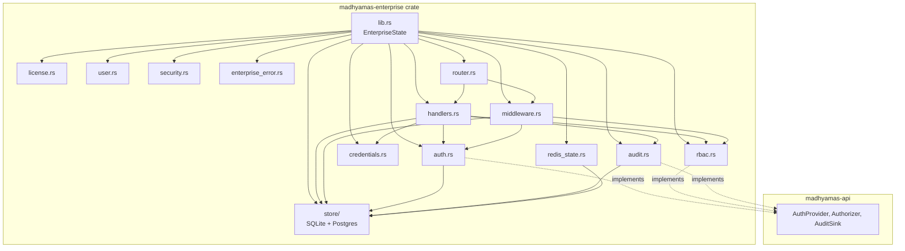
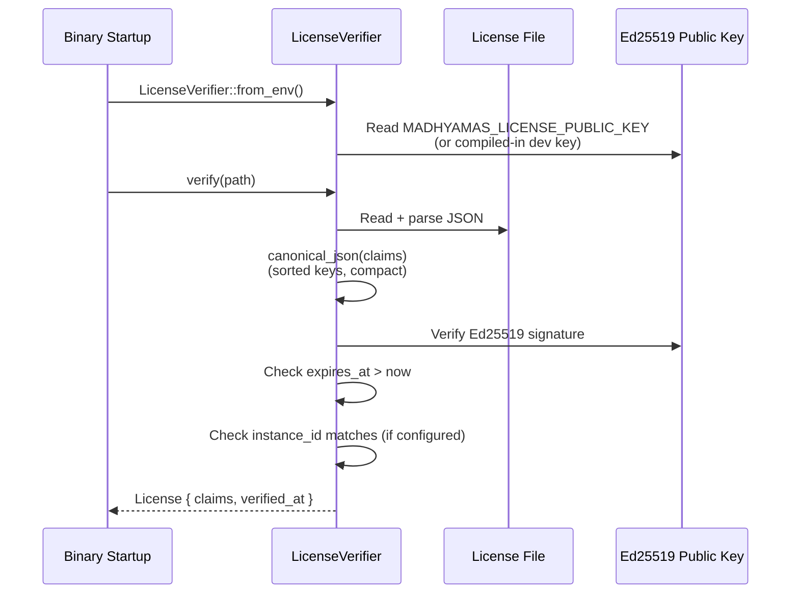

# Enterprise Crate Developer Guide

> **Last verified:** 2025-01 against `crates/madhyamas-enterprise/`.
> **Audience:** Developers working on or extending the enterprise tier.
> **License:** This crate is licensed under BSL-1.1 (Business Source License),
> unlike the rest of the workspace which is dual MIT OR Apache-2.0.

## Overview

`madhyamas-enterprise` is the workspace crate that holds all enterprise-specific
code: authentication (JWT + API keys), role-based access control, tamper-evident
audit logging, offline Ed25519 license verification, Redis-backed cross-instance
state coordination, and the axum handlers/middleware/router that expose all of
the above over the REST API.

The crate depends on `madhyamas-api` (for the `AuthProvider`, `Authorizer`, and
`AuditSink` trait abstractions and the shared `AppState`) and on
`madhyamas-core` (for shared non-enterprise types such as `TrafficEvent` and the
Redis pub/sub channel constants). Nothing in those two crates depends on this
one — the dependency direction is strictly one-way, which keeps the OSS build
free of enterprise code and BSL-licensed dependencies.

## Crate Structure



### Module map

| Module | File | Purpose |
|--------|------|---------|
| `lib` | `src/lib.rs` | `EnterpriseState` struct, public re-exports, error conversions |
| `auth` | `src/auth.rs` | `AuthManager`, JWT (HS256) issue/validate, API key validation, `Scope` |
| `rbac` | `src/rbac.rs` | `RbacManager`, role-to-permission matrix, `ResourceType`/`Permission` |
| `audit` | `src/audit.rs` | `AuditLogger`, in-memory ring buffer, SHA-256 hash chain, store-backed persistence |
| `license` | `src/license.rs` | `LicenseVerifier`, Ed25519 signature verification, canonical JSON |
| `credentials` | `src/credentials.rs` | Argon2id `hash_password`/`verify_password`, complexity policy |
| `user` | `src/user.rs` | `User`, `UserRole`, `UserStatus` domain types |
| `redis_state` | `src/redis_state.rs` | `RedisState`, pub/sub, instance registration, seat tracking, cluster metrics |
| `store` | `src/store/` | `EnterpriseStore` async trait + `SqliteEnterpriseStore` + `PostgresEnterpriseStore` |
| `security` | `src/security.rs` | `validate_callback_url` (SSRF guard), `is_private_ip` |
| `enterprise_error` | `src/enterprise_error.rs` | `EnterpriseError` enum + conversions to API-layer errors |
| `handlers` | `src/handlers.rs` | axum handlers for all enterprise endpoints |
| `middleware` | `src/middleware.rs` | `auth_middleware`, `require_permission_middleware`, `AuthUser` extractor |
| `router` | `src/router.rs` | `create_enterprise_router` wiring |

## Public API

### `EnterpriseState`

The central type constructed by the main binary when the enterprise tier is
enabled. It bundles the three core managers plus optional store, license, and
Redis coordinator behind `Arc` so they can be shared across async tasks and
cloned into `madhyamas_api::AppState`.

```rust
pub struct EnterpriseState {
    pub auth: Arc<AuthManager>,
    pub rbac: Arc<RbacManager>,
    pub audit: Arc<AuditLogger>,
    pub store: Option<Arc<dyn EnterpriseStore>>,
    pub license: Option<License>,
    pub redis: Option<Arc<RedisState>>,
}
```

### Builder pattern

`EnterpriseState` uses a consuming-builder style. The base `new` constructs the
three in-memory managers; the `with_*` methods attach optional components.

```rust
use madhyamas_enterprise::{EnterpriseState, AuthConfig};
use madhyamas_enterprise::store::SqliteEnterpriseStore;

let store = SqliteEnterpriseStore::new(pool).await?;
let state = EnterpriseState::new(AuthConfig::production(jwt_secret))
    .with_store(store)
    .with_license(Some(license))
    .with_redis(Some(redis_state));
```

| Method | Effect |
|--------|--------|
| `EnterpriseState::new(config)` | Creates `AuthManager`, `RbacManager`, `AuditLogger` from an `AuthConfig` |
| `.with_store(store)` | Attaches a persistent `EnterpriseStore` (users, API keys, sessions, audit) |
| `.with_license(license)` | Attaches a verified `License` (or `None` for unlicensed enterprise mode) |
| `.with_redis(redis)` | Attaches a `RedisState` coordinator (or `None` for single-instance mode) |

When `license` is `None`, the binary runs in unlicensed enterprise mode —
auth/RBAC/audit still function, but seat-count enforcement and feature gating
are not applied. When `redis` is `None`, all multi-instance features are
disabled and the binary operates as a single instance.

### Key re-exports

`lib.rs` re-exports the most-used types at the crate root (e.g. `AuthManager`,
`RbacManager`, `AuditLogger`, `LicenseVerifier`, `RedisState`,
`EnterpriseStore`, `User`, `EnterpriseError`, `create_enterprise_router`) so
downstream code rarely needs to reach into submodules. See `src/lib.rs` for the
full re-export list.

## Module Details

### `auth` — Authentication

**Purpose:** JWT (HS256) access/refresh token issuance and validation, API key
validation against the persistent store, and scope parsing/matching for
API-key-authenticated requests.

**Key types:** `AuthConfig` (enabled, jwt_secret, expiries, timeouts),
`AuthManager` (config + in-memory sessions + optional store), `JwtClaims`,
`RefreshTokenClaims`, `ApiKey`, `ApiKeyAuth`, `Scope`.

**Key methods:**

| Method | Description |
|--------|-------------|
| `AuthConfig::production(jwt_secret)` | Strict config: `enabled=true`, `require_auth=true` |
| `AuthConfig::development()` | Permissive config: `enabled=false` |
| `AuthManager::with_store(store)` | Attach a persistent store for API key validation |
| `generate_jwt(user_id, role)` | Issue an HS256 access token |
| `validate_jwt(token)` | Validate an access token (HS256 pin, 60s leeway, `typ=access`) |
| `generate_token_pair(user_id, role)` | Issue `(access, refresh, sid, exp)` sharing one session ID |
| `validate_refresh_token(token)` | Validate a refresh token (`typ=refresh`) |
| `validate_api_key(key)` | SHA-256 hash → store lookup → expiry check → `ApiKeyAuth` |
| `session_idle_timeout_secs()` | Exposed for the auth middleware's idle-timeout check |

**Security notes:** JWT validation pins `Algorithm::HS256` explicitly to prevent
`none`-algorithm and RS256/HS256 confusion attacks. API keys are high-entropy
random tokens hashed with SHA-256 (fast); passwords use Argon2id (see
`credentials`). `validate_api_key` fire-and-forgets a `last_used` update via
`tokio::spawn` so the request is not blocked.

**Extension points:** Implement `madhyamas_api::auth::AuthProvider` to add OIDC,
SAML, header-based, or LDAP authentication. `AuthManager` already implements
`AuthProvider` for JWT and API key flows.

### `rbac` — Role-Based Access Control

**Purpose:** In-memory role-to-permission matrix mapping `UserRole` to sets of
`(ResourceType, Permission)` pairs. Provides runtime permission checks used by
the permission middleware.

**Key types:** `ResourceType` (Traffic, Session, Mock, Rewrite, Breakpoint,
Script, Plugin, Config), `Permission` (Read, Write, Delete, Execute),
`RbacManager` (role_permissions map behind `RwLock`).

**Default role matrix:**

| Role | Permissions |
|------|-------------|
| `Admin` | All (read/write/delete/execute) on all resource types |
| `User` | Read/write on traffic, sessions, mocks, rewrites, breakpoints; read/execute on scripts |
| `Viewer` | Read-only on traffic, sessions, mocks, rewrites, breakpoints, scripts, plugins |
| `ReadOnly` | Same as `Viewer` |

**Key methods:** `has_permission(role, rt, perm)`, `get_permissions(role)`,
`grant_permission(role, rt, perm)`, `revoke_permission(role, rt, perm)`.
`RbacManager` implements `madhyamas_api::auth::Authorizer`, bridging the
enterprise enums to the API-layer equivalents. Enterprise-only resources
(`User`, `Audit`, `License`) and the `Admin` permission have no representation
in the core matrix and return `false` from the trait method.

**Extension points:** Use `grant_permission`/`revoke_permission` to customize
the matrix at runtime, or implement `Authorizer` directly for a custom policy
engine (e.g. ABAC or policy-as-code).

### `audit` — Audit Logging

**Purpose:** Append-only audit event log with a SHA-256 hash chain for tamper
detection. Backed by an in-memory ring buffer plus optional persistent store
persistence.

**Key types:** `AuditEventType` (Login, Logout, ApiKeyCreated, ...,
ConfigChanged, Custom), `AuditEvent` (id, type, timestamp, user_id,
api_key_id, client_ip, description, metadata, prev_hash, hash), `AuditFilter`,
`AuditLogger` (ring buffer + optional store).

**Hash chain:** Each event's `prev_hash` links to the previous event's `hash`.
The hash covers `id`, `event_type`, `timestamp`, `description`, and `prev_hash`
(canonical fields only — metadata is excluded for stability).
`verify_hash_chain()` recomputes the chain and detects tampering.

**Key methods:**

| Method | Description |
|--------|-------------|
| `AuditLogger::new(max_events)` | Create with a ring buffer of `max_events` entries |
| `with_store(store)` | Attach persistent storage (fire-and-forget persistence) |
| `log(event)` | Compute hash chain, update ring buffer, persist asynchronously |
| `query(filter)` | Query events (delegates to store when attached) |
| `verify_hash_chain()` | Recompute the chain; returns `Ok(false)` on tamper detection |
| `clear()` | Clear both the ring buffer and the persistent store |

**Extension points:** Implement `madhyamas_api::auth::AuditSink` to route audit
events to an external SIEM, syslog, or object storage. `AuditLogger` already
implements `AuditSink` for the built-in log + store path.

### `license` — Ed25519 License Verification

**Purpose:** Offline license file verification using Ed25519 signatures. The
binary holds only the public key; the licensing server (see
[ENTERPRISE_LICENSING_SERVER.md](ENTERPRISE_LICENSING_SERVER.md)) holds the
private signing key.

**Key types:** `LicenseClaims` (license_id, customer, plan, seats,
instance_id, issued_at, expires_at, features), `LicenseFile` (claims + base64
signature), `License` (verified claims + verification timestamp),
`LicenseVerifier` (public key + optional expected instance ID), `LicenseError`.

**Verification flow:**



**Key methods:** `LicenseVerifier::new(key_bytes)`, `from_env()` (reads
`MADHYAMAS_LICENSE_PUBLIC_KEY`; falls back to dev key), `with_expected_instance_id(id)`
(license replay prevention), `verify(path)` (read + parse + verify from disk),
`verify_claims(file)` (core verification on in-memory `LicenseFile`),
`License::is_expired()`, `License::has_feature(name)`.

**Canonical JSON contract:** The signature is computed over the claims only
(excluding `signature`), serialized with all object keys sorted recursively
(lexicographic UTF-8 byte order) and compact (no whitespace). The licensing
server MUST produce signatures over the identical canonical form.

### `redis_state` — Cross-Instance Coordination

**Purpose:** Redis-backed pub/sub event broadcasting, instance registration with
heartbeats, license seat tracking, and cluster metrics aggregation for
multi-instance deployments.

**Key types:** `RedisState` (client + instance_id), `InstanceInfo`
(instance_id, license_id, addr, last_heartbeat, metrics), `InstanceMetrics`
(cpu, memory, connections, request_count, uptime), `RedisTrafficEvent`
(instance_id + TrafficEvent wrapper).

**Channels:**

| Constant | Channel | Purpose |
|----------|---------|---------|
| `CHANNEL_EVENTS` | `madhyamas:events` | Cross-instance WebSocket traffic event broadcast |
| `CHANNEL_CONFIG` | `madhyamas:config` | Config-change notifications (reload from store) |
| `CHANNEL_INTERCEPT` | `madhyamas:intercept` | Intercept-rule-change notifications (reload store) |
| `CHANNEL_SEATS` | `madhyamas:seats` | License seat-count updates |

**Key methods:** `new(url, instance_id)` (connect + PING; supports `redis://`
and `rediss://` TLS), `publish`/`subscribe` (pub/sub), `register_instance`,
`heartbeat`, `deregister_instance`, `active_instance_count`, `list_instances`,
`register_instance_with_metrics`, `update_instance_metrics`.

`RedisState` implements `madhyamas_api::EventPublisher` so the API layer can
publish config/intercept notifications without depending on the concrete type.

**Seat tracking:** There is no separate `SeatCoordinator` type — seat tracking
is built directly into `RedisState` via the sorted-set methods. The atomic Lua
`ZADD + EXPIRE` script prevents stale entries from a crash between the two
operations, which would cause seat over-counting. Heartbeat staleness threshold
is 120 seconds.

### `store` — Storage Abstraction

**Purpose:** Async storage trait for enterprise data (users, API keys, auth
sessions, audit events) with two concrete backends: SQLite and PostgreSQL.

The `EnterpriseStore` trait (defined in `store/mod.rs`, `#[async_trait]`) covers
four data domains:

| Domain | Methods |
|--------|---------|
| Users | `create_user`, `get_user`, `get_user_by_username`, `get_user_credentials`, `list_users`, `update_user`, `delete_user` |
| API keys | `create_api_key`, `get_api_key_by_hash`, `list_api_keys`, `revoke_api_key`, `update_api_key_last_used` |
| Sessions | `create_session`, `get_session`, `revoke_session`, `cleanup_expired_sessions`, `update_session_activity` |
| Audit | `log_audit_event`, `query_audit_events`, `get_audit_stats`, `clear_audit_events`, `get_latest_audit_hash` |

**Backends:**

| Backend | Type | Pool | Notes |
|---------|------|------|-------|
| SQLite | `SqliteEnterpriseStore` | `sqlx::SqlitePool` | Single-instance; in-memory (`:memory:`) for tests |
| PostgreSQL | `PostgresEnterpriseStore` | `sqlx::PgPool` | Multi-instance; advisory lock `0x4D414448` serializes DDL |

All SQL uses runtime `sqlx::query` / `sqlx::query_as` strings (not the
compile-time `query!` macro) so the crate builds without a database at build
time. Row types (`UserRecord`, `ApiKeyRecord`, `AuthSession`,
`AuditEventRecord`, `UserUpdate`, `AuditStats`) in `store/types.rs` derive
`sqlx::FromRow` and convert to/from the public domain types.

### `handlers` — API Handlers

**Purpose:** axum request handlers for all enterprise endpoints. Persistent
data is served from an `EnterpriseStore` injected via `axum::Extension`; the
`AuthManager` is likewise injected so login/token handlers can issue JWTs.

**Handler groups:**

| Group | Key handlers | Routes |
|-------|--------------|--------|
| Performance | `get_metrics`, `get_cluster_metrics`, `get_instances`, `get_performance_stats` | `/metrics`, `/metrics/cluster`, `/instances`, `/performance` |
| Health | `get_health_check` | `/health/detailed` |
| License | `get_license_info` | `/license` (public) |
| Auth | `login`, `refresh_token`, `logout`, `get_current_user`, `validate_token` | `/auth/*` |
| API Keys | `get_api_keys`, `create_api_key`, `revoke_api_key` | `/auth/api-keys` |
| Users | `get_users`, `create_user`, `update_user`, `delete_user` | `/users` (admin-only) |
| RBAC | `get_roles`, `get_permissions`, `check_permission` | `/rbac/*` |
| Audit | `get_audit_events`, `get_audit_stats`, `export_audit_events`, `clear_audit_events` | `/audit/*` |
| Onboarding | `get_onboarding_status`, `complete_onboarding_step`, `skip_onboarding` | `/onboarding/*` |
| Config | `export_config`, `import_config` | `/config/export`, `/config/import` |

### `middleware` — Auth and Permission Enforcement

**Purpose:** Two axum middleware functions plus an `AuthUser` extractor.

**`auth_middleware`:** Validates `X-API-Key` header, `?api_key=` query param,
or `Authorization: Bearer <token>` header. Injects an `AuthUser` into request
extensions. Public paths bypass the check. For API key auth, the granted scopes
are checked against the route's required scope (derived from HTTP method + path
via `required_scope`).

**`require_permission_middleware`:** Checks the authenticated user's role
against the RBAC matrix for a specific `(ResourceType, Permission)`. Applied via
`from_fn_with_state(PermissionState, ...)`. For API-key users, scope
enforcement has already been applied in `auth_middleware`, so this passes
through.

```rust
pub struct AuthUser {
    pub claims: Option<JwtClaims>,    // Some when JWT auth
    pub scopes: Option<Vec<String>>,  // Some when API key auth
    pub user_id: String,
    pub role: String,
    pub key_id: Option<String>,
    pub session_id: Option<String>,
}
```

`AuthUser` implements `FromRequestParts` so handlers can extract it as a
parameter. If no `AuthUser` is present, extraction fails with `401`.

**Public paths** (no auth required): `/health`, `/api/health`,
`/api/health/detailed`, `/api/auth/login`, `/api/auth/refresh`, `/api/license`.

**CSRF note:** Auth uses bearer tokens in the `Authorization` header (or API
keys), not cookies, so CSRF is not applicable. If cookie-based auth is added in
the future, CSRF tokens MUST be implemented.

### `router` — Enterprise Router

**Purpose:** `create_enterprise_router` assembles all enterprise routes into a
single `Router<Arc<AppState>>` that the main binary merges with the core API
router when the enterprise tier is enabled.

```rust
pub fn create_enterprise_router(
    store: Arc<dyn EnterpriseStore>,
    auth: Arc<AuthManager>,
    audit: Arc<AuditLogger>,
    license: Option<License>,
    redis: Option<Arc<RedisState>>,
) -> Router<Arc<AppState>>
```

The store, auth manager, audit logger, license, and Redis state are injected
via `axum::Extension` layers so handlers can access them without
`madhyamas-api` depending on this crate. User-management routes are wrapped in
a sub-router with `require_permission_middleware` enforcing `Config:Write`
(admin-only). Audit clear requires `Config:Delete`.

## Extension Points

### Custom auth providers

Implement `madhyamas_api::auth::AuthProvider` (which requires `validate_token`,
`validate_api_key`, and `authenticate_password`) to add OIDC, SAML, header-based,
or LDAP authentication. Wire the custom provider into `AppState` (the
`auth_provider` field) in the main binary. Use `security::validate_callback_url`
to guard OIDC callback endpoints against SSRF.

### Custom audit sinks

Implement `madhyamas_api::auth::AuditSink` (which requires `log_event`,
`query_events`, `export_events`) to route events to an external SIEM, syslog, or
object storage. Wire the custom sink into `AppState` (the `audit_sink` field).
The built-in `AuditLogger` can still run alongside it for the in-memory ring
buffer and hash chain.

### Custom storage backends

Implement `EnterpriseStore` to add a new database backend (e.g. MySQL, a
cloud-native database, or an encrypted-at-rest store). Pass the custom store to
`EnterpriseState::with_store`. The `AuthManager`, `AuditLogger`, and handlers
all use the trait, so no other changes are needed.

### Custom routes

Add a new handler in `handlers.rs` and register it in
`router::create_enterprise_router`:

```rust
// In handlers.rs
pub async fn my_custom_handler(
    Extension(store): Extension<Arc<dyn EnterpriseStore>>,
    auth: AuthUser,
) -> Json<serde_json::Value> {
    Json(serde_json::json!({"ok": true}))
}

// In router.rs: .route("/my-endpoint", get(handlers::my_custom_handler))
// To protect with RBAC, wrap in a sub-router with require_permission_middleware
// using PermissionState { rbac, resource_type, permission }.
```

## Build Configuration

### Cargo features

The crate has no Cargo features of its own (`default = []`). Enterprise
functionality is gated at the workspace level via the `enterprise` feature on
`madhyamas-core` and `madhyamas-api`, which conditionally compile the code that
depends on this crate. The main binary's `Cargo.toml` pulls in
`madhyamas-enterprise` only when the `enterprise` feature is enabled.

### Key dependencies

| Dependency | Role |
|------------|------|
| `jsonwebtoken` | HS256 JWT issue/validate |
| `argon2` + `password-hash` | Argon2id password hashing |
| `ed25519-dalek` | Ed25519 license signature verification |
| `sha2` | API key hashing (SHA-256) + audit hash chain |
| `sqlx` | Async SQLite + PostgreSQL drivers |
| `redis` | Redis client (pub/sub, sorted sets) |
| `parking_lot` | `RwLock`/`Mutex` for concurrent in-memory state |
| `axum` | HTTP router, middleware, extractors |
| `base64` | License signature encoding |
| `url` | Callback URL parsing (SSRF guard) |

### Conditional compilation

Within the crate, `#[cfg(test)]` gates the `jwt_secret()` accessor (for tests
that craft tokens with custom claims) and the test modules. There are no
`#[cfg(feature = "...")]` gates inside this crate — the entire crate is only
compiled when the workspace `enterprise` feature is on.

## Key Types Reference

| Type | Module | Description |
|------|--------|-------------|
| `EnterpriseState` | `lib` | Top-level state bundle (auth, rbac, audit, store, license, redis) |
| `AuthConfig` / `AuthManager` | `auth` | Auth config + JWT/API key manager |
| `JwtClaims` / `RefreshTokenClaims` | `auth` | JWT access / refresh token claims |
| `ApiKey` / `ApiKeyAuth` / `Scope` | `auth` | API key types + scope parser |
| `RbacManager` / `ResourceType` / `Permission` / `Resource` | `rbac` | RBAC matrix + enums |
| `AuditLogger` / `AuditEvent` / `AuditEventType` / `AuditFilter` | `audit` | Audit log + hash chain |
| `LicenseVerifier` / `License` / `LicenseClaims` / `LicenseFile` / `LicenseError` | `license` | Ed25519 license verification |
| `RedisState` / `InstanceInfo` / `InstanceMetrics` / `RedisTrafficEvent` | `redis_state` | Redis coordinator + types |
| `EnterpriseStore` / `SqliteEnterpriseStore` / `PostgresEnterpriseStore` | `store` | Storage trait + backends |
| `ApiKeyRecord` / `AuthSession` / `UserUpdate` / `AuditStats` / `StoreError` | `store` | Store row/update/error types |
| `User` / `UserRole` / `UserStatus` | `user` | User domain types |
| `AuthUser` / `PermissionState` | `middleware` | Auth identity extractor + permission middleware state |
| `EnterpriseError` | `enterprise_error` | Crate error enum |

## Error Handling

`EnterpriseError` (`AuthFailed`, `TokenExpired`, `JwtError`,
`PermissionDenied`, `UserNotFound`, `AuditError`, `RoleNotFound`,
`InvalidConfig`) is the crate's error enum, with `From` implementations
converting it to the API-layer trait errors (`AuthError`, `AuditError`). Store
operations return `StoreError` (`Database`, `NotFound`, `Serialization`).
License verification returns `LicenseError` (`NotFound`, `Parse`,
`InvalidSignature`, `Expired`, `InstanceMismatch`, `KeyError`, `Io`).

## See Also

- [ENTERPRISE_OVERVIEW.md](ENTERPRISE_OVERVIEW.md) — Two-tier model, crate architecture, roadmap
- [ENTERPRISE_AUTH_RBAC.md](ENTERPRISE_AUTH_RBAC.md) — Auth modes, RBAC model, OIDC/header/LDAP/SAML
- [ENTERPRISE_STORAGE_TRAITS.md](ENTERPRISE_STORAGE_TRAITS.md) — Storage traits, rusqlite to sqlx migration
- [ENTERPRISE_LICENSING_SERVER.md](ENTERPRISE_LICENSING_SERVER.md) — SaaS licensing server
- [ENTERPRISE_MULTI_INSTANCE.md](ENTERPRISE_MULTI_INSTANCE.md) — LB routing, Redis state sync, K8s
- [ENTERPRISE_CRATE_MIGRATION.md](ENTERPRISE_CRATE_MIGRATION.md) — Migration analysis for this crate
- [ENTERPRISE_IMPLEMENTATION_PLAN.md](ENTERPRISE_IMPLEMENTATION_PLAN.md) — Implementation plan (13 phases)
- [ENTERPRISE_PERF_SECURITY.md](ENTERPRISE_PERF_SECURITY.md) — Threat model, security gaps, perf bottlenecks
- [ENTERPRISE_CICD.md](ENTERPRISE_CICD.md) — Two-tier CI matrix, release workflow
- [API_ENTERPRISE.md](API_ENTERPRISE.md) — Enterprise API endpoint reference
- [ARCHITECTURE.md](ARCHITECTURE.md) — System architecture and workspace layout
