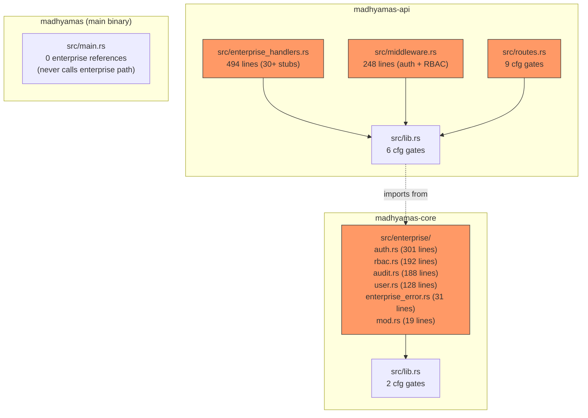
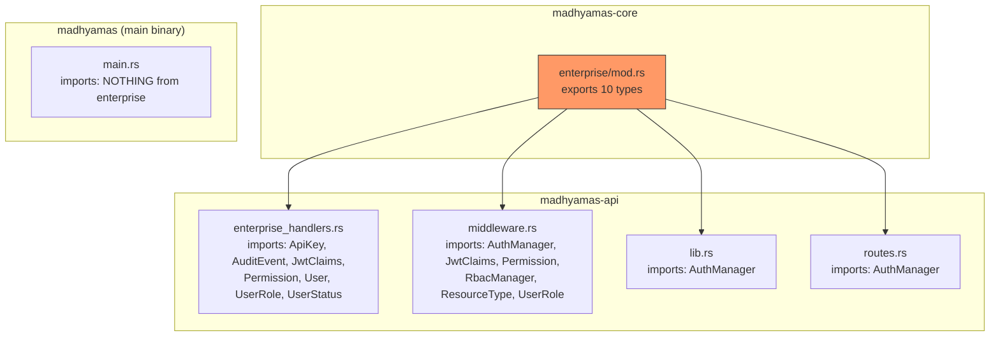
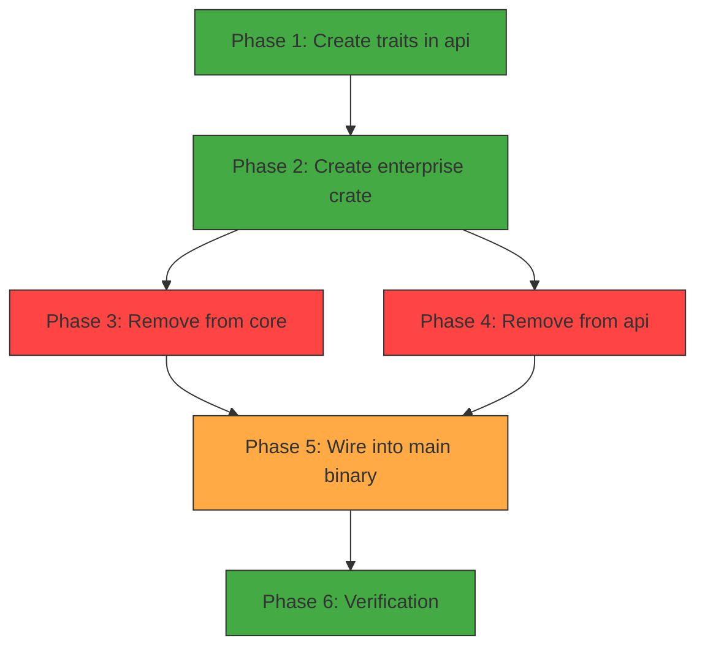

# madhyamas-enterprise Crate Migration Analysis

> Part of: [Enterprise Analysis Overview](ENTERPRISE_OVERVIEW.md)

This document analyzes the current state of enterprise code across
the codebase and provides a detailed migration plan for extracting it
into a separate `madhyamas-enterprise` crate. It catalogs every file,
every `#[cfg]` gate, every dependency, and every cross-crate
reference that must change.

---

## Table of Contents

1. [Current State: Where Enterprise Code Lives Today](#1-current-state-where-enterprise-code-lives-today)
2. [Inventory: Every Enterprise File and Its Contents](#2-inventory-every-enterprise-file-and-its-contents)
3. [Every #[cfg] Gate: Complete Listing](#3-every-cfg-gate-complete-listing)
4. [Dependency Analysis](#4-dependency-analysis)
5. [Cross-Crate Reference Map](#5-cross-crate-reference-map)
6. [What Moves Where](#6-what-moves-where)
7. [What Stays in Existing Crates](#7-what-stays-in-existing-crates)
8. [Trait Abstractions Required](#8-trait-abstractions-required)
9. [AppState Changes](#9-appstate-changes)
10. [Migration Steps (Ordered)](#10-migration-steps-ordered)
11. [Risk Assessment](#11-risk-assessment)
12. [Post-Migration Verification](#12-post-migration-verification)

---

## 1. Current State: Where Enterprise Code Lives Today

Enterprise code is currently scattered across **3 crates** behind
`#[cfg(feature = "enterprise")]` gates:



### Key findings

1. **859 lines** of enterprise types and logic in `madhyamas-core`
2. **742 lines** of enterprise handlers and middleware in `madhyamas-api`
3. **17 `#[cfg]` gates** across 4 files in 2 crates
4. **Main binary has zero enterprise references** — it never calls
   `create_routes_with_enterprise()` or constructs `AuthManager`
5. **No CLI enterprise stubs exist** (docs mention them but they
   were never created)
6. **No MCP enterprise stubs exist** (same — never created)
7. **No trait abstractions exist** in `madhyamas-api` — the
   `AuthProvider`/`Authorizer`/`AuditSink` traits proposed in the
   overview doc don't exist yet
8. **All enterprise handlers return 501 or empty responses** — they
   are stubs, not functional implementations
9. **`enterprise` is in the default feature set** of all 3 crates —
   meaning every default build compiles enterprise code (adding
   binary bloat and the `jsonwebtoken` dependency)

---

## 2. Inventory: Every Enterprise File and Its Contents

### 2.1 `madhyamas-core/src/enterprise/` (859 lines total)

| File | Lines | Contents | Dependencies |
|---|---|---|---|
| `mod.rs` | 19 | Module declarations + re-exports (`pub use`) | — |
| `auth.rs` | 301 | `AuthConfig`, `ApiKey`, `JwtClaims`, `AuthManager` (JWT issue/validate, API key gen/validate, session management) | `jsonwebtoken`, `parking_lot`, `serde`, `uuid`, `chrono` |
| `rbac.rs` | 192 | `ResourceType`, `Permission`, `Resource`, `RbacManager` (role → permission matrix, has_permission check) | `parking_lot`, `serde` |
| `audit.rs` | 188 | `AuditEventType`, `AuditEvent`, `AuditFilter`, `AuditLogger` (in-memory ring buffer) | `serde`, `chrono`, `uuid` |
| `user.rs` | 128 | `UserRole`, `UserStatus`, `User` (user struct with create_admin/create_viewer helpers) | `serde`, `uuid` |
| `enterprise_error.rs` | 31 | `EnterpriseError` enum (AuthFailed, TokenExpired, JwtError, PermissionDenied, UserNotFound, AuditError, RoleNotFound, InvalidConfig) | `thiserror`, `serde` |

**Key types exported by `mod.rs`:**
```rust
pub use audit::{AuditEvent, AuditEventType, AuditFilter, AuditLogger};
pub use auth::{ApiKey, AuthConfig, AuthManager, JwtClaims};
pub use enterprise_error::EnterpriseError;
pub use rbac::{Permission, RbacManager, Resource, ResourceType};
pub use user::{User, UserRole, UserStatus};
```

### 2.2 `madhyamas-api/src/enterprise_handlers.rs` (494 lines)

| Section | Lines | Handlers | Status |
|---|---|---|---|
| Stub types | 1-88 | `Metrics`, `MetricsCollector`, `HealthCheck`, `Role` | Defined (stub data) |
| Performance & Metrics | 89-152 | `get_metrics`, `get_health_check`, `get_performance_stats` | Return stub data |
| Authentication | 153-206 | `login`, `logout`, `get_current_user`, `validate_token` | **501 Not Implemented** |
| API Keys | 207-237 | `get_api_keys`, `create_api_key`, `revoke_api_key` | **501 or empty** |
| User Management | 238-300 | `get_users`, `get_user`, `create_user`, `update_user`, `delete_user` | **501 or empty** |
| RBAC | 301-323 | `get_roles`, `get_permissions`, `check_permission` | Return stub data |
| Audit Logs | 324-382 | `get_audit_events`, `get_audit_stats`, `export_audit_events`, `clear_audit_events` | Return empty |
| Onboarding | 383-468 | `get_onboarding_status`, `complete_onboarding_step`, `skip_onboarding` | Return stub data |
| Config Export/Import | 469-494 | `export_config`, `import_config` | Return stub/OK |

**Imports from `madhyamas-core`:**
```rust
use madhyamas_core::enterprise::{
    ApiKey, AuditEvent, JwtClaims, Permission, User, UserRole, UserStatus,
};
```

### 2.3 `madhyamas-api/src/middleware.rs` (248 lines)

| Component | Lines | Purpose | Status |
|---|---|---|---|
| `PUBLIC_PATHS` constant | 554-561 | Paths exempt from auth | Functional |
| `is_public_path()` | 563-575 | Check if path is exempt | Functional |
| `unauthorized()` / `forbidden()` | 577-599 | Error response builders | Functional |
| `auth_middleware` | 613-645 | JWT validation middleware | **Functional** (JWT-only, no API key) |
| `AuthUser` extractor | 651-668 | Extract JwtClaims from request | Functional |
| `role_from_claims()` | 673-680 | Parse UserRole from JWT | Functional |
| `PermissionState` | 684-691 | RBAC check state | Functional |
| `require_permission_middleware` | 701-719 | RBAC permission check | Functional |
| `require_permission()` | 739-745 | Helper to build PermissionState | Functional |

**Imports from `madhyamas-core`:**
```rust
use madhyamas_core::enterprise::{
    AuthManager, JwtClaims, Permission, RbacManager, ResourceType, UserRole,
};
```

### 2.4 `madhyamas-api/src/routes.rs` (enterprise parts, ~90 lines)

| Section | Lines | Purpose |
|---|---|---|
| Imports | 3-17 | `#[cfg]` imports of `AuthManager`, `enterprise_handlers`, `middleware` |
| `create_routes_with_enterprise()` | 44-56 | Public function with `#[cfg]` params |
| `create_routes_inner()` | 53-54 | `#[cfg]` params for `enterprise_enabled` and `auth_service` |
| Enterprise route block | 468-560 | 30+ route definitions (conditionally compiled) |
| Auth middleware application | 552-559 | Apply `auth_middleware` if `auth_service` is provided |

### 2.5 `madhyamas-api/src/lib.rs` (enterprise parts, ~20 lines)

| Line | What |
|---|---|
| 4 | `#[cfg(feature = "enterprise")] pub mod enterprise_handlers;` |
| 9 | `#[cfg(feature = "enterprise")] pub mod middleware;` |
| 18 | `#[cfg(feature = "enterprise")] use madhyamas_core::enterprise::AuthManager;` |
| 102 | `#[cfg(feature = "enterprise")] pub auth_service: Option<Arc<AuthManager>>` field on `AppState` |
| 133 | `#[cfg(feature = "enterprise")] auth_service: None` in `AppState::new()` |
| 234 | `#[cfg(feature = "enterprise")] pub fn with_auth_service()` builder method |

### 2.6 `madhyamas-core/src/lib.rs` (enterprise parts, ~5 lines)

| Line | What |
|---|---|
| 6 | `#[cfg(feature = "enterprise")] pub mod enterprise;` |
| 151 | `#[cfg(feature = "enterprise")] Enterprise(#[from] enterprise::EnterpriseError)` variant in `Error` enum |

---

## 3. Every #[cfg] Gate: Complete Listing

### 3.1 `madhyamas-core/src/lib.rs` (2 gates)

| Line | Gate | Code |
|---|---|---|
| 6 | `#[cfg(feature = "enterprise")]` | `pub mod enterprise;` |
| 151 | `#[cfg(feature = "enterprise")]` | `Enterprise(#[from] enterprise::EnterpriseError)` error variant |

### 3.2 `madhyamas-api/src/lib.rs` (6 gates)

| Line | Gate | Code |
|---|---|---|
| 4 | `#[cfg(feature = "enterprise")]` | `pub mod enterprise_handlers;` |
| 9 | `#[cfg(feature = "enterprise")]` | `pub mod middleware;` |
| 18 | `#[cfg(feature = "enterprise")]` | `use madhyamas_core::enterprise::AuthManager;` |
| 102 | `#[cfg(feature = "enterprise")]` | `pub auth_service: Option<Arc<AuthManager>>` on `AppState` |
| 133 | `#[cfg(feature = "enterprise")]` | `auth_service: None` in `AppState::new()` |
| 234 | `#[cfg(feature = "enterprise")]` | `pub fn with_auth_service()` |

### 3.3 `madhyamas-api/src/routes.rs` (9 gates)

| Line | Gate | Code |
|---|---|---|
| 3 | `#[cfg(feature = "enterprise")]` | `use madhyamas_core::enterprise::AuthManager;` |
| 9 | `#[cfg(feature = "enterprise")]` | `use super::middleware;` |
| 13 | `#[cfg(feature = "enterprise")]` | `use super::enterprise_handlers;` |
| 17 | `#[cfg(feature = "enterprise")]` | `use axum::middleware::from_fn;` |
| 25 | `#[cfg(feature = "enterprise")]` | `pub fn create_routes_with_enterprise(...)` |
| 44 | `#[cfg(feature = "enterprise")]` | `pub fn create_routes_with_enterprise(...)` (definition) |
| 53 | `#[cfg(feature = "enterprise")] enterprise_enabled: bool` | function parameter |
| 54 | `#[cfg(feature = "enterprise")] auth_service: Option<Arc<AuthManager>>` | function parameter |
| 468 | `#[cfg(feature = "enterprise")]` | Enterprise route block (30+ routes) |

**Total: 17 `#[cfg]` gates across 4 files in 2 crates.**

---

## 4. Dependency Analysis

### 4.1 Enterprise-only dependencies in `madhyamas-core`

| Dependency | Used by | Enterprise-only? | In workspace deps? |
|---|---|---|---|
| `jsonwebtoken` | `auth.rs` (JWT encode/decode) | Yes — `optional = true`, gated by `enterprise` feature | Yes (`= "9"`) |
| `parking_lot` | `auth.rs`, `rbac.rs` (RwLock) | **No** — also used by core non-enterprise code | Yes (`= "0.12"`) |
| `serde` | All enterprise files | **No** — used everywhere | Yes |
| `uuid` | `auth.rs`, `audit.rs`, `user.rs` | **No** — used everywhere | Yes |
| `chrono` | `audit.rs`, `auth.rs` | **No** — used everywhere | Yes |
| `thiserror` | `enterprise_error.rs` | **No** — used everywhere | Yes |

**Only `jsonwebtoken` is enterprise-only.** All other dependencies are
shared and already in the workspace. The enterprise crate will need
`jsonwebtoken` as a non-optional dependency.

### 4.2 Dependencies the enterprise crate will need

| Dependency | Purpose | Source |
|---|---|---|
| `madhyamas-core` | Re-export types? No — enterprise types move OUT of core | — |
| `madhyamas-api` | `AppState`, `Router`, axum types | workspace |
| `jsonwebtoken` | JWT encode/decode | workspace |
| `parking_lot` | RwLock for AuthManager, RbacManager | workspace |
| `serde` | Serialize/Deserialize on all types | workspace |
| `uuid` | ID generation | workspace |
| `chrono` | Timestamps | workspace |
| `thiserror` | EnterpriseError | workspace |
| `axum` | Middleware, handlers, Router | workspace |
| `tokio` | Async runtime (for async store) | workspace |
| `argon2` | Password hashing (not yet used — needed for real impl) | **New dependency** |
| `sqlx` | PostgreSQL/SQLite async (not yet used — needed for store) | **New dependency** |

### 4.3 Dependencies to REMOVE from `madhyamas-core` after migration

| Dependency | Reason |
|---|---|
| `jsonwebtoken` | Only used by `enterprise/auth.rs`; moves to enterprise crate |

### 4.4 Cargo.toml changes

```toml
# crates/madhyamas-core/Cargo.toml — AFTER migration
[features]
default = ["grpc", "scripting", "plugins", "wasm-runtime"]
# enterprise feature REMOVED entirely
# jsonwebtoken REMOVED from [dependencies]

# crates/madhyamas-api/Cargo.toml — AFTER migration
[features]
default = ["grpc", "scripting", "plugins", "embedded-assets"]
# enterprise feature REMOVED entirely

# crates/madhyamas/Cargo.toml — AFTER migration
[features]
default = ["grpc", "scripting", "plugins", "wasm-runtime"]
# enterprise feature changed to pull in separate crate:
enterprise = ["dep:madhyamas-enterprise"]

[dependencies]
madhyamas-enterprise = { path = "../madhyamas-enterprise", optional = true }

# crates/madhyamas-enterprise/Cargo.toml — NEW
[package]
name = "madhyamas-enterprise"
version.workspace = true
edition.workspace = true
license = "BSL-1.1"  # Different license from OSS crates
publish = false  # Not published to crates.io

[dependencies]
madhyamas-api.workspace = true
madhyamas-core.workspace = true  # For shared types (TrafficStore, etc.)
jsonwebtoken.workspace = true
parking_lot.workspace = true
serde.workspace = true
serde_json.workspace = true
uuid.workspace = true
chrono.workspace = true
thiserror.workspace = true
axum.workspace = true
tokio.workspace = true
# New deps for real implementation (Phase 2+):
# argon2 = "0.5"
# sqlx = { version = "0.8", features = ["postgres", "sqlite", "runtime-tokio-rustls", "uuid", "chrono", "json"] }
```

---

## 5. Cross-Crate Reference Map

### 5.1 Who imports what from enterprise code



### 5.2 Detailed import table

| Source file | Imports from `madhyamas_core::enterprise` |
|---|---|
| `madhyamas-api/src/enterprise_handlers.rs` | `ApiKey`, `AuditEvent`, `JwtClaims`, `Permission`, `User`, `UserRole`, `UserStatus` |
| `madhyamas-api/src/middleware.rs` | `AuthManager`, `JwtClaims`, `Permission`, `RbacManager`, `ResourceType`, `UserRole` |
| `madhyamas-api/src/lib.rs` | `AuthManager` |
| `madhyamas-api/src/routes.rs` | `AuthManager` |
| `madhyamas/src/main.rs` | **Nothing** (never imports enterprise) |

### 5.3 Who imports FROM the enterprise handlers/middleware

| Source file | Imports from `madhyamas-api` enterprise modules |
|---|---|
| `madhyamas-api/src/routes.rs` | `enterprise_handlers::*` (all handler functions), `middleware::auth_middleware`, `middleware::from_fn` |
| `madhyamas-api/src/lib.rs` | `pub mod enterprise_handlers`, `pub mod middleware` (module declarations) |
| `madhyamas/src/main.rs` | **Nothing** (never calls `create_routes_with_enterprise`) |

### 5.4 Key insight: the main binary is not wired

The main binary (`crates/madhyamas/src/main.rs`) **never calls**
`create_routes_with_enterprise()` and **never constructs**
`AuthManager`. It only calls `create_router(api_state, rate_limit_config)`
which calls `routes::create_routes()` (the non-enterprise version).

This means:
- Enterprise routes are **never mounted** at runtime
- Enterprise auth middleware is **never applied** at runtime
- The enterprise code is compiled but **dead code** in the current build
- The migration won't break the main binary's runtime behavior

---

## 6. What Moves Where

### 6.1 Move table

| From | To | What | Lines | How |
|---|---|---|---|---|
| `madhyamas-core/src/enterprise/auth.rs` | `madhyamas-enterprise/src/auth.rs` | AuthConfig, ApiKey, JwtClaims, AuthManager | 301 | Move file, update imports |
| `madhyamas-core/src/enterprise/rbac.rs` | `madhyamas-enterprise/src/rbac.rs` | ResourceType, Permission, Resource, RbacManager | 192 | Move file |
| `madhyamas-core/src/enterprise/audit.rs` | `madhyamas-enterprise/src/audit.rs` | AuditEventType, AuditEvent, AuditFilter, AuditLogger | 188 | Move file |
| `madhyamas-core/src/enterprise/user.rs` | `madhyamas-enterprise/src/user.rs` | UserRole, UserStatus, User | 128 | Move file |
| `madhyamas-core/src/enterprise/enterprise_error.rs` | `madhyamas-enterprise/src/error.rs` | EnterpriseError | 31 | Move + rename |
| `madhyamas-core/src/enterprise/mod.rs` | `madhyamas-enterprise/src/lib.rs` | Module declarations + re-exports | 19 | Merge into lib.rs |
| `madhyamas-api/src/enterprise_handlers.rs` | `madhyamas-enterprise/src/handlers.rs` | 30+ handler stubs + stub types | 494 | Move file, update imports |
| `madhyamas-api/src/middleware.rs` | `madhyamas-enterprise/src/middleware.rs` | auth_middleware, AuthUser, PermissionState, require_permission_middleware | 248 | Move file, update imports |
| `madhyamas-api/src/routes.rs` (enterprise block) | `madhyamas-enterprise/src/router.rs` | create_routes_with_enterprise, enterprise route definitions | ~90 | Extract block into new file |

### 6.2 What gets deleted from existing crates

| File/section | Crate | Action |
|---|---|---|
| `crates/madhyamas-core/src/enterprise/` (entire directory) | core | **Delete** after moving |
| `crates/madhyamas-api/src/enterprise_handlers.rs` | api | **Delete** after moving |
| `crates/madhyamas-api/src/middleware.rs` | api | **Delete** after moving |
| Enterprise route block in `routes.rs` (lines 468-560) | api | **Remove** block |
| `create_routes_with_enterprise()` in `routes.rs` | api | **Remove** function |
| `#[cfg(feature = "enterprise")]` gates in `lib.rs` files | core, api | **Remove** all 17 gates |
| `enterprise` feature in `Cargo.toml` | core, api | **Remove** feature |
| `jsonwebtoken` dependency | core | **Remove** (moves to enterprise crate) |
| `Enterprise` error variant in `Error` enum | core | **Remove** |

### 6.3 New crate structure

```
crates/madhyamas-enterprise/
├── Cargo.toml
├── src/
│   ├── lib.rs              # Module declarations + public API + EnterpriseState
│   ├── error.rs            # EnterpriseError (from enterprise_error.rs)
│   ├── auth.rs             # AuthConfig, ApiKey, JwtClaims, AuthManager
│   ├── rbac.rs             # ResourceType, Permission, Resource, RbacManager
│   ├── audit.rs            # AuditEventType, AuditEvent, AuditFilter, AuditLogger
│   ├── user.rs             # UserRole, UserStatus, User
│   ├── handlers.rs         # 30+ API handlers (from enterprise_handlers.rs)
│   ├── middleware.rs       # auth_middleware, AuthUser, PermissionState, require_permission_middleware
│   ├── router.rs           # create_enterprise_router() (from routes.rs enterprise block)
│   └── license.rs          # License verification (NEW — doesn't exist yet)
└── migrations/             # SQL migrations (NEW — doesn't exist yet)
    ├── 001_users.sql
    ├── 002_audit_events.sql
    └── 003_api_keys.sql
```

---

## 7. What Stays in Existing Crates

### 7.1 `madhyamas-core` — what stays

| What | Why |
|---|---|
| All non-enterprise code | Proxy engine, TLS, traffic store, intercept pipeline, etc. |
| `Error` enum (minus `Enterprise` variant) | Core error types |
| `parking_lot`, `serde`, `uuid`, `chrono`, `thiserror` deps | Used by non-enterprise code |

### 7.2 `madhyamas-api` — what stays

| What | Why |
|---|---|
| `AppState` struct | Needs modification (see §9) but stays in api |
| `create_router()` | Non-enterprise router creation |
| `routes::create_routes()` | Non-enterprise route definitions |
| All non-enterprise handlers | Traffic, sessions, intercept, config, etc. |
| `embedded_assets.rs`, `ws.rs`, `error.rs`, `validation.rs` | Non-enterprise modules |

### 7.3 Proposed trait abstractions in `madhyamas-api` (NEW — don't exist yet)

These traits should be defined in `madhyamas-api` so the enterprise
crate can implement them and the simple tier can use no-op
implementations:

```rust
// crates/madhyamas-api/src/auth.rs (NEW FILE)

use std::sync::Arc;

/// Authentication provider trait.
/// Enterprise crate implements this with JWT + API key + OIDC.
/// Simple tier uses a no-op implementation.
#[async_trait::async_trait]
pub trait AuthProvider: Send + Sync {
    /// Validate a JWT bearer token and return user identity.
    async fn validate_token(&self, token: &str) -> Result<Identity, AuthError>;

    /// Validate an API key and return user identity.
    async fn validate_api_key(&self, key: &str) -> Result<Identity, AuthError>;

    /// Generate a JWT for a user.
    async fn generate_token(&self, user_id: &str, role: &str) -> Result<String, AuthError>;
}

/// Authorization checker trait.
/// Enterprise crate implements this with RBAC.
/// Simple tier uses an allow-all implementation.
#[async_trait::async_trait]
pub trait Authorizer: Send + Sync {
    /// Check if a user with the given role has permission for a resource.
    fn has_permission(&self, role: &str, resource: &str, permission: &str) -> bool;
}

/// Audit sink trait.
/// Enterprise crate implements this with PostgreSQL persistence.
/// Simple tier uses a no-op implementation (drops events).
#[async_trait::async_trait]
pub trait AuditSink: Send + Sync {
    async fn log(&self, event: AuditEvent) -> Result<(), AuditError>;
}

/// Authenticated user identity (injected into request extensions).
#[derive(Debug, Clone, serde::Serialize, serde::Deserialize)]
pub struct Identity {
    pub user_id: String,
    pub username: String,
    pub role: String,
    pub api_key_id: Option<String>,
}

/// Auth method detected from request.
#[derive(Debug, Clone)]
pub enum AuthMethod {
    BearerJwt(String),
    ApiKey(String),
    None,
}
```

---

## 8. Trait Abstractions Required

### 8.1 Why traits instead of direct types

The current approach uses `#[cfg(feature = "enterprise")]` to
conditionally compile enterprise code into core and api. This has
several problems:

1. **17 `#[cfg]` gates** scattered across 4 files — error-prone
2. **Enterprise code in OSS build** — `enterprise` is in default
   features, so every build compiles it (binary bloat)
3. **Tight coupling** — api directly imports concrete types
   (`AuthManager`, `RbacManager`) from core
4. **No clean separation** — can't license the enterprise code
   differently

The trait approach:
1. Define `AuthProvider`, `Authorizer`, `AuditSink` traits in
   `madhyamas-api` (not enterprise-specific)
2. `AppState` holds `Option<Arc<dyn AuthProvider>>` etc. — `None`
   in simple tier, `Some` in enterprise
3. Enterprise crate implements these traits
4. Main binary constructs enterprise implementations and injects them
5. **Zero `#[cfg]` gates needed** — the `Option` handles presence/absence

### 8.2 Trait definitions needed

| Trait | Location | Methods | Enterprise impl | Simple impl |
|---|---|---|---|---|
| `AuthProvider` | `madhyamas-api/src/auth.rs` | `validate_token`, `validate_api_key`, `generate_token` | JWT + API key + OIDC | No-op (always returns error) |
| `Authorizer` | `madhyamas-api/src/auth.rs` | `has_permission` | RBAC matrix | Allow-all |
| `AuditSink` | `madhyamas-api/src/auth.rs` | `log`, `query`, `clear` | PostgreSQL | No-op (drops events) |

### 8.3 What the enterprise crate re-exports

The enterprise crate re-exports its concrete types for the main
binary to construct:

```rust
// crates/madhyamas-enterprise/src/lib.rs
pub use auth::{AuthConfig, ApiKey, JwtClaims, AuthManager};
pub use rbac::{ResourceType, Permission, Resource, RbacManager};
pub use audit::{AuditEventType, AuditEvent, AuditFilter, AuditLogger};
pub use user::{UserRole, UserStatus, User};
pub use error::EnterpriseError;
pub use handlers::*;
pub use middleware::*;
pub use router::create_enterprise_router;

/// Enterprise state — constructed by main binary when enterprise
/// features are enabled.
pub struct EnterpriseState {
    pub auth: Arc<AuthManager>,
    pub rbac: Arc<RbacManager>,
    pub audit: Arc<AuditLogger>,
}

impl EnterpriseState {
    pub fn new(config: AuthConfig) -> Self {
        Self {
            auth: Arc::new(AuthManager::new(config)),
            rbac: Arc::new(RbacManager::new()),
            audit: Arc::new(AuditLogger::default()),
        }
    }
}
```

---

## 9. AppState Changes

### 9.1 Current AppState (with #[cfg] gates)

```rust
// CURRENT — madhyamas-api/src/lib.rs
pub struct AppState {
    pub traffic_store: Arc<TrafficStore>,
    // ... other fields ...
    #[cfg(feature = "enterprise")]
    pub auth_service: Option<Arc<AuthManager>>,
}
```

### 9.2 Proposed AppState (with trait objects)

```rust
// PROPOSED — madhyamas-api/src/lib.rs
pub struct AppState {
    pub traffic_store: Arc<TrafficStore>,
    // ... other fields ...

    // Enterprise trait objects — None in simple tier, Some in enterprise
    pub auth_provider: Option<Arc<dyn AuthProvider>>,
    pub authorizer: Option<Arc<dyn Authorizer>>,
    pub audit_sink: Option<Arc<dyn AuditSink>>,
}
```

### 9.3 Builder methods

```rust
impl AppState {
    pub fn new(traffic_store: Arc<TrafficStore>) -> Self {
        Self {
            traffic_store,
            // ... other fields ...
            auth_provider: None,
            authorizer: None,
            audit_sink: None,
        }
    }

    pub fn with_auth_provider(mut self, provider: Arc<dyn AuthProvider>) -> Self {
        self.auth_provider = Some(provider);
        self
    }

    pub fn with_authorizer(mut self, authorizer: Arc<dyn Authorizer>) -> Self {
        self.authorizer = Some(authorizer);
        self
    }

    pub fn with_audit_sink(mut self, sink: Arc<dyn AuditSink>) -> Self {
        self.audit_sink = Some(sink);
        self
    }
}
```

### 9.4 Main binary construction

```rust
// crates/madhyamas/src/main.rs — enterprise build
#[cfg(feature = "enterprise")]
{
    let ent_state = madhyamas_enterprise::EnterpriseState::new(auth_config);
    api_state = api_state
        .with_auth_provider(ent_state.auth.clone())
        .with_authorizer(ent_state.rbac.clone())
        .with_audit_sink(ent_state.audit.clone());
}
```

---

## 10. Migration Steps (Ordered)

### Phase 0: Preparation (no code changes)

| Step | Action | Risk |
|---|---|---|
| 0.1 | Verify all enterprise tests pass (if any exist) | Low |
| 0.2 | Verify `cargo build --release` works with current `enterprise` feature | Low |
| 0.3 | Verify `cargo build --release --no-default-features` works (OSS build) | Low |

### Phase 1: Create trait abstractions in `madhyamas-api`

| Step | Action | Files | Risk |
|---|---|---|---|
| 1.1 | Create `madhyamas-api/src/auth.rs` with `AuthProvider`, `Authorizer`, `AuditSink` traits | New file | Low |
| 1.2 | Add `auth_provider`, `authorizer`, `audit_sink` fields to `AppState` (as `Option<Arc<dyn Trait>>`) | `lib.rs` | Low |
| 1.3 | Add builder methods (`with_auth_provider`, etc.) | `lib.rs` | Low |
| 1.4 | Export traits from `lib.rs` | `lib.rs` | Low |
| 1.5 | Verify build compiles | — | Low |

### Phase 2: Create `madhyamas-enterprise` crate

| Step | Action | Files | Risk |
|---|---|---|---|
| 2.1 | Create `crates/madhyamas-enterprise/Cargo.toml` | New file | Low |
| 2.2 | Add `madhyamas-enterprise` to workspace `members` | `Cargo.toml` | Low |
| 2.3 | Create `src/lib.rs` with module declarations | New file | Low |
| 2.4 | Create `src/error.rs` (copy from `enterprise_error.rs`) | New file | Low |
| 2.5 | Create `src/auth.rs` (copy from `core/enterprise/auth.rs`) | New file | Low |
| 2.6 | Create `src/rbac.rs` (copy from `core/enterprise/rbac.rs`) | New file | Low |
| 2.7 | Create `src/audit.rs` (copy from `core/enterprise/audit.rs`) | New file | Low |
| 2.8 | Create `src/user.rs` (copy from `core/enterprise/user.rs`) | New file | Low |
| 2.9 | Create `src/handlers.rs` (copy from `api/enterprise_handlers.rs`) | New file | Medium (update imports) |
| 2.10 | Create `src/middleware.rs` (copy from `api/middleware.rs`) | New file | Medium (update imports) |
| 2.11 | Create `src/router.rs` (extract from `api/routes.rs` enterprise block) | New file | Medium |
| 2.12 | Implement `AuthProvider` for `AuthManager` | `auth.rs` | Low |
| 2.13 | Implement `Authorizer` for `RbacManager` | `rbac.rs` | Low |
| 2.14 | Implement `AuditSink` for `AuditLogger` | `audit.rs` | Low |
| 2.15 | Create `EnterpriseState` struct | `lib.rs` | Low |
| 2.16 | Verify enterprise crate compiles standalone | — | Medium |

### Phase 3: Remove enterprise code from `madhyamas-core`

| Step | Action | Files | Risk |
|---|---|---|---|
| 3.1 | Delete `crates/madhyamas-core/src/enterprise/` directory | 6 files deleted | **High** (breaks api imports) |
| 3.2 | Remove `#[cfg(feature = "enterprise")] pub mod enterprise;` from `lib.rs` | `lib.rs` | Low |
| 3.3 | Remove `Enterprise` variant from `Error` enum | `lib.rs` | Low |
| 3.4 | Remove `enterprise` feature from `Cargo.toml` | `Cargo.toml` | Low |
| 3.5 | Remove `jsonwebtoken` from `[dependencies]` | `Cargo.toml` | Low |
| 3.6 | Verify core crate compiles without enterprise | — | Medium |

### Phase 4: Remove enterprise code from `madhyamas-api`

| Step | Action | Files | Risk |
|---|---|---|---|
| 4.1 | Delete `crates/madhyamas-api/src/enterprise_handlers.rs` | 1 file deleted | **High** (breaks routes.rs) |
| 4.2 | Delete `crates/madhyamas-api/src/middleware.rs` | 1 file deleted | **High** (breaks routes.rs) |
| 4.3 | Remove enterprise imports from `routes.rs` | `routes.rs` | Medium |
| 4.4 | Remove `create_routes_with_enterprise()` from `routes.rs` | `routes.rs` | Medium |
| 4.5 | Remove enterprise route block from `routes.rs` | `routes.rs` | Medium |
| 4.6 | Remove `#[cfg]` gates from `lib.rs` (6 gates) | `lib.rs` | Low |
| 4.7 | Remove `enterprise` feature from `Cargo.toml` | `Cargo.toml` | Low |
| 4.8 | Verify api crate compiles without enterprise | — | Medium |

### Phase 5: Wire enterprise crate into main binary

| Step | Action | Files | Risk |
|---|---|---|---|
| 5.1 | Add `madhyamas-enterprise` as optional dependency | `madhyamas/Cargo.toml` | Low |
| 5.2 | Change `enterprise` feature to `["dep:madhyamas-enterprise"]` | `madhyamas/Cargo.toml` | Low |
| 5.3 | Add `#[cfg(feature = "enterprise")]` block in `main.rs` to construct `EnterpriseState` and inject into `AppState` | `main.rs` | Medium |
| 5.4 | Add `#[cfg(feature = "enterprise")]` block to merge enterprise router with core router | `main.rs` | Medium |
| 5.5 | Add CLI flags (`--enable-auth`, `--jwt-secret`, `--license-file`, etc.) | `main.rs` | Low |
| 5.6 | Verify enterprise build compiles and runs | — | Medium |
| 5.7 | Verify OSS build (`--no-default-features`) compiles and runs | — | Medium |

### Phase 6: Verification

| Step | Action | Risk |
|---|---|---|
| 6.1 | `cargo build --release` (default = enterprise) | Medium |
| 6.2 | `cargo build --release --no-default-features` (OSS) | Medium |
| 6.3 | `cargo build --release --features enterprise --no-default-features --features grpc,scripting,plugins` | Low |
| 6.4 | `cargo test` | Medium |
| 6.5 | `cargo clippy --all-targets --all-features` | Low |
| 6.6 | Verify OSS binary has no enterprise code (`strings madhyamas \| grep -i enterprise`) | Low |
| 6.7 | Verify enterprise binary starts and mounts enterprise routes | Medium |

---

## 11. Risk Assessment

### 11.1 High-risk steps

| Step | Risk | Mitigation |
|---|---|---|
| 3.1: Delete `core/enterprise/` | Breaks all `madhyamas_core::enterprise::*` imports in api | Must complete Phase 2 first (enterprise crate has the code) and Phase 4 (api no longer imports from core) |
| 4.1: Delete `api/enterprise_handlers.rs` | Breaks `routes.rs` imports | Must complete Phase 2 first (enterprise crate has handlers) and Phase 4.3-4.5 (remove imports and route block) |
| 4.2: Delete `api/middleware.rs` | Breaks `routes.rs` imports | Same as above |

### 11.2 Ordering constraints



**Critical ordering:** Phase 2 (create enterprise crate) MUST complete
before Phase 3 (delete from core) and Phase 4 (delete from api).
Otherwise, the build breaks with missing imports.

### 11.3 Low-risk aspects

| Aspect | Why it's low risk |
|---|---|
| Main binary has no enterprise references | `main.rs` never calls `create_routes_with_enterprise()` — no runtime behavior change |
| All enterprise handlers are stubs | They return 501 or empty — no functional behavior to preserve |
| No enterprise tests exist | Nothing to break |
| `jsonwebtoken` is only enterprise-only dep | Clean removal from core |
| Enterprise code is self-contained | No non-enterprise code imports from enterprise modules |

---

## 12. Post-Migration Verification

### 12.1 Build matrix

| Build command | Expected result | What it tests |
|---|---|---|
| `cargo build -p madhyamas --no-default-features` | Success, no enterprise code | OSS build is clean |
| `cargo build -p madhyamas` (default features) | Success, with enterprise | Default build works |
| `cargo build -p madhyamas-enterprise` | Success, standalone | Enterprise crate compiles |
| `cargo build -p madhyamas-core` | Success, no enterprise | Core has no enterprise code |
| `cargo build -p madhyamas-api` | Success, no enterprise | API has no enterprise code |
| `cargo clippy --all-targets --all-features` | No warnings | Code quality |

### 12.2 Binary size comparison

| Build | Before migration | After migration | Expected change |
|---|---|---|---|
| OSS (`--no-default-features`) | ~20 MB (enterprise in default) | ~15-18 MB | **Smaller** (no enterprise code) |
| Enterprise (default features) | ~20 MB | ~20-22 MB | Same or slightly larger (new crate overhead) |

### 12.3 `#[cfg]` gate count

| Metric | Before | After |
|---|---|---|
| `#[cfg(feature = "enterprise")]` in `madhyamas-core` | 2 | **0** |
| `#[cfg(feature = "enterprise")]` in `madhyamas-api` | 15 | **0** |
| `#[cfg(feature = "enterprise")]` in `madhyamas` (main) | 0 | ~3-5 (new, for wiring) |
| **Total** | 17 | ~3-5 |

### 12.4 Code location

| Code | Before | After |
|---|---|---|
| Enterprise types (auth, rbac, audit, user) | `madhyamas-core/src/enterprise/` | `madhyamas-enterprise/src/` |
| Enterprise handlers | `madhyamas-api/src/enterprise_handlers.rs` | `madhyamas-enterprise/src/handlers.rs` |
| Enterprise middleware | `madhyamas-api/src/middleware.rs` | `madhyamas-enterprise/src/middleware.rs` |
| Enterprise routes | `madhyamas-api/src/routes.rs` (inline) | `madhyamas-enterprise/src/router.rs` |
| Enterprise error | `madhyamas-core/src/enterprise/enterprise_error.rs` | `madhyamas-enterprise/src/error.rs` |
| `jsonwebtoken` dep | `madhyamas-core/Cargo.toml` | `madhyamas-enterprise/Cargo.toml` |

---

## See Also

- [Enterprise Analysis Overview](ENTERPRISE_OVERVIEW.md) — §2 describes the proposed crate architecture
- [Enterprise Auth, RBAC, and IdP](ENTERPRISE_AUTH_RBAC.md) — Auth design details
- [Enterprise AI Agent Integration](ENTERPRISE_AI_AGENTS.md) — MCP/CLI auth gaps and solutions
- [Enterprise Storage Traits](ENTERPRISE_STORAGE_TRAITS.md) — Storage backend abstraction
- [Enterprise CI/CD](ENTERPRISE_CICD.md) — Two-tier build pipeline
- [ENTERPRISE.md](ENTERPRISE.md) — Current enterprise feature internals
