# Enterprise Licensing Server

> Part of: [Enterprise Analysis Overview](ENTERPRISE_OVERVIEW.md)

This document specifies the **licensing server** — the server-side
infrastructure that issues, manages, and revokes Madhyamas enterprise
licenses. The proxy binary contains only the license *verification*
logic (Ed25519 public key, expiry check, optional revocation check).
The licensing server is the *authority* that signs licenses, processes
payments, manages customer accounts, and provides support.

This is a **full SaaS licensing platform** (elaborate approach):
self-service registration, automated Stripe payments, license
dashboard, support ticket system, admin analytics, and email
notifications.

---

## Table of Contents

1. [System Overview](#1-system-overview)
2. [Tech Stack](#2-tech-stack)
3. [Architecture](#3-architecture)
4. [Account Management](#4-account-management)
5. [Payment Processing (Stripe)](#5-payment-processing-stripe)
6. [License Management](#6-license-management)
7. [License Verification API](#7-license-verification-api)
8. [Support Ticket System](#8-support-ticket-system)
9. [Admin Dashboard](#9-admin-dashboard)
10. [Email Notifications](#10-email-notifications)
11. [Database Schema](#11-database-schema)
12. [API Design](#12-api-design)
13. [Security](#13-security)
14. [Deployment](#14-deployment)
15. [Portal Frontend](#15-portal-frontend)
16. [Implementation Roadmap](#16-implementation-roadmap)
17. [Risk Analysis](#17-risk-analysis)

---

## 1. System Overview

The licensing server is a **separate web application** deployed
independently from the Madhyamas proxy binary. It serves three
audiences:

| Audience | Surface | Purpose |
|---|---|---|
| Customers (organizations) | Web portal (`madhyamas.ai`) | Register, subscribe, download licenses, manage seats, file support tickets |
| Madhyamas proxy binary | REST API (`/api/v1/license/verify`, `/api/v1/license/revocation`) | Verify license, check revocation status |
| Madhyamas team (admins) | Admin dashboard (`madhyamas.ai/admin`) | View customers, revenue, licenses, support tickets, issue manual licenses |

### Relationship to the proxy binary

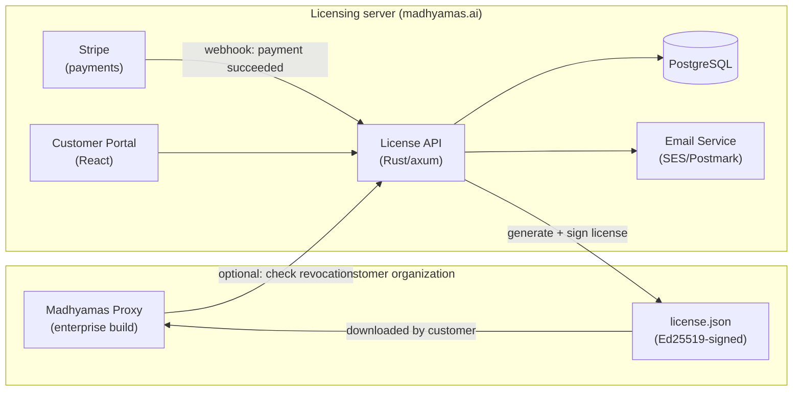

The proxy binary **never depends on the licensing server at runtime**
except for the optional revocation check. License verification is
offline (Ed25519 signature + expiry). The licensing server is only
needed during registration, payment, and license download.

### Key design principles

- **Offline-first.** The proxy binary verifies licenses without network
  access. The licensing server is not in the critical path.
- **Stripe handles payments.** No credit card data touches our
  servers. Stripe handles PCI-DSS compliance, subscriptions, invoices,
  and webhooks.
- **Ed25519 signing keys are server-side only.** The private key that
  signs licenses never leaves the licensing server. The proxy binary
  has only the public key.
- **Self-service by default.** Customers register, subscribe, download
  licenses, and file tickets without human intervention from the
  Madhyamas team. Manual license issuance is available for
  air-gapped/customers who can't use Stripe.
- **Audit everything.** Every license operation (issue, revoke, renew,
  transfer) is logged with timestamp, actor, and reason.

---

## 2. Tech Stack

The licensing server uses the **same tech stack as Madhyamas itself**
for consistency and shared expertise:

| Layer | Technology | Rationale |
|---|---|---|
| Backend | Rust + axum | Same as Madhyamas API. Type-safe, fast, no GC pauses. |
| Database | PostgreSQL (via `sqlx`) | Same as enterprise tier. ACID, JSONB, connection pooling. |
| Frontend | React + TypeScript + Vite | Same as Madhyamas web UI. Shared component library (shadcn/ui). |
| Auth | JWT + session cookies | Portal auth for customers; separate admin auth for staff. |
| Payments | Stripe (Checkout + Billing) | Industry standard. Handles PCI-DSS, subscriptions, invoices, tax. |
| Email | AWS SES or Postmark | Transactional email for notifications. |
| Cache | Redis | Session storage, rate limiting, revocation cache. |
| Deployment | Docker + Docker Compose (small), Kubernetes (scale) | Same deployment story as Madhyamas. |
| Secrets | AWS Secrets Manager / HashiCorp Vault | Ed25519 private key, Stripe API key, email API key. |

### Why Rust for the licensing server?

- **Shared code reuse.** The Ed25519 signing utilities
  (`ed25519-dalek`) are already in the Madhyamas workspace. The
  licensing server can depend on `madhyamas-core` for the signing
  primitives, ensuring the license format is identical between server
  and client.
- **Type safety for financial data.** Rust's type system prevents
  entire classes of bugs that are dangerous in payment systems (null
  handling, integer overflow, string vs numeric IDs).
- **Single deployment story.** Same Docker base image, same CI
  pipeline, same monitoring stack.
- **Performance.** The licensing server is not high-throughput, but
  Rust's low resource usage means it can run on a small VM.

### Workspace structure

The licensing server is a **separate workspace** (not part of the
Madhyamas Cargo workspace) to keep concerns isolated:

```
madhyamas-license-server/       # Separate repository or workspace
├── Cargo.toml                  # Workspace root
├── crates/
│   ├── license-server/         # Main binary (axum server)
│   ├── license-core/           # License types, signing, verification
│   ├── license-db/             # Database layer (sqlx + PostgreSQL)
│   └── stripe-client/          # Stripe API client (typed wrapper)
├── web/                        # React frontend (customer portal + admin)
├── migrations/                 # SQL migrations
├── docker/
└── docs/
```

`license-core` can depend on `madhyamas-core` (from the main workspace)
for the Ed25519 signing utilities, ensuring license format consistency:

```toml
# crates/license-core/Cargo.toml
[dependencies]
madhyamas-core = { git = "https://github.com/madhyamas/madhyamas", features = ["plugin-signing"] }
ed25519-dalek = "2.0"
serde = { version = "1.0", features = ["derive"] }
serde_json = "1.0"
```

---

## 3. Architecture

### High-level architecture

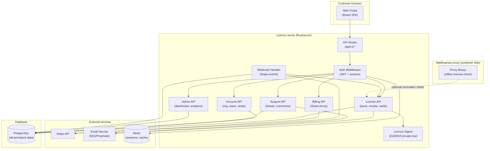

### Component responsibilities

| Component | Responsibility |
|---|---|
| **API Router** | Routes requests to handlers, applies CORS, rate limiting |
| **Auth Middleware** | Validates JWT/session, extracts user context, enforces RBAC |
| **License API** | Issue, revoke, renew, transfer, verify licenses. Calls Signer. |
| **Account API** | Organization CRUD, user CRUD, seat management, role assignment |
| **Billing API** | Proxies Stripe Checkout, manages subscriptions, retrieves invoices |
| **Support API** | Ticket CRUD, comments, attachments, status transitions, SLA |
| **Admin API** | Revenue analytics, license metrics, customer list, manual license issuance |
| **Webhook Handler** | Receives Stripe webhooks, triggers license issue/revoke on payment events |
| **License Signer** | Holds Ed25519 private key, signs license payloads, never exposes key |

### Request flow: new customer registration

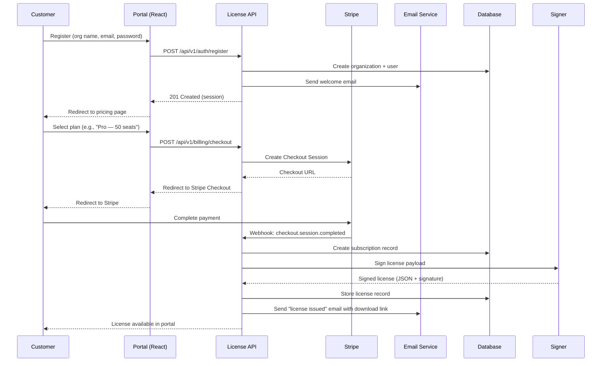

---

## 4. Account Management

### Data model

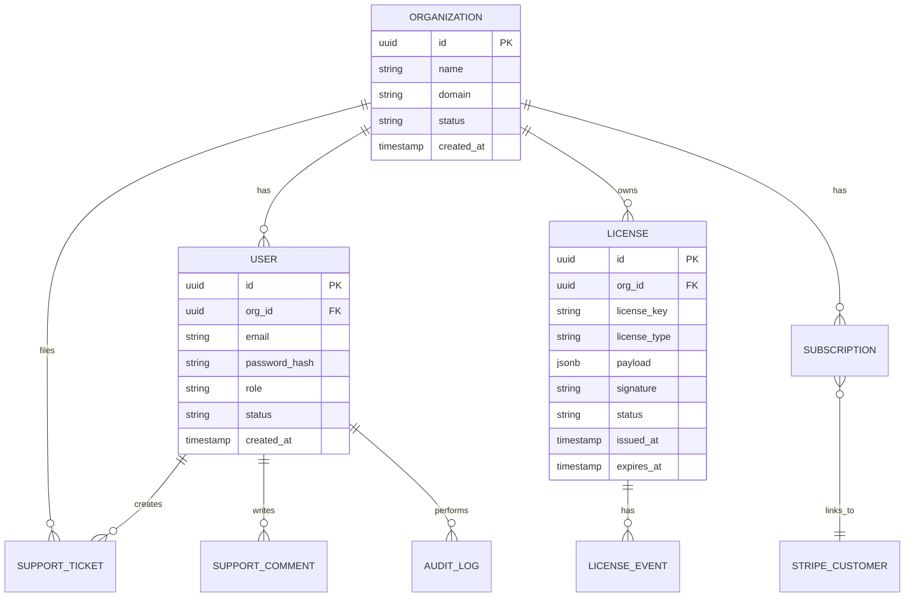

### User roles within the portal

| Role | Permissions |
|---|---|
| `org_admin` | Everything: manage users, billing, licenses, tickets |
| `billing_admin` | Billing + licenses only (no user management) |
| `developer` | Download licenses, file support tickets (no billing) |
| `support_agent` (Madhyamas staff) | All support tickets, customer list, license info (read-only) |
| `admin` (Madhyamas staff) | Everything: all organizations, manual license issuance, analytics |

### Registration flow

1. **Sign up:** User provides organization name, admin email, password.
   Password is hashed with argon2id (same as the proxy binary).
2. **Email verification:** Verification link sent via email. Account is
   `pending_verification` until clicked.
3. **Plan selection:** User selects a pricing plan (see Section 5).
4. **Payment:** Redirected to Stripe Checkout. No credit card data
   touches our server.
5. **License issuance:** On successful payment (Stripe webhook), a
   license is generated and signed automatically.
6. **Download:** License file is available in the portal dashboard. An
   email notification is sent with a download link.

### Team management

An organization can have multiple users. The `org_admin` can:
- Invite users by email (invitation link with expiry)
- Assign roles (`developer`, `billing_admin`)
- Remove users
- Transfer `org_admin` role to another user

### SSO for the portal (future)

The portal itself can support OIDC login (e.g., "Sign in with Google")
for customer convenience. This is separate from the SSO that the proxy
binary supports for its own enterprise auth. Priority: after core
portal functionality is working.

---

## 5. Payment Processing (Stripe)

### Pricing tiers

| Tier | Seats | Price/month | Price/year | Features |
|---|---|---|---|---|
| Trial | 5 | Free (30 days) | — | All enterprise features, time-limited |
| Starter | 10 | $49/mo | $490/yr | Auth, RBAC, audit, local IdP |
| Pro | 50 | $199/mo | $1,990/yr | All Starter + SSO (OIDC), MFA, priority support |
| Enterprise | Unlimited | $499/mo | $4,990/yr | All Pro + LDAP, custom features, dedicated support |
| Academic | Unlimited | Free | — | All features, requires `.edu` email verification |

### Stripe integration

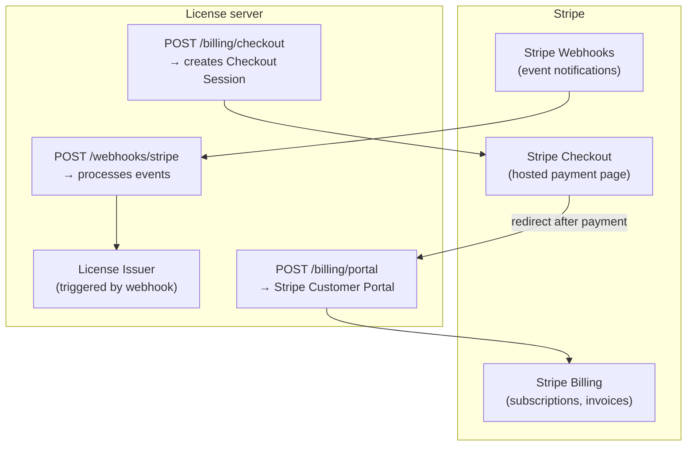

### Stripe webhook events

| Event | Action |
|---|---|
| `checkout.session.completed` | Create subscription, issue license, send email |
| `invoice.paid` | Renew license (extend `expires_at`), send receipt |
| `invoice.payment_failed` | Mark subscription `past_due`, send warning email, schedule license revocation after grace period |
| `customer.subscription.deleted` | Revoke license, send cancellation email |
| `customer.subscription.updated` | Update seat count on license (proration) |
| `customer.subscription.trial_will_end` | Send trial expiry warning (3 days before) |

### Grace period for failed payments

When a payment fails:
1. **Day 0:** `invoice.payment_failed` webhook. Mark subscription
   `past_due`. Send "payment failed" email. License remains active.
2. **Day 3:** Stripe retries payment (Smart Retries). If still failing,
   send second warning.
3. **Day 7:** Stripe retries again. If still failing, send final
   warning: "License will be revoked in 3 days."
4. **Day 10:** If payment still failing, revoke license. Set license
   status to `revoked`. Send "license revoked" email. The proxy binary
   will reject the license on next startup or revocation check.

### Customer portal (Stripe-hosted)

Stripe provides a [Customer Portal](https://stripe.com/docs/billing/subscriptions/customer-portal)
where customers can:
- Update payment methods
- View invoices and payment history
- Cancel or change subscriptions
- Download invoices (PDF)

The license server redirects to the Stripe-hosted portal via
`POST /api/v1/billing/portal`. No need to build these features
ourselves.

### Tax handling

Stripe Tax automatically calculates sales tax/VAT based on customer
location. No custom tax logic is needed. The license server passes
`automatic_tax: { enabled: true }` when creating Checkout Sessions.

### Manual license issuance (non-Stripe)

For customers who cannot use Stripe (air-gapped, government, wire
transfer, custom contracts):

1. Madhyamas admin creates a manual license via the admin dashboard.
2. Admin specifies: organization, license type, seat count, expiry,
   features.
3. License is signed by the Signer (same Ed25519 key).
4. License file is delivered via email or secure file transfer.
5. No Stripe subscription is created; the license is tracked as
   `manual` in the database.

---

## 6. License Management

### License lifecycle

```mermaid
state diagram-v2
    [*] --> Pending: Registration
    Pending --> Active: Payment confirmed (webhook)
    Pending --> Expired: Trial expires without payment
    Active --> Renewed: Subscription renews (invoice.paid)
    Active --> PastDue: Payment fails
    PastDue --> Active: Payment recovered
    PastDue --> Revoked: Grace period expires (10 days)
    Active --> Revoked: Manual revocation (admin)
    Active --> Expired: Expiry date reached
    Active --> Upgraded: Seat count change (subscription.updated)
    Upgraded --> Active: New license issued
    Revoked --> [*]
    Expired --> [*]
```

### License issuance process

When a license is issued (automatically via Stripe webhook or manually
by admin):

1. **Build payload:**
   ```rust
   let payload = LicensePayload {
       license_id: Uuid::new_v4(),
       license_type: plan.license_type,
       organization: org.name,
       contact_email: user.email,
       issued_at: Utc::now(),
       expires_at: plan.expiry(),
       max_users: plan.seats,
       features: plan.features(),
       fingerprint: org.fingerprint(),
       issuer: "madhyamas-license-authority",
       issuer_key_id: current_key_id,
   };
   ```

2. **Canonicalize:** Serialize to canonical JSON (sorted keys, no
   whitespace) to ensure deterministic signing.

3. **Sign:** Ed25519 sign over the canonical JSON bytes using the
   private key from the secrets manager.

4. **Store:** Insert license record into PostgreSQL with payload,
   signature, status, and linked subscription ID.

5. **Deliver:** Make license available for download in the portal. Send
   email notification.

### License revocation

Revocation sets the license status to `revoked` and adds it to the
revocation list. The proxy binary can check this list via the optional
revocation API (Section 7).

| Trigger | Action |
|---|---|
| Subscription cancelled | Revoke after grace period (10 days) |
| Payment failure (10 days) | Revoke automatically |
| Manual revocation (admin) | Revoke immediately, log reason |
| License transfer | Revoke old license, issue new license to new org |
| Fraud / abuse | Revoke immediately, ban organization |

### License renewal

Renewal is automatic for active subscriptions:
1. Stripe generates invoice 3 days before renewal date.
2. Stripe charges the payment method on file.
3. `invoice.paid` webhook fires.
4. License API extends `expires_at` by one billing period.
5. License status remains `active`.
6. Email receipt is sent.

No new license file is generated — the existing license's `expires_at`
is extended. The proxy binary checks `expires_at` at startup, so the
license remains valid as long as the subscription is active.

### Seat count changes (upgrade/downgrade)

When a customer changes their plan (e.g., Starter → Pro):
1. Stripe processes the proration.
2. `customer.subscription.updated` webhook fires.
3. License API issues a **new license** with updated `max_users` and
   `features`.
4. Old license is revoked.
5. New license file is available for download in the portal.
6. Email notification is sent.

The customer must download the new license file and replace the old
one. The proxy binary will accept either license until the old one
expires or is checked against the revocation list.

### License transfer

An organization can transfer a license to another organization (e.g.,
during acquisition/restructuring):
1. Admin initiates transfer in the portal (or Madhyamas admin does it
   via admin dashboard).
2. Old license is revoked.
3. New license is issued to the target organization with the same
   `license_type`, `max_users`, `features`, and `expires_at`.
4. Both organizations receive email notifications.

### License audit trail

Every license operation is recorded in `license_events`:

| Event type | Trigger | Recorded |
|---|---|---|
| `issued` | License created | timestamp, license_id, org_id, trigger (webhook/manual), actor |
| `renewed` | Subscription renewed | timestamp, license_id, new expires_at, invoice_id |
| `revoked` | License revoked | timestamp, license_id, reason, actor |
| `transferred` | License transferred | timestamp, old_license_id, new_license_id, from_org, to_org |
| `upgraded` | Seat count changed | timestamp, old_license_id, new_license_id, old_seats, new_seats |
| `expired` | Expiry reached | timestamp, license_id (system-generated) |

---

## 7. License Verification API

These are the endpoints the proxy binary calls. They are **public**
(no auth required) but rate-limited.

### `GET /api/v1/license/verify/{license_id}`

Returns the status of a license by its ID. Used by the proxy binary's
optional online revocation check.

**Response (200):**
```json
{
  "license_id": "uuid",
  "status": "active",
  "expires_at": "2027-08-12T00:00:00Z",
  "revoked": false
}
```

**Response (404):** License not found (invalid ID).

**Rate limiting:** 100 requests per minute per IP. Redis-based sliding
window.

### `GET /api/v1/license/revocation?since={timestamp}`

Returns all licenses revoked since the given timestamp. Allows the
proxy binary to sync a local revocation cache without checking each
license individually.

**Response (200):**
```json
{
  "revoked_licenses": [
    {
      "license_id": "uuid",
      "revoked_at": "2026-08-10T12:00:00Z",
      "reason": "subscription_cancelled"
    }
  ],
  "check_again_after": "2026-08-13T00:00:00Z"
}
```

### `POST /api/v1/license/attest`

Optional attestation endpoint. The proxy binary sends a heartbeat with
its license ID and fingerprint. This allows the licensing server to
track active installations and detect license sharing.

**Request:**
```json
{
  "license_id": "uuid",
  "fingerprint": "sha256-hash",
  "version": "0.1.6",
  "instance_id": "uuid"
}
```

**Response (200):**
```json
{
  "status": "ok",
  "warnings": []
}
```

**Response (200 with warning):**
```json
{
  "status": "ok",
  "warnings": ["fingerprint_mismatch"]
}
```

This endpoint is **opt-in** (`--license-attest-url`). Data is used
only for analytics and abuse detection, never to block activation
(offline-first principle).

---

## 8. Support Ticket System

### Overview

The licensing server includes a built-in support ticket system so
customers don't need a separate helpdesk tool. It covers the common
needs of a developer-tools company: bug reports, feature requests,
billing questions, license issues.

### Data model

```sql
-- Support tickets
CREATE TABLE support_tickets (
    id              UUID PRIMARY KEY DEFAULT gen_random_uuid(),
    org_id          UUID NOT NULL REFERENCES organizations(id) ON DELETE CASCADE,
    created_by      UUID NOT NULL REFERENCES users(id),
    assigned_to     UUID REFERENCES users(id),  -- support agent
    subject         TEXT NOT NULL,
    description     TEXT NOT NULL,
    category        TEXT NOT NULL CHECK (category IN (
                        'bug', 'feature_request', 'billing',
                        'license', 'installation', 'other'
                    )),
    priority        TEXT NOT NULL DEFAULT 'normal' CHECK (priority IN (
                        'low', 'normal', 'high', 'urgent'
                    )),
    status          TEXT NOT NULL DEFAULT 'open' CHECK (status IN (
                        'open', 'in_progress', 'waiting_on_customer',
                        'resolved', 'closed'
                    )),
    sla_due_at      TIMESTAMPTZ,  -- calculated from priority + category
    first_response_at TIMESTAMPTZ,
    resolved_at     TIMESTAMPTZ,
    created_at      TIMESTAMPTZ NOT NULL DEFAULT now(),
    updated_at      TIMESTAMPTZ NOT NULL DEFAULT now()
);

-- Ticket comments (conversation thread)
CREATE TABLE support_comments (
    id              UUID PRIMARY KEY DEFAULT gen_random_uuid(),
    ticket_id       UUID NOT NULL REFERENCES support_tickets(id) ON DELETE CASCADE,
    author_id       UUID NOT NULL REFERENCES users(id),
    body            TEXT NOT NULL,
    is_internal     BOOLEAN NOT NULL DEFAULT false,  -- internal note (not visible to customer)
    created_at      TIMESTAMPTZ NOT NULL DEFAULT now()
);

-- Ticket attachments
CREATE TABLE support_attachments (
    id              UUID PRIMARY KEY DEFAULT gen_random_uuid(),
    comment_id      UUID NOT NULL REFERENCES support_comments(id) ON DELETE CASCADE,
    filename        TEXT NOT NULL,
    s3_key          TEXT NOT NULL,  -- S3 object key
    content_type    TEXT NOT NULL,
    size_bytes      INTEGER NOT NULL,
    created_at      TIMESTAMPTZ NOT NULL DEFAULT now()
);
```

### SLA targets

| Priority | First response | Resolution |
|---|---|---|
| Urgent | 1 hour | 4 hours |
| High | 4 hours | 1 business day |
| Normal | 1 business day | 3 business days |
| Low | 2 business days | Best effort |

SLA is calculated from ticket creation time. `sla_due_at` is set
automatically based on priority. Overdue tickets are flagged in the
admin dashboard.

### Ticket workflow

```mermaid
state diagram-v2
    [*] --> Open: Customer creates ticket
    Open --> InProgress: Support agent assigns
    InProgress --> WaitingOnCustomer: Agent asks for info
    WaitingOnCustomer --> InProgress: Customer responds
    InProgress --> Resolved: Agent resolves
    Resolved --> Closed: Auto-close after 7 days
    Resolved --> InProgress: Customer reopens
    Closed --> [*]
```

### Email integration

- **Ticket created:** Customer gets confirmation email with ticket ID.
  Support team gets notification (if no auto-assignment).
- **Comment added:** All participants get email notification with
  comment body and reply link.
- **Reply by email:** Customers can reply to ticket emails. The email
  is parsed (In-Reply-To header) and added as a comment. This requires
  an inbound email service (SES Inbound, Postmark Inbound).

### Knowledge base (future)

A simple knowledge base with articles searchable by keyword. Articles
are authored by support agents and admin staff. Priority: after ticket
system is working and patterns emerge from common questions.

---

## 9. Admin Dashboard

### Overview

The admin dashboard is for the Madhyamas team (not customers). It
provides visibility into revenue, licenses, customers, and support.

### Metrics

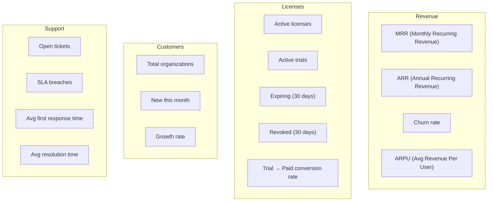

### Admin views

| View | Description |
|---|---|
| **Revenue dashboard** | MRR/ARR charts, churn rate, revenue by tier, Stripe sync |
| **License list** | All licenses with filters (status, type, org, expiry) |
| **Customer list** | All organizations with subscription status, seat count, revenue |
| **Customer detail** | Org profile, users, licenses, subscriptions, tickets, audit log |
| **Support overview** | All tickets across customers, SLA status, agent workload |
| **Manual license issuance** | Form to issue a license without Stripe (air-gapped, custom) |
| **Audit log** | All admin actions (license issuance, revocation, manual overrides) |

### Admin authentication

Admin users are separate from customer users. They authenticate via a
separate login page with:
- Username + password (argon2id)
- TOTP MFA (required for all admin accounts)
- Optional: IP allowlist (admin dashboard only accessible from
  specified IPs)

---

## 10. Email Notifications

### Email templates

| Template | Trigger | Recipient | Subject |
|---|---|---|---|
| `welcome` | Registration | User | "Welcome to Madhyamas Enterprise" |
| `email_verification` | Registration | User | "Verify your email address" |
| `license_issued` | License created (webhook/manual) | Org admin | "Your Madhyamas Enterprise license is ready" |
| `license_renewed` | Subscription renewed | Org admin | "Your license has been renewed" |
| `license_revoked` | License revoked | Org admin | "Your license has been revoked" |
| `license_expiring_30d` | 30 days before expiry | Org admin | "Your license expires in 30 days" |
| `license_expiring_7d` | 7 days before expiry | Org admin | "Your license expires in 7 days — renew now" |
| `license_expiring_1d` | 1 day before expiry | Org admin | "Your license expires tomorrow" |
| `payment_failed` | Stripe invoice.payment_failed | Billing admin | "Payment failed — action required" |
| `payment_receipt` | Stripe invoice.paid | Billing admin | "Payment receipt for Madhyamas Enterprise" |
| `trial_expiring` | 3 days before trial ends | User | "Your trial expires in 3 days" |
| `ticket_created` | Support ticket created | Customer + agents | "Support ticket #{id}: {subject}" |
| `ticket_updated` | Comment added | Participants | "Re: Support ticket #{id}: {subject}" |
| `user_invited` | Team invite | Invitee | "You've been invited to {org} on Madhyamas" |

### Email service

Use **AWS SES** or **Postmark** for transactional email. Both provide:
- High deliverability (SPF, DKIM, DMARC configured)
- Bounce/complaint handling
- Webhook notifications for delivery status
- Template management

Email templates are stored as [Handlebars](https://handlebarsjs.com/)
or [MJML](https://mjml.io/) files in the license server repository,
rendered server-side, and sent via the email service API.

### Scheduled email jobs

A background job runner (using `tokio::time` interval or a cron-like
scheduler) checks for:
- Licenses expiring in 30/7/1 days → send warning emails
- Trials expiring in 3 days → send trial warning
- Past-due subscriptions past grace period → revoke + notify
- Unassigned tickets past SLA → notify support team

---

## 11. Database Schema

### Complete PostgreSQL schema

```sql
-- ============================================================================
-- Organizations
-- ============================================================================
CREATE TABLE organizations (
    id              UUID PRIMARY KEY DEFAULT gen_random_uuid(),
    name            TEXT NOT NULL,
    domain          TEXT,
    status          TEXT NOT NULL DEFAULT 'active'
                      CHECK (status IN ('active', 'suspended', 'closed')),
    stripe_customer_id TEXT UNIQUE,  -- Stripe customer ID (null for manual)
    fingerprint     TEXT,            -- org domain hash for license binding
    created_at      TIMESTAMPTZ NOT NULL DEFAULT now(),
    updated_at      TIMESTAMPTZ NOT NULL DEFAULT now()
);

-- ============================================================================
-- Users (portal users, not proxy users)
-- ============================================================================
CREATE TABLE users (
    id              UUID PRIMARY KEY DEFAULT gen_random_uuid(),
    org_id          UUID NOT NULL REFERENCES organizations(id) ON DELETE CASCADE,
    email           TEXT NOT NULL,
    password_hash   TEXT,            -- argon2id (null for SSO-only users)
    name            TEXT,
    role            TEXT NOT NULL DEFAULT 'developer'
                      CHECK (role IN ('org_admin', 'billing_admin', 'developer',
                                      'support_agent', 'admin')),
    status          TEXT NOT NULL DEFAULT 'pending_verification'
                      CHECK (status IN ('pending_verification', 'active',
                                        'suspended', 'invited')),
    mfa_secret      TEXT,            -- TOTP secret (encrypted at rest)
    last_login_at   TIMESTAMPTZ,
    created_at      TIMESTAMPTZ NOT NULL DEFAULT now(),
    UNIQUE (org_id, email)
);

CREATE INDEX idx_users_email ON users(email);
CREATE INDEX idx_users_org_id ON users(org_id);

-- ============================================================================
-- Subscriptions (linked to Stripe)
-- ============================================================================
CREATE TABLE subscriptions (
    id                  UUID PRIMARY KEY DEFAULT gen_random_uuid(),
    org_id              UUID NOT NULL REFERENCES organizations(id) ON DELETE CASCADE,
    stripe_subscription_id TEXT UNIQUE,
    stripe_price_id     TEXT NOT NULL,
    plan_tier           TEXT NOT NULL CHECK (plan_tier IN (
                            'trial', 'starter', 'pro', 'enterprise', 'academic'
                        )),
    seat_count          INTEGER NOT NULL DEFAULT 1,
    billing_cycle       TEXT NOT NULL CHECK (billing_cycle IN ('monthly', 'annual')),
    status              TEXT NOT NULL DEFAULT 'active' CHECK (status IN (
                            'active', 'past_due', 'canceled', 'trialing', 'ended'
                        )),
    current_period_start TIMESTAMPTZ,
    current_period_end   TIMESTAMPTZ,
    cancel_at_period_end BOOLEAN NOT NULL DEFAULT false,
    created_at          TIMESTAMPTZ NOT NULL DEFAULT now(),
    updated_at          TIMESTAMPTZ NOT NULL DEFAULT now()
);

CREATE INDEX idx_subscriptions_org_id ON subscriptions(org_id);
CREATE INDEX idx_subscriptions_status ON subscriptions(status);

-- ============================================================================
-- Licenses
-- ============================================================================
CREATE TABLE licenses (
    id              UUID PRIMARY KEY DEFAULT gen_random_uuid(),
    org_id          UUID NOT NULL REFERENCES organizations(id) ON DELETE CASCADE,
    subscription_id UUID REFERENCES subscriptions(id) ON DELETE SET NULL,
    license_key     TEXT UNIQUE NOT NULL,  -- customer-facing key (not the file)
    license_type    TEXT NOT NULL CHECK (license_type IN (
                        'enterprise', 'enterprise-trial', 'enterprise-academic'
                    )),
    payload         JSONB NOT NULL,        -- the signed license payload
    signature       TEXT NOT NULL,          -- Ed25519 signature (hex)
    status          TEXT NOT NULL DEFAULT 'active' CHECK (status IN (
                        'pending', 'active', 'past_due', 'revoked', 'expired'
                    )),
    max_users       INTEGER NOT NULL DEFAULT 0,  -- 0 = unlimited
    features        JSONB NOT NULL DEFAULT '[]'::jsonb,
    issued_at       TIMESTAMPTZ NOT NULL DEFAULT now(),
    expires_at      TIMESTAMPTZ,
    revoked_at      TIMESTAMPTZ,
    revoke_reason   TEXT,
    created_at      TIMESTAMPTZ NOT NULL DEFAULT now(),
    updated_at      TIMESTAMPTZ NOT NULL DEFAULT now()
);

CREATE INDEX idx_licenses_org_id ON licenses(org_id);
CREATE INDEX idx_licenses_status ON licenses(status);
CREATE INDEX idx_licenses_expires_at ON licenses(expires_at);
CREATE INDEX idx_licenses_license_key ON licenses(license_key);

-- ============================================================================
-- License events (audit trail)
-- ============================================================================
CREATE TABLE license_events (
    id              UUID PRIMARY KEY DEFAULT gen_random_uuid(),
    license_id      UUID NOT NULL REFERENCES licenses(id) ON DELETE CASCADE,
    event_type      TEXT NOT NULL CHECK (event_type IN (
                        'issued', 'renewed', 'revoked', 'transferred',
                        'upgraded', 'expired', 'downloaded'
                    )),
    actor_id        UUID REFERENCES users(id),  -- null for system-generated
    details         JSONB NOT NULL DEFAULT '{}'::jsonb,
    created_at      TIMESTAMPTZ NOT NULL DEFAULT now()
);

CREATE INDEX idx_license_events_license_id ON license_events(license_id);
CREATE INDEX idx_license_events_type ON license_events(event_type);
CREATE INDEX idx_license_events_created_at ON license_events(created_at DESC);

-- ============================================================================
-- Support tickets
-- ============================================================================
CREATE TABLE support_tickets (
    id                  UUID PRIMARY KEY DEFAULT gen_random_uuid(),
    org_id              UUID NOT NULL REFERENCES organizations(id) ON DELETE CASCADE,
    created_by          UUID NOT NULL REFERENCES users(id),
    assigned_to         UUID REFERENCES users(id),
    subject             TEXT NOT NULL,
    description         TEXT NOT NULL,
    category            TEXT NOT NULL CHECK (category IN (
                            'bug', 'feature_request', 'billing',
                            'license', 'installation', 'other'
                        )),
    priority            TEXT NOT NULL DEFAULT 'normal' CHECK (priority IN (
                            'low', 'normal', 'high', 'urgent'
                        )),
    status              TEXT NOT NULL DEFAULT 'open' CHECK (status IN (
                            'open', 'in_progress', 'waiting_on_customer',
                            'resolved', 'closed'
                        )),
    sla_due_at          TIMESTAMPTZ,
    first_response_at   TIMESTAMPTZ,
    resolved_at         TIMESTAMPTZ,
    created_at          TIMESTAMPTZ NOT NULL DEFAULT now(),
    updated_at          TIMESTAMPTZ NOT NULL DEFAULT now()
);

CREATE INDEX idx_tickets_org_id ON support_tickets(org_id);
CREATE INDEX idx_tickets_status ON support_tickets(status);
CREATE INDEX idx_tickets_assigned_to ON support_tickets(assigned_to);
CREATE INDEX idx_tickets_sla_due ON support_tickets(sla_due_at) WHERE status NOT IN ('resolved', 'closed');

-- ============================================================================
-- Support comments
-- ============================================================================
CREATE TABLE support_comments (
    id              UUID PRIMARY KEY DEFAULT gen_random_uuid(),
    ticket_id       UUID NOT NULL REFERENCES support_tickets(id) ON DELETE CASCADE,
    author_id       UUID NOT NULL REFERENCES users(id),
    body            TEXT NOT NULL,
    is_internal     BOOLEAN NOT NULL DEFAULT false,
    created_at      TIMESTAMPTZ NOT NULL DEFAULT now()
);

CREATE INDEX idx_comments_ticket_id ON support_comments(ticket_id);

-- ============================================================================
-- Support attachments
-- ============================================================================
CREATE TABLE support_attachments (
    id              UUID PRIMARY KEY DEFAULT gen_random_uuid(),
    comment_id      UUID NOT NULL REFERENCES support_comments(id) ON DELETE CASCADE,
    filename        TEXT NOT NULL,
    s3_key          TEXT NOT NULL,
    content_type    TEXT NOT NULL,
    size_bytes      INTEGER NOT NULL,
    created_at      TIMESTAMPTZ NOT NULL DEFAULT now()
);

-- ============================================================================
-- Audit log (admin actions)
-- ============================================================================
CREATE TABLE audit_log (
    id              UUID PRIMARY KEY DEFAULT gen_random_uuid(),
    actor_id        UUID REFERENCES users(id),
    action          TEXT NOT NULL,
    resource_type   TEXT NOT NULL,
    resource_id     TEXT,
    details         JSONB NOT NULL DEFAULT '{}'::jsonb,
    ip_address      TEXT,
    user_agent      TEXT,
    created_at      TIMESTAMPTZ NOT NULL DEFAULT now()
);

CREATE INDEX idx_audit_log_actor_id ON audit_log(actor_id);
CREATE INDEX idx_audit_log_action ON audit_log(action);
CREATE INDEX idx_audit_log_created_at ON audit_log(created_at DESC);

-- ============================================================================
-- Email log (sent emails)
-- ============================================================================
CREATE TABLE email_log (
    id              UUID PRIMARY KEY DEFAULT gen_random_uuid(),
    recipient       TEXT NOT NULL,
    template        TEXT NOT NULL,
    subject         TEXT NOT NULL,
    status          TEXT NOT NULL CHECK (status IN ('queued', 'sent', 'bounced', 'failed')),
    message_id      TEXT,  -- email service message ID for tracking
    created_at      TIMESTAMPTZ NOT NULL DEFAULT now()
);

CREATE INDEX idx_email_log_recipient ON email_log(recipient);
CREATE INDEX idx_email_log_status ON email_log(status);

-- ============================================================================
-- License attestations (optional heartbeat data)
-- ============================================================================
CREATE TABLE license_attestations (
    id              UUID PRIMARY KEY DEFAULT gen_random_uuid(),
    license_id      UUID NOT NULL REFERENCES licenses(id) ON DELETE CASCADE,
    fingerprint     TEXT,
    instance_id     TEXT NOT NULL,
    version         TEXT,
    ip_address      TEXT,
    created_at      TIMESTAMPTZ NOT NULL DEFAULT now()
);

CREATE INDEX idx_attestations_license_id ON license_attestations(license_id);
CREATE INDEX idx_attestations_created_at ON license_attestations(created_at DESC);
```

### Migration files

```
migrations/
├── 20260812000001_create_organizations.sql
├── 20260812000002_create_users.sql
├── 20260812000003_create_subscriptions.sql
├── 20260812000004_create_licenses.sql
├── 20260812000005_create_license_events.sql
├── 20260812000006_create_support_tickets.sql
├── 20260812000007_create_support_comments.sql
├── 20260812000008_create_support_attachments.sql
├── 20260812000009_create_audit_log.sql
├── 20260812000010_create_email_log.sql
└── 20260812000011_create_license_attestations.sql
```

---

## 12. API Design

### Authentication

All customer-facing API endpoints require JWT authentication (except
registration, login, and public license verification):

```
Authorization: Bearer <jwt>
```

JWT is issued on login, valid for 1 hour, with refresh token for 7
days. Same JWT mechanism as the proxy binary's enterprise auth.

Admin endpoints require a separate admin JWT with `role: "admin"` or
`role: "support_agent"`.

### API endpoints

#### Authentication

| Method | Path | Description | Auth |
|---|---|---|---|
| POST | `/api/v1/auth/register` | Register new organization | None |
| POST | `/api/v1/auth/login` | Login (email + password) | None |
| POST | `/api/v1/auth/refresh` | Refresh access token | Refresh token |
| POST | `/api/v1/auth/verify-email` | Verify email address | None |
| POST | `/api/v1/auth/forgot-password` | Request password reset | None |
| POST | `/api/v1/auth/reset-password` | Reset password with token | None |
| GET | `/api/v1/auth/me` | Get current user | JWT |
| POST | `/api/v1/auth/mfa/setup` | Setup TOTP MFA | JWT |
| POST | `/api/v1/auth/mfa/verify` | Verify MFA code | JWT |

#### Account

| Method | Path | Description | Auth |
|---|---|---|---|
| GET | `/api/v1/account/org` | Get organization details | JWT |
| PATCH | `/api/v1/account/org` | Update organization | JWT (org_admin) |
| GET | `/api/v1/account/users` | List users in org | JWT |
| POST | `/api/v1/account/users/invite` | Invite user to org | JWT (org_admin) |
| DELETE | `/api/v1/account/users/{id}` | Remove user from org | JWT (org_admin) |
| PATCH | `/api/v1/account/users/{id}` | Update user role | JWT (org_admin) |

#### Billing

| Method | Path | Description | Auth |
|---|---|---|---|
| GET | `/api/v1/billing/subscription` | Get current subscription | JWT |
| POST | `/api/v1/billing/checkout` | Create Stripe Checkout Session | JWT (billing_admin) |
| POST | `/api/v1/billing/portal` | Redirect to Stripe Customer Portal | JWT (billing_admin) |
| GET | `/api/v1/billing/invoices` | List invoices | JWT (billing_admin) |
| GET | `/api/v1/billing/invoices/{id}` | Download invoice PDF | JWT (billing_admin) |

#### Licenses

| Method | Path | Description | Auth |
|---|---|---|---|
| GET | `/api/v1/licenses` | List org's licenses | JWT |
| GET | `/api/v1/licenses/{id}` | Get license details | JWT |
| GET | `/api/v1/licenses/{id}/download` | Download license file | JWT |
| GET | `/api/v1/licenses/{id}/events` | Get license event history | JWT |

#### Support

| Method | Path | Description | Auth |
|---|---|---|---|
| GET | `/api/v1/support/tickets` | List org's tickets | JWT |
| POST | `/api/v1/support/tickets` | Create ticket | JWT |
| GET | `/api/v1/support/tickets/{id}` | Get ticket details | JWT |
| POST | `/api/v1/support/tickets/{id}/comments` | Add comment | JWT |
| POST | `/api/v1/support/tickets/{id}/attachments` | Upload attachment | JWT |
| PATCH | `/api/v1/support/tickets/{id}` | Update ticket (status, priority) | JWT |

#### Public license API (no auth, rate-limited)

| Method | Path | Description | Auth |
|---|---|---|---|
| GET | `/api/v1/license/verify/{license_id}` | Check license status | None (rate-limited) |
| GET | `/api/v1/license/revocation` | Get revocation list (delta) | None (rate-limited) |
| POST | `/api/v1/license/attest` | Attest installation | None (rate-limited) |

#### Webhooks

| Method | Path | Description | Auth |
|---|---|---|---|
| POST | `/webhooks/stripe` | Stripe webhook receiver | Stripe signature |

#### Admin

| Method | Path | Description | Auth |
|---|---|---|---|
| GET | `/api/v1/admin/dashboard` | Revenue + license metrics | Admin JWT |
| GET | `/api/v1/admin/organizations` | List all organizations | Admin JWT |
| GET | `/api/v1/admin/organizations/{id}` | Get org details | Admin JWT |
| GET | `/api/v1/admin/licenses` | List all licenses | Admin JWT |
| POST | `/api/v1/admin/licenses/issue` | Manually issue license | Admin JWT |
| POST | `/api/v1/admin/licenses/{id}/revoke` | Revoke license | Admin JWT |
| GET | `/api/v1/admin/tickets` | List all tickets | Admin/support JWT |
| PATCH | `/api/v1/admin/tickets/{id}` | Assign ticket, update status | Admin/support JWT |
| GET | `/api/v1/admin/audit-log` | View audit log | Admin JWT |

---

## 13. Security

### Ed25519 signing key management

The license signing private key is the **most critical secret** in the
system. If compromised, all licenses issued by that key are
untrustworthy.

| Practice | Implementation |
|---|---|
| **Storage** | AWS Secrets Manager or HashiCorp Vault. Never in env vars, config files, or source code. |
| **Access** | Only the license signer service can read it. IAM policy restricts access to the specific service role. |
| **Rotation** | Support key rotation via `issuer_key_id` in the license payload. Old key remains valid for existing licenses; new key signs new licenses. Rotate annually or on compromise. |
| **Audit** | Every key access is logged by the secrets manager. Alert on unexpected access. |
| **Backup** | Key is backed up in an offline KMS/HSM. Recovery procedure documented. |
| **Split knowledge**** (optional) | For high-security: use Shamir's Secret Sharing to split the key across 3 people, requiring 2 to reconstruct. |

### Key rotation process

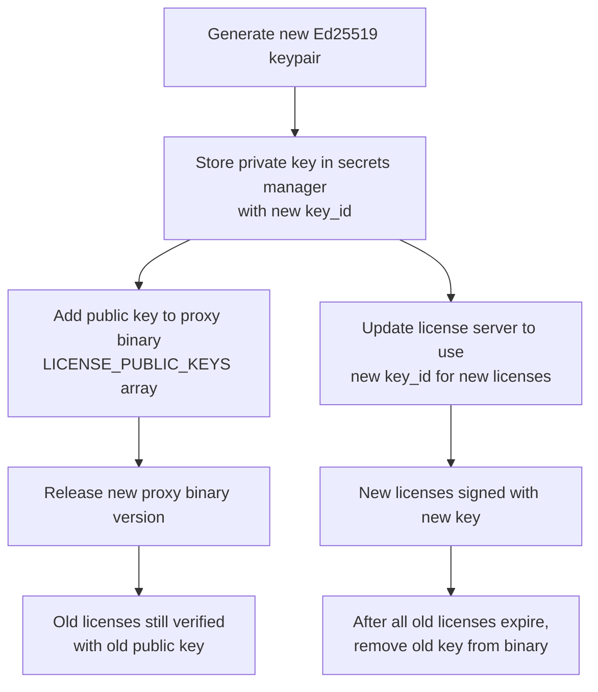

### Stripe webhook security

- Verify Stripe webhook signature using Stripe-Signature header.
- Reject requests with invalid signatures.
- Idempotency: process each webhook event only once (store event ID in
  Redis with 24h TTL).
- Respond 200 quickly; process asynchronously to avoid Stripe
  timeouts.

### API security

| Concern | Mitigation |
|---|---|
| Brute force login | Rate limiting (5 attempts per minute per IP), account lockout after 10 failed attempts |
| JWT theft | Short-lived access tokens (1h), refresh token rotation, HttpOnly cookies for web |
| CSRF | SameSite cookies, CSRF token for state-changing operations |
| SQL injection | `sqlx` parameterized queries (no string concatenation) |
| XSS | React auto-escaping, CSP headers, no `dangerouslySetInnerHTML` |
| SSRF | No user-controlled URLs in server-side requests |
| Sensitive data in logs | Never log passwords, JWTs, Stripe keys, or license private keys |

### Data encryption

| Data | At rest | In transit |
|---|---|---|
| Database | PostgreSQL TDE or disk-level encryption (LUKS/EBS) | TLS (SSL connection to Pg) |
| Passwords | argon2id hash (not encrypted — hashed) | TLS |
| License private key | Secrets Manager encryption | TLS ( Secrets Manager API) |
| MFA secrets | AES-256-GCM encrypted at rest | TLS |
| S3 attachments | SSE-S3 or SSE-KMS | TLS |
| Redis | Optional: Redis TLS + at-rest encryption | TLS |

### Compliance

- **PCI-DSS:** Not applicable — Stripe handles all credit card data.
  We never see or store card numbers. Stripe is PCI-DSS Level 1
  certified.
- **GDPR:** Support data export (JSON dump of org data) and data
  deletion (right to be forgotten). Documented in admin dashboard.
- **SOC 2 (future):** If targeting enterprise customers who require
  SOC 2, the licensing server's security practices support it: audit
  logging, access controls, encryption, key management.

---

## 14. Deployment

### Architecture

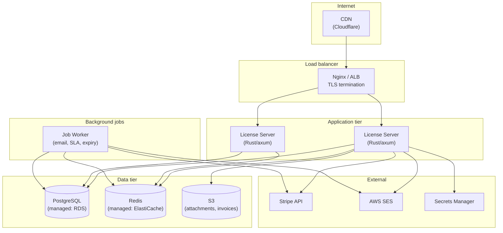

### Deployment options

#### Small (MVP launch, < 100 customers)

| Component | Setup |
|---|---|
| License server | Single Docker container on a 2 vCPU / 4GB VM |
| PostgreSQL | Managed RDS (db.t4g.micro) or Docker container on same VM |
| Redis | Docker container on same VM (or skip — use in-process cache) |
| S3 | AWS S3 bucket |
| Email | AWS SES |
| Secrets | AWS Secrets Manager (or `.env` file for MVP) |
| CDN | Cloudflare (free tier) |
| TLS | Let's Encrypt via Nginx or Cloudflare edge |

```yaml
# docker-compose.yml (small deployment)
services:
  license-server:
    build: .
    ports: ["3000:3000"]
    environment:
      DATABASE_URL: postgres://license:pass@db:5432/licensedb
      REDIS_URL: redis://redis:6379
      STRIPE_SECRET_KEY: ${STRIPE_SECRET_KEY}
      # ... other secrets
    depends_on: [db, redis]

  db:
    image: postgres:16-alpine
    environment:
      POSTGRES_DB: licensedb
      POSTGRES_USER: license
      POSTGRES_PASSWORD: pass
    volumes: ["pgdata:/var/lib/postgresql/data"]

  redis:
    image: redis:7-alpine

  worker:
    build: .
    command: ["./license-worker"]
    environment:
      # same as license-server
    depends_on: [db, redis]

volumes:
  pgdata:
```

#### Scaled (100+ customers)

| Component | Setup |
|---|---|
| License server | 2+ containers behind ALB, auto-scaling on CPU |
| PostgreSQL | Managed RDS (Multi-AZ, automated backups, read replica) |
| Redis | ElastiCache (Multi-AZ) |
| S3 | S3 + CloudFront for attachment download |
| Email | SES (production access) |
| Secrets | Secrets Manager with IAM roles |
| CDN | Cloudflare Pro |
| Monitoring | CloudWatch + Grafana |
| CI/CD | GitHub Actions → ECR → ECS |

### CI/CD pipeline

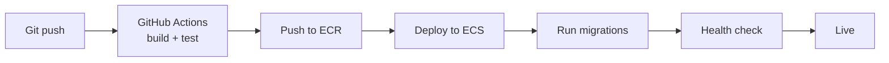

### Monitoring

| Metric | Source | Alert |
|---|---|---|
| API latency (p50, p95, p99) | Application metrics | p99 > 500ms |
| Error rate | Application metrics | > 1% of requests |
| Stripe webhook processing lag | Application metrics | > 30s behind |
| Email delivery rate | SES metrics | < 95% |
| Database connections | RDS metrics | > 80% of pool |
| Disk usage | RDS metrics | > 80% |
| License issuance failures | Application metrics | Any failure |
| Support SLA breaches | Application query | Any breach |

---

## 15. Portal Frontend

This section specifies how the licensing server's web UI (customer
portal + admin dashboard) is built, maintained, packaged, and deployed
— and how it relates to the Madhyamas proxy's own web UI.

### 15.1 Two web apps, two audiences

There are **two distinct React applications** in the Madhyamas
ecosystem. They serve different audiences, have different routing, and
are deployed independently:

| App | Location | Audience | Served from | Embedded? |
|---|---|---|---|---|
| **Proxy web UI** | `madhyamas/web/` | Developers using the proxy | Embedded in the proxy binary via `rust-embed` | Yes — single binary |
| **License server portal** | `madhyamas-license-server/web/` | Customer admins (register, pay, download licenses, file tickets) + Madhyamas staff (admin dashboard) | Served by the license server's axum instance or a CDN | No — hosted at `madhyamas.ai` |

These are **separate apps** with separate `package.json`, separate
Vite configs, separate builds, and separate deployments. They do not
share a bundle. They do share **design tokens and component patterns**
(see Section 15.4).

### 15.2 Why not embed the portal in the Rust binary?

The proxy web UI is embedded via `rust-embed` because the proxy is a
**single self-contained binary** — that's the core product proposition.
The licensing server portal is different:

| Concern | Proxy web UI (embedded) | License portal (not embedded) |
|---|---|---|
| Deployment model | One binary, no external files | Server-side app on a managed VM/container |
| Update frequency | Tied to proxy releases (weeks/months) | Can update independently (daily/weekly) |
| CDN / caching | N/A (served from binary) | Cloudflare CDN for static assets |
| Bundle size | Must be small (embedded in binary) | No constraint (served from disk/CDN) |
| SEO | Not needed (localhost) | Needed for marketing pages (pricing, docs) |
| SSR / SSG | Not needed (SPA) | Optional for marketing pages (SSG via Vite) |

Embedding the portal in the Rust binary would tie portal updates to
Rust releases, prevent CDN caching, and add unnecessary constraints.
The portal is served as **static files from disk** (or CDN), with the
Rust backend serving the API on the same domain.

### 15.3 Repository structure

The licensing server lives in a **separate repository**
(`madhyamas-license-server`), not in the main `madhyamas` repo. This
keeps the commercial/proprietary code separate from the OSS codebase:

```
madhyamas-license-server/          # Separate repository (private)
├── Cargo.toml                     # Workspace root
├── crates/
│   ├── license-server/            # Main binary (axum server)
│   ├── license-core/              # License types, signing, verification
│   ├── license-db/                # Database layer (sqlx + PostgreSQL)
│   └── stripe-client/             # Stripe API client
├── web/                           # Portal frontend (React + Vite)
│   ├── package.json               # Separate from proxy's web/package.json
│   ├── vite.config.ts             # Separate Vite config
│   ├── tailwind.config.js         # Shared design tokens (see 15.4)
│   ├── tsconfig.json
│   ├── index.html
│   └── src/
│       ├── main.tsx
│       ├── App.tsx                # Router (react-router-dom)
│       ├── components/
│       │   ├── ui/                # shadcn/ui components (copied, see 15.4)
│       │   ├── layout/            # PortalLayout, AdminLayout, Sidebar
│       │   └── shared/            # Shared widgets (LicenseCard, PlanBadge)
│       ├── features/
│       │   ├── auth/              # Register, Login, ForgotPassword, MFA
│       │   ├── billing/           # Pricing, Checkout, Invoices, Portal redirect
│       │   ├── licenses/          # LicenseList, LicenseDetail, Download
│       │   ├── support/           # TicketList, TicketDetail, NewTicket
│       │   ├── account/           # OrgSettings, UserManagement, TeamInvite
│       │   └── admin/             # RevenueDashboard, CustomerList, AuditLog
│       ├── lib/
│       │   ├── api/               # API client (auth, billing, licenses, support, admin)
│       │   ├── auth/              # AuthContext, useAuth, token management
│       │   └── utils.ts           # cn() helper, formatters
│       ├── hooks/                 # useSubscription, useLicenses, useTickets
│       └── types/                 # TypeScript types
├── migrations/                    # SQL migrations
├── docker/
│   ├── Dockerfile                 # Multi-stage: build web + build Rust
│   └── docker-compose.yml
├── docs/
└── .github/
    └── workflows/
        └── ci.yml                 # Build + test + deploy
```

### 15.4 Sharing design with the proxy web UI

The two web apps are separate, but they should **look and feel like the
same product**. There are three levels of sharing:

#### Level 1: Design tokens (shared via npm package)

The Tailwind config (colors, fonts, spacing, border radius) is
extracted into a small npm package that both apps depend on:

```
madhyamas-design-tokens/           # Separate npm package (published or local)
├── package.json                   # "name": "@madhyamas/design-tokens"
├── tailwind-preset.js             # Tailwind preset (colors, fonts, radius)
├── tokens.json                    # Design tokens (for tooling)
└── index.js                       # JS-exported tokens
```

Both apps use this preset:

```js
// web/tailwind.config.js (both proxy and license server)
const preset = require("@madhyamas/design-tokens/tailwind-preset");

module.exports = {
  presets: [preset],
  content: ["./src/**/*.{ts,tsx}"],
  // App-specific overrides only (if any)
};
```

This ensures both apps use the same `--primary`, `--background`,
`--foreground`, `--muted`, `--destructive`, etc. color tokens, the
same font stack, and the same border radius scale.

**Publishing strategy:** Start with a local path dependency
(`"@madhyamas/design-tokens": "file:../madhyamas-design-tokens"`).
When stable, publish to npm as `@madhyamas/design-tokens` (or keep as
a git submodule / monorepo workspace package).

#### Level 2: shadcn/ui components (copied, not imported)

shadcn/ui components are **not a dependency** — they're source files
you copy into your project. Both apps have their own
`components/ui/` directory with the same components (Button, Card,
Dialog, Input, etc.). The components are identical because they're
generated by the same `shadcn/ui` CLI with the same config.

To keep them in sync:

```bash
# When a shadcn/ui component is updated in the proxy web UI,
# copy it to the license server portal:
cp madhyamas/web/src/components/ui/button.tsx \
   madhyamas-license-server/web/src/components/ui/button.tsx

# Or use the shadcn CLI to regenerate in both projects:
cd madhyamas/web && npx shadcn@latest add button
cd madhyamas-license-server/web && npx shadcn@latest add button
```

This is the **shadcn/ui recommended approach** — components are owned
by the project, not imported as a dependency. It allows each app to
customize components independently while starting from the same base.

#### Level 3: Shared utility patterns (convention, not code)

Both apps use the same patterns:
- `cn()` class merge helper (from `clsx` + `tailwind-merge`)
- `apiGet`/`apiPost`/`apiPatch`/`apiDelete` fetch wrapper pattern
- TanStack Query for server state
- `React.lazy` for code splitting

These are **convention-level sharing** — each app has its own copy of
the utility, but they follow the same pattern. This makes it easy for
developers to work on both apps.

#### What is NOT shared

- **No shared npm package for components.** shadcn/ui components are
  copied, not imported. Each app owns its `components/ui/` directory.
- **No shared bundle.** Each app has its own Vite build, its own
  `package.json`, its own dependency tree.
- **No shared routing.** The proxy uses `useState`-based view switching
  (no react-router). The portal uses `react-router-dom` (multi-page:
  /login, /register, /dashboard, /billing, /support, /admin/*).
- **No shared state management.** Each app manages its own state.

### 15.5 Portal frontend architecture

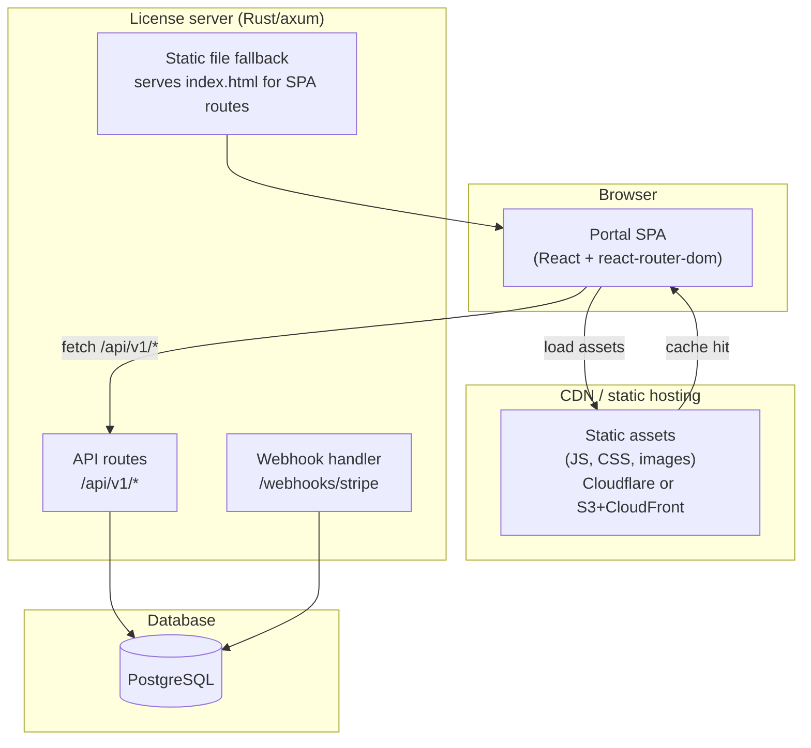

### 15.6 Routing

The portal uses `react-router-dom` (unlike the proxy, which uses
`useState`-based view switching). The portal has real URLs for
bookmarks, browser back button, and SEO on marketing pages:

```tsx
// web/src/App.tsx (license server portal)
import { createBrowserRouter, RouterProvider } from "react-router-dom";

const router = createBrowserRouter([
  // Public routes (no auth)
  { path: "/", element: <LandingPage /> },
  { path: "/pricing", element: <PricingPage /> },
  { path: "/register", element: <RegisterPage /> },
  { path: "/login", element: <LoginPage /> },
  { path: "/forgot-password", element: <ForgotPasswordPage /> },
  { path: "/reset-password", element: <ResetPasswordPage /> },
  { path: "/verify-email", element: <VerifyEmailPage /> },

  // Customer routes (auth required)
  {
    path: "/dashboard",
    element: <ProtectedRoute><DashboardLayout /></ProtectedRoute>,
    children: [
      { index: true, element: <DashboardHome /> },
      { path: "licenses", element: <LicenseListPage /> },
      { path: "licenses/:id", element: <LicenseDetailPage /> },
      { path: "billing", element: <BillingPage /> },
      { path: "billing/invoices", element: <InvoiceListPage /> },
      { path: "support", element: <TicketListPage /> },
      { path: "support/new", element: <NewTicketPage /> },
      { path: "support/:id", element: <TicketDetailPage /> },
      { path: "settings", element: <OrgSettingsPage /> },
      { path: "settings/users", element: <UserManagementPage /> },
      { path: "settings/api-keys", element: <ApiKeyManagementPage /> },
    ],
  },

  // Admin routes (admin auth required)
  {
    path: "/admin",
    element: <AdminRoute><AdminLayout /></AdminRoute>,
    children: [
      { index: true, element: <AdminDashboard /> },
      { path: "customers", element: <CustomerListPage /> },
      { path: "customers/:id", element: <CustomerDetailPage /> },
      { path: "licenses", element: <AdminLicenseListPage /> },
      { path: "licenses/issue", element: <ManualLicensePage /> },
      { path: "tickets", element: <AdminTicketListPage /> },
      { path: "tickets/:id", element: <AdminTicketDetailPage /> },
      { path: "audit-log", element: <AuditLogPage /> },
    ],
  },
]);

export default function App() {
  return (
    <QueryClientProvider client={queryClient}>
      <AuthProvider>
        <RouterProvider router={router} />
      </AuthProvider>
      <Toaster />
    </QueryClientProvider>
  );
}
```

### 15.7 Build and packaging

#### Multi-stage Docker build

The portal frontend and Rust backend are built in a single Docker
image using multi-stage builds:

```dockerfile
# docker/Dockerfile (madhyamas-license-server)

# Stage 1: Build web frontend
FROM node:20-alpine AS web-builder
WORKDIR /app/web
COPY web/package*.json ./
RUN npm ci
COPY web/ ./
RUN npm run build  # → /app/web/dist/

# Stage 2: Build Rust backend
FROM rust:1.80-alpine AS rust-builder
WORKDIR /app
RUN apk add --no-cache musl-dev pkgconf openssl-dev
COPY Cargo.toml Cargo.lock ./
COPY crates/ ./crates/
COPY migrations/ ./migrations/
RUN cargo build --release --bin license-server

# Stage 3: Runtime image
FROM alpine:3.20
RUN apk add --no-cache ca-certificates openssl
WORKDIR /app

# Copy Rust binary
COPY --from=rust-builder /app/target/release/license-server /app/license-server

# Copy web dist (served from disk, not embedded)
COPY --from=web-builder /app/web/dist /app/web/dist

# Copy migrations
COPY --from=rust-builder /app/migrations /app/migrations

ENV MADHYAMAS_WEB_DIR=/app/web/dist
EXPOSE 3000
CMD ["/app/license-server"]
```

The Rust backend serves the web frontend from disk via the
`MADHYAMAS_WEB_DIR` environment variable. The axum server has a
fallback handler that serves `index.html` for non-API routes (SPA
routing), same pattern as the proxy binary's `embedded_fallback`.

#### How the Rust backend serves the portal

```rust
// crates/license-server/src/main.rs

use axum::body::Body;
use axum::http::{header, StatusCode};
use axum::response::IntoResponse;
use tower_http::services::ServeDir;

async fn spa_fallback(uri: axum::http::Uri) -> impl IntoResponse {
    let web_dir = std::env::var("MADHYAMAS_WEB_DIR")
        .unwrap_or_else(|_| "web/dist".to_string());

    let path = uri.path().trim_start_matches('/');
    let file_path = format!("{}/{}", web_dir, path);

    // Try exact file
    if let Ok(data) = std::fs::read(&file_path) {
        let mime = mime_guess::from_path(&file_path).first_or_octet_stream();
        return Response::builder()
            .status(StatusCode::OK)
            .header(header::CONTENT_TYPE, mime.as_ref())
            .body(Body::from(data))
            .unwrap();
    }

    // SPA fallback: serve index.html for client-side routes
    let index_path = format!("{}/index.html", web_dir);
    if let Ok(data) = std::fs::read(&index_path) {
        return Response::builder()
            .status(StatusCode::OK)
            .header(header::CONTENT_TYPE, "text/html; charset=utf-8")
            .body(Body::from(data))
            .unwrap();
    }

    StatusCode::NOT_FOUND.into_response()
}

fn app() -> Router {
    Router::new()
        .nest("/api/v1", api_routes())
        .route("/webhooks/stripe", axum::routing::post(stripe_webhook))
        .fallback(spa_fallback)
        .layer(CorsLayer::permissive())
        .layer(TraceLayer::new_for_http())
}
```

Alternatively, use `tower_http::services::ServeDir` which handles
static file serving, MIME detection, and SPA fallback:

```rust
use tower_http::services::ServeDir;

fn app() -> Router {
    let web_dir = std::env::var("MADHYAMAS_WEB_DIR")
        .unwrap_or_else(|_| "web/dist".to_string());

    Router::new()
        .nest("/api/v1", api_routes())
        .route("/webhooks/stripe", axum::routing::post(stripe_webhook))
        .fallback_service(ServeDir::new(&web_dir).fallback(ServeDir::new(format!("{}/index.html", web_dir))))
}
```

#### CDN deployment (production)

For production, static assets are deployed to a CDN for better
performance and geographic distribution:

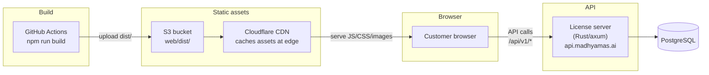

- **Static assets** (JS, CSS, images) served from Cloudflare CDN
  (cached at edge locations worldwide)
- **API calls** go to the license server (Rust/axum) at
  `api.madhyamas.ai` or same-origin via reverse proxy
- **HTML** served from CDN or from the Rust backend (depends on
  caching strategy)

For a simpler setup (MVP), skip the CDN and serve everything from the
Rust backend. The multi-stage Docker build handles this — the web
dist is copied into the Docker image and served from disk.

#### Vite config

```ts
// web/vite.config.ts (license server portal)
import { defineConfig } from "vite";
import react from "@vitejs/plugin-react";
import path from "path";

export default defineConfig({
  plugins: [react()],
  resolve: {
    alias: {
      "@": path.resolve(__dirname, "./src"),
    },
  },
  server: {
    port: 5175,  // Different from proxy's 5174
    proxy: {
      "/api": {
        target: "http://127.0.0.1:3000",  // License server API
        changeOrigin: true,
      },
      "/webhooks": {
        target: "http://127.0.0.1:3000",
        changeOrigin: true,
      },
    },
  },
  build: {
    outDir: "dist",
    sourcemap: false,
    target: "es2020",
    rollupOptions: {
      output: {
        manualChunks: {
          "react-vendor": ["react", "react-dom", "react-router-dom"],
          "radix-vendor": [
            "@radix-ui/react-dialog",
            "@radix-ui/react-dropdown-menu",
            "@radix-ui/react-tabs",
            "@radix-ui/react-select",
            "@radix-ui/react-tooltip",
            "@radix-ui/react-toast",
            "@radix-ui/react-accordion",
            "@radix-ui/react-checkbox",
            "@radix-ui/react-label",
            "@radix-ui/react-separator",
            "@radix-ui/react-slot",
          ],
          "charts": ["recharts"],
          "icons": ["lucide-react"],
        },
      },
    },
  },
});
```

### 15.8 CI/CD pipeline

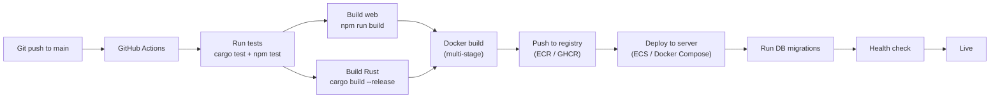

```yaml
# .github/workflows/ci.yml (license server)
name: CI

on:
  push:
    branches: [main]
  pull_request:

jobs:
  test:
    runs-on: ubuntu-latest
    steps:
      - uses: actions/checkout@v4
      - uses: actions-rust-lang/setup-rust-toolchain@v1
      - uses: actions/setup-node@v4
        with:
          node-version: 20
      - run: cargo test --workspace
      - run: cd web && npm ci && npm run typecheck && npm run build

  build-and-deploy:
    needs: test
    if: github.ref == 'refs/heads/main'
    runs-on: ubuntu-latest
    steps:
      - uses: actions/checkout@v4
      - uses: docker/setup-buildx-action@v3
      - uses: aws-actions/configure-aws-credentials@v4
        with:
          aws-access-key-id: ${{ secrets.AWS_ACCESS_KEY_ID }}
          aws-secret-access-key: ${{ secrets.AWS_SECRET_ACCESS_KEY }}
          aws-region: us-east-1
      - uses: aws-actions/amazon-ecr-login@v2
      - name: Build and push
        uses: docker/build-push-action@v5
        with:
          context: .
          file: docker/Dockerfile
          push: true
          tags: |
            ${{ secrets.ECR_REGISTRY }}/madhyamas-license-server:latest
            ${{ secrets.ECR_REGISTRY }}/madhyamas-license-server:${{ github.sha }}
      - name: Deploy
        run: |
          aws ecs update-service --cluster madhyamas --service license-server --force-new-deployment
```

### 15.9 Development workflow

```bash
# Clone the license server repo
git clone git@github.com:madhyamas/madhyamas-license-server.git
cd madhyamas-license-server

# Terminal 1: Start PostgreSQL + Redis (Docker)
docker compose up db redis

# Terminal 2: Start Rust API server
cargo run --bin license-server
# → API at http://127.0.0.1:3000

# Terminal 3: Start Vite dev server (frontend)
cd web && npm run dev
# → Portal at http://127.0.0.1:5175 (proxies /api to :3000)

# Or use Docker Compose for everything:
docker compose up
# → Portal at http://127.0.0.1:3000 (Rust serves web/dist)
```

### 15.10 Comparison: proxy web UI vs license portal

| Aspect | Proxy web UI (`madhyamas/web/`) | License portal (`madhyamas-license-server/web/`) |
|---|---|---|
| Repository | `madhyamas` (OSS) | `madhyamas-license-server` (private) |
| Audience | Developers using the proxy | Customer admins + Madhyamas staff |
| Routing | `useState`-based view switching (no react-router) | `react-router-dom` (real URLs, bookmarks, SEO) |
| Embedding | `rust-embed` (embedded in binary) | Served from disk (MADHYAMAS_WEB_DIR) or CDN |
| Build | `npm run build` → `web/dist/` → embedded via rust-embed | `npm run build` → `web/dist/` → Docker image or CDN |
| Update frequency | Tied to proxy releases | Independent (can deploy daily) |
| Auth | Runtime-gated (tier detection at startup) | Always required (portal is auth-first) |
| Pages | Traffic, tools, sessions, config, admin (enterprise) | Landing, pricing, register, login, dashboard, billing, support, admin |
| shadcn/ui components | Own copy in `components/ui/` | Own copy in `components/ui/` (synced via convention) |
| Design tokens | `@madhyamas/design-tokens` (shared) | `@madhyamas/design-tokens` (shared) |
| API client | `apiGet`/`apiPost` to `/api/*` (same origin) | `apiGet`/`apiPost` to `/api/v1/*` (same origin or cross-origin) |
| State management | TanStack Query | TanStack Query |
| Component library | shadcn/ui (Radix + Tailwind) | shadcn/ui (Radix + Tailwind) |
| Charts | Not currently used | `recharts` (revenue dashboard, metrics) |
| Dev server port | 5174 | 5175 |
| API server port | 3001 | 3000 |

### 15.11 Dependency inventory

Portal-specific dependencies (not in the proxy web UI):

| Dependency | Purpose |
|---|---|
| `react-router-dom` | Multi-page routing (the proxy doesn't use this) |
| `recharts` | Revenue/metrics charts (admin dashboard) |
| `@tanstack/react-query` | Server state (same as proxy, but separate instance) |
| `date-fns` | Date formatting (invoices, license expiry, ticket timestamps) |
| `@stripe/stripe-js` | Stripe.js (redirect to Checkout, Customer Portal) |
| `qrcode.react` | MFA QR code display (TOTP setup) |
| `dompurify` | Sanitize ticket comment HTML (if rich text is supported) |

Shared dependencies (same versions as proxy web UI):

| Dependency | Purpose |
|---|---|
| `react`, `react-dom` | UI framework |
| `@radix-ui/*` | shadcn/ui primitives |
| `tailwindcss` | Styling |
| `lucide-react` | Icons |
| `clsx` + `tailwind-merge` | `cn()` class merge helper |
| `vite` | Build tool |

---

## 16. Implementation Roadmap

### Phase L1: Core license server (MVP)

**Goal:** Sign and verify licenses, basic account management, manual
license issuance.

| Task | Component |
|---|---|
| Set up Rust workspace (`license-server`, `license-core`, `license-db`) | Infrastructure |
| Set up `web/` React app (Vite + react-router-dom + shadcn/ui + Tailwind) | `web/` |
| Extract `@madhyamas/design-tokens` package (shared Tailwind preset) | Infrastructure |
| Implement Ed25519 license signing (reuse `madhyamas-core` signing utils) | `license-core` |
| Implement license payload types, canonical JSON serialization | `license-core` |
| Set up PostgreSQL with migrations | `license-db` |
| Implement organization + user CRUD | `license-server` |
| Implement auth (register, login, JWT, email verification) | `license-server` |
| Implement manual license issuance (admin only) | `license-server` |
| Implement license download endpoint | `license-server` |
| Implement public license verify + revocation API | `license-server` |
| Basic React portal: register, login, download license | `web/` |
| Basic admin dashboard: issue license, list customers | `web/` |
| Multi-stage Dockerfile (build web + Rust in one image) | `docker/` |
| Docker Compose deployment (server + PostgreSQL + Redis) | `docker/` |
| CI/CD pipeline (GitHub Actions: test, build, deploy) | `.github/` |

**Effort:** Large. This is the foundation — all subsequent phases
build on it.

### Phase L2: Stripe integration

**Goal:** Self-service subscription purchase, automated license
issuance on payment.

| Task | Component |
|---|---|
| Add `stripe-client` crate (typed Stripe API wrapper) | `stripe-client` |
| Implement Stripe Checkout Session creation | `license-server` |
| Implement Stripe webhook handler (signature verification) | `license-server` |
| Handle `checkout.session.completed` → issue license | `license-server` |
| Handle `invoice.paid` → renew license | `license-server` |
| Handle `invoice.payment_failed` → mark past_due, start grace period | `license-server` |
| Handle `customer.subscription.deleted` → revoke license | `license-server` |
| Handle `customer.subscription.updated` → seat count change | `license-server` |
| Stripe Customer Portal integration | `license-server` |
| Pricing page in React portal | `web/` |
| Subscription management in portal | `web/` |
| Invoice list + PDF download | `web/` |
| Grace period background job (revoke after 10 days) | `license-worker` |

**Effort:** Medium. Stripe handles most payment complexity; the work
is webhook handling and state management.

### Phase L3: Email notifications

**Goal:** Automated email for all key events.

| Task | Component |
|---|---|
| Set up AWS SES or Postmark integration | `license-server` |
| Create email templates (MJML + Handlebars) | `templates/` |
| Send welcome, email verification, license issued emails | `license-server` |
| Send payment receipt, payment failed emails | `license-server` |
| Send license expiry warnings (30/7/1 days) | `license-worker` |
| Send trial expiry warning (3 days) | `license-worker` |
| Email log table + tracking | `license-db` |
| Bounce/complaint handling via SES webhooks | `license-server` |

**Effort:** Small-medium. Templates are the bulk of the work; the
sending infrastructure is straightforward.

### Phase L4: Support ticket system

**Goal:** Customers can file and track support tickets; agents can
manage them.

| Task | Component |
|---|---|
| Ticket CRUD API | `license-server` |
| Comment CRUD API | `license-server` |
| S3 attachment upload + download | `license-server` |
| SLA calculation + tracking | `license-server` |
| Ticket list view in portal | `web/` |
| Ticket detail view with comment thread | `web/` |
| Admin ticket dashboard (all tickets, assign, SLA) | `web/` |
| Email notifications for ticket events | `license-server` |
| Inbound email (reply-to-ticket via email) | `license-server` |

**Effort:** Medium. Standard CRUD with some workflow logic.

### Phase L5: Admin dashboard and analytics

**Goal:** Madhyamas team has full visibility into revenue, licenses,
and support.

| Task | Component |
|---|---|
| Revenue dashboard (MRR, ARR, churn, ARPU) | `web/` |
| License metrics (active, trials, expiring, conversion) | `web/` |
| Customer list with filters | `web/` |
| Customer detail view (org, users, licenses, subscriptions, tickets) | `web/` |
| Audit log viewer | `web/` |
| Admin MFA (TOTP required) | `license-server` + `web/` |
| Admin IP allowlist | `license-server` |

**Effort:** Medium. Mostly frontend work; data is available from
existing tables.

### Phase L6: Hardening and scale

**Goal:** Production-grade reliability and security.

| Task | Component |
|---|---|
| Redis-based rate limiting on public API | `license-server` |
| License attestation endpoint + analytics | `license-server` |
| Key rotation support (multiple public keys in proxy binary) | `license-core` + proxy |
| GDPR data export endpoint | `license-server` |
| GDPR data deletion endpoint | `license-server` |
| SOC 2 readiness documentation | `docs/` |
| Multi-instance deployment (ECS + ALB) | `docker/` |
| Monitoring + alerting (CloudWatch/Grafana) | Infrastructure |
| Backup + disaster recovery procedures | Infrastructure |
| Load testing | QA |

**Effort:** Medium. Incremental hardening based on customer growth.

### Roadmap summary

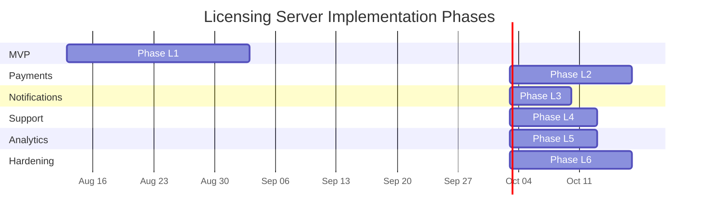

### Dependency on proxy binary

The licensing server can be built **independently** of the proxy
binary's enterprise tier. The only contract between them is:

1. **License file format** — defined in `license-core`, shared via the
   `madhyamas-core` dependency.
2. **Revocation API** — the proxy binary calls `GET
   /api/v1/license/verify/{id}` (optional, off by default).
3. **Embedded public key** — the proxy binary embeds the Ed25519
   public key; the licensing server holds the private key.

The licensing server can launch before the proxy binary's enterprise
tier is complete. Manual license issuance (Phase L1) is enough to
support early customers. Stripe automation (Phase L2) can follow.

---

## 17. Risk Analysis

> **Note:** For a comprehensive performance and security analysis
> covering the entire enterprise design (not just the licensing
> server), see [ENTERPRISE_PERF_SECURITY.md](ENTERPRISE_PERF_SECURITY.md).
> It includes a full threat model, 16 security gaps with code-level
> remediations, 10 performance bottlenecks, and pre-launch checklists.

### Security risks

| Risk | Mitigation |
|---|---|
| Ed25519 private key compromise | Store in Secrets Manager/Vault. Rotate annually. Support `issuer_key_id` for seamless rotation. Alert on unexpected key access. |
| Stripe API key compromise | Store in Secrets Manager. Use restricted keys (only the scopes needed). Rotate on personnel turnover. Stripe dashboard alerts on suspicious activity. |
| Admin account takeover | TOTP MFA required for all admin accounts. IP allowlist. Account lockout after failed attempts. |
| License file sharing (one org, many deployments) | Optional attestation endpoint detects multiple installations. Soft binding via fingerprint. Hard binding available for strict licenses. |
| Webhook spoofing | Verify Stripe-Signature header. Reject unsigned requests. |
| SQL injection | `sqlx` parameterized queries exclusively. No string concatenation in SQL. |
| XSS in portal | React auto-escaping. CSP headers. No `dangerouslySetInnerHTML`. |

### Operational risks

| Risk | Mitigation |
|---|---|
| Stripe outage | Stripe has 99.99% uptime. If webhook delivery fails, Stripe retries for 3 days. License issuance is delayed but not lost. Manual license issuance as fallback. |
| PostgreSQL outage | Multi-AZ RDS with automated failover. Daily backups with 30-day retention. Point-in-time recovery. |
| Email delivery issues | SES/Postmark have high deliverability. Monitor bounce rate. If bounce rate > 5%, pause sending and investigate. |
| License issuance failure after payment | Webhook handler is idempotent. If signing fails, retry with exponential backoff. If still failing, alert admin to issue manually. Customer has paid; license must be delivered. |
| Key rotation breaks existing licenses | Old public key stays in proxy binary until all old licenses expire. `issuer_key_id` in payload identifies which key to use. Test rotation in staging before production. |

### Business risks

| Risk | Mitigation |
|---|---|
| Pricing too low for sustainability | Start with current tiers. Monitor MRR and costs. Adjust based on customer feedback and competitor analysis. |
| Chargeback / fraud | Stripe Radar for fraud detection. Manual review for high-value subscriptions. License revocation on chargeback. |
| Customer churn | Track churn rate. Exit survey on cancellation. Engage with customers showing reduced license attestations. |
| Support overload | Knowledge base articles for common issues. Ticket deflection via docs. Hire support agent when ticket volume exceeds capacity. |

---

## See Also

- [Enterprise Analysis Overview](ENTERPRISE_OVERVIEW.md) — Master document
- [Enterprise Storage Trait Design](ENTERPRISE_STORAGE_TRAITS.md) — Storage backend abstraction
- [Enterprise Auth, RBAC, and IdP](ENTERPRISE_AUTH_RBAC.md) — Proxy-side authentication
- [Enterprise Web UI](ENTERPRISE_WEB_UI.md) — Proxy-side enterprise web UI (same-folder, runtime-gated)
- [ENTERPRISE.md](ENTERPRISE.md) — Current enterprise feature internals (pre-refactor)
- [PLUGIN_SECURITY.md](PLUGIN_SECURITY.md) — Plugin signing (same Ed25519 crypto as license signing)
