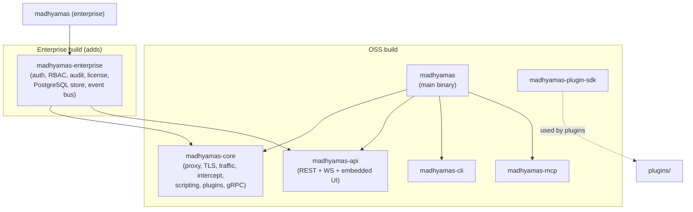
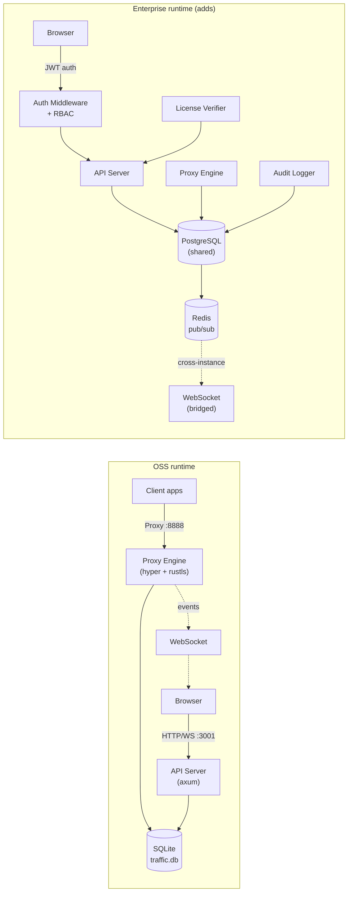
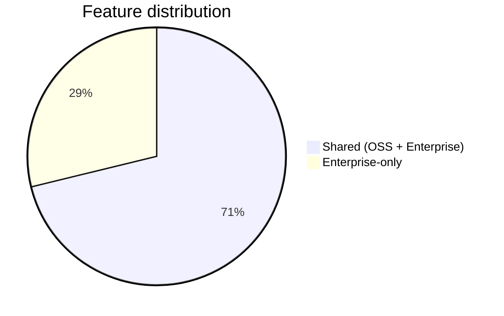
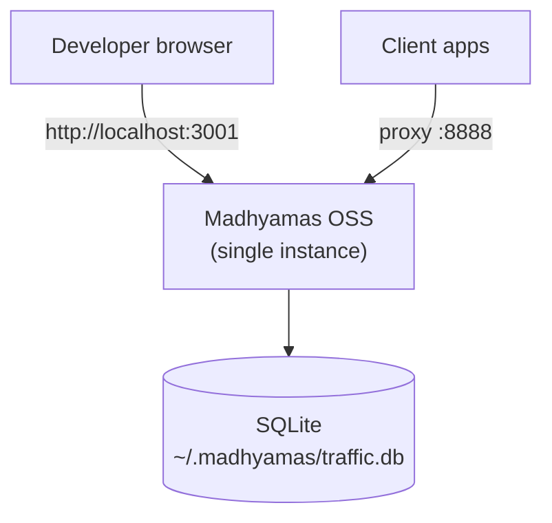
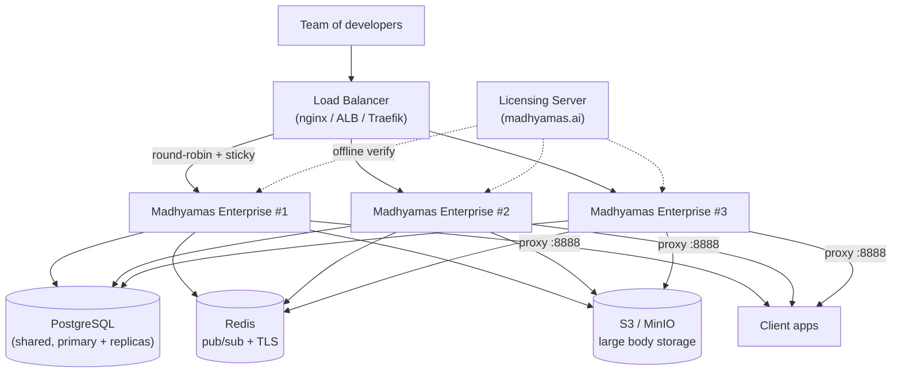
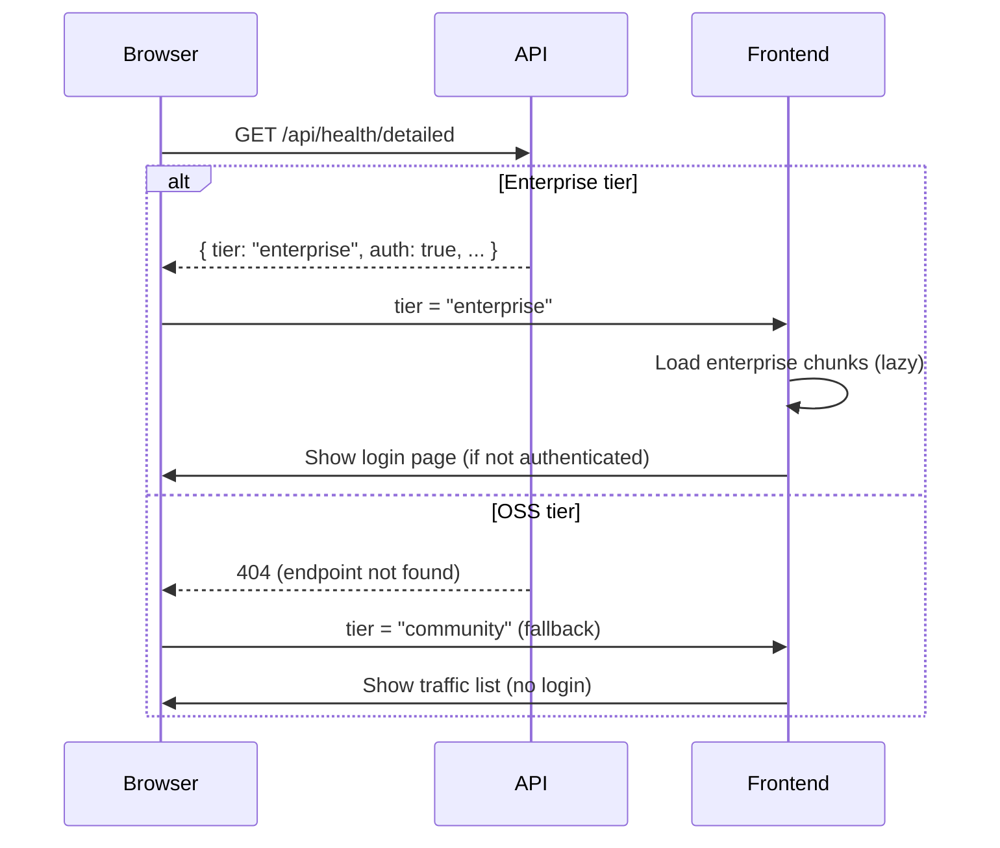
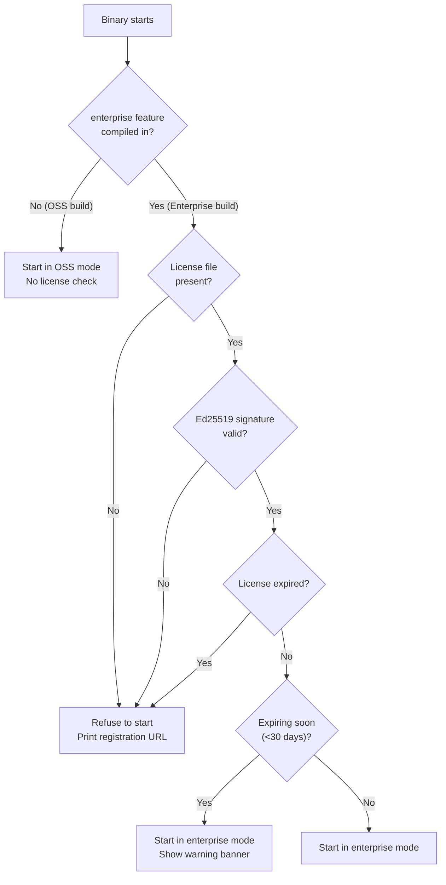
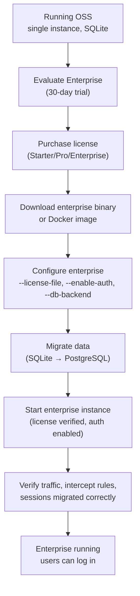

# OSS vs Enterprise Comparison

> Part of: [Enterprise Analysis Overview](ENTERPRISE_OVERVIEW.md)

This document provides a side-by-side comparison of the Madhyamas
Open Source Software (OSS / "Simple") tier and the Enterprise tier.
It covers architecture, feature parity, build/distribution,
database, deployment, security, performance, web UI, CLI/MCP, and
pricing — giving a clear picture of what each tier provides, what
is shared, and what differs.

---

## Table of Contents

1. [Executive Summary](#1-executive-summary)
2. [Architecture Comparison](#2-architecture-comparison)
3. [Feature Parity Matrix](#3-feature-parity-matrix)
4. [Build and Distribution](#4-build-and-distribution)
5. [Database and Storage](#5-database-and-storage)
6. [Deployment Topologies](#6-deployment-topologies)
7. [Security Model Comparison](#7-security-model-comparison)
8. [Performance Characteristics](#8-performance-characteristics)
9. [Web UI Comparison](#9-web-ui-comparison)
10. [CLI and MCP Comparison](#10-cli-and-mcp-comparison)
11. [Configuration Comparison](#11-configuration-comparison)
12. [Licensing and Pricing](#12-licensing-and-pricing)
13. [What Is Shared Between Tiers](#13-what-is-shared-between-tiers)
14. [What Is OSS-Only](#14-what-is-oss-only)
15. [What Is Enterprise-Only](#15-what-is-enterprise-only)
16. [Upgrade Path: OSS to Enterprise](#16-upgrade-path-oss-to-enterprise)
17. [Frequently Asked Questions](#17-frequently-asked-questions)

---

## 1. Executive Summary

Madhyamas is distributed as a **single codebase, two builds**:

| | OSS (Simple) | Enterprise |
|---|---|---|
| **Target user** | Solo developer, small team | Medium to large teams, organizations |
| **Price** | Free (MIT OR Apache-2.0) | Paid (subscription, see §12) |
| **Auth** | None (local trust) | JWT + API keys + SSO (OIDC/LDAP/SAML) |
| **Database** | SQLite (local file) | PostgreSQL (shared) + SQLite (fallback) |
| **Deployment** | Single instance | Single or multi-instance (K8s, LB) |
| **Multi-user** | Single implicit user | Named users with RBAC roles |
| **License check** | None | Ed25519-signed license file |
| **Source code** | Open source | Same source; enterprise crate is source-available (not OSS-licensed) |
| **Support** | Community (GitHub) | Priority (email, SLA) |

**Key principle:** The OSS tier is a fully functional debugging proxy
with no crippled features. The Enterprise tier adds organizational
capabilities (auth, RBAC, audit, multi-instance, SSO) that a solo
developer doesn't need but an organization requires.

---

## 2. Architecture Comparison

### 2.1 Crate structure



| Crate | OSS | Enterprise | Notes |
|---|---|---|---|
| `madhyamas` (main binary) | Yes | Yes | Enterprise build adds `--features enterprise` |
| `madhyamas-core` | Yes | Yes | Same code; enterprise crate adds extensions |
| `madhyamas-api` | Yes | Yes | Same code; enterprise crate injects routes + middleware |
| `madhyamas-cli` | Yes | Yes | Enterprise adds subcommands (user, audit, license) |
| `madhyamas-mcp` | Yes | Yes | Enterprise adds MCP tools (user, audit, license) |
| `madhyamas-plugin-sdk` | Yes | Yes | Identical — plugins work in both tiers |
| `madhyamas-enterprise` | **No** | **Yes** | Separate crate; not compiled in OSS build |

### 2.2 Runtime architecture



### 2.3 Process model

| Aspect | OSS | Enterprise |
|---|---|---|
| Processes | 1 (unified binary) | 1 per instance (unified binary) |
| Threads | Tokio runtime (multi-threaded) | Same |
| WebSocket | In-process broadcast | In-process + Redis pub/sub bridge |
| State | In-process (SQLite + memory) | Shared (PostgreSQL + Redis) |
| License check | None | At startup (Ed25519 verify, ~50ms) |

---

## 3. Feature Parity Matrix

### 3.1 Core proxy features (identical in both tiers)

| Feature | OSS | Enterprise | Notes |
|---|---|---|---|
| HTTP/HTTPS proxy | ✅ | ✅ | Same engine (`hyper` + `rustls`) |
| TLS interception (MITM) | ✅ | ✅ | Same CA generation + leaf cert signing |
| SSL pass-through | ✅ | ✅ | Non-intercepted TLS tunneling |
| HTTP/2 support | ✅ | ✅ | ALPN negotiation |
| gRPC inspection | ✅ | ✅ | Feature-gated (`grpc` feature) |
| WebSocket inspection | ✅ | ✅ | WS message capture + display |
| SOCKS5 proxy | ✅ | ✅ | Blind TCP tunnel on port 1080 |
| Upstream proxy chaining | ✅ | ✅ | HTTP/HTTPS/SOCKS5 upstream |
| IP allowlist | ✅ | ✅ | CIDR-based access control |

### 3.2 Intercept pipeline (identical in both tiers)

| Handler | Priority | OSS | Enterprise | Notes |
|---|---|---|---|---|
| Block list | 5 | ✅ | ✅ | Domain/pattern blocking |
| Rewrites | 10 | ✅ | ✅ | Request modification rules |
| Mocks | 20 | ✅ | ✅ | Single/sequence/conditional/probabilistic |
| Breakpoints | 30 | ✅ | ✅ | Interactive request/response pause |
| Throttle | 40 | ✅ | ✅ | Latency simulation |
| Scripts | 10 (extension) | ✅ | ✅ | JS (boa_engine) — feature-gated |
| Plugins | 20 (extension) | ✅ | ✅ | WASM (wasmtime) — feature-gated |

### 3.3 Traffic recording (identical in both tiers)

| Feature | OSS | Enterprise | Notes |
|---|---|---|---|
| Traffic capture | ✅ | ✅ | Request/response headers + bodies |
| Session management | ✅ | ✅ | Named sessions, switch, delete |
| HAR import/export | ✅ | ✅ | Full HAR 1.2 support |
| cURL export | ✅ | ✅ | Per-entry cURL command generation |
| Recording limits | ✅ | ✅ | max_entries, max_body_size, max_total_size |
| Ignored domains | ✅ | ✅ | Domain exclusion from capture |
| Focus hosts | ✅ | ✅ | Visual highlighting (not a filter) |
| Auto Save | ✅ | ✅ | Periodic HAR/session backup |
| Mirror tool | ✅ | ✅ | Save response bodies to disk |
| Edit-then-Repeat | ✅ | ✅ | Modify saved requests before replay |
| Repeat Advanced | ✅ | ✅ | Batch iterations/concurrency/delay |
| Timeline view | ✅ | ✅ | Waterfall chart |
| Log rotation | ✅ | ✅ | Time/size/on-demand rotation |

### 3.4 Enterprise-only features

| Feature | OSS | Enterprise | Notes |
|---|---|---|---|
| **Authentication** | ❌ | ✅ | JWT (HMAC-SHA256), API keys |
| **RBAC** | ❌ | ✅ | Admin / User / Viewer roles |
| **User management** | ❌ | ✅ | CRUD users, password hashing (argon2id) |
| **Audit logging** | ❌ | ✅ | Hash-chained, append-only, PostgreSQL |
| **SSO (OIDC)** | ❌ | ✅ | External identity provider integration |
| **SSO (LDAP)** | ❌ | ✅ | Enterprise plan only |
| **SSO (SAML)** | ❌ | ✅ | Enterprise plan only |
| **MFA (TOTP)** | ❌ | ✅ | Two-factor authentication |
| **License verification** | ❌ | ✅ | Ed25519-signed license file |
| **PostgreSQL backend** | ❌ | ✅ | Shared database across instances |
| **Multi-instance** | ❌ | ✅ | K8s deployment, load balancer, Redis |
| **Config sync** | ❌ | ✅ | Atomic cross-instance propagation |
| **Instance registry** | ❌ | ✅ | Heartbeat, seat counting |
| **Detailed health checks** | ❌ | ✅ | DB, Redis, license dependency checks |
| **Config export/import** | ❌ | ✅ | Backup/restore configuration |
| **Onboarding wizard** | ❌ | ✅ | First-run setup flow |
| **Priority support** | ❌ | ✅ | Email, SLA (plan-dependent) |

### 3.5 Feature parity summary



- **42 features** are shared between both tiers (all core proxy,
  intercept, recording, and tooling features)
- **17 features** are enterprise-only (all organizational, auth,
  and multi-instance features)
- **0 features** are OSS-only (enterprise is a superset, not a
  different product)

---

## 4. Build and Distribution

### 4.1 Build commands

```bash
# === OSS (Simple) build ===
cargo build --release                          # Default (no enterprise feature)
cargo build --release --no-default-features    # Minimal (no gRPC, scripting, plugins, enterprise)

# === Enterprise build ===
cargo build --release --features enterprise    # Enterprise + all defaults
cargo build --release --features enterprise --no-default-features --features grpc,scripting,plugins  # Enterprise + select features

# === Frontend (both tiers) ===
cd web && npm run build                        # Build React UI (embedded at compile time)
```

### 4.2 Binary differences

| Property | OSS | Enterprise |
|---|---|---|
| Binary size | ~15-20 MB | ~20-25 MB |
| Dependencies | Core + gRPC + scripting + plugins | + jsonwebtoken, sqlx (postgres), redis, argon2, ed25519-dalek |
| Startup time | < 1s | < 5s (license verify + DB connect) |
| License check | None | Ed25519 signature verification at startup |
| Enterprise code compiled | No | Yes (separate `madhyamas-enterprise` crate) |

### 4.3 Distribution channels

| Channel | OSS | Enterprise | Notes |
|---|---|---|---|
| GitHub Releases | ✅ (`madhyamas-v*`) | ✅ (`madhyamas-enterprise-v*`) | Same release, different assets |
| crates.io | ✅ (OSS crates only) | ❌ | Enterprise crate not published |
| Homebrew | ✅ | ❌ | OSS only (Homebrew tap) |
| Chocolatey | ✅ | ❌ | OSS only (Windows package) |
| Snap | ✅ | ❌ | OSS only (Linux package) |
| RPM | ✅ | ❌ | OSS only (Fedora/RHEL) |
| Docker Hub | ✅ (`madhyamas/madhyamas`) | ❌ | OSS only |
| GHCR | ✅ (`ghcr.io/{org}/madhyamas`) | ✅ (`ghcr.io/{org}/madhyamas-enterprise`) | Enterprise requires login |
| Direct download | ✅ (public) | ✅ (authenticated, from licensing portal) | Enterprise download requires active license |

### 4.4 Docker images

| Property | OSS | Enterprise |
|---|---|---|
| Image | `ghcr.io/{org}/madhyamas:latest` | `ghcr.io/{org}/madhyamas-enterprise:latest` |
| Base image | `alpine:3.19` | `alpine:3.19` |
| User | `madhyamas` (non-root) | `madhyamas` (non-root) |
| Ports | 3001 (API), 8888 (proxy) | 3001, 8888 |
| Env vars | `MADHYAMAS_HOST`, `MADHYAMAS_API_PORT`, etc. | + `DATABASE_URL`, `REDIS_URL`, `MADHYAMAS_LICENSE_FILE`, `MADHYAMAS_JWT_SECRET_FILE` |
| Volumes | `/data` (SQLite + certs) | `/data` + `/etc/madhyamas` (config, license, CA) |
| Health check | `GET /health` | `GET /health/ready` (checks DB, Redis, license) |
| Multi-arch | linux/amd64, linux/arm64 | linux/amd64, linux/arm64 |

---

## 5. Database and Storage

### 5.1 Storage comparison

| Aspect | OSS | Enterprise |
|---|---|---|
| Default database | SQLite (`traffic.db`) | PostgreSQL |
| Fallback database | — | SQLite (single-instance mode) |
| Driver | `rusqlite` (sync) → `sqlx` (async, planned) | `sqlx` (async, native) |
| Connection model | `Mutex<Connection>` (single writer) | `PgPool` (multi-connection, MVCC) |
| Max concurrent writers | 1 | Limited by pool size (default 10) |
| Shared across instances | No (file per instance) | Yes (shared PostgreSQL) |
| Schema | 8 tables (sessions, requests, responses, ws_*, focus_hosts) | Same 8 + enterprise tables (users, roles, audit_events, active_sessions, ca_certificates) |
| Body storage | `BLOB` inline (up to 20MB) | Tiered: inline (≤1KB) / TOAST (≤100KB) / S3 (>100KB) |
| Body compression | None | zstd (level 3, skip already-compressed) |
| Write pattern | 1 INSERT per request + 1 per response | Batch INSERT (100 entries / 500ms) |
| Count queries | `COUNT(*)` on every insert | Session counter column (no COUNT(*)) |
| Pagination | `LIMIT` / `OFFSET` | Cursor-based (keyset pagination) |
| List view | Loads all columns (including bodies) | Metadata-only; bodies lazy-loaded |
| Indexing | 4 B-tree indexes | 7 indexes: B-tree, GIN (JSONB), BRIN (time), trigram (URL) |
| Partitioning | No | Weekly partitioning via pg_partman |
| Retention | FIFO pruning (DELETE) | Drop old partitions (no DELETE + VACUUM) |
| Vacuum | N/A (SQLite) | Tuned autovacuum (scale_factor 0.05, fillfactor 90) |
| Read replicas | No | Optional (dual pool: write to primary, read from replica) |
| External pooler | No | PgBouncer (for 10+ instances) |

### 5.2 Schema comparison

| Table | OSS | Enterprise | Differences |
|---|---|---|---|
| `sessions` | ✅ | ✅ | Enterprise adds `entry_count`, `total_body_bytes` columns |
| `requests` / `traffic_entries` | ✅ | ✅ | Enterprise: UUID types, JSONB headers, tiered body columns, `instance_id` |
| `responses` | ✅ | Merged into `traffic_entries` | Enterprise: response columns in same table (LEFT JOIN eliminated) |
| `ws_connections` | ✅ | ✅ | Same |
| `ws_messages` | ✅ | ✅ (batched) | Enterprise: `ws_message_batches` table (100 messages per row) |
| `focus_hosts` | ✅ | ✅ | Same |
| `mock_rules` | ✅ | ✅ | Same |
| `rewrite_rules` | ✅ | ✅ | Same |
| `breakpoint_rules` | ✅ | ✅ | Same |
| `throttle_profile` | ✅ | ✅ | Same |
| `block_list_entries` | ✅ | ✅ | Same |
| `users` | ❌ | ✅ | Enterprise-only |
| `roles` | ❌ | ✅ | Enterprise-only |
| `audit_events` | ❌ | ✅ | Enterprise-only (hash-chained, append-only) |
| `active_sessions` | ❌ | ✅ | Enterprise-only (license seat tracking) |
| `active_instances` | ❌ | ✅ | Enterprise-only (instance registry) |
| `ca_certificates` | ❌ | ✅ | Enterprise-only (shared CA, encrypted at rest) |
| `api_keys` | ❌ | ✅ | Enterprise-only |

### 5.3 Data volume comparison

| Metric | OSS (single dev) | Enterprise (50 devs) |
|---|---|---|
| Entries per day | ~25,000 | ~1,000,000 |
| Metadata per day | ~10 MB | ~400 MB |
| Bodies per day (50KB avg) | ~1.2 GB | ~50 GB |
| Database size (30-day retention) | ~36 GB | ~1.5 TB |
| Write rate | ~1/sec | ~12/sec sustained, ~100/sec burst |
| Concurrent readers | 1 | 50+ |

---

## 6. Deployment Topologies

### 6.1 OSS deployment



| Property | Value |
|---|---|
| Instances | 1 |
| Load balancer | None |
| Database | SQLite (local file) |
| Redis | None |
| High availability | None (single point of failure) |
| Scaling | Vertical (more CPU/RAM) |
| Setup time | < 1 minute (download + run) |
| Container orchestration | Docker Compose (optional) |

### 6.2 Enterprise deployment



| Property | Value |
|---|---|
| Instances | 1-N (horizontal scaling) |
| Load balancer | nginx / AWS ALB / Traefik (sticky sessions for WS) |
| Database | PostgreSQL (shared, primary + optional read replicas) |
| Redis | Required for multi-instance (pub/sub event bus) |
| S3 / MinIO | Optional (large body storage, >100KB) |
| High availability | Yes (instance failure doesn't affect cluster) |
| Scaling | Horizontal (add instances) + vertical (per instance) |
| Setup time | 30-60 minutes (K8s + PostgreSQL + Redis) |
| Container orchestration | Kubernetes (recommended) or Docker Compose |
| License server | External (madhyamas.ai); offline verification by default |

### 6.3 Deployment comparison

| Aspect | OSS | Enterprise |
|---|---|---|
| Single instance | ✅ (default) | ✅ (with SQLite fallback) |
| Docker Compose | ✅ | ✅ (single instance) |
| Kubernetes | Possible but unnecessary | ✅ (recommended) |
| Multi-instance | ❌ | ✅ (3+ replicas) |
| Load balancer | ❌ | ✅ (nginx / ALB / Traefik) |
| PostgreSQL | ❌ | ✅ (required for multi-instance) |
| Redis | ❌ | ✅ (required for multi-instance) |
| S3 / MinIO | ❌ | ✅ (optional, for large body storage) |
| Read replicas | ❌ | ✅ (optional, for read-heavy deployments) |
| PgBouncer | ❌ | ✅ (recommended for 10+ instances) |

---

## 7. Security Model Comparison

### 7.1 Authentication

| Aspect | OSS | Enterprise |
|---|---|---|
| Authentication | None (local trust) | JWT (HMAC-SHA256) + API keys |
| Password storage | N/A | argon2id (memory-hard, GPU-resistant) |
| Token expiry | N/A | 15min access token + 8h refresh token (rotation) |
| API keys | N/A | SHA-256 hashed, scoped, expiring |
| SSO (OIDC) | ❌ | ✅ (Pro plan+) |
| SSO (LDAP) | ❌ | ✅ (Enterprise plan) |
| SSO (SAML) | ❌ | ✅ (Enterprise plan) |
| MFA (TOTP) | ❌ | ✅ (Pro plan+) |
| Session revocation | N/A | Redis-backed revocation list |

### 7.2 Authorization

| Aspect | OSS | Enterprise |
|---|---|---|
| Authorization model | None (all access) | RBAC (role → permissions) |
| Roles | N/A | Admin, User, Viewer |
| Per-route enforcement | N/A | `require_permission_middleware` |
| Per-resource permissions | N/A | CRUD per resource type |
| API key scopes | N/A | Per-key scope limitation |

### 7.3 Network security

| Aspect | OSS | Enterprise |
|---|---|---|
| TLS (API/UI) | Self-signed (dev) | Terminated at load balancer |
| TLS (proxy interception) | Self-signed CA | Shared CA (volume or PG-backed) |
| CORS | Origin allowlist (localhost, private IPs) | Same + configurable allowed origins |
| Rate limiting | Per-IP (`tower_governor`) | Per-IP + per-user (JWT `sub`) |
| IP allowlist (proxy) | ✅ | ✅ |
| Proxy authentication | ❌ | Optional (HTTP Proxy-Authenticate) |
| WebSocket authentication | ❌ | ✅ (query param token) |
| Redis authentication | N/A | Password + TLS + ACL |
| PostgreSQL TLS | N/A | `sslmode=require` |

### 7.4 Audit and compliance

| Aspect | OSS | Enterprise |
|---|---|---|
| Audit logging | ❌ | ✅ (hash-chained, append-only) |
| Audit storage | N/A | PostgreSQL (with tamper protection) |
| Audit export | N/A | JSON, CSV |
| Compliance (GDPR) | N/A | Data export + deletion support |
| Compliance (SOC 2) | N/A | Security practices support it |
| Telemetry / phone-home | ❌ (no telemetry) | ❌ (no telemetry; offline license verify) |

### 7.5 Security headers

| Header | OSS | Enterprise |
|---|---|---|
| Content-Security-Policy | ❌ | ✅ |
| X-Content-Type-Options | ❌ | ✅ (`nosniff`) |
| X-Frame-Options | ❌ | ✅ (`DENY`) |
| Strict-Transport-Security | ❌ | ✅ (`max-age=31536000`) |
| Referrer-Policy | ❌ | ✅ (`strict-origin-when-cross-origin`) |

> **Note:** Security headers should be added to both tiers (see
> [PERF_SECURITY §3.3](ENTERPRISE_PERF_SECURITY.md#33-missing-csp-headers-on-proxy-web-ui)).
> The OSS tier serves a web UI on localhost and would benefit from
> CSP protection even without auth.

---

## 8. Performance Characteristics

### 8.1 Throughput comparison

| Metric | OSS | Enterprise | Notes |
|---|---|---|---|
| Proxy throughput | ~500 conn/sec | ~500 conn/sec per instance | Same engine; enterprise scales horizontally |
| API throughput | ~10k req/sec | ~10k req/sec per instance | Same axum server |
| Write throughput | ~1k writes/sec (SQLite) | ~10k writes/sec (PG batched) | Enterprise: 100x via batching + PG MVCC |
| WebSocket clients | ~100 | ~100 per instance | Enterprise: Redis bridge for cross-instance |
| Max traffic entries | 10,000 (configurable) | Unlimited (partitioned) | Enterprise: weekly partitions with retention |
| List view latency (50 entries) | ~50ms (SQLite) | ~5ms (PG, metadata-only) | Enterprise: lazy body loading |

### 8.2 Latency comparison

| Operation | OSS | Enterprise | Notes |
|---|---|---|---|
| Store traffic entry | ~0.5ms (SQLite) | ~0.1ms (batched PG) | Enterprise: batch amortizes round-trip |
| Get traffic list (50 entries) | ~50ms (SQLite) | ~5ms (PG, indexed) | Enterprise: cursor pagination, metadata-only |
| Get traffic detail (with body) | ~5ms (SQLite) | ~5-50ms (PG + S3) | Enterprise: S3 fetch for large bodies |
| Filter by URL pattern | ~200ms (LIKE scan) | ~20ms (trigram index) | Enterprise: GIN trigram index |
| Filter by header | ~500ms (LIKE scan) | ~10ms (GIN JSONB) | Enterprise: JSONB GIN index |
| Config update | ~1ms (local) | ~20ms (PG + Redis) | Enterprise: atomic propagation |
| WebSocket event delivery | ~1ms (local) | ~2ms (Redis bridge) | Enterprise: +1ms Redis hop |

### 8.3 Resource usage

| Resource | OSS | Enterprise | Notes |
|---|---|---|---|
| Binary size | ~15-20 MB | ~20-25 MB | Enterprise: +5MB (sqlx, redis, argon2, ed25519) |
| Memory (idle) | ~50 MB | ~100 MB | Enterprise: PG pool, Redis connection, caches |
| Memory (under load) | ~500 MB | ~500 MB per instance | Both: memory-managed by MemoryManager |
| CPU (idle) | < 1% | < 1% | Same |
| CPU (under load) | Scales with traffic | Scales with traffic per instance | Enterprise: horizontal scaling |
| Disk (SQLite) | ~1-10 GB | N/A (PostgreSQL) | OSS: local file |
| Disk (PostgreSQL) | N/A | ~10-1000 GB | Enterprise: shared, partitioned |
| Network | Local only | Cross-instance (Redis, PG, S3) | Enterprise: internal network traffic |

---

## 9. Web UI Comparison

### 9.1 UI feature comparison

| Feature | OSS | Enterprise | Notes |
|---|---|---|---|
| Traffic list view | ✅ | ✅ | Same component |
| Traffic detail view | ✅ | ✅ | Same component |
| Session management | ✅ | ✅ | Same component |
| Intercept rules (mocks, rewrites, etc.) | ✅ | ✅ | Same components |
| Breakpoint editor | ✅ | ✅ | Same component |
| Script editor | ✅ | ✅ | Same component (if `scripting` feature) |
| Plugin manager | ✅ | ✅ | Same component (if `plugins` feature) |
| Timeline (waterfall) | ✅ | ✅ | Same component |
| Config panel | ✅ | ✅ | Same component |
| Export (HAR, cURL) | ✅ | ✅ | Same components |
| **Login page** | ❌ | ✅ | Enterprise-only |
| **User menu** | ❌ | ✅ | Enterprise-only (shows logged-in user, logout) |
| **Admin: Users panel** | ❌ | ✅ | Enterprise-only (CRUD users) |
| **Admin: Audit log** | ❌ | ✅ | Enterprise-only (view, filter, export) |
| **Admin: Metrics dashboard** | ❌ | ✅ | Enterprise-only (full PerformanceMonitor) |
| **Admin: License info** | ❌ | ✅ | Enterprise-only (expiry, seats, plan) |
| **Admin: Onboarding wizard** | ❌ | ✅ | Enterprise-only (first-run setup) |
| **SSO login button** | ❌ | ✅ | Enterprise-only (if OIDC configured) |
| **MFA setup** | ❌ | ✅ | Enterprise-only (if MFA enabled) |

### 9.2 Build and embedding

| Aspect | OSS | Enterprise | Notes |
|---|---|---|---|
| Frontend framework | React 18 + TypeScript + Vite | Same | Same codebase |
| Component library | shadcn/ui + Tailwind CSS | Same | Same codebase |
| State management | TanStack Query | Same | Same codebase |
| Build output | `web/dist/` (embedded via `rust-embed`) | Same | Same |
| Enterprise JS chunks | Not loaded (lazy) | Loaded when tier = enterprise | Runtime-gated via tier detection |
| Tier detection | N/A | `GET /api/health/detailed` → `tier: "enterprise"` | Frontend falls back to `community` |
| Bundle size | ~500 KB (gzip) | ~600 KB (gzip) | +100KB for enterprise chunks |
| Base path | `/` (root) | Configurable (`MADHYAMAS_BASE_PATH`) | Enterprise: context-path deployment |

### 9.3 Tier detection flow



---

## 10. CLI and MCP Comparison

### 10.1 CLI subcommands

| Command group | OSS | Enterprise | Notes |
|---|---|---|---|
| `traffic list/detail/clear/count` | ✅ | ✅ | Same |
| `traffic import har` | ✅ | ✅ | Same |
| `sessions list/create/switch/delete` | ✅ | ✅ | Same |
| `export har/curl` | ✅ | ✅ | Same |
| `mocks list/create/delete` | ✅ | ✅ | Same |
| `rewrites list/create/delete` | ✅ | ✅ | Same |
| `breakpoints list/create/delete` | ✅ | ✅ | Same |
| `throttle get/set` | ✅ | ✅ | Same |
| `blocklist list/add/remove` | ✅ | ✅ | Same |
| `focus list/add/remove` | ✅ | ✅ | Same |
| `replay run` | ✅ | ✅ | Same |
| `scripts list/run/delete` | ✅ | ✅ | Same (if `scripting` feature) |
| `plugins list/install/uninstall` | ✅ | ✅ | Same (if `plugins` feature) |
| `config get/set` | ✅ | ✅ | Same |
| `logs get/rotate` | ✅ | ✅ | Same |
| `cert ca` | ✅ | ✅ | Same |
| `wstraffic connections/messages/clear` | ✅ | ✅ | Same |
| **`users list/create/delete`** | ❌ | ✅ | Enterprise-only |
| **`audit list/export/clear`** | ❌ | ✅ | Enterprise-only |
| **`license info/verify`** | ❌ | ✅ | Enterprise-only |
| **`auth login/logout`** | ❌ | ✅ | Enterprise-only (CLI auth against proxy) |

### 10.2 MCP tools

| Tool category | OSS | Enterprise | Notes |
|---|---|---|---|
| Traffic tools | ✅ | ✅ | Same (list, detail, clear, count) |
| Session tools | ✅ | ✅ | Same |
| Intercept tools | ✅ | ✅ | Same (mocks, rewrites, breakpoints, throttle, blocklist) |
| Export tools | ✅ | ✅ | Same (HAR, cURL) |
| Script tools | ✅ | ✅ | Same (if `scripting` feature) |
| Plugin tools | ✅ | ✅ | Same (if `plugins` feature) |
| Config tools | ✅ | ✅ | Same |
| Log tools | ✅ | ✅ | Same |
| Cert tools | ✅ | ✅ | Same |
| WS traffic tools | ✅ | ✅ | Same |
| **User tools** | ❌ | ✅ | Enterprise-only (list, create, delete) |
| **Audit tools** | ❌ | ✅ | Enterprise-only (list, export) |
| **License tools** | ❌ | ✅ | Enterprise-only (info, verify) |

### 10.3 CLI/MCP authentication

| Aspect | OSS | Enterprise | Notes |
|---|---|---|---|
| CLI auth | None | `--api-key` or `--token` flag | Enterprise: CLI sends JWT/API key in header |
| MCP auth | None | `MADHYAMAS_API_KEY` env var | Enterprise: MCP tools authenticate to proxy |
| Config file | `~/.madhyamas/config.json` | Same + `api_key` field | Enterprise: stores auth token for CLI/MCP |

---

## 11. Configuration Comparison

### 11.1 Environment variables

| Variable | OSS | Enterprise | Default | Notes |
|---|---|---|---|---|
| `RUST_LOG` | ✅ | ✅ | `info` | Logging level |
| `MADHYAMAS_HOST` | ✅ | ✅ | `127.0.0.1` | Bind host |
| `MADHYAMAS_API_PORT` | ✅ | ✅ | `3001` | API port |
| `MADHYAMAS_PROXY_PORT` | ✅ | ✅ | `8888` | Proxy port |
| `MADHYAMAS_PUBLIC_IP` | ✅ | ✅ | — | Public IP for remote access display |
| `MADHYAMAS_API_URL` | ✅ | ✅ | `http://127.0.0.1:3001` | API URL for CLI/MCP |
| `MADHYAMAS_WEB_DIR` | ✅ | ✅ | — | Override web asset directory (dev) |
| `MADHYAMAS_ENABLE_SOCKS` | ✅ | ✅ | — | SOCKS5 listener |
| `MADHYAMAS_SOCKS_*` | ✅ | ✅ | — | SOCKS5 config |
| `MADHYAMAS_UPSTREAM_PROXY_*` | ✅ | ✅ | — | Upstream proxy chaining |
| `MADHYAMAS_ALLOWED_IPS` | ✅ | ✅ | — | IP/CIDR allowlist |
| `DATABASE_URL` | ❌ | ✅ | — | PostgreSQL connection string |
| `MADHYAMAS_DB_BACKEND` | ❌ | ✅ | `postgresql` | `postgresql` or `sqlite` |
| `MADHYAMAS_DB_MAX_CONNECTIONS` | ❌ | ✅ | `10` | PG pool size |
| `REDIS_URL` | ❌ | ✅ | — | Redis connection string |
| `MADHYAMAS_LICENSE_FILE` | ❌ | ✅ | — | Path to license file |
| `MADHYAMAS_JWT_SECRET_FILE` | ❌ | ✅ | — | Path to JWT secret file |
| `MADHYAMAS_JWT_SECRET` | ❌ | ✅ | — | JWT secret (env; prefer file) |
| `MADHYAMAS_CA_CERT_FILE` | ❌ | ✅ | — | Shared CA cert path |
| `MADHYAMAS_CA_KEY_FILE` | ❌ | ✅ | — | Shared CA key path |
| `MADHYAMAS_BASE_PATH` | ❌ | ✅ | `/` | Web UI base path (context-path deployment) |
| `MADHYAMAS_INSTANCE_ID` | ❌ | ✅ | UUID | Instance identifier (auto-generated) |
| `MADHYAMAS_CONFIG_FILE` | ❌ | ✅ | — | YAML config file path |
| `MADHYAMAS_AUTH_MODE` | ❌ | ✅ | `jwt` | `jwt`, `oidc`, `header`, `ldap` |
| `MADHYAMAS_OIDC_*` | ❌ | ✅ | — | OIDC provider config |
| `MADHYAMAS_ADMIN_USERNAME` | ❌ | ✅ | — | Initial admin username |
| `MADHYAMAS_ADMIN_PASSWORD` | ❌ | ✅ | — | Initial admin password |

### 11.2 CLI flags

| Flag | OSS | Enterprise | Notes |
|---|---|---|---|
| `--proxy-port` | ✅ | ✅ | |
| `--api-port` | ✅ | ✅ | |
| `--host` | ✅ | ✅ | |
| `--public-ip` | ✅ | ✅ | |
| `--verbose` | ✅ | ✅ | |
| `--no-https` | ✅ | ✅ | Disable TLS interception |
| `--enable-socks` | ✅ | ✅ | |
| `--socks-port` | ✅ | ✅ | |
| `--upstream-proxy-enabled` | ✅ | ✅ | |
| `--allowed-ip` | ✅ | ✅ | Repeatable |
| `--enable-auth` | ❌ | ✅ | Enable JWT authentication |
| `--jwt-secret` | ❌ | ✅ | JWT signing secret |
| `--license-file` | ❌ | ✅ | Path to license file |
| `--db-backend` | ❌ | ✅ | `postgresql` or `sqlite` |
| `--db-url` | ❌ | ✅ | Database connection string |
| `--admin-username` | ❌ | ✅ | Initial admin user |
| `--admin-password` | ❌ | ✅ | Initial admin password |
| `--auth-mode` | ❌ | ✅ | `jwt`, `oidc`, `header`, `ldap` |

---

## 12. Licensing and Pricing

### 12.1 License model

| Aspect | OSS | Enterprise |
|---|---|---|
| License type | MIT OR Apache-2.0 | Commercial (subscription) |
| License file | Not required | Ed25519-signed JSON file |
| License verification | N/A | Offline (Ed25519 signature check at startup) |
| Online revocation check | N/A | Optional (opt-in) |
| License expiry | N/A | Yes (checked at startup; warning at 30 days) |
| Seat count | N/A | Per-license (5, 10, 50, unlimited) |
| Fingerprint binding | N/A | Soft binding (fingerprint logged; not enforced) |
| Attestation | N/A | Optional (detects multiple installations) |

### 12.2 Pricing tiers

| Tier | Seats | Price/month | Price/year | Features | Target |
|---|---|---|---|---|---|
| **OSS** | Unlimited | Free | Free | All core proxy features | Solo dev, small team, open-source |
| **Trial** | 5 | Free (30 days) | — | All enterprise features, time-limited | Evaluation |
| **Starter** | 10 | $49/mo | $490/yr | Auth, RBAC, audit, local IdP | Small team |
| **Pro** | 50 | $199/mo | $1,990/yr | All Starter + SSO (OIDC), MFA, priority support | Medium team |
| **Enterprise** | Unlimited | $499/mo | $4,990/yr | All Pro + LDAP, custom features, dedicated support | Large org |
| **Academic** | Unlimited | Free | — | All features, `.edu` email required | Education |

### 12.3 What triggers the license check



### 12.4 Source code availability

| Component | OSS | Enterprise | Notes |
|---|---|---|---|
| `madhyamas-core` | Open source (MIT/Apache) | Same source | Same license |
| `madhyamas-api` | Open source (MIT/Apache) | Same source | Same license |
| `madhyamas-cli` | Open source (MIT/Apache) | Same source | Same license |
| `madhyamas-mcp` | Open source (MIT/Apache) | Same source | Same license |
| `madhyamas-plugin-sdk` | Open source (MIT/Apache) | Same source | Same license |
| `madhyamas` (main binary) | Open source (MIT/Apache) | Same source | Same license |
| `madhyamas-enterprise` | Not in OSS build | **Source-available** (not OSS-licensed) | Separate license; compiled only in enterprise build |
| Licensing server | N/A | **Closed source** | Separate repository; not distributed to customers |

---

## 13. What Is Shared Between Tiers

### 13.1 Shared code (compiled in both tiers)

| Component | Location | Notes |
|---|---|---|
| Proxy engine | `madhyamas-core/src/proxy/` | Same HTTP/HTTPS proxy with TLS interception |
| TLS certificate manager | `madhyamas-core/src/tls/` | Same CA generation + leaf cert signing |
| Traffic store (interface) | `madhyamas-core/src/traffic/` | Same trait; different backend (SQLite vs PostgreSQL) |
| Intercept pipeline | `madhyamas-core/src/intercept/` | Same 5 handlers + extension system |
| Block list / rewrites / mocks / breakpoints / throttle | `madhyamas-core/src/intercept/` | Same implementations |
| Scripting system | `madhyamas-core/src/scripting/` | Same boa_engine JS runtime |
| Plugin system | `madhyamas-core/src/plugin/` | Same wasmtime WASM runtime |
| gRPC inspection | `madhyamas-core/src/grpc/` | Same gRPC decoder |
| WebSocket inspection | `madhyamas-core/src/traffic/` | Same WS message capture |
| Session management | `madhyamas-core/src/session/` | Same session model |
| HAR import/export | `madhyamas-core/src/traffic/` | Same HAR 1.2 support |
| Auto Save | `madhyamas-core/src/auto_save.rs` | Same periodic backup |
| Mirror tool | `madhyamas-core/src/mirror.rs` | Same response body mirroring |
| Log rotation | `madhyamas-core/src/log_rotation.rs` | Same rotating file logger |
| Performance monitor | `madhyamas-core/src/performance/` | Same metrics collection (enterprise adds endpoints) |
| Access control (IP allowlist) | `madhyamas-core/src/access_control.rs` | Same CIDR-based ACL |
| API server | `madhyamas-api/` | Same axum server; enterprise adds routes + middleware |
| Embedded web UI | `madhyamas-api/src/embedded_assets.rs` | Same React app; enterprise adds lazy-loaded chunks |
| CLI | `madhyamas-cli/` | Same CLI; enterprise adds subcommands |
| MCP server | `madhyamas-mcp/` | Same MCP server; enterprise adds tools |
| Plugin SDK | `madhyamas-plugin-sdk/` | Identical — plugins work in both tiers |

### 13.2 Shared configuration

Both tiers read from the same configuration sources:
- CLI flags (`--proxy-port`, `--api-port`, etc.)
- Environment variables (`RUST_LOG`, `MADHYAMAS_*`)
- Config file (`~/.madhyamas/config.json`)
- Data directory (`~/.madhyamas/`)

Enterprise adds additional config (database, Redis, license, auth)
but doesn't change the existing config.

### 13.3 Shared user experience

Both tiers provide:
- Same web UI look and feel (same React components, same Tailwind theme)
- Same keyboard shortcuts
- Same traffic list / detail / timeline views
- Same intercept rule editors
- Same export formats (HAR, cURL)
- Same CLI command syntax
- Same MCP tool interface

An OSS user upgrading to Enterprise sees the same UI with additional
menu items (Admin, Audit, Users) and a login screen — not a
different product.

---

## 14. What Is OSS-Only

Nothing. The Enterprise tier is a **strict superset** of the OSS
tier. There are no features that exist in OSS but not in Enterprise.

This is a deliberate design choice:
- Enterprise users get everything OSS users get, plus more
- No "downgrade" experience when switching from OSS to Enterprise
- OSS users can evaluate Enterprise without losing any functionality

---

## 15. What Is Enterprise-Only

### 15.1 Organizational features

| Feature | Why it's enterprise-only |
|---|---|
| Authentication (JWT + API keys) | Solo developers don't need auth on localhost |
| RBAC (Admin/User/Viewer) | Only meaningful with multiple users |
| User management | Only meaningful with multiple users |
| Audit logging | Organizations need accountability; solo devs don't |
| SSO (OIDC/LDAP/SAML) | Integrates with corporate identity providers |
| MFA (TOTP) | Security requirement for organizations |
| Session revocation | Needed when employees leave |
| Per-user rate limiting | Only meaningful with multiple users |

### 15.2 Infrastructure features

| Feature | Why it's enterprise-only |
|---|---|
| PostgreSQL backend | Solo devs don't need a database server |
| Multi-instance deployment | Solo devs run one instance |
| Redis pub/sub event bus | Only needed for multi-instance |
| Shared CA (volume/PG) | Only needed for multi-instance |
| Instance registry + heartbeat | Only needed for multi-instance |
| Config sync (atomic propagation) | Only needed for multi-instance |
| License seat tracking | Only meaningful with paid licenses |
| PgBouncer / read replicas | Only needed at scale |
| S3 body storage | Only needed at high volume |
| Table partitioning | Only needed at high volume |

### 15.3 Business features

| Feature | Why it's enterprise-only |
|---|---|
| License verification | Funds enterprise development |
| Config export/import | Organizations need config backup/restore |
| Onboarding wizard | Organizations need guided first-run setup |
| Priority support | Paid benefit |
| Custom features | Enterprise plan benefit |

---

## 16. Upgrade Path: OSS to Enterprise

### 16.1 When to upgrade

| Signal | Recommendation |
|---|---|
| More than 5 developers need concurrent access | Consider Enterprise (Starter) |
| Need to track who did what (compliance) | Enterprise (Starter+) |
| Need SSO with corporate IdP | Enterprise (Pro) |
| Need multi-instance for HA or scale | Enterprise (Pro+) |
| Need LDAP or SAML | Enterprise (Enterprise) |
| Single developer, localhost only | Stay on OSS |
| Small team, single instance, no auth needed | Stay on OSS |

### 16.2 Migration steps



### 16.3 Data migration

| Data | Migration method | Notes |
|---|---|---|
| Traffic entries (sessions, requests, responses) | `madhyamas migrate` subcommand | Reads from SQLite, writes to PostgreSQL |
| Intercept rules (mocks, rewrites, breakpoints, throttle, blocklist) | `madhyamas migrate` subcommand | Same |
| Focus hosts | `madhyamas migrate` subcommand | Same |
| Scripts | `madhyamas migrate` subcommand | Same |
| Plugin state | `madhyamas migrate` subcommand | Same |
| Config | Manual (export from OSS, import to enterprise) | `GET /api/config` → `POST /api/config/import` |
| CA certificates | Copy `~/.madhyamas/certs/` to shared volume | Manual |
| Users, roles, audit | N/A (new data; created during onboarding) | Enterprise-only |

### 16.4 Rollback path

If Enterprise doesn't work out, you can roll back to OSS:

1. Export traffic: `madhyamas export har --output backup.har`
2. Export config: `madhyamas config export > config.json`
3. Stop enterprise instance
4. Download OSS binary
5. Start OSS instance
6. Import traffic: `madhyamas traffic import har backup.har`
7. Import config: `madhyamas config import config.json`

**Limitations:** Users, roles, audit logs, and API keys are
enterprise-only and cannot be exported to OSS. Intercept rules and
traffic data migrate cleanly in both directions.

---

## 17. Frequently Asked Questions

### Can I use the OSS tier in a company?

Yes. The OSS tier is licensed under MIT OR Apache-2.0 and can be
used freely in any organization, including commercial. The OSS tier
has no auth, no RBAC, and no audit logging — if your organization
doesn't need those, OSS is fine.

### Can I run the enterprise binary without a license?

No. The enterprise binary requires a valid Ed25519-signed license
file at startup. Without it, the binary refuses to start and prints
a registration URL. The 30-day trial license provides full
enterprise features for evaluation.

### Can I run the enterprise binary in OSS mode?

No. The enterprise binary always starts in enterprise mode (with
license check, auth, etc.). If you want the OSS experience, use the
OSS binary. However, the enterprise binary can use SQLite as the
database backend (`--db-backend sqlite`), which gives a
single-instance experience similar to OSS but with auth and audit.

### Are plugins and scripts the same in both tiers?

Yes. The plugin system (WASM/wasmtime) and scripting system
(JS/boa_engine) are identical in both tiers. Plugins and scripts
work in both OSS and Enterprise without modification.

### Can I develop plugins/scripts with the OSS tier and use them in Enterprise?

Yes. Plugins and scripts are stored in the database and are
interchangeable between tiers. A plugin developed on OSS works on
Enterprise and vice versa.

### Does the OSS tier phone home or collect telemetry?

No. Neither OSS nor Enterprise collects telemetry. The Enterprise
tier verifies the license offline by default. An optional online
revocation check is opt-in only.

### Can I modify the enterprise source code?

The enterprise crate (`madhyamas-enterprise`) is source-available
but not open-source licensed. Customers receive the source for
audit and customization but cannot redistribute it. The licensing
server is closed source and not distributed to customers.

### What happens when my enterprise license expires?

- **30 days before expiry:** Warning banner appears in web UI and CLI
- **At expiry:** Binary refuses to start on next restart
- **Running instances:** Continue running (license is checked at
  startup, not continuously)
- **After renewal:** Download new license file, restart instance

### Can I use PostgreSQL with the OSS tier?

No. PostgreSQL support is an enterprise feature. The OSS tier uses
SQLite exclusively. If you need PostgreSQL, upgrade to Enterprise.

### Can I run multiple OSS instances?

You can, but they won't share state. Each OSS instance has its own
SQLite database, intercept rules, and sessions. There is no
cross-instance synchronization. For shared state, use Enterprise
with PostgreSQL + Redis.

### Is the web UI different between tiers?

No. The web UI is the same React application. Enterprise adds
lazy-loaded chunks (login, admin panels) that are not loaded in OSS.
The look and feel, layout, and core components are identical.

### Can I downgrade from Enterprise to OSS?

Yes. Export your traffic (HAR) and config, then start the OSS
binary and import. Users, roles, audit logs, and API keys are
enterprise-only and cannot be migrated to OSS. See §16.4.

---

## See Also

- [Enterprise Analysis Overview](ENTERPRISE_OVERVIEW.md) — Master document
- [Enterprise Licensing Server](ENTERPRISE_LICENSING_SERVER.md) — License issuance, Stripe, pricing tiers
- [Enterprise Auth, RBAC, and IdP](ENTERPRISE_AUTH_RBAC.md) — Auth design details
- [Enterprise Web UI](ENTERPRISE_WEB_UI.md) — Frontend tier detection and enterprise chunks
- [Enterprise Multi-Instance](ENTERPRISE_MULTI_INSTANCE.md) — Multi-instance deployment
- [Enterprise Performance & Security](ENTERPRISE_PERF_SECURITY.md) — Performance and security analysis
- [Enterprise Storage Traits](ENTERPRISE_STORAGE_TRAITS.md) — Storage backend abstraction
- [Enterprise CI/CD](ENTERPRISE_CICD.md) — Two-tier build and release pipeline
- [ENTERPRISE.md](ENTERPRISE.md) — Current enterprise feature internals (pre-refactor)
