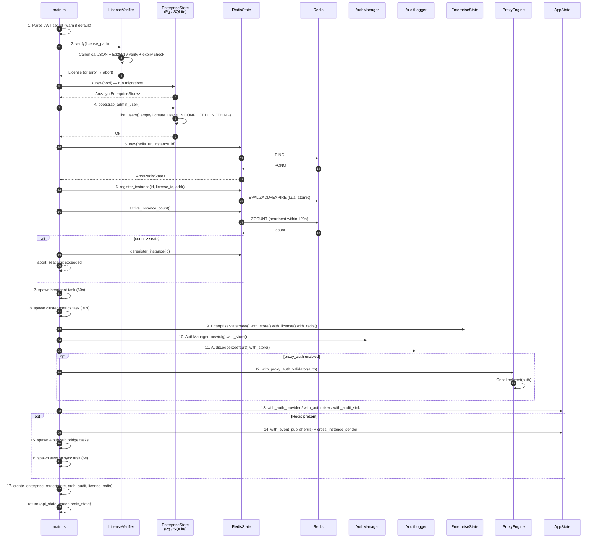
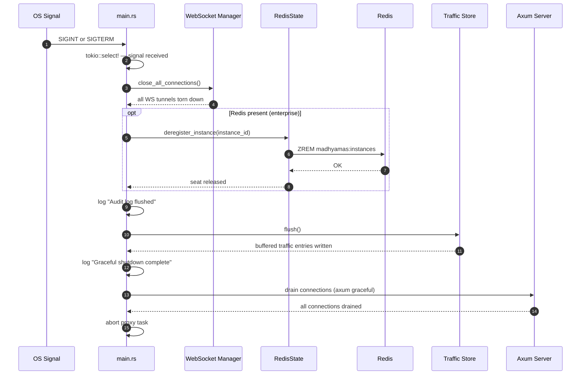

# Enterprise Startup Flow

> Part of: [Enterprise Analysis Overview](ENTERPRISE_OVERVIEW.md)

Last verified: 2025-01

This document describes the enterprise startup sequence executed by the main
`madhyamas` binary when compiled with the `enterprise` feature (the default).
The entire sequence lives inside a single `#[cfg(feature = "enterprise")]`
block in `crates/madhyamas/src/main.rs` (lines 1374–1819). In the OSS build
(`--no-default-features`) the block is compiled out — no enterprise code is
linked, and the binary starts in single-instance SQLite mode with no auth,
RBAC, audit, or Redis coordination.

---

## Table of Contents

1. [Overview](#1-overview)
2. [Step-by-Step Initialization](#2-step-by-step-initialization)
3. [Component Interaction Sequence](#3-component-interaction-sequence)
4. [Error Handling](#4-error-handling)
5. [Graceful Shutdown](#5-graceful-shutdown)
6. [CLI Flags Reference](#6-cli-flags-reference)

---

## 1. Overview

When built with the `enterprise` feature, `main.rs` enters a dedicated
initialization block after the core proxy engine and API state are
constructed. The block performs 17 ordered steps wiring up authentication,
licensing, persistent storage, Redis cross-instance coordination, and the
enterprise HTTP router. Any hard failure (license invalid, database
unreachable, seat limit exceeded) aborts startup with a descriptive error
before the API server binds its listening socket.

The block returns a triple — `(api_state, enterprise_router,
redis_state_for_shutdown)` — used by the rest of `main.rs` to merge
enterprise routes under `/api` and deregister the instance from Redis on
graceful shutdown.

### 1.1 Initialization flowchart

```mermaid
flowchart TD
    START([Binary launch<br/>enterprise feature]) --> S1["1. Parse JWT secret<br/>warn if default"]
    S1 --> S2["2. License verification<br/>Ed25519 + claims + expiry"]
    S2 --> S2A{License file<br/>provided?}
    S2A -->|Yes| S2B["Verify signature & expiry<br/>fail fast on invalid"]
    S2A -->|No| S2C["Unlicensed enterprise mode<br/>auth/RBAC/audit still work"]
    S2B --> S3
    S2C --> S3
    S3["3. Construct enterprise store<br/>PostgreSQL or SQLite"] --> S4["4. Bootstrap admin user<br/>ON CONFLICT DO NOTHING"]
    S4 --> S5{Redis URL<br/>provided?}
    S5 -->|Yes| S5A["5. Connect to Redis<br/>PING verify"]
    S5 -->|No| S5B["Single-instance mode<br/>multi-instance disabled"]
    S5A --> S6{License + Redis<br/>both present?}
    S5B --> S9
    S6 -->|Yes| S6A["6. Register instance<br/>Lua ZADD+EXPIRE<br/>check seat limit"]
    S6 -->|No| S9
    S6A --> S6B{Seats<br/>exceeded?}
    S6B -->|Yes| FAIL1([Fail fast:<br/>deregister + exit])
    S6B -->|No| S7["7. Start heartbeat task<br/>every 60s"]
    S7 --> S8["8. Start cluster metrics task<br/>every 30s"]
    S8 --> S9["9. Construct EnterpriseState<br/>store + license + redis"]
    S9 --> S10["10. Wire AuthManager<br/>with store"]
    S10 --> S11["11. Wire AuditLogger<br/>with store"]
    S11 --> S12{Proxy auth<br/>enabled?}
    S12 -->|Yes| S12A["12. Attach proxy auth validator<br/>OnceLock on ProxyEngine"]
    S12 -->|No| S13
    S12A --> S13["13. Inject traits into AppState<br/>AuthProvider/Authorizer/AuditSink"]
    S13 --> S14{Redis<br/>present?}
    S14 -->|Yes| S14A["14. Wire Redis event publisher<br/>+ cross-instance channel"]
    S14 -->|No| S15
    S14A --> S15["15. Start Redis pub/sub bridge tasks<br/>4 background tasks"]
    S15 --> S16["16. Start periodic session sync<br/>every 5s"]
    S16 --> S17["17. Create enterprise router<br/>merge with core /api"]
    S17 --> DONE([Startup complete<br/>bind API listener])
```

---

## 2. Step-by-Step Initialization

### Step 1 — Parse JWT secret

**Source:** `main.rs:1376–1387`

The JWT secret is read from `--jwt-secret` / `MADHYAMAS_JWT_SECRET`. When
neither is provided, the binary falls back to
`AuthConfig::default().jwt_secret` and emits a warning: `No --jwt-secret
provided; using default development secret. Set --jwt-secret or
MADHYAMAS_JWT_SECRET in production.` The secret is assembled into an
`AuthConfig` struct (`enabled` mirrors `--enable-auth`) reused by the
`AuthManager` in Step 10. The secret is never logged.

### Step 2 — License verification

**Source:** `main.rs:1388–1428`, `crates/madhyamas-enterprise/src/license.rs`

When `--license-file` is provided, a `LicenseVerifier` is constructed via
`from_env()`, which reads `MADHYAMAS_LICENSE_PUBLIC_KEY` (base64-encoded
32-byte Ed25519 public key). If the env var is absent, a compiled-in
**development** key is used and a warning is logged — production must set it.

The verification flow (`license.rs:206–266`): (1) read the license file from
disk, parse into `LicenseFile` (claims + detached base64 signature); (2)
re-serialize `LicenseClaims` to **canonical JSON** (object keys sorted
recursively, compact) via `canonical_json()`; (3) verify the Ed25519
signature over those canonical bytes using the embedded `VerifyingKey`;
(4) check `expires_at` is in the future; (5) **Phase 9.14:** when
`--instance-id` is provided, the license's `instance_id` must match (replay
prevention), else `LicenseError::InstanceMismatch`; (6) on success, return a
`License` tagged with the verification timestamp. On any failure
(`InvalidSignature`, `Expired`, `InstanceMismatch`, `NotFound`, `Parse`),
startup aborts with `license verification failed: {e}`. When
`--license-file` is **omitted**, the binary runs in **unlicensed enterprise
mode** — auth, RBAC, and audit still function, but seat-count enforcement and
feature gating are not applied.

### Step 3 — Construct enterprise store

**Source:** `main.rs:1429–1505`

A trait object `Arc<dyn EnterpriseStore>` is constructed based on
`--database-url`:

| Condition | Backend | Details |
|---|---|---|
| `postgres://` or `postgresql://` | `PostgresEnterpriseStore` | `PgPoolOptions` (`max_connections(5)`). Shares the traffic store DB. URL redacted in logs. |
| Other URL or no `--database-url` | `SqliteEnterpriseStore` | Separate `enterprise.db` alongside `traffic.db`. `create_if_missing(true)`. |

Both backends call `::new(pool).await` which runs schema migrations. A
connection or migration failure aborts startup.

### Step 4 — Bootstrap admin user

**Source:** `main.rs:1506–1512`, `bootstrap_admin_user()` at `main.rs:2157–2249`

On first run (empty users table), an admin user is created:

1. **Fast path:** `list_users()` — if users exist, return immediately.
2. **Username:** `--admin-username` / `MADHYAMAS_ADMIN_USERNAME`, default `admin`.
3. **Password:** `--admin-password` / `MADHYAMAS_ADMIN_PASSWORD`, or a random
   24-char password from `[A-Za-z0-9]` if not provided.
4. **Insert:** `create_user()` uses `ON CONFLICT (username) DO NOTHING`, so a
   racing instance inserting the same username is a no-op, not a crash.
5. **Post-insert lookup:** `get_user_by_username()` checks if this instance
   won the race (stored `id` matches): **won** → auto-generated password
   logged once with `CHANGE IMMEDIATELY` warning (provided password → only
   username logged); **lost** → logs admin already exists, no credentials
   logged; **not found** → logs warning, continues.

### Step 5 — Connect to Redis (optional)

**Source:** `main.rs:1513–1535`, `redis_state.rs:141–152`

A unique `instance_id` (`Uuid::new_v4()`) is generated. When `--redis-url` /
`MADHYAMAS_REDIS_URL` is provided, `RedisState::new()` opens a multiplexed
async connection and sends `PING` to verify connectivity. When the URL uses
`rediss://`, an info log confirms TLS is active. Accepted schemes: `redis://`
(TCP), `redis://:pass@` (TCP+auth), `rediss://` (TLS), `rediss://:pass@`
(TLS+auth). A connection failure aborts startup with `failed to connect to
Redis: {e}`. When `--redis-url` is omitted, the binary runs in
**single-instance mode**: `redis_state` is `None` and all multi-instance
features (pub/sub bridges, seat tracking, cluster metrics) are disabled.

### Step 6 — Register instance and check seat limits

**Source:** `main.rs:1536–1602`, `redis_state.rs:197–288`

When **both** a license and Redis state are present:

1. **Register:** `register_instance(instance_id, license_id, addr)` adds the
   instance to the Redis sorted set `madhyamas:instances` (member =
   JSON-encoded `InstanceInfo`, score = current Unix timestamp). Uses a
   **Lua script** (`ZADD_WITH_EXPIRE_SCRIPT`) for atomic `ZADD` + `EXPIRE`
   so a crash between them can't leave stale entries. Key TTL is 120s.
2. **Count:** `active_instance_count()` runs `ZCOUNT`, counting only members
   whose heartbeat is within 120s of now (stale instances excluded).
3. **Seat check:** if `active > license.claims.seats`, the instance is
   **deregistered** and startup fails fast:
   `license seat limit exceeded: {active} active instances, license allows {seats} seats`

### Step 7 — Start heartbeat task

**Source:** `main.rs:1561–1573`, `redis_state.rs:231–262`

A background tokio task calls `heartbeat(instance_id)` every **60 seconds**.
The heartbeat finds the instance's member in the sorted set, removes it, and
re-inserts it with an updated `last_heartbeat` timestamp via the same atomic
Lua `ZADD + EXPIRE` script, resetting the key TTL to 120s. Failures are
logged as warnings but do not crash the server. If heartbeats stop for >120s,
the instance is considered dead (the TTL expires its entry). The first
`interval.tick()` is awaited to skip the initial tick, so the first real
heartbeat fires 60s after startup.

### Step 8 — Start cluster metrics task

**Source:** `main.rs:1574–1601`, `redis_state.rs:345–381`

A background task runs every **30 seconds**, collecting a local
`MetricsCollector::snapshot()` and writing it to Redis via
`update_instance_metrics()`. The `InstanceMetrics` includes
`active_connections`, `request_count`, and `uptime_secs` (`cpu_usage` and
`memory_usage_mb` are `0` — not tracked locally yet). Read by
`/api/metrics/cluster` for cross-instance aggregation. Failures are logged
as warnings, not fatal.

### Step 9 — Construct EnterpriseState

**Source:** `main.rs:1603–1606`

`EnterpriseState::new(auth_config)` is chained with `.with_store()`,
`.with_license()`, and `.with_redis()`. It is the central holder for
enterprise configuration, exposing `rbac` and `license` used by subsequent
wiring steps.

### Step 10 — Wire AuthManager with store

**Source:** `main.rs:1607–1617`

An `AuthManager` is constructed with a fresh `AuthConfig` (`enabled` and
`require_auth` mirror `--enable-auth`, same JWT secret) and chained with
`.with_store(store.clone())`, enabling API key validation against the
persistent `api_keys` table and user lookups for JWT issuance.

### Step 11 — Wire AuditLogger with store

**Source:** `main.rs:1618–1620`

`AuditLogger::default().with_store(store.clone())` persists audit events to
the `audit_events` table with a hash chain for tamper-evidence.

### Step 12 — Attach proxy auth validator

**Source:** `main.rs:1621–1631`

When `--proxy-auth` / `MADHYAMAS_PROXY_AUTH` is enabled, the `AuthManager`
Arc is attached to the already-running `ProxyEngine` via
`with_proxy_auth_validator()`, setting a `OnceLock` that takes effect
immediately for all subsequent CONNECT/HTTP requests — no restart needed.
Unauthenticated proxy requests receive `407 Proxy Authentication Required`.
When off, the proxy remains open.

### Step 13 — Inject traits into AppState

**Source:** `main.rs:1632–1635`

The three enterprise trait impls are injected into the core `AppState`:
`.with_auth_provider(auth)` (AuthProvider), `.with_authorizer(enterprise.rbac)`
(Authorizer), and `.with_audit_sink(audit)` (AuditSink). This is the key
abstraction boundary: the API crate depends only on the traits, not concrete
enterprise types. The OSS build never calls these setters.

### Step 14 — Wire Redis event publisher

**Source:** `main.rs:1636–1650`

When Redis is present, two things are wired into `AppState`:

1. **Event publisher:** `with_event_publisher(rs.clone())` — `RedisState`
   implements the `EventPublisher` trait for cross-instance notifications.
2. **Cross-instance sender:** a separate `broadcast::channel(256)` of
   `TrafficEvent` attached via `with_cross_instance_sender()`. This channel
   receives events bridged **from** Redis (Step 15) and is distinct from the
   traffic store's local broadcast, preventing an infinite event loop. The
   WebSocket handler subscribes to both channels. When Redis is absent, this
   step is a no-op.

### Step 15 — Start Redis pub/sub bridge tasks

**Source:** `main.rs:1651–1810`

When Redis is present, **four** background tasks are spawned:

| Task | Direction | Channel | Behavior |
|---|---|---|---|
| **WS event publisher** | local → Redis | `madhyamas:events` | Subscribes to traffic store's local broadcast; wraps each event in `RedisTrafficEvent` (with `instance_id` for dedup) and publishes to Redis. |
| **WS event subscriber** | Redis → local | `madhyamas:events` | Subscribes to Redis; deserializes `RedisTrafficEvent`, skips own `instance_id`, sends to cross-instance broadcast channel. Reconnects after 2s. |
| **Config change subscriber** | Redis → local | `madhyamas:config` | Logs config change notifications. (Reload from shared store is future work.) Reconnects after 2s. |
| **Intercept rule subscriber** | Redis → local | `madhyamas:intercept` | On notification, reloads all intercept rules (mock, rewrite, breakpoint, throttle, block list) from shared store via `Persistable::load()`. Reconnects after 2s. |

All four tasks use `loop { ... }` with automatic reconnection (2s sleep
between attempts) so transient Redis outages don't break coordination.

### Step 16 — Start periodic session sync task

**Source:** `main.rs:1798–1809`

A background task runs every **5 seconds**, calling
`traffic_store.sync_current_session()` to check shared state for
current-session changes by other instances. Failures logged at `debug`
(best-effort).

### Step 17 — Create enterprise router and merge with core

**Source:** `main.rs:1811–1818`

`create_enterprise_router(store, auth, audit, license, redis_state)` builds
the axum router for enterprise endpoints (`/api/auth/*`, `/api/users`,
`/api/rbac/*`, `/api/audit/*`, `/api/metrics/*`, `/api/onboarding/*`),
returned as `Some(router)` and merged with the core API router by
`create_router()` (`main.rs:1835`). The `redis_state` is returned for the
shutdown handler. In the OSS build, `enterprise_router` is `None` and
`_redis_state_for_shutdown` is `Option<()>` (no-op).

---

## 3. Component Interaction Sequence

---

## 4. Error Handling

The enterprise block uses `?` propagation throughout — any `Err` aborts
`main()` before the API listener binds. This is a deliberate fail-fast
design: a misconfigured deployment should refuse to start rather than run
degraded.

### 4.1 Hard failures (abort startup)

| Failure point | Error message | Behavior |
|---|---|---|
| License verifier init | `license verifier init failed: {e}` | Aborts. `MADHYAMAS_LICENSE_PUBLIC_KEY` present but invalid. |
| License verification | `license verification failed: {e}` | Aborts. Covers `InvalidSignature`, `Expired`, `InstanceMismatch`, `NotFound`, `Parse`. |
| PostgreSQL connect | `failed to connect to PostgreSQL for enterprise: {e}` | Aborts. Network/credentials/DB not found. |
| Store init (Pg/SQLite) | `failed to initialize enterprise store: {e}` | Aborts. Schema migration failure. |
| SQLite open | `failed to open enterprise db: {e}` | Aborts. Disk full, permission denied, corrupt file. |
| Bootstrap admin user | `bootstrap: failed to {list/create/look up}: {e}` | Aborts. Store connectivity or schema issue. |
| Redis connect | `failed to connect to Redis: {e}` | Aborts. Wrong URL, network unreachable, AUTH failed. |
| Instance registration | `failed to register instance in Redis: {e}` | Aborts. Redis unavailable between PING and ZADD. |
| Active instance count | `failed to query active instance count: {e}` | Aborts. Redis read failure. |
| Seat limit exceeded | `license seat limit exceeded: {active} active, {seats} allowed` | Aborts. Instance deregistered first (best-effort). |

### 4.2 Soft failures (logged, do not crash)

| Failure point | Log level | Behavior |
|---|---|---|
| Heartbeat failure | `warn` | Retries next 60s tick. Instance expires from Redis after 120s. |
| Metrics update failure | `warn` | Retries next 30s tick. Cluster metrics show stale data. |
| Event publish failure | `warn` | Event lost; no retry. Other instances miss this event. |
| Subscribe stream end | `warn`/`debug` | Task reconnects after 2s. |
| Session sync failure | `debug` | Retries next 5s tick. |
| Deregister on shutdown | `warn` | Instance expires from Redis after 120s TTL. Seat released eventually. |

---

## 5. Graceful Shutdown

**Source:** `main.rs:1897–1964`

After the API server is bound, `main.rs` installs a graceful shutdown handler
via `axum::serve(...).with_graceful_shutdown(shutdown)`. The shutdown future
waits for **either** SIGINT (Ctrl+C) **or** SIGTERM (Unix signal), then
performs an ordered drain.

### 5.1 Shutdown sequence

### 5.2 Shutdown steps in detail

| Step | Action | Details |
|---|---|---|
| 1. Wait for signal | `tokio::select!` on SIGINT (`ctrl_c()`) + SIGTERM (`SignalKind::terminate()`) | Whichever fires first triggers the drain. |
| 2. Close WebSocket | `shutdown_ws.close_all_connections()` | Tears down in-flight proxy WS tunnels (clean close frame, not TCP reset). |
| 3. Deregister from Redis | `deregister_instance(instance_id)` (enterprise + Redis only) | Removes from `madhyamas:instances` sorted set; releases seat immediately. Failure logged as warning (TTL cleans up eventually). |
| 4. Flush audit log | Buffered audit entries flushed to persistent store | Logged for operational visibility. |
| 5. Flush traffic store | `traffic_store.flush()` | Writes buffered entries (write batcher, Phase 10b.1) so traffic isn't lost. |
| 6. Drain API server | axum graceful shutdown | Drains in-flight HTTP requests before closing listener. |
| 7. Abort proxy task | Abort proxy tokio task | Once API drain completes, proxy task is aborted. |

---

## 6. CLI Flags Reference

All enterprise-related CLI flags accept an equivalent environment variable.
Flags are declared `global = true` so they work with any subcommand.

| Flag | Env var | Default | Description |
|---|---|---|---|
| `--enable-auth` | `MADHYAMAS_ENABLE_AUTH` | `false` | Enable enterprise auth (JWT + API keys). No effect in OSS build. |
| `--jwt-secret` | `MADHYAMAS_JWT_SECRET` | *(dev default)* | JWT signing secret. Warning if default used. Never logged. |
| `--license-file` | `MADHYAMAS_LICENSE_FILE` | *(none)* | Path to Ed25519-signed license file. Omit for unlicensed mode. |
| `--instance-id` | `MADHYAMAS_INSTANCE_ID` | *(none)* | Expected instance ID for license replay prevention (Phase 9.14). |
| `--admin-username` | `MADHYAMAS_ADMIN_USERNAME` | `admin` | Bootstrap admin username (first run only). |
| `--admin-password` | `MADHYAMAS_ADMIN_PASSWORD` | *(auto-generated)* | Bootstrap admin password. If omitted, random 24-char password logged once. |
| `--database-url` | `MADHYAMAS_DATABASE_URL` | *(none → SQLite)* | `postgres://` → PostgreSQL for all stores. Omit → SQLite. |
| `--database-read-url` | `MADHYAMAS_DATABASE_READ_URL` | *(none)* | Read replica PostgreSQL URL. Reads route here; writes to `--database-url`. |
| `--database-url-file` | `MADHYAMAS_DATABASE_URL_FILE` | *(none)* | Path to file with DB URL (for secret managers). `--database-url` takes precedence. |
| `--redis-url` | `MADHYAMAS_REDIS_URL` | *(none)* | Redis URL for multi-instance coordination. `redis://` (TCP), `rediss://` (TLS). |
| `--redis-ca-cert` | `MADHYAMAS_REDIS_CA_CERT` | *(none)* | PEM CA cert for `rediss://` TLS verification. Omit → system CA store. |
| `--proxy-auth` | `MADHYAMAS_PROXY_AUTH` | `false` | Require auth for proxy CONNECT/HTTP. Unauthenticated → `407`. |
| `--ca-cert-file` | `MADHYAMAS_CA_CERT_FILE` | *(none)* | PEM CA cert file for HTTPS interception (shared CA for multi-instance). |
| `--ca-key-file` | `MADHYAMAS_CA_KEY_FILE` | *(none)* | PEM CA private key file. Paired with `--ca-cert-file`. |
| `--base-path` | `MADHYAMAS_BASE_PATH` | `/` | Base path for API + web UI (LB context-path routing). |
| `--api-key` | `MADHYAMAS_API_KEY` | *(none)* | API key for MCP/CLI auth. Sent as `X-API-Key`. Takes precedence over `--token`. |
| `--token` | `MADHYAMAS_TOKEN` | *(none)* | JWT token for MCP/CLI auth. Sent as `Authorization: Bearer <token>`. |

### 6.1 License public key (env var only)

| Env var | Description |
|---|---|
| `MADHYAMAS_LICENSE_PUBLIC_KEY` | Base64-encoded 32-byte Ed25519 public key for license verification. If absent, a compiled-in **development** key is used (warning logged). **Production must set this.** |

---

## See Also

- [Enterprise Analysis Overview](ENTERPRISE_OVERVIEW.md) — two-tier model, crate architecture
- [Enterprise Multi-Instance Deployment](ENTERPRISE_MULTI_INSTANCE.md) — LB routing, state sync, seat tracking
- [Enterprise Auth, RBAC, and IdP](ENTERPRISE_AUTH_RBAC.md) — auth modes, RBAC model
- [Enterprise Storage Traits](ENTERPRISE_STORAGE_TRAITS.md) — SQLite + PostgreSQL backends
- [Enterprise Licensing Server](ENTERPRISE_LICENSING_SERVER.md) — license issuance and signing
- [Enterprise Crate Migration](ENTERPRISE_CRATE_MIGRATION.md) — trait abstractions, `#[cfg]` gates
