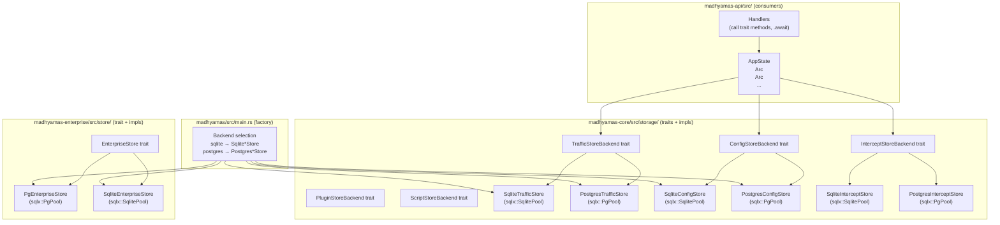
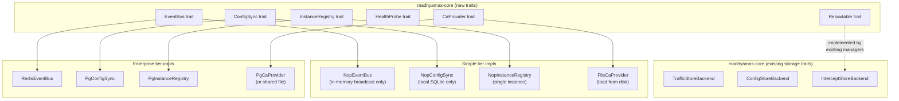
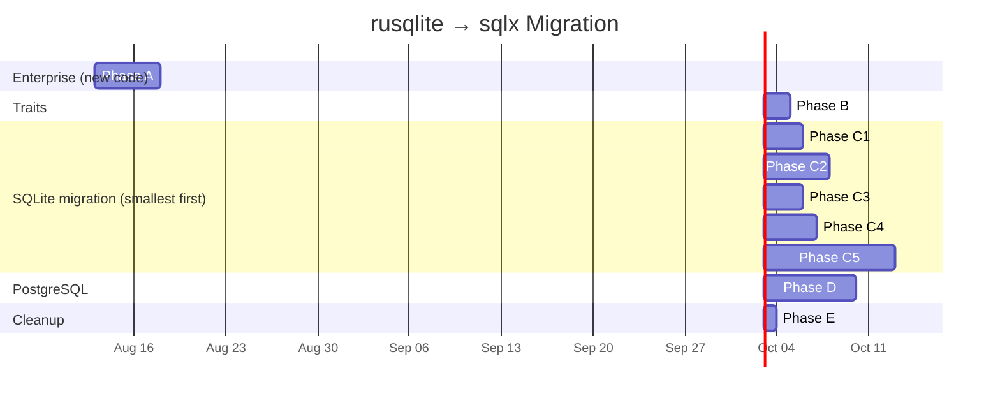

# Enterprise Storage Trait Design

This document is a sub-document of the enterprise analysis, extracted from
the main plan so that the storage trait design and migration approach can be
read and referenced independently. It is fully self-contained: all code
examples, diagrams, and tables needed to understand the design are included
here.

Part of: [Enterprise Analysis Overview](ENTERPRISE_OVERVIEW.md)

---

## 1. The shared storage trait problem

### 1.1 Why a shared trait is needed

The current plan has a gap: it says "existing stores continue using
`rusqlite`" and "enterprise crate uses `sqlx`" without addressing how
the two coexist or how enterprise can optionally use PostgreSQL for
core stores (traffic, config, intercept). A shared storage trait is
needed for three reasons:

1. **Backend swappability.** Enterprise customers may want PostgreSQL
   for all stores (traffic, config, intercept, users, audit) so that
   multiple proxy instances share a single database. Without a trait,
   each store is hardcoded to one backend.

2. **Code uniformity.** If the simple tier uses `rusqlite` (sync) and
   the enterprise tier uses `sqlx` (async) for the same logical store,
   there are two incompatible implementations of "traffic storage" in
   the codebase. A trait unifies them behind one interface.

3. **Testability.** A trait allows mocking stores in tests regardless
   of backend. Today, testing against SQLite is the only option; with
   a trait, tests can use an in-memory mock or either backend.

### 1.2 The sync/async obstacle

The biggest challenge is that the current stores are **synchronous**
(`rusqlite`), while `sqlx` is **asynchronous** (tokio-based). A shared
trait must pick one:

| Approach | Trait type | SQLite impl | PostgreSQL impl | Problem |
|---|---|---|---|---|
| A. Sync trait | `trait Store { fn get(...) -> Result }` | `rusqlite` (current) | `sqlx` via `block_on` | Blocking in async runtime — defeats purpose of async |
| B. Async trait, dual library | `#[async_trait] trait Store { async fn get(...) }` | `rusqlite` via `spawn_blocking` | `sqlx` (native async) | Two DB libraries in one binary; wrapping overhead |
| C. Async trait, sqlx only | `#[async_trait] trait Store { async fn get(...) }` | `sqlx::SqlitePool` | `sqlx::PgPool` | Requires migrating all stores from `rusqlite` to `sqlx` |

**Approach C is the correct choice.** It eliminates `rusqlite` entirely,
uses one DB library (`sqlx`) for both backends, and is fully
async-native. The migration effort is significant but mechanical, and
the result is a clean, uniform codebase.

### 1.3 Current rusqlite coupling (the migration scope)

An audit of `rusqlite` usage in `madhyamas-core`:

| File | rusqlite refs | Sync methods | Lines of code | Migration difficulty |
|---|---|---|---|---|
| `traffic/store.rs` | 35 | 41 `pub fn`, 0 `async` | ~1700 | Hard — largest, most complex, called from proxy engine |
| `persistence/intercept_store.rs` | 22 | 19 `pub fn` | ~600 | Medium |
| `scripting/persistence.rs` | 20 | ~15 `pub fn` | ~500 | Medium |
| `plugin/persistence.rs` | 13 | ~10 `pub fn` | ~350 | Medium |
| `persistence/config_store.rs` | 7 | 8 `pub fn` | ~220 | Easy — smallest, simplest |
| `session.rs` | 1 | delegates to TrafficStore | ~200 | Easy — thin wrapper |
| `scripting/runtime.rs` | 2 | indirect | ~400 | Easy — indirect usage |
| `lib.rs` | 3 | initialization | — | Easy — DB init code |
| **Total** | **103** | **~93** | **~3970** | — |

Additionally, the **proxy engine** (`proxy/engine.rs`) calls
`traffic_store.store_request()` and `store_response()` directly from
async context without `spawn_blocking` — 15+ call sites. All API
handlers call store methods synchronously. These callers must all be
updated to `await` the new async methods.

### 1.4 Proposed trait design

All storage traits are **async**, defined in `madhyamas-core`, and
implemented for both `sqlx::SqlitePool` and `sqlx::PgPool`.

```rust
// crates/madhyamas-core/src/storage/mod.rs (NEW module)

use async_trait::async_trait;
use crate::traffic::{TrafficEntry, TrafficFilter, HttpResponse, TimingInfo, Session};
use crate::Result;

/// Traffic store backend — implemented for SQLite and PostgreSQL.
///
/// This trait replaces the concrete `TrafficStore` struct. All methods
/// are async. The in-memory state (capture_enabled, max_entries, etc.)
/// lives in the implementing struct, not in the trait.
#[async_trait]
pub trait TrafficStoreBackend: Send + Sync {
    // --- Storage ---

    /// Store a request. Returns the assigned entry ID.
    async fn store_request(&self, entry: &TrafficEntry) -> Result<()>;

    /// Store a response for an existing request entry.
    async fn store_response(
        &self,
        id: &str,
        response: &HttpResponse,
        timing: &TimingInfo,
    ) -> Result<()>;

    // --- Retrieval ---

    /// Get a single traffic entry by ID.
    async fn get_by_id(&self, id: &str) -> Result<Option<TrafficEntry>>;

    /// List traffic entries matching a filter.
    async fn get_traffic(&self, filter: &TrafficFilter) -> Result<Vec<TrafficEntry>>;

    /// Count total entries.
    async fn count(&self) -> Result<usize>;

    /// Get capture statistics.
    async fn get_capture_stats(&self) -> Result<CaptureStats>;

    // --- Mutation ---

    /// Clear all traffic entries.
    async fn clear_traffic(&self) -> Result<()>;

    /// Delete specific entries by ID.
    async fn delete_traffic(&self, ids: &[String]) -> Result<()>;

    // --- Sessions ---

    async fn list_sessions(&self) -> Result<Vec<Session>>;
    async fn create_session(&self, name: Option<&str>) -> Result<Session>;
    async fn switch_session(&self, session_id: &str) -> Result<()>;
    async fn delete_session(&self, session_id: &str) -> Result<()>;
    async fn get_traffic_by_session(&self, session_id: &str) -> Result<Vec<TrafficEntry>>;
    async fn current_session_id(&self) -> String;

    // --- Export/Import ---

    async fn export_har(&self, session_id: &str) -> Result<serde_json::Value>;
    async fn import_har(&self, har: serde_json::Value, session_name: Option<&str>) -> Result<ImportResult>;

    // --- Focus hosts ---

    async fn add_focus_host(&self, pattern: &str) -> Result<FocusHost>;
    async fn remove_focus_host(&self, id: &str) -> Result<bool>;
    async fn list_focus_hosts(&self) -> Result<Vec<FocusHost>>;

    // --- Events ---

    /// Subscribe to real-time traffic events (for WebSocket updates).
    fn subscribe(&self) -> tokio::sync::broadcast::Receiver<TrafficEvent>;

    // --- Configuration (in-memory, not DB-backed) ---

    fn is_capture_enabled(&self) -> bool;
    fn set_capture_enabled(&self, enabled: bool);
    fn max_body_size(&self) -> usize;
    fn set_max_body_size(&self, max: usize);
    fn max_entries(&self) -> usize;
    fn set_max_entries(&self, max: usize);
    // ... other in-memory config getters/setters
}
```

Similarly for other stores:

```rust
/// Configuration store backend.
#[async_trait]
pub trait ConfigStoreBackend: Send + Sync {
    async fn get<T: for<'de> Deserialize<'de> + Send>(&self, key: &str) -> Result<Option<T>>;
    async fn set<T: Serialize + Send + Sync>(&self, key: &str, value: &T) -> Result<()>;
    async fn delete(&self, key: &str) -> Result<bool>;
    async fn load_config(&self) -> Result<PersistedConfig>;
    async fn save_config(&self, config: &PersistedConfig) -> Result<()>;
    async fn export(&self) -> Result<String>;
    async fn import(&self, json: &str) -> Result<()>;
}

/// Intercept rules store backend (mocks, rewrites, breakpoints, throttle, blocklist).
#[async_trait]
pub trait InterceptStoreBackend: Send + Sync {
    async fn save_mock_rule(&self, rule: &MockRule) -> Result<()>;
    async fn load_mock_rules(&self) -> Result<Vec<MockRule>>;
    async fn delete_mock_rule(&self, id: &str) -> Result<bool>;
    async fn increment_mock_hit_count(&self, id: &str) -> Result<()>;
    // ... rewrite, breakpoint, throttle, blocklist methods
}

/// Plugin registry store backend.
#[async_trait]
pub trait PluginStoreBackend: Send + Sync {
    async fn save_plugin(&self, plugin: &PluginRecord) -> Result<()>;
    async fn load_plugins(&self) -> Result<Vec<PluginRecord>>;
    async fn delete_plugin(&self, id: &str) -> Result<bool>;
}

/// Script store backend.
#[async_trait]
pub trait ScriptStoreBackend: Send + Sync {
    async fn save_script(&self, script: &ScriptRecord) -> Result<()>;
    async fn load_scripts(&self) -> Result<Vec<ScriptRecord>>;
    async fn delete_script(&self, id: &str) -> Result<bool>;
}
```

### 1.5 Dual backend implementation pattern

Each trait has two implementations. They share query logic through a
generic `sqlx::Pool` abstraction where possible, and use separate query
strings where SQL dialects differ.

```rust
// crates/madhyamas-core/src/storage/sqlite/traffic.rs

use sqlx::sqlite::SqlitePool;
use async_trait::async_trait;

pub struct SqliteTrafficStore {
    pool: SqlitePool,
    // In-memory state (not DB-backed)
    capture_enabled: std::sync::atomic::AtomicBool,
    current_session_id: tokio::sync::Mutex<String>,
    max_entries: std::sync::atomic::AtomicUsize,
    max_body_size: std::sync::atomic::AtomicUsize,
    // ... other in-memory config
    event_sender: tokio::sync::broadcast::Sender<TrafficEvent>,
}

#[async_trait]
impl TrafficStoreBackend for SqliteTrafficStore {
    async fn store_request(&self, entry: &TrafficEntry) -> Result<()> {
        // SQLite-specific SQL (TEXT for UUID, INTEGER for timestamps)
        sqlx::query(
            "INSERT INTO traffic_entries
             (id, session_id, method, url, host, path, headers, body,
              request_at, status, duration_ms)
             VALUES (?, ?, ?, ?, ?, ?, ?, ?, ?, ?, ?)"
        )
            .bind(&entry.id)
            .bind(&entry.session_id)
            .bind(&entry.request.method)
            .bind(&entry.request.url)
            // ... bind all fields
            .execute(&self.pool)
            .await
            .map_err(|e| Error::Database(e.to_string()))?;

        // Emit event for WebSocket subscribers
        let _ = self.event_sender.send(TrafficEvent::EntryStored(entry.id.clone()));
        Ok(())
    }

    async fn get_by_id(&self, id: &str) -> Result<Option<TrafficEntry>> {
        let row = sqlx::query_as::<_, TrafficRow>(
            "SELECT * FROM traffic_entries WHERE id = ?"
        )
            .bind(id)
            .fetch_optional(&self.pool)
            .await
            .map_err(|e| Error::Database(e.to_string()))?;

        Ok(row.map(TrafficEntry::from))
    }

    // ... all other methods
}
```

```rust
// crates/madhyamas-core/src/storage/postgres/traffic.rs

use sqlx::postgres::PgPool;
use async_trait::async_trait;

pub struct PostgresTrafficStore {
    pool: PgPool,
    // Same in-memory state as SqliteTrafficStore
    capture_enabled: std::sync::atomic::AtomicBool,
    current_session_id: tokio::sync::Mutex<String>,
    max_entries: std::sync::atomic::AtomicUsize,
    max_body_size: std::sync::atomic::AtomicUsize,
    event_sender: tokio::sync::broadcast::Sender<TrafficEvent>,
}

#[async_trait]
impl TrafficStoreBackend for PostgresTrafficStore {
    async fn store_request(&self, entry: &TrafficEntry) -> Result<()> {
        // PostgreSQL-specific SQL (UUID type, TIMESTAMPTZ, JSONB)
        sqlx::query(
            "INSERT INTO traffic_entries
             (id, session_id, method, url, host, path, headers, body,
              request_at, status, duration_ms)
             VALUES ($1, $2, $3, $4, $5, $6, $7, $8, $9, $10, $11)"
        )
            .bind(uuid::Uuid::parse_str(&entry.id).unwrap_or_default())
            .bind(uuid::Uuid::parse_str(&entry.session_id).unwrap_or_default())
            .bind(&entry.request.method)
            .bind(&entry.request.url)
            // ... bind all fields (JSONB for headers, TIMESTAMPTZ for timestamps)
            .execute(&self.pool)
            .await
            .map_err(|e| Error::Database(e.to_string()))?;

        let _ = self.event_sender.send(TrafficEvent::EntryStored(entry.id.clone()));
        Ok(())
    }

    async fn get_by_id(&self, id: &str) -> Result<Option<TrafficEntry>> {
        let uuid = uuid::Uuid::parse_str(id)
            .map_err(|e| Error::Config(format!("invalid UUID: {}", e)))?;

        let row = sqlx::query_as::<_, TrafficRow>(
            "SELECT * FROM traffic_entries WHERE id = $1"
        )
            .bind(uuid)
            .fetch_optional(&self.pool)
            .await
            .map_err(|e| Error::Database(e.to_string()))?;

        Ok(row.map(TrafficEntry::from))
    }

    // ... all other methods
}
```

### 1.6 Reducing duplication between backends

The SQLite and PostgreSQL implementations share most logic but differ
in SQL syntax (placeholders `?` vs `$1`, type binding, JSON handling).
Three strategies to reduce duplication:

**Strategy 1: Shared query module with format helpers (recommended)**

```rust
// crates/madhyamas-core/src/storage/queries.rs

/// Generate a SELECT query with the correct placeholder style.
pub fn select_by_id(table: &str, backend: Backend) -> String {
    match backend {
        Backend::Sqlite => format!("SELECT * FROM {} WHERE id = ?", table),
        Backend::Postgres => format!("SELECT * FROM {} WHERE id = $1", table),
    }
}

/// Generate an INSERT query with N placeholders.
pub fn insert(table: &str, columns: &[&str], backend: Backend) -> String {
    let placeholders: Vec<String> = match backend {
        Backend::Sqlite => (0..columns.len()).map(|_| "?".to_string()).collect(),
        Backend::Postgres => (1..=columns.len()).map(|i| format!("${}", i)).collect(),
    };
    format!(
        "INSERT INTO {} ({}) VALUES ({})",
        table,
        columns.join(", "),
        placeholders.join(", ")
    )
}
```

**Strategy 2: `sqlx::Any` driver (not recommended)**

`sqlx` has an `Any` driver that abstracts over backends, but it has
limitations: no JSONB support, no UUID type, fewer features. It adds
complexity without full backend parity. Avoid.

**Strategy 3: Macro-generated queries (future optimization)**

A macro could generate both SQLite and PostgreSQL query strings from a
single declaration. This is elegant but adds macro complexity. Defer
unless duplication becomes burdensome.

**Recommendation:** Start with Strategy 1 (shared query helpers).
Each backend's implementation file calls the same helper functions to
generate SQL, then binds parameters and executes via its own pool type.
The duplication is in the `sqlx::query()` call and parameter binding,
which is unavoidable due to different type systems (TEXT vs UUID,
INTEGER vs TIMESTAMPTZ).

### 1.7 Where the traits live

```
crates/madhyamas-core/src/
├── storage/                  # NEW: storage traits + implementations
│   ├── mod.rs                # TrafficStoreBackend, ConfigStoreBackend,
│   │                         # InterceptStoreBackend, PluginStoreBackend,
│   │                         # ScriptStoreBackend traits
│   ├── queries.rs            # Shared query helpers (placeholder generation)
│   ├── sqlite/               # SQLite implementations (sqlx::SqlitePool)
│   │   ├── mod.rs
│   │   ├── traffic.rs        # SqliteTrafficStore
│   │   ├── config.rs         # SqliteConfigStore
│   │   ├── intercept.rs      # SqliteInterceptStore
│   │   ├── plugin.rs         # SqlitePluginStore
│   │   └── script.rs         # SqliteScriptStore
│   └── postgres/             # PostgreSQL implementations (sqlx::PgPool)
│       ├── mod.rs
│       ├── traffic.rs        # PostgresTrafficStore
│       ├── config.rs         # PostgresConfigStore
│       ├── intercept.rs      # PostgresInterceptStore
│       ├── plugin.rs         # PostgresPluginStore
│       └── script.rs         # PostgresScriptStore
├── traffic/                  # Types only (TrafficEntry, TrafficFilter, etc.)
│   ├── types.rs              # No rusqlite imports — pure data types
│   └── events.rs             # TrafficEvent, broadcast channel
├── persistence/              # DEPRECATED — removed after migration
│   ├── config_store.rs       # → storage/sqlite/config.rs + storage/postgres/config.rs
│   └── intercept_store.rs    # → storage/sqlite/intercept.rs + storage/postgres/intercept.rs
└── ...
```

The traits live in `madhyamas-core/src/storage/mod.rs` — not in a
separate crate. They are core abstractions, not enterprise-specific.
Both the simple and enterprise tiers use them.

### 1.8 AppState changes for trait-based stores

`AppState` currently holds `Arc<TrafficStore>` (concrete type). It
changes to `Arc<dyn TrafficStoreBackend>` (trait object):

```rust
// crates/madhyamas-api/src/lib.rs (PROPOSED)

pub struct AppState {
    pub traffic_store: Arc<dyn TrafficStoreBackend>,
    pub config_store: Option<Arc<dyn ConfigStoreBackend>>,
    pub intercept_store: Option<Arc<dyn InterceptStoreBackend>>,
    // ... other fields unchanged
}
```

The main binary constructs the appropriate backend at startup:

```rust
// crates/madhyamas/src/main.rs

let traffic_store: Arc<dyn TrafficStoreBackend> = match db_config.backend {
    Backend::Sqlite => {
        let pool = sqlx::SqlitePool::connect(&db_config.url).await?;
        Arc::new(SqliteTrafficStore::new(pool).await?)
    }
    Backend::Postgres => {
        let pool = sqlx::PgPool::connect(&db_config.url).await?;
        Arc::new(PostgresTrafficStore::new(pool).await?)
    }
};

let api_state = AppState::new(traffic_store)
    .with_config_store(config_store)
    .with_intercept_store(intercept_store);
```

### 1.9 Caller migration: sync to async

All callers of store methods must be updated from sync to async. This
is the most widespread change:

**Proxy engine** (`proxy/engine.rs`):
```rust
// BEFORE (sync call from async context):
let _ = self.traffic_store.store_request(&entry);

// AFTER (async call):
let _ = self.traffic_store.store_request(&entry).await;
```

**API handlers** (`handlers.rs`):
```rust
// BEFORE:
match state.traffic_store.get_traffic(&filter) {
    Ok(entries) => Json(entries),
    Err(e) => (StatusCode::INTERNAL_SERVER_ERROR, e.to_string()).into_response(),
}

// AFTER:
match state.traffic_store.get_traffic(&filter).await {
    Ok(entries) => Json(entries).into_response(),
    Err(e) => (StatusCode::INTERNAL_SERVER_ERROR, e.to_string()).into_response(),
}
```

**SessionManager** (`session.rs`):
```rust
// BEFORE:
pub fn list_sessions(&self) -> Result<Vec<Session>> {
    self.traffic_store.list_sessions()
}

// AFTER:
pub async fn list_sessions(&self) -> Result<Vec<Session>> {
    self.traffic_store.list_sessions().await
}
```

The proxy engine is already async (74 `.await` calls), so adding
`.await` to store calls is natural. The API handlers are async axum
handlers, so they can `.await` directly. The migration is mechanical
but touches many files.

### 1.10 Enterprise store trait (separate from core traits)

The enterprise store (users, API keys, auth sessions, audit events)
has its own trait, separate from the core storage traits. This trait
lives in the enterprise crate:

```rust
// crates/madhyamas-enterprise/src/store/mod.rs

#[async_trait]
pub trait EnterpriseStore: Send + Sync {
    // Users
    async fn create_user(&self, user: &User) -> Result<()>;
    async fn get_user(&self, id: &str) -> Result<Option<User>>;
    async fn get_user_by_username(&self, username: &str) -> Result<Option<User>>;
    async fn list_users(&self) -> Result<Vec<User>>;
    async fn update_user(&self, id: &str, updates: &UserUpdate) -> Result<()>;
    async fn delete_user(&self, id: &str) -> Result<()>;

    // API keys
    async fn create_api_key(&self, key: &ApiKeyRecord) -> Result<()>;
    async fn get_api_key_by_hash(&self, hash: &str) -> Result<Option<ApiKeyRecord>>;
    async fn list_api_keys(&self, user_id: &str) -> Result<Vec<ApiKeyRecord>>;
    async fn revoke_api_key(&self, id: &str) -> Result<()>;
    async fn update_api_key_last_used(&self, id: &str) -> Result<()>;

    // Auth sessions
    async fn create_session(&self, session: &AuthSession) -> Result<()>;
    async fn get_session(&self, id: &str) -> Result<Option<AuthSession>>;
    async fn revoke_session(&self, id: &str) -> Result<()>;
    async fn cleanup_expired_sessions(&self) -> Result<()>;

    // Audit
    async fn log_audit_event(&self, event: &AuditEvent) -> Result<()>;
    async fn query_audit_events(&self, filter: &AuditFilter) -> Result<Vec<AuditEvent>>;
    async fn get_audit_stats(&self) -> Result<AuditStats>;
    async fn clear_audit_events(&self) -> Result<()>;
}
```

Implemented by `PgEnterpriseStore` (using `sqlx::PgPool`) and
`SqliteEnterpriseStore` (using `sqlx::SqlitePool`). Same pattern as
the core traits — the enterprise store is new code, so it starts
async with sqlx from day one.

### 1.11 Complete trait hierarchy



---

## 2. Multi-instance traits (beyond storage)

The [multi-instance deployment design](ENTERPRISE_MULTI_INSTANCE.md)
introduces requirements that go **beyond storage backends**. When
multiple proxy instances share a PostgreSQL database and coordinate
via Redis Pub/Sub, the core crate needs new traits for:

1. **Event bus** — cross-instance pub/sub for traffic events, config
   changes, breakpoint notifications
2. **Config sync** — atomic config propagation with periodic
   reconciliation
3. **Instance registry** — tracking which instances are alive, heartbeats
4. **Health checks** — dependency-aware readiness/liveness probes
5. **CA provider** — shared CA certificate loading (file, PostgreSQL, or
   in-memory)
6. **Reloadable intercept handlers** — handlers that can reload their
   rules from the store when notified of changes

These traits live in `madhyamas-core` (not `madhyamas-enterprise`)
because the simple tier can optionally use them too (e.g., a single
instance with Redis for event persistence, or a file-based CA
provider that's swappable for a PostgreSQL-backed one).

### 2.1 Trait map



### 2.2 EventBus trait

The `EventBus` trait abstracts cross-instance event propagation. The
simple tier uses a no-op implementation (in-memory `broadcast` only);
the enterprise tier uses Redis Pub/Sub.

```rust
// crates/madhyamas-core/src/event_bus.rs

use crate::traffic::events::TrafficEvent;
use async_trait::async_trait;
use serde::{Deserialize, Serialize};
use tokio::sync::broadcast;

/// Events that can be propagated across instances.
#[derive(Debug, Clone, Serialize, Deserialize)]
pub enum ClusterEvent {
    /// A new traffic entry was captured by an instance.
    TrafficEvent {
        instance_id: String,
        event: TrafficEvent,
    },
    /// A config value was changed. Subscribers should reload from
    /// the store (the event is a notification, not the data itself).
    ConfigChanged {
        instance_id: String,
        key: String,
    },
    /// An intercept rule was added/modified/deleted.
    InterceptRulesChanged {
        instance_id: String,
        rule_type: InterceptRuleType,
    },
    /// A breakpoint was hit (request is paused on the originating instance).
    BreakpointHit {
        instance_id: String,
        request_id: String,
    },
    /// A breakpoint was resumed/released.
    BreakpointResumed {
        instance_id: String,
        request_id: String,
    },
    /// A session was created, switched, or deleted.
    SessionChanged {
        instance_id: String,
        session_id: String,
        action: SessionAction,
    },
    /// The CA certificate was rotated.
    CaRotated {
        instance_id: String,
    },
    /// An instance started or stopped.
    InstanceLifecycle {
        instance_id: String,
        status: InstanceStatus,
    },
}

#[derive(Debug, Clone, Serialize, Deserialize)]
pub enum InterceptRuleType {
    BlockList,
    Rewrite,
    Mock,
    Breakpoint,
    Throttle,
}

#[derive(Debug, Clone, Serialize, Deserialize)]
pub enum SessionAction {
    Created,
    Switched,
    Deleted,
}

#[derive(Debug, Clone, Serialize, Deserialize)]
pub enum InstanceStatus {
    Started,
    Stopping,
    Stopped,
}

/// Cross-instance event bus.
///
/// The simple tier uses `NopEventBus` (events stay local — the
/// in-memory `broadcast` channel is the only subscriber). The
/// enterprise tier uses `RedisEventBus` which bridges local events
/// to Redis Pub/Sub and forwards remote events back to local
/// subscribers.
#[async_trait]
pub trait EventBus: Send + Sync {
    /// Publish an event to all instances (including self).
    async fn publish(&self, event: ClusterEvent) -> Result<()>;

    /// Subscribe to events from all instances.
    /// Returns a receiver that yields events as they arrive.
    async fn subscribe(&self) -> Result<broadcast::Receiver<ClusterEvent>>;

    /// Local instance ID (UUID). Used for event deduplication.
    fn instance_id(&self) -> &str;
}
```

#### Simple tier: NopEventBus

```rust
// crates/madhyamas-core/src/event_bus.rs

pub struct NopEventBus {
    instance_id: String,
    sender: broadcast::Sender<ClusterEvent>,
}

impl NopEventBus {
    pub fn new() -> Self {
        let (sender, _) = broadcast::channel(256);
        Self {
            instance_id: uuid::Uuid::new_v4().to_string(),
            sender,
        }
    }
}

#[async_trait]
impl EventBus for NopEventBus {
    async fn publish(&self, event: ClusterEvent) -> Result<()> {
        // Local broadcast only — no cross-instance propagation
        let _ = self.sender.send(event);
        Ok(())
    }

    async fn subscribe(&self) -> Result<broadcast::Receiver<ClusterEvent>> {
        Ok(self.sender.subscribe())
    }

    fn instance_id(&self) -> &str {
        &self.instance_id
    }
}
```

#### Enterprise tier: RedisEventBus

```rust
// crates/madhyamas-enterprise/src/event_bus.rs

pub struct RedisEventBus {
    instance_id: String,
    redis: redis::aio::ConnectionManager,
    local_sender: broadcast::Sender<ClusterEvent>,
}

impl RedisEventBus {
    pub async fn new(redis_url: &str) -> Result<Self> {
        let manager = redis::aio::ConnectionManager::new(redis_url).await?;
        let (local_sender, _) = broadcast::channel(256);
        Ok(Self {
            instance_id: uuid::Uuid::new_v4().to_string(),
            redis: manager,
            local_sender,
        })
    }

    /// Start the Redis → local bridge (runs in background).
    pub async fn start_bridge(&self) -> Result<()> {
        let mut pubsub = self.redis.clone();
        pubsub.subscribe("madhyamas:events").await?;

        let local_sender = self.local_sender.clone();
        tokio::spawn(async move {
            let mut stream = pubsub.on_message();
            while let Some(msg) = stream.next().await {
                if let Ok(event) = serde_json::from_str::<ClusterEvent>(&msg) {
                    let _ = local_sender.send(event);
                }
            }
        });
        Ok(())
    }
}

#[async_trait]
impl EventBus for RedisEventBus {
    async fn publish(&self, event: ClusterEvent) -> Result<()> {
        // Publish to Redis (other instances receive via bridge)
        let json = serde_json::to_string(&event)?;
        let mut conn = self.redis.clone();
        let _: () = redis::cmd("PUBLISH")
            .arg("madhyamas:events")
            .arg(json)
            .query_async(&mut conn)
            .await?;

        // Also deliver locally (so local subscribers get it immediately)
        let _ = self.local_sender.send(event);
        Ok(())
    }

    async fn subscribe(&self) -> Result<broadcast::Receiver<ClusterEvent>> {
        Ok(self.local_sender.subscribe())
    }

    fn instance_id(&self) -> &str {
        &self.instance_id
    }
}
```

### 2.3 ConfigSync trait

The `ConfigSync` trait abstracts atomic config propagation. It wraps
the `ConfigStoreBackend` trait (from Section 1.4) with cross-instance
notification and periodic reconciliation.

```rust
// crates/madhyamas-core/src/config/sync.rs

use async_trait::async_trait;
use std::sync::Arc;
use tokio::sync::watch;

/// Synchronized configuration that propagates changes across instances.
///
/// The simple tier uses `NopConfigSync` (writes to local store, no
/// notification). The enterprise tier uses `PgConfigSync` (writes to
/// PostgreSQL, publishes notification via EventBus, reloads on
/// notification, reconciles every 30s).
#[async_trait]
pub trait ConfigSync: Send + Sync {
    /// Update a config key atomically and notify other instances.
    async fn set(&self, key: &str, value: &serde_json::Value) -> Result<()>;

    /// Get the current config value for a key.
    async fn get(&self, key: &str) -> Result<Option<serde_json::Value>>;

    /// Get a watch channel for live config updates.
    /// Receivers are notified whenever any config key changes.
    fn watch(&self) -> watch::Receiver<Arc<serde_json::Value>>;

    /// Trigger a manual reload from the backing store.
    async fn reload(&self) -> Result<()>;

    /// Start the periodic reconciliation loop (runs in background).
    /// Compares local config hash against store; reloads if drifted.
    async fn start_reconciliation(&self) -> Result<()>;
}
```

#### Simple tier: NopConfigSync

```rust
pub struct NopConfigSync {
    store: Arc<dyn ConfigStoreBackend>,
    current: watch::Sender<Arc<serde_json::Value>>,
}

#[async_trait]
impl ConfigSync for NopConfigSync {
    async fn set(&self, key: &str, value: &serde_json::Value) -> Result<()> {
        // Write to local store; no notification needed (single instance)
        self.store.set(key, value).await?;
        self.reload().await?;
        Ok(())
    }

    async fn get(&self, key: &str) -> Result<Option<serde_json::Value>> {
        self.store.get(key).await
    }

    fn watch(&self) -> watch::Receiver<Arc<serde_json::Value>> {
        self.current.subscribe()
    }

    async fn reload(&self) -> Result<()> {
        let config = self.store.load_config().await?;
        let json = serde_json::to_value(&config)?;
        let _ = self.current.send(Arc::new(json));
        Ok(())
    }

    async fn start_reconciliation(&self) -> Result<()> {
        // No-op for single instance — no drift possible
        Ok(())
    }
}
```

#### Enterprise tier: PgConfigSync

```rust
// crates/madhyamas-enterprise/src/config/sync.rs

pub struct PgConfigSync {
    store: Arc<dyn ConfigStoreBackend>,
    event_bus: Arc<dyn EventBus>,
    current: watch::Sender<Arc<serde_json::Value>>,
    reconcile_interval: Duration,
}

#[async_trait]
impl ConfigSync for PgConfigSync {
    async fn set(&self, key: &str, value: &serde_json::Value) -> Result<()> {
        // 1. Write to PostgreSQL (atomic)
        self.store.set(key, value).await?;

        // 2. Reload local state from store
        self.reload().await?;

        // 3. Notify other instances via event bus
        self.event_bus.publish(ClusterEvent::ConfigChanged {
            instance_id: self.event_bus.instance_id().to_string(),
            key: key.to_string(),
        }).await?;

        Ok(())
    }

    async fn reload(&self) -> Result<()> {
        let config = self.store.load_config().await?;
        let json = serde_json::to_value(&config)?;
        let _ = self.current.send(Arc::new(json));
        Ok(())
    }

    async fn start_reconciliation(&self) -> Result<()> {
        let store = self.store.clone();
        let current = self.current.clone();
        let interval = self.reconcile_interval;

        tokio::spawn(async move {
            let mut ticker = tokio::time::interval(interval);
            loop {
                ticker.tick().await;
                if let Ok(config) = store.load_config().await {
                    if let Ok(json) = serde_json::to_value(&config) {
                        let _ = current.send(Arc::new(json));
                    }
                }
            }
        });
        Ok(())
    }

    // get() and watch() same as NopConfigSync
}
```

### 2.4 InstanceRegistry trait

Tracks which instances are alive in the cluster. Used for admin
dashboard, license seat counting, and graceful shutdown coordination.

```rust
// crates/madhyamas-core/src/cluster/registry.rs

use async_trait::async_trait;
use serde::{Deserialize, Serialize};

#[derive(Debug, Clone, Serialize, Deserialize)]
pub struct InstanceInfo {
    pub instance_id: String,
    pub hostname: String,
    pub version: String,
    pub started_at: chrono::DateTime<chrono::Utc>,
    pub last_heartbeat: chrono::DateTime<chrono::Utc>,
    pub status: InstanceStatus,
    pub active_connections: u64,
    pub proxy_port: u16,
    pub api_port: u16,
}

/// Registry of active instances in the cluster.
///
/// Simple tier: `NopInstanceRegistry` (always reports one instance —
/// self). Enterprise tier: `PgInstanceRegistry` (backed by PostgreSQL
/// `active_instances` table with heartbeat + expiry).
#[async_trait]
pub trait InstanceRegistry: Send + Sync {
    /// Register this instance on startup.
    async fn register(&self, info: &InstanceInfo) -> Result<()>;

    /// Send a heartbeat (updates last_heartbeat_at).
    async fn heartbeat(&self) -> Result<()>;

    /// Deregister this instance on shutdown.
    async fn deregister(&self) -> Result<()>;

    /// List all active instances (non-expired heartbeats).
    async fn list_instances(&self) -> Result<Vec<InstanceInfo>>;

    /// Get this instance's ID.
    fn instance_id(&self) -> &str;

    /// Start the heartbeat loop (runs in background, sends every 10s).
    async fn start_heartbeat(&self) -> Result<()>;

    /// Start the cleanup loop (runs in background, removes expired
    /// instances every 30s).
    async fn start_cleanup(&self) -> Result<()>;
}
```

### 2.5 HealthProbe trait

Separates liveness (process alive) from readiness (can serve
requests — DB connected, Redis connected, license valid).

```rust
// crates/madhyamas-core/src/cluster/health.rs

use async_trait::async_trait;
use serde::Serialize;

#[derive(Debug, Clone, Serialize)]
pub struct HealthStatus {
    pub status: HealthState,
    pub checks: Vec<HealthCheck>,
    pub instance_id: String,
    pub version: String,
    pub uptime_secs: u64,
}

#[derive(Debug, Clone, Serialize)]
pub enum HealthState {
    Healthy,
    Degraded,
    Unhealthy,
}

#[derive(Debug, Clone, Serialize)]
pub struct HealthCheck {
    pub name: String,
    pub status: HealthState,
    pub message: String,
    pub latency_ms: u64,
}

/// Health probe — checks dependency connectivity.
///
/// Simple tier: `LocalHealthProbe` (checks SQLite file exists, no
/// external deps). Enterprise tier: `ClusterHealthProbe` (checks
/// PostgreSQL, Redis, license validity, instance registry).
#[async_trait]
pub trait HealthProbe: Send + Sync {
    /// Liveness check — is the process alive?
    /// Always returns Healthy if the process is running.
    async fn liveness(&self) -> HealthStatus;

    /// Readiness check — can this instance serve requests?
    /// Checks all dependencies (DB, Redis, license).
    async fn readiness(&self) -> HealthStatus;

    /// Detailed health — includes all checks with latency.
    async fn detailed(&self) -> HealthStatus;
}
```

### 2.6 CaProvider trait

Abstracts CA certificate loading so the simple tier loads from a local
file and the enterprise tier can load from a shared volume or
PostgreSQL.

```rust
// crates/madhyamas-core/src/tls/ca_provider.rs

use async_trait::async_trait;

/// CA certificate material.
#[derive(Debug, Clone)]
pub struct CaMaterial {
    pub cert_pem: Vec<u8>,
    pub key_pem: Vec<u8>,
}

/// Provides CA certificate and private key for TLS interception.
///
/// Simple tier: `FileCaProvider` (loads from disk, generates if
/// missing — current behavior). Enterprise tier: `SharedFileCaProvider`
/// (loads from mounted volume, no generation) or `PgCaProvider` (loads
/// from PostgreSQL, generates on first startup with advisory lock).
#[async_trait]
pub trait CaProvider: Send + Sync {
    /// Load the CA material. Returns None if no CA exists yet.
    async fn load(&self) -> Result<Option<CaMaterial>>;

    /// Store new CA material (after generation or rotation).
    async fn store(&self, material: &CaMaterial) -> Result<()>;

    /// Whether this provider can generate a new CA (file providers can;
    /// read-only shared providers cannot).
    fn can_generate(&self) -> bool;
}
```

#### Implementations

```rust
// Simple tier — current behavior preserved
pub struct FileCaProvider {
    cert_path: String,
}

#[async_trait]
impl CaProvider for FileCaProvider {
    async fn load(&self) -> Result<Option<CaMaterial>> {
        // Try to load from disk; return None if files don't exist
        let cert = tokio::fs::read(format!("{}/ca-cert.pem", self.cert_path)).await;
        let key = tokio::fs::read(format!("{}/ca-key.pem", self.cert_path)).await;
        match (cert, key) {
            (Ok(c), Ok(k)) => Ok(Some(CaMaterial { cert_pem: c, key_pem: k })),
            _ => Ok(None),
        }
    }

    async fn store(&self, material: &CaMaterial) -> Result<()> {
        tokio::fs::write(format!("{}/ca-cert.pem", self.cert_path), &material.cert_pem).await?;
        tokio::fs::write(format!("{}/ca-key.pem", self.cert_path), &material.key_pem).await?;
        Ok(())
    }

    fn can_generate(&self) -> bool { true }
}

// Enterprise tier — shared volume (read-only after initial generation)
pub struct SharedFileCaProvider {
    cert_path: String,
}

#[async_trait]
impl CaProvider for SharedFileCaProvider {
    async fn load(&self) -> Result<Option<CaMaterial>> {
        // Same as FileCaProvider but does not generate if missing
        // (expects CA to be pre-provisioned in the shared volume)
        let cert = tokio::fs::read(format!("{}/ca-cert.pem", self.cert_path)).await;
        let key = tokio::fs::read(format!("{}/ca-key.pem", self.cert_path)).await;
        match (cert, key) {
            (Ok(c), Ok(k)) => Ok(Some(CaMaterial { cert_pem: c, key_pem: k })),
            _ => Ok(None),
        }
    }

    async fn store(&self, material: &CaMaterial) -> Result<()> {
        // Same as FileCaProvider — can write on first generation
        tokio::fs::write(format!("{}/ca-cert.pem", self.cert_path), &material.cert_pem).await?;
        tokio::fs::write(format!("{}/ca-key.pem", self.cert_path), &material.key_pem).await?;
        Ok(())
    }

    fn can_generate(&self) -> bool { true } // first instance generates
}

// Enterprise tier — PostgreSQL-backed (auto-provisioning with advisory lock)
pub struct PgCaProvider {
    pool: sqlx::PgPool,
    encryption_key: Vec<u8>, // for encrypting CA key at rest
}

#[async_trait]
impl CaProvider for PgCaProvider {
    async fn load(&self) -> Result<Option<CaMaterial>> {
        let row: Option<(String, Vec<u8>)> = sqlx::query_as(
            "SELECT cert_pem, key_pem_encrypted FROM ca_certificates ORDER BY created_at DESC LIMIT 1"
        )
        .fetch_optional(&self.pool)
        .await?;

        match row {
            Some((cert, encrypted_key)) => {
                let key = decrypt(&encrypted_key, &self.encryption_key)?;
                Ok(Some(CaMaterial {
                    cert_pem: cert.into_bytes(),
                    key_pem: key,
                }))
            }
            None => Ok(None),
        }
    }

    async fn store(&self, material: &CaMaterial) -> Result<()> {
        // Use advisory lock to ensure only one instance generates
        sqlx::query("SELECT pg_advisory_lock(72727272)")
            .execute(&self.pool)
            .await?;

        // Check again (another instance may have stored while we waited)
        if self.load().await?.is_some() {
            sqlx::query("SELECT pg_advisory_unlock(72727272)")
                .execute(&self.pool)
                .await?;
            return Ok(());
        }

        let encrypted_key = encrypt(&material.key_pem, &self.encryption_key)?;
        sqlx::query(
            "INSERT INTO ca_certificates (cert_pem, key_pem_encrypted) VALUES ($1, $2)"
        )
        .bind(String::from_utf8_lossy(&material.cert_pem).as_ref())
        .bind(&encrypted_key)
        .execute(&self.pool)
        .await?;

        sqlx::query("SELECT pg_advisory_unlock(72727272)")
            .execute(&self.pool)
            .await?;
        Ok(())
    }

    fn can_generate(&self) -> bool { true }
}
```

### 2.7 Reloadable trait (for intercept handlers)

The existing intercept managers (`BlockListManager`, `RewriteManager`,
`MockManager`, `BreakpointManager`, `ThrottleManager`) each have a
`with_store()` method and load rules from the store on construction.
For multi-instance, they need to **reload rules when notified of
changes on other instances**.

Currently, each manager loads from the store once at startup. The
`Reloadable` trait gives them a uniform reload interface so the
`ConfigSync` / `EventBus` can trigger reloads without knowing each
manager's concrete type.

```rust
// crates/madhyamas-core/src/intercept/reloadable.rs

use async_trait::async_trait;

/// A component that can reload its state from a backing store.
///
/// Implemented by all intercept managers (BlockListManager,
/// RewriteManager, MockManager, BreakpointManager, ThrottleManager)
/// so that cross-instance config changes can trigger a uniform reload.
///
/// This extends the existing `Persistable` trait (which has a sync
/// `load()` method) with an async variant suitable for PostgreSQL
/// backends.
#[async_trait]
pub trait Reloadable: Send + Sync {
    /// Reload all rules from the backing store, replacing in-memory state.
    async fn reload(&self) -> Result<()>;

    /// Number of rules currently loaded in memory.
    fn rule_count(&self) -> usize;
}
```

#### Implementation for BlockListManager (example)

```rust
// crates/madhyamas-core/src/intercept/block_list.rs

#[async_trait]
impl Reloadable for BlockListManager {
    async fn reload(&self) -> Result<()> {
        if let Some(store) = &self.store {
            let loaded = store.load_block_list_entries()?;
            let mut entries = self.entries.write();
            entries.clear();
            entries.extend(loaded);
            info!("Reloaded {} block list entries", entries.len());
        }
        Ok(())
    }

    fn rule_count(&self) -> usize {
        self.entries.read().len()
    }
}
```

#### Wiring reload to EventBus

```rust
// crates/madhyamas-enterprise/src/cluster/coordinator.rs

pub struct ClusterCoordinator {
    event_bus: Arc<dyn EventBus>,
    reloadables: Vec<Arc<dyn Reloadable>>,
}

impl ClusterCoordinator {
    /// Start listening for InterceptRulesChanged events and trigger
    /// reloads on the appropriate managers.
    pub async fn start(&self) -> Result<()> {
        let mut rx = self.event_bus.subscribe().await?;

        while let Ok(event) = rx.recv().await {
            if let ClusterEvent::InterceptRulesChanged { instance_id, .. } = &event {
                // Skip self-originated events (we already reloaded locally)
                if instance_id == self.event_bus.instance_id() {
                    continue;
                }
                // Reload all intercept managers from PostgreSQL
                for reloadable in &self.reloadables {
                    if let Err(e) = reloadable.reload().await {
                        error!("Failed to reload intercept rules: {}", e);
                    }
                }
            }
        }
        Ok(())
    }
}
```

### 2.8 Summary: new traits in core

| Trait | Location | Simple tier impl | Enterprise tier impl | Purpose |
|---|---|---|---|---|
| `EventBus` | `madhyamas-core/src/event_bus.rs` | `NopEventBus` | `RedisEventBus` | Cross-instance pub/sub |
| `ConfigSync` | `madhyamas-core/src/config/sync.rs` | `NopConfigSync` | `PgConfigSync` | Atomic config propagation |
| `InstanceRegistry` | `madhyamas-core/src/cluster/registry.rs` | `NopInstanceRegistry` | `PgInstanceRegistry` | Track active instances |
| `HealthProbe` | `madhyamas-core/src/cluster/health.rs` | `LocalHealthProbe` | `ClusterHealthProbe` | Liveness/readiness checks |
| `CaProvider` | `madhyamas-core/src/tls/ca_provider.rs` | `FileCaProvider` | `SharedFileCaProvider` / `PgCaProvider` | CA cert loading |
| `Reloadable` | `madhyamas-core/src/intercept/reloadable.rs` | (existing managers) | (existing managers) | Async reload from store |

### 2.9 What does NOT need a new trait

| Component | Why no new trait |
|---|---|
| Traffic store | Already covered by `TrafficStoreBackend` (Section 1.4) |
| Config store | Already covered by `ConfigStoreBackend` (Section 1.4) |
| Intercept store | Already covered by `InterceptStoreBackend` (Section 1.4) |
| Enterprise store (users, audit, RBAC) | Already covered by `EnterpriseStore` (Section 1.6) |
| Plugin/script stores | Already covered by `PluginStoreBackend` / `ScriptStoreBackend` |
| Proxy engine | No state to sync — proxy is stateless (traffic flows through) |
| Script runtime | Scripts are loaded from store; `Reloadable` covers this |
| Plugin manager | Plugins are loaded from store; `Reloadable` covers this |
| WebSocket handler | Uses `EventBus` for cross-instance bridging; no separate trait |
| Rate limiter | Per-instance is acceptable; no cross-instance coordination needed |
| Metrics collector | Per-instance; aggregated via Prometheus scraping; no trait needed |

### 2.10 AppState changes

The `AppState` struct in `madhyamas-api` gains optional fields for
the new traits. The simple tier leaves them as `None` (or uses the
Nop implementations); the enterprise tier injects the real
implementations.

```rust
// crates/madhyamas-api/src/lib.rs — MODIFIED AppState

#[derive(Clone)]
pub struct AppState {
    // ... existing fields unchanged ...

    /// Cross-instance event bus. None = single instance (NopEventBus).
    /// Enterprise tier injects RedisEventBus.
    pub event_bus: Option<Arc<dyn EventBus>>,

    /// Synchronized config. None = local config (NopConfigSync).
    /// Enterprise tier injects PgConfigSync.
    pub config_sync: Option<Arc<dyn ConfigSync>>,

    /// Instance registry. None = single instance (NopInstanceRegistry).
    /// Enterprise tier injects PgInstanceRegistry.
    pub instance_registry: Option<Arc<dyn InstanceRegistry>>,

    /// Health probe. None = local health (LocalHealthProbe).
    /// Enterprise tier injects ClusterHealthProbe.
    pub health_probe: Option<Arc<dyn HealthProbe>>,

    /// CA provider. None = file-based (FileCaProvider, current behavior).
    /// Enterprise tier injects SharedFileCaProvider or PgCaProvider.
    pub ca_provider: Option<Arc<dyn CaProvider>>,
}
```

### 2.11 Dependency additions

| Crate | Dependency | Feature | Purpose |
|---|---|---|---|
| `madhyamas-core` | `uuid` | `v4` | Instance ID generation |
| `madhyamas-core` | `async-trait` | (already used) | Trait definitions |
| `madhyamas-core` | `chrono` | `serde` | Timestamps in InstanceInfo, HealthStatus |
| `madhyamas-enterprise` | `redis` | `tokio-comp`, `aio` | Redis client for RedisEventBus |
| `madhyamas-enterprise` | `sqlx` | `postgres`, `chrono`, `uuid` | PostgreSQL for PgInstanceRegistry, PgCaProvider |

The `uuid` and `chrono` dependencies are already in the workspace
(via other crates). `redis` is new and only needed by
`madhyamas-enterprise`.

---

## 3. Migration approach

The migration from `rusqlite` (sync) to `sqlx` (async) with shared
traits is phased to minimize disruption. Each phase produces a working
build.

### Phase A: Enterprise store (new code, no migration)

- Create `madhyamas-enterprise/src/store/` with the `EnterpriseStore`
  trait.
- Implement `PgEnterpriseStore` and `SqliteEnterpriseStore` using
  `sqlx` from the start — no `rusqlite` involved.
- This is new code with no existing callers to update.
- **No changes to existing core stores.** They continue using
  `rusqlite` during this phase.

### Phase B: Define core storage traits (no behavior change)

- Create `madhyamas-core/src/storage/mod.rs` with all trait
  definitions: `TrafficStoreBackend`, `ConfigStoreBackend`,
  `InterceptStoreBackend`, `PluginStoreBackend`, `ScriptStoreBackend`.
- Do NOT implement them yet. Do NOT change existing stores.
- This is a compile-time-only change — traits exist but nothing uses
  them.

### Phase C: Implement SQLite backends (migrate from rusqlite to sqlx)

Migrate stores one at a time, smallest first, to limit blast radius:

1. **ConfigStore** (7 rusqlite refs, ~220 lines) — easiest
   - Create `SqliteConfigStore` using `sqlx::SqlitePool`.
   - Update `AppState` to hold `Arc<dyn ConfigStoreBackend>`.
   - Update all callers to `.await`.
   - Remove old `config_store.rs`.

2. **InterceptStore** (22 refs, ~600 lines)
   - Same pattern: `SqliteInterceptStore`, update callers, remove old.

3. **PluginStore** (13 refs, ~350 lines)
   - Same pattern.

4. **ScriptStore** (20 refs, ~500 lines)
   - Same pattern.

5. **TrafficStore** (35 refs, ~1700 lines) — hardest, do last
   - Create `SqliteTrafficStore` using `sqlx::SqlitePool`.
   - Update `AppState` to hold `Arc<dyn TrafficStoreBackend>`.
   - Update proxy engine (15+ call sites) to `.await` store calls.
   - Update all API handlers (30+ call sites) to `.await`.
   - Update `SessionManager` (delegates to TrafficStore) to async.
   - Remove old `traffic/store.rs`.

After Phase C, `rusqlite` is no longer used. All stores use `sqlx`
with `SqlitePool`. The simple tier works identically — same SQLite
file, same behavior, just async and via `sqlx` instead of `rusqlite`.

### Phase D: Implement PostgreSQL backends (enterprise feature)

- Create `PostgresTrafficStore`, `PostgresConfigStore`, etc. in
  `madhyamas-core/src/storage/postgres/`.
- These are new implementations of the same traits, using
  `sqlx::PgPool`.
- Gate behind the `postgres` feature on `madhyamas-core` (or in the
  enterprise crate).
- The main binary selects the backend at startup based on config.
- This is only available in the enterprise build.

### Phase E: Remove rusqlite dependency

- Remove `rusqlite` from `Cargo.toml` workspace dependencies.
- Remove `rusqlite` from all crate `Cargo.toml` files.
- Verify simple build compiles with `sqlx::SqlitePool` only.
- Verify enterprise build compiles with both `SqlitePool` and `PgPool`.

### Migration timeline



### Why migrate all stores to sqlx (not just enterprise stores)

| Question | Answer |
|---|---|
| Can't we just keep rusqlite for core and sqlx for enterprise? | Technically yes, but you'd have two DB libraries, sync/async mismatch, and no way to use PostgreSQL for core stores. The shared trait requires both backends to use the same library. |
| Is the migration worth it if enterprise only needs PostgreSQL for users/audit? | If enterprise never needs PostgreSQL for traffic/config, Phase C-D can be deferred. But the sync/async mismatch remains, and `rusqlite` + `sqlx` in one binary is wasteful. Migrating to `sqlx` for SQLite too eliminates `rusqlite` entirely and makes the codebase uniform. |
| What's the risk of the migration? | The traffic store is 1700 lines with 35 rusqlite references and 41 methods. The migration is mechanical (rusqlite API → sqlx API) but voluminous. Each store is migrated independently and tested before moving to the next. |
| Can we use `sqlx::Any` to avoid duplicate implementations? | No — `sqlx::Any` lacks JSONB, UUID, and other backend-specific features. Separate implementations with shared query helpers (Section 1.6) is the right approach. |

---

## See Also

- [Enterprise Analysis Overview](ENTERPRISE_OVERVIEW.md)
- [Enterprise Multi-Instance Deployment](ENTERPRISE_MULTI_INSTANCE.md) — Drives the traits in Section 2
- [Enterprise Performance & Security](ENTERPRISE_PERF_SECURITY.md) — Database optimization (§6): tiered body storage, write batching, indexing strategy, partitioning, cursor pagination, PgBouncer, read replicas. The PostgreSQL schema in §1.5 above is a naive starting point; the optimized schema is in PERF_SECURITY §6.3.
