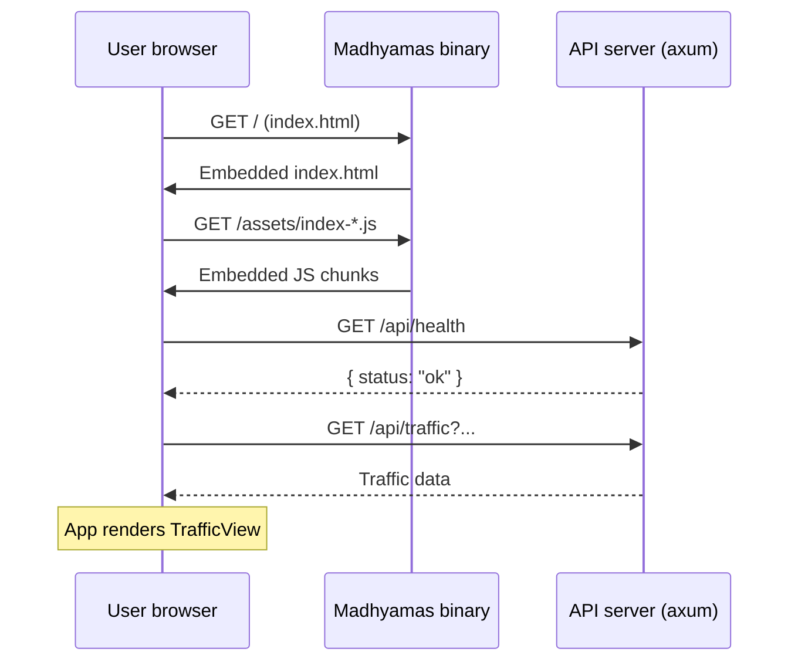
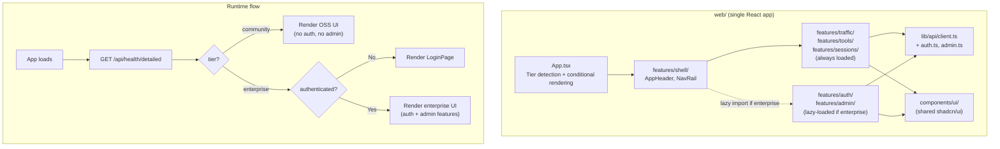
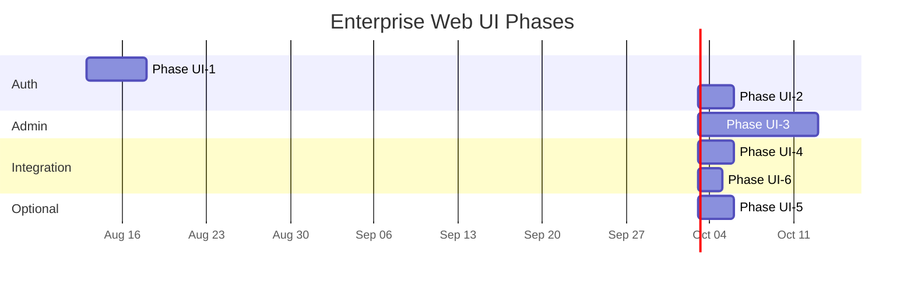

# Enterprise Web UI Design

> Part of: [Enterprise Analysis Overview](ENTERPRISE_OVERVIEW.md)

This document specifies how the Madhyamas web frontend changes to
support enterprise features (login, user management, RBAC, audit
viewer, metrics dashboard, license management) — and where that code
lives relative to the existing OSS frontend.

---

## Table of Contents

1. [Current Frontend Architecture](#1-current-frontend-architecture)
2. [The Question: Same Folder or Separate?](#2-the-question-same-folder-or-separate)
3. [Recommended Approach: Same Folder, Runtime-Gated](#3-recommended-approach-same-folder-runtime-gated)
4. [Tier Detection](#4-tier-detection)
5. [Authentication UI](#5-authentication-ui)
6. [Shell Changes](#6-shell-changes)
7. [Admin Panel UI](#7-admin-panel-ui)
8. [API Client Changes](#8-api-client-changes)
9. [Build and Embedding](#9-build-and-embedding)
10. [File Inventory](#10-file-inventory)
11. [Implementation Phases](#11-implementation-phases)

---

## 1. Current Frontend Architecture

The Madhyamas web UI is a **single-page React application** in `web/`.

### Structure

```
web/
├── package.json              # React 18, TypeScript, Vite, TanStack Query, shadcn/ui
├── vite.config.ts            # Vite config (manual chunks, dev proxy to :3001)
├── tailwind.config.js        # Tailwind CSS theme
├── index.html                # SPA entry point
└── src/
    ├── main.tsx              # React root
    ├── App.tsx               # App shell (header + nav rail + main area)
    ├── index.css             # Global styles
    ├── components/ui/        # shadcn/ui primitives (Button, Dialog, Card, etc.)
    ├── features/             # Feature-based modules
    │   ├── shell/            # AppHeader, NavRail
    │   ├── traffic/          # TrafficView (main view)
    │   ├── tools/            # Breakpoints, Mocks, Rewrites, etc. (18 files)
    │   ├── sessions/         # SessionsPanel
    │   ├── cert/             # CertificateHelper
    │   ├── config/           # ConfigDialog
    │   └── onboarding/       # OnboardingWizard
    ├── hooks/                # useTraffic, useWebSocket, useCaptureStats
    ├── lib/                  # Utilities
    │   ├── api/              # API client (client.ts + domain modules)
    │   ├── utils.ts          # cn() class merge helper
    │   └── focus.ts          # Focus host utilities
    └── types/                # TypeScript types (traffic, filters, websocket)
```

### Key characteristics

| Aspect | Current state |
|---|---|
| **Routing** | No react-router. `App.tsx` uses `useState<activeView>` with conditional rendering. NavRail switches views. |
| **State management** | TanStack Query for server state. React `useState`/`useEffect` for local state. No global state store (Redux/Zustand). |
| **API client** | `web/src/lib/api/client.ts` — thin `fetch` wrapper with `apiGet`, `apiPost`, `apiPatch`, `apiDelete`. All requests go to `/api/*` on the same origin. |
| **Auth awareness** | **None.** No login page, no auth context, no token management, no 401 handling. All API calls are unauthenticated. |
| **Component library** | shadcn/ui (Radix UI primitives + Tailwind). 20+ components in `components/ui/`. |
| **Embedding** | `rust-embed` embeds `web/dist/` into the Rust binary at compile time. The binary serves both API and web assets from the same origin. |
| **Build** | `npm run build` → `tsc --noEmit && vite build` → `web/dist/`. Single build, single bundle. |
| **Bundle size** | Manual chunks in `vite.config.ts` split vendor libs (react, radix, icons, ace editor). Lazy-loaded tool panels are in separate chunks. |
| **Total size** | 77 TS/TSX files, ~20,900 lines. |

### How the app loads



There is no tier check, no auth check, no login redirect. The app
loads and immediately shows the traffic view.

---

## 2. The Question: Same Folder or Separate?

Three options for where enterprise UI code lives:

### Option A: Separate `web-enterprise/` folder

A completely separate React app with its own `package.json`, `vite.config.ts`,
`tailwind.config.js`, and `src/` tree. Built separately, embedded
separately.

| Pros | Cons |
|---|---|
| Enterprise UI code is not in the OSS repo | Duplicates all infrastructure (package.json, vite config, tailwind, tsconfig) |
| Clean separation — OSS users never see enterprise UI | Cannot share shadcn/ui components (Button, Dialog, Card, etc.) |
| | Cannot share API client, hooks, utils, types |
| | Two build pipelines to maintain |
| | Two `rust-embed` configurations |
| | Divergent styling — enterprise UI looks different from OSS UI |
| | Feature changes that touch both OSS and enterprise require edits in two repos |
| | The licensing server portal is already a separate web app — this would make three |

### Option B: Same `web/` folder, build-time gated

Enterprise features in `web/src/features/auth/` and `web/src/features/admin/`.
A Vite environment variable (`VITE_ENTERPRISE=true`) controls which
features are included at build time. Two builds: one for simple, one
for enterprise.

| Pros | Cons |
|---|---|
| Shares all infrastructure (components, API client, hooks) | Requires two web builds (one per tier) |
| Enterprise code is tree-shaken out of the simple build | CI must coordinate: build web → build Rust, per tier |
| Clean bundle — simple build has zero enterprise JS | Risk of mismatch (simple binary with enterprise web bundle) |
| | More complex CI/CD pipeline |
| | Developer must remember which build to run |

### Option C: Same `web/` folder, runtime-gated (recommended)

Enterprise features in `web/src/features/auth/` and
`web/src/features/admin/`. Single build. The frontend calls
`/api/health/detailed` at startup to learn the tier and auth mode.
Enterprise features are lazy-loaded (dynamic import) only if the tier
is enterprise. In the simple tier, the lazy imports are never
triggered, so enterprise chunks are never loaded.

| Pros | Cons |
|---|---|
| Single build pipeline — same `web/dist/` for both tiers | Enterprise JS chunks are in the simple binary's embedded assets (but never loaded) |
| Shares all infrastructure (components, API client, hooks) | Enterprise code is visible in the OSS repo (but it's behind a license gate at runtime) |
| No CI coordination — one `npm run build` before any Rust build | Bundle contains enterprise code that is dead in simple tier |
| Runtime flexibility — same binary can serve both tiers if features are toggled | Slightly larger bundle (mitigated by lazy loading / code splitting) |
| Developer runs one command: `npm run build` | |
| Enterprise UI uses the same components, same theme, same look and feel | |
| No risk of build mismatch | |

### Recommendation: Option C

**Option C (same folder, runtime-gated) is the best approach.**

Reasons:

1. **The bundle size impact is negligible.** Enterprise features are
   lazy-loaded via `React.lazy(() => import(...))`. Vite splits them
   into separate chunks (`assets/auth-*.js`, `assets/admin-*.js`). In
   the simple tier, these chunks are embedded but never fetched by the
   browser. The main bundle (loaded on page load) is unchanged.

2. **Enterprise code in the OSS repo is not a security concern.** The
   enterprise *backend* code is in a separate Rust crate
   (`madhyamas-enterprise`) that is not compiled in the simple build.
   The enterprise *frontend* code is harmless JS that calls API
   endpoints which don't exist in the simple tier (they return 404).
   Even if someone reads the enterprise JS source, they can't activate
   enterprise features without the backend.

3. **Shared infrastructure is a major benefit.** The enterprise UI
   needs the same shadcn/ui components, the same API client patterns,
   the same TanStack Query hooks, the same Tailwind theme. Duplicating
   all of this in a separate folder would be wasteful and lead to
   divergent styling.

4. **The licensing server portal is already separate.** The licensing
   server (`madhyamas.ai`) has its own React app. That's the right
   separation — the licensing portal is a different product for a
   different audience (customer admin vs. developer using the proxy).
   The proxy's enterprise UI is for the same audience as the OSS UI
   (developers using the proxy), just with additional features.

5. **Single build is simpler for everyone.** One `npm run build`
   command. One `web/dist/` directory. One `rust-embed` configuration.
   No CI coordination. No risk of mismatch.

---

## 3. Recommended Approach: Same Folder, Runtime-Gated

### Architecture



### How runtime gating works

1. **App startup:** `App.tsx` calls `GET /api/health/detailed` before
   rendering anything.
2. **Response includes tier info:**
   ```json
   {
     "status": "ok",
     "tier": "enterprise",
     "auth_mode": "local",
     "auth_required": true,
     "license": {
       "organization": "Acme Corp",
       "expires_at": "2027-08-12T00:00:00Z",
       "max_users": 50,
       "features": ["auth", "rbac", "audit", "sso"]
     }
   }
   ```
3. **If `tier === "community"`:** Render the app as-is (no auth, no
   admin nav items). Enterprise chunks are never imported.
4. **If `tier === "enterprise"` and `auth_required === true`:**
   - Check if a JWT is stored (in `sessionStorage` or HttpOnly cookie).
   - If no JWT → render `LoginPage`.
   - If JWT exists → validate via `GET /api/auth/me`.
   - If valid → render the main app with enterprise features.
   - If invalid (401) → clear token, render `LoginPage`.
5. **If `tier === "enterprise"` and `auth_required === false`:**
   - Render the main app with enterprise features but no login required
     (e.g., header auth mode where the reverse proxy handles auth).

### Lazy loading enterprise features

Enterprise features are lazy-loaded so they're in separate chunks:

```tsx
// App.tsx — enterprise features are lazy-loaded
const LoginPage = lazy(() =>
  import("@/features/auth/LoginPage").then((m) => ({ default: m.LoginPage }))
);
const UsersPanel = lazy(() =>
  import("@/features/admin/UsersPanel").then((m) => ({ default: m.UsersPanel }))
);
const AuditLogViewer = lazy(() =>
  import("@/features/admin/AuditLogViewer").then((m) => ({ default: m.AuditLogViewer }))
);
```

In the simple tier, these `import()` calls are never executed, so the
chunks are never fetched. Vite's code splitting ensures they're in
separate files (`assets/auth-*.js`, `assets/admin-*.js`).

---

## 4. Tier Detection

### Health endpoint

The backend must expose tier information. Add a `detailed` variant to
the health endpoint:

```rust
// crates/madhyamas-api/src/handlers.rs (or enterprise_handlers)

#[derive(Serialize)]
pub struct DetailedHealth {
    pub status: String,
    pub tier: String,           // "community" | "enterprise"
    pub auth_mode: String,      // "none" | "local" | "oidc" | "header" | "ldap"
    pub auth_required: bool,
    pub license: Option<LicenseInfo>,
}

#[derive(Serialize)]
pub struct LicenseInfo {
    pub organization: String,
    pub expires_at: Option<String>,
    pub max_users: u32,
    pub features: Vec<String>,
}
```

In the simple tier, this returns:
```json
{
  "status": "ok",
  "tier": "community",
  "auth_mode": "none",
  "auth_required": false,
  "license": null
}
```

In the enterprise tier (with valid license):
```json
{
  "status": "ok",
  "tier": "enterprise",
  "auth_mode": "local",
  "auth_required": true,
  "license": {
    "organization": "Acme Corp",
    "expires_at": "2027-08-12T00:00:00Z",
    "max_users": 50,
    "features": ["auth", "rbac", "audit", "sso"]
  }
}
```

### Frontend tier context

```tsx
// web/src/lib/tier.ts (NEW)

export interface TierInfo {
  tier: "community" | "enterprise";
  authMode: "none" | "local" | "oidc" | "header" | "ldap";
  authRequired: boolean;
  license: LicenseInfo | null;
}

export async function fetchTierInfo(): Promise<TierInfo> {
  const res = await fetch("/api/health/detailed");
  if (!res.ok) {
    // If detailed health is not available, assume community
    return {
      tier: "community",
      authMode: "none",
      authRequired: false,
      license: null,
    };
  }
  return res.json();
}

export function useTierInfo(): { data: TierInfo | undefined; isLoading: boolean } {
  const { data, isLoading } = useQuery({
    queryKey: ["tier-info"],
    queryFn: fetchTierInfo,
    staleTime: Infinity, // Tier doesn't change during a session
  });
  return { data, isLoading };
}
```

---

## 5. Authentication UI

### New files: `web/src/features/auth/`

```
web/src/features/auth/
├── AuthContext.tsx          # Auth provider (current user, login, logout, token refresh)
├── LoginPage.tsx            # Login form (username/password, SSO button)
├── ProtectedApp.tsx         # Wraps the main app, redirects to login if unauthenticated
├── UserMenu.tsx             # Dropdown menu in header (profile, logout, admin links)
├── MfaSetupDialog.tsx       # TOTP MFA setup (optional, if mfa feature enabled)
└── SsoRedirect.tsx          # OIDC redirect handler (callback from IdP)
```

### AuthContext

```tsx
// web/src/features/auth/AuthContext.tsx

interface AuthState {
  user: User | null;
  isLoading: boolean;
  isAuthenticated: boolean;
}

interface AuthContextValue extends AuthState {
  login: (username: string, password: string) => Promise<void>;
  logout: () => Promise<void>;
  refreshUser: () => Promise<void>;
}

const AuthContext = createContext<AuthContextValue | null>(null);

export function AuthProvider({ children }: { children: React.ReactNode }) {
  const [state, setState] = useState<AuthState>({
    user: null,
    isLoading: true,
    isAuthenticated: false,
  });

  // On mount, check if we have a valid session
  useEffect(() => {
    const token = sessionStorage.getItem("madhyamas-jwt");
    if (token) {
      // Validate token by fetching current user
      apiGet<User>("/auth/me")
        .then((user) => {
          setState({ user, isLoading: false, isAuthenticated: true });
        })
        .catch(() => {
          // Token invalid — clear and continue as unauthenticated
          sessionStorage.removeItem("madhyamas-jwt");
          setState({ user: null, isLoading: false, isAuthenticated: false });
        });
    } else {
      setState({ user: null, isLoading: false, isAuthenticated: false });
    }
  }, []);

  const login = async (username: string, password: string) => {
    const { token, user } = await apiPost<{ token: string; user: User }>(
      "/auth/login",
      { username, password }
    );
    sessionStorage.setItem("madhyamas-jwt", token);
    setState({ user, isLoading: false, isAuthenticated: true });
  };

  const logout = async () => {
    try {
      await apiPostVoid("/auth/logout");
    } finally {
      sessionStorage.removeItem("madhyamas-jwt");
      setState({ user: null, isLoading: false, isAuthenticated: false });
    }
  };

  return (
    <AuthContext.Provider value={{ ...state, login, logout, refreshUser: () => {} }}>
      {children}
    </AuthContext.Provider>
  );
}

export function useAuth() {
  const ctx = useContext(AuthContext);
  if (!ctx) throw new Error("useAuth must be used within AuthProvider");
  return ctx;
}
```

### LoginPage

```tsx
// web/src/features/auth/LoginPage.tsx

export function LoginPage({ tierInfo }: { tierInfo: TierInfo }) {
  const { login } = useAuth();
  const [username, setUsername] = useState("");
  const [password, setPassword] = useState("");
  const [error, setError] = useState<string | null>(null);
  const [loading, setLoading] = useState(false);

  const handleSubmit = async (e: React.FormEvent) => {
    e.preventDefault();
    setLoading(true);
    setError(null);
    try {
      await login(username, password);
    } catch (err) {
      setError(err instanceof ApiError ? err.body : "Login failed");
    } finally {
      setLoading(false);
    }
  };

  return (
    <div className="flex h-full items-center justify-center bg-background">
      <Card className="w-[400px]">
        <CardHeader>
          <div className="flex items-center gap-2">
            <div className="flex h-8 w-8 items-center justify-center rounded bg-primary text-sm font-bold text-primary-foreground">
              M
            </div>
            <div>
              <CardTitle>Madhyamas Enterprise</CardTitle>
              <CardDescription>
                {tierInfo.license?.organization ?? "Sign in to continue"}
              </CardDescription>
            </div>
          </div>
        </CardHeader>
        <CardContent>
          <form onSubmit={handleSubmit} className="space-y-4">
            {error && (
              <div className="rounded-md border border-destructive/30 bg-destructive/10 p-3 text-sm text-destructive">
                {error}
              </div>
            )}
            <div className="space-y-2">
              <Label htmlFor="username">Username</Label>
              <Input
                id="username"
                value={username}
                onChange={(e) => setUsername(e.target.value)}
                autoFocus
                required
              />
            </div>
            <div className="space-y-2">
              <Label htmlFor="password">Password</Label>
              <Input
                id="password"
                type="password"
                value={password}
                onChange={(e) => setPassword(e.target.value)}
                required
              />
            </div>
            <Button type="submit" className="w-full" disabled={loading}>
              {loading ? "Signing in…" : "Sign in"}
            </Button>
          </form>

          {/* SSO button (if OIDC is configured) */}
          {tierInfo.authMode === "oidc" && (
            <>
              <div className="relative my-4">
                <Separator />
                <span className="absolute left-1/2 top-1/2 -translate-x-1/2 -translate-y-1/2 bg-card px-2 text-xs text-muted-foreground">
                  or
                </span>
              </div>
              <Button
                variant="outline"
                className="w-full"
                onClick={() => window.location.href = "/api/auth/oidc/redirect"}
              >
                Sign in with SSO
              </Button>
            </>
          )}
        </CardContent>
      </Card>
    </div>
  );
}
```

### ProtectedApp

```tsx
// web/src/features/auth/ProtectedApp.tsx

export function ProtectedApp({ tierInfo, children }: {
  tierInfo: TierInfo;
  children: React.ReactNode;
}) {
  const { isAuthenticated, isLoading } = useAuth();

  if (isLoading) {
    return (
      <div className="flex h-full items-center justify-center">
        <Loader2 className="h-6 w-6 animate-spin text-muted-foreground" />
      </div>
    );
  }

  // If auth is required and user is not authenticated, show login
  if (tierInfo.authRequired && !isAuthenticated) {
    return <LoginPage tierInfo={tierInfo} />;
  }

  // Authenticated (or auth not required) — render the main app
  return <>{children}</>;
}
```

---

## 6. Shell Changes

### App.tsx changes

The main `App.tsx` needs to:
1. Fetch tier info at startup
2. Wrap the app in `AuthProvider` (if enterprise)
3. Wrap the app in `ProtectedApp` (if enterprise + auth required)
4. Conditionally add admin nav items to NavRail
5. Conditionally render UserMenu in AppHeader

```tsx
// web/src/App.tsx (MODIFIED — key changes shown)

import { AuthProvider } from "@/features/auth/AuthContext";
import { ProtectedApp } from "@/features/auth/ProtectedApp";
import { useTierInfo } from "@/lib/tier";

// Lazy-load enterprise features
const LoginPage = lazy(() =>
  import("@/features/auth/LoginPage").then((m) => ({ default: m.LoginPage }))
);
const UsersPanel = lazy(() =>
  import("@/features/admin/UsersPanel").then((m) => ({ default: m.UsersPanel }))
);
const AuditLogViewer = lazy(() =>
  import("@/features/admin/AuditLogViewer").then((m) => ({ default: m.AuditLogViewer }))
);
const MetricsDashboard = lazy(() =>
  import("@/features/admin/MetricsDashboard").then((m) => ({ default: m.MetricsDashboard }))
);
const LicensePanel = lazy(() =>
  import("@/features/admin/LicensePanel").then((m) => ({ default: m.LicensePanel }))
);

export default function App() {
  const { isDark, toggle } = useTheme();
  const [activeView, setActiveView] = useState<NavView["id"]>("traffic");
  const { data: tierInfo, isLoading: tierLoading } = useTierInfo();

  if (tierLoading) {
    return (
      <div className="flex h-full items-center justify-center">
        <Loader2 className="h-6 w-6 animate-spin text-muted-foreground" />
      </div>
    );
  }

  const isEnterprise = tierInfo?.tier === "enterprise";

  // Build nav views — add admin items if enterprise
  const navViews: NavView[] = [
    ...TOOL_VIEWS,
    ...(isEnterprise ? [
      { id: "users", label: "Users", icon: "Users" },
      { id: "audit", label: "Audit Log", icon: "ScrollText" },
      { id: "metrics", label: "Metrics", icon: "BarChart3" },
      { id: "license", label: "License", icon: "KeyRound" },
    ] : []),
  ];

  // If enterprise with auth, wrap in AuthProvider + ProtectedApp
  const app = (
    <div className="flex h-full flex-col bg-background text-foreground">
      <AppHeader
        isDark={isDark}
        onToggleTheme={toggle}
        tierInfo={tierInfo}
      />
      <div className="flex min-h-0 flex-1">
        <NavRail views={navViews} activeView={activeView} onSelect={setActiveView} />
        <main className="min-w-0 flex-1 overflow-hidden">
          <ErrorBoundary label="Panel">
            <Suspense fallback={<PanelFallback />}>
              {activeView === "traffic" && <TrafficView />}
              {activeView === "breakpoints" && <BreakpointsPanel />}
              {/* ... other OSS views ... */}
              {isEnterprise && activeView === "users" && <UsersPanel />}
              {isEnterprise && activeView === "audit" && <AuditLogViewer />}
              {isEnterprise && activeView === "metrics" && <MetricsDashboard />}
              {isEnterprise && activeView === "license" && <LicensePanel />}
            </Suspense>
          </ErrorBoundary>
        </main>
      </div>
    </div>
  );

  if (isEnterprise) {
    return (
      <QueryClientProvider client={queryClient}>
        <AuthProvider>
          <ProtectedApp tierInfo={tierInfo}>
            {app}
          </ProtectedApp>
        </AuthProvider>
        <Toaster />
      </QueryClientProvider>
    );
  }

  // Simple tier — no auth wrapper
  return (
    <QueryClientProvider client={queryClient}>
      {app}
      <Toaster />
    </QueryClientProvider>
  );
}
```

### AppHeader changes

Add `UserMenu` (enterprise only) and license expiry banner:

```tsx
// web/src/features/shell/AppHeader.tsx (MODIFIED — additions)

import { UserMenu } from "@/features/auth/UserMenu";

export function AppHeader({ isDark, onToggleTheme, tierInfo }: AppHeaderProps) {
  const isEnterprise = tierInfo?.tier === "enterprise";

  return (
    <header className="flex h-11 shrink-0 items-center justify-between border-b border-border bg-card px-3">
      {/* Brand — unchanged */}
      <div className="flex items-center gap-2">
        {/* ... existing brand ... */}
        {isEnterprise && tierInfo.license && (
          <Badge variant="secondary" className="ml-2 text-2xs">
            Enterprise
          </Badge>
        )}
      </div>

      {/* Right controls */}
      <div className="flex items-center gap-1.5">
        {/* ... existing controls (proxy address, capture, config, etc.) ... */}

        {/* License expiry warning (enterprise only) */}
        {isEnterprise && tierInfo?.license?.expires_at && (
          <LicenseExpiryBadge expiresAt={tierInfo.license.expires_at} />
        )}

        {/* User menu (enterprise only) */}
        {isEnterprise && <UserMenu />}

        {/* Theme toggle — unchanged */}
        <Button variant="ghost" size="icon-sm" onClick={onToggleTheme}>
          {isDark ? <Sun className="h-3.5 w-3.5" /> : <Moon className="h-3.5 w-3.5" />}
        </Button>
      </div>
    </header>
  );
}
```

### NavRail changes

The NavRail itself doesn't need code changes — it already takes `views`
as a prop. The enterprise admin views are added to the `navViews` array
in `App.tsx`. The NavRail renders them automatically.

The only addition is new icon mappings for the admin views:

```tsx
// web/src/features/shell/NavRail.tsx (MODIFIED — add icons)

import { Users, ScrollText, BarChart3, KeyRound } from "lucide-react";

const ICONS: Record<string, LucideIcon> = {
  // ... existing icons ...
  Users,
  ScrollText,
  BarChart3,
  KeyRound,
};
```

---

## 7. Admin Panel UI

### New files: `web/src/features/admin/`

```
web/src/features/admin/
├── UsersPanel.tsx            # User list, create/edit/delete, role assignment
├── RolesPanel.tsx            # RBAC role/permission matrix viewer (read-only or editable)
├── AuditLogViewer.tsx        # Audit event table with filters (type, user, date range)
├── MetricsDashboard.tsx      # Performance metrics charts (recharts)
├── LicensePanel.tsx          # License info, expiry, features, download
└── ApiKeyManager.tsx         # API key list, create/revoke (could be in UsersPanel)
```

### UsersPanel

Table of users with columns: username, email, role, status, last login.
Actions: create user (dialog), edit user (dialog), delete user
(confirm), reset password (dialog). Admin-only — `require_permission_middleware`
on the backend enforces this.

### AuditLogViewer

Table of audit events with columns: timestamp, event type, user,
description, metadata (expandable JSON). Filters: event type dropdown,
user dropdown, date range picker. Export button (downloads as JSON or
CSV). Pagination or virtualized scrolling for large datasets.

### MetricsDashboard

Uses `recharts` to display:
- Request count over time (line chart)
- Response time percentiles (p50, p95, p99)
- Status code distribution (pie chart)
- Top hosts by request count (bar chart)
- Memory usage over time (area chart)

Data comes from the existing `PerformanceMonitor` wired to the
enterprise metrics endpoints.

### LicensePanel

Shows:
- Organization name
- License type (enterprise, trial, academic)
- Issue date and expiry date
- Days remaining (with color: green >30d, yellow 7-30d, red <7d)
- Max users vs current user count
- Feature flags (checkmarks for enabled features)
- License ID (for support reference)

No actions — license management is done on the licensing server portal.

---

## 8. API Client Changes

### Auth token injection

The existing `client.ts` needs to inject the JWT into all requests:

```tsx
// web/src/lib/api/client.ts (MODIFIED — add auth)

/** Get the auth token from sessionStorage. */
function getAuthToken(): string | null {
  return sessionStorage.getItem("madhyamas-jwt");
}

/** Build headers with auth token if present. */
function authHeaders(init?: RequestInit): Record<string, string> {
  const headers: Record<string, string> = {};
  const token = getAuthToken();
  if (token) {
    headers["Authorization"] = `Bearer ${token}`;
  }
  // Merge with existing headers from init
  if (init?.headers) {
    const existing = init.headers as Record<string, string>;
    Object.assign(headers, existing);
  }
  return headers;
}

/** Check response and handle 401 (auth expired). */
async function checkResponse(res: Response): Promise<void> {
  if (res.status === 401) {
    // Token expired or invalid — clear and reload to show login
    sessionStorage.removeItem("madhyamas-jwt");
    // Don't redirect if we're already on the login page
    if (!window.location.hash.includes("login")) {
      window.location.reload();
    }
    throw new ApiError(401, "Authentication required");
  }
  if (!res.ok) {
    const body = await res.text().catch(() => "");
    throw new ApiError(res.status, body);
  }
}

// All apiGet, apiPost, etc. now use authHeaders(init) instead of init?.headers
export async function apiGet<T>(path: string, init?: RequestInit): Promise<T> {
  const res = await fetch(buildUrl(path), {
    ...init,
    method: "GET",
    headers: authHeaders(init),
  });
  await checkResponse(res);
  return res.json() as Promise<T>;
}
```

### New API modules

```
web/src/lib/api/
├── client.ts          # (MODIFIED — auth token injection, 401 handling)
├── auth.ts            # NEW — login, logout, me, refresh, MFA setup/verify
├── admin.ts           # NEW — users CRUD, audit query, license info, metrics
├── cert.ts            # (unchanged)
├── tools.ts           # (unchanged)
├── intercept.ts       # (unchanged)
├── sessions.ts        # (unchanged)
├── mirror.ts          # (unchanged)
└── autosave.ts        # (unchanged)
```

```tsx
// web/src/lib/api/auth.ts (NEW)

import { apiGet, apiPost, apiPostVoid } from "./client";

export interface User {
  id: string;
  username: string;
  email: string | null;
  display_name: string;
  role: "admin" | "user" | "viewer" | "readonly";
  status: "active" | "inactive" | "suspended";
  last_login: string | null;
}

export interface LoginResponse {
  token: string;
  user: User;
}

export function login(username: string, password: string): Promise<LoginResponse> {
  return apiPost<LoginResponse>("/auth/login", { username, password });
}

export function logout(): Promise<void> {
  return apiPostVoid("/auth/logout");
}

export function getCurrentUser(): Promise<User> {
  return apiGet<User>("/auth/me");
}

export function refreshToken(): Promise<{ token: string }> {
  return apiPost<{ token: string }>("/auth/refresh");
}
```

```tsx
// web/src/lib/api/admin.ts (NEW)

import { apiGet, apiPost, apiPatch, apiDelete, apiDeleteVoid } from "./client";
import type { User } from "./auth";

export function listUsers(): Promise<User[]> {
  return apiGet<User[]>("/users");
}

export function createUser(data: {
  username: string;
  password: string;
  email?: string;
  display_name: string;
  role: string;
}): Promise<User> {
  return apiPost<User>("/users", data);
}

export function updateUser(id: string, data: Partial<User>): Promise<User> {
  return apiPatch<User>(`/users/${id}`, data);
}

export function deleteUser(id: string): Promise<void> {
  return apiDeleteVoid(`/users/${id}`);
}

export interface AuditEvent {
  id: string;
  event_type: string;
  timestamp: string;
  user_id: string | null;
  description: string;
  metadata: Record<string, unknown>;
}

export function queryAuditEvents(filter: {
  event_type?: string;
  user_id?: string;
  since?: string;
  until?: string;
  limit?: number;
}): Promise<AuditEvent[]> {
  const params = new URLSearchParams();
  if (filter.event_type) params.set("event_type", filter.event_type);
  if (filter.user_id) params.set("user_id", filter.user_id);
  if (filter.since) params.set("since", filter.since);
  if (filter.until) params.set("until", filter.until);
  if (filter.limit) params.set("limit", String(filter.limit));
  return apiGet<AuditEvent[]>(`/audit?${params.toString()}`);
}

export interface LicenseInfo {
  license_id: string;
  organization: string;
  license_type: string;
  expires_at: string | null;
  max_users: number;
  features: string[];
}

export function getLicenseInfo(): Promise<LicenseInfo> {
  return apiGet<LicenseInfo>("/license/info");
}
```

---

## 9. Build and Embedding

### No changes to the build pipeline

The build process remains exactly the same:

```bash
cd web && npm run build    # → web/dist/
cargo build -p madhyamas   # embeds web/dist/ via rust-embed
```

Enterprise features are in separate chunks (via `React.lazy`), but
they're all in `web/dist/`. The same `web/dist/` is embedded into both
the simple and enterprise binaries.

### Vite chunk splitting

Vite automatically creates separate chunks for dynamic imports. The
enterprise features will be in:

```
web/dist/assets/
├── index-*.js              # Main bundle (always loaded)
├── vendor-*.js             # React, Radix, etc.
├── TrafficView-*.js        # Lazy-loaded OSS feature
├── BreakpointsPanel-*.js   # Lazy-loaded OSS feature
├── ...
├── auth-*.js               # Lazy-loaded enterprise feature (never loaded in simple)
├── UsersPanel-*.js         # Lazy-loaded enterprise feature (never loaded in simple)
├── AuditLogViewer-*.js     # Lazy-loaded enterprise feature (never loaded in simple)
└── ...
```

### Optional: exclude enterprise chunks from simple build

If the enterprise chunk size is a concern, a post-build script can
remove enterprise chunks from `web/dist/assets/` before the simple
Rust build:

```bash
# Build web (includes enterprise chunks)
cd web && npm run build

# For simple build: remove enterprise chunks
rm web/dist/assets/auth-*.js web/dist/assets/UsersPanel-*.js web/dist/assets/AuditLogViewer-*.js

# Build simple binary (embeds web/dist/ without enterprise chunks)
cargo build -p madhyamas

# For enterprise build: rebuild web (restore enterprise chunks)
cd web && npm run build

# Build enterprise binary
cargo build -p madhyamas --features enterprise
```

This is **optional** and not recommended for the initial
implementation. The enterprise chunks are small (a few KB each) and
never loaded in the simple tier. The complexity of the post-build
script is not worth the marginal size savings.

### `MADHYAMAS_WEB_DIR` override (development)

During development, `MADHYAMAS_WEB_DIR` can point to the live Vite dev
server output. Both simple and enterprise features are available in dev
mode regardless of which binary is running. This is fine — the frontend
adapts at runtime based on the tier info from the API.

---

## 10. File Inventory

### New files (enterprise UI)

| File | Purpose |
|---|---|
| `web/src/lib/tier.ts` | Tier detection hook (`useTierInfo`) |
| `web/src/lib/api/auth.ts` | Auth API client (login, logout, me, refresh) |
| `web/src/lib/api/admin.ts` | Admin API client (users, audit, license, metrics) |
| `web/src/features/auth/AuthContext.tsx` | Auth provider (user state, login, logout) |
| `web/src/features/auth/LoginPage.tsx` | Login form (local + SSO button) |
| `web/src/features/auth/ProtectedApp.tsx` | Auth gate (redirect to login if unauthenticated) |
| `web/src/features/auth/UserMenu.tsx` | Header dropdown (profile, logout, admin links) |
| `web/src/features/auth/MfaSetupDialog.tsx` | TOTP MFA setup (optional) |
| `web/src/features/auth/SsoRedirect.tsx` | OIDC callback handler |
| `web/src/features/admin/UsersPanel.tsx` | User management table + CRUD dialogs |
| `web/src/features/admin/RolesPanel.tsx` | RBAC role/permission matrix viewer |
| `web/src/features/admin/AuditLogViewer.tsx` | Audit event table with filters + export |
| `web/src/features/admin/MetricsDashboard.tsx` | Performance charts (recharts) |
| `web/src/features/admin/LicensePanel.tsx` | License info display |
| `web/src/features/admin/ApiKeyManager.tsx` | API key list + create/revoke |

### Modified files

| File | Changes |
|---|---|
| `web/src/App.tsx` | Tier detection, AuthProvider wrapper, ProtectedApp wrapper, conditional admin nav items, conditional admin view rendering |
| `web/src/features/shell/AppHeader.tsx` | Accept `tierInfo` prop, render UserMenu (enterprise), license expiry badge, "Enterprise" badge |
| `web/src/features/shell/NavRail.tsx` | Add icon mappings for admin views (Users, ScrollText, BarChart3, KeyRound) |
| `web/src/lib/api/client.ts` | Auth token injection (Authorization header), 401 handling (clear token + reload) |
| `web/src/features/onboarding/OnboardingWizard.tsx` | Detect auth mode, prompt login if enterprise |

### Unchanged files

All other files remain unchanged:
- `web/src/features/traffic/` — no enterprise awareness
- `web/src/features/tools/` — no enterprise awareness
- `web/src/features/sessions/` — no enterprise awareness
- `web/src/features/cert/` — no enterprise awareness
- `web/src/features/config/` — no enterprise awareness
- `web/src/components/ui/` — shared, no changes
- `web/src/hooks/` — no changes (enterprise has its own hooks in `features/auth/`)
- `web/src/types/` — no changes (enterprise types in `lib/api/auth.ts` and `lib/api/admin.ts`)

### Backend: new endpoint

| Endpoint | Purpose |
|---|---|
| `GET /api/health/detailed` | Returns tier, auth_mode, auth_required, license info |

This is the only backend change needed for the frontend to work. The
existing enterprise API endpoints (`/api/auth/*`, `/api/users/*`,
`/api/audit/*`, `/api/license/*`) are defined in the enterprise crate
and documented in [ENTERPRISE_AUTH_RBAC.md](ENTERPRISE_AUTH_RBAC.md).

---

## 11. Implementation Phases

### Phase UI-1: Tier detection + auth infrastructure

| Task | Files |
|---|---|
| Add `GET /api/health/detailed` endpoint | `crates/madhyamas-api/src/handlers.rs` (or enterprise crate) |
| Create `web/src/lib/tier.ts` | New file |
| Create `web/src/lib/api/auth.ts` | New file |
| Modify `web/src/lib/api/client.ts` — auth token injection, 401 handling | Modified |
| Create `web/src/features/auth/AuthContext.tsx` | New file |
| Create `web/src/features/auth/LoginPage.tsx` | New file |
| Create `web/src/features/auth/ProtectedApp.tsx` | New file |
| Modify `web/src/App.tsx` — tier detection, auth wrapper | Modified |

**Effort:** Medium. The auth context and login page are standard React
patterns. The tier detection is a single API call.

### Phase UI-2: Shell changes

| Task | Files |
|---|---|
| Create `web/src/features/auth/UserMenu.tsx` | New file |
| Modify `web/src/features/shell/AppHeader.tsx` — UserMenu, badges | Modified |
| Modify `web/src/features/shell/NavRail.tsx` — admin icon mappings | Modified |
| Modify `web/src/App.tsx` — conditional admin nav items | Modified |

**Effort:** Small. The UserMenu is a dropdown with profile, logout, and
admin links. The NavRail change is just adding icon imports.

### Phase UI-3: Admin panels

| Task | Files |
|---|---|
| Create `web/src/features/admin/UsersPanel.tsx` | New file |
| Create `web/src/features/admin/AuditLogViewer.tsx` | New file |
| Create `web/src/features/admin/MetricsDashboard.tsx` | New file (requires `recharts` dependency) |
| Create `web/src/features/admin/LicensePanel.tsx` | New file |
| Create `web/src/lib/api/admin.ts` | New file |
| Add `recharts` to `web/package.json` | Modified |

**Effort:** Large. Each admin panel is a full feature with table,
filters, dialogs, and API integration. The MetricsDashboard requires
chart integration.

### Phase UI-4: SSO integration

| Task | Files |
|---|---|
| Create `web/src/features/auth/SsoRedirect.tsx` | New file |
| Add SSO button to LoginPage (conditional on `authMode === "oidc"`) | Modified |
| Handle OIDC callback (token extraction, redirect to app) | New file |

**Effort:** Small. The OIDC flow is backend-driven — the frontend just
redirects to the IdP and handles the callback.

### Phase UI-5: MFA (optional)

| Task | Files |
|---|---|
| Create `web/src/features/auth/MfaSetupDialog.tsx` | New file |
| Add MFA step to login flow | Modified |

**Effort:** Small. TOTP setup is a QR code + verification input.

### Phase UI-6: Onboarding integration

| Task | Files |
|---|---|
| Modify `web/src/features/onboarding/OnboardingWizard.tsx` | Modified |
| Detect auth mode, prompt login if enterprise | Modified |
| Show enterprise-specific onboarding steps (user creation, SSO setup) | Modified |

**Effort:** Small. The OnboardingWizard already exists; adding
enterprise-aware steps is incremental.

### Roadmap



---

## See Also

- [Enterprise Analysis Overview](ENTERPRISE_OVERVIEW.md) — Master document
- [Enterprise Auth, RBAC, and IdP](ENTERPRISE_AUTH_RBAC.md) — Proxy-side authentication design
- [Enterprise Licensing Server](ENTERPRISE_LICENSING_SERVER.md) — Licensing server (separate portal)
- [WEB_FRONTEND.md](WEB_FRONTEND.md) — Current web frontend architecture
- [ENTERPRISE.md](ENTERPRISE.md) — Current enterprise feature internals (pre-refactor)
