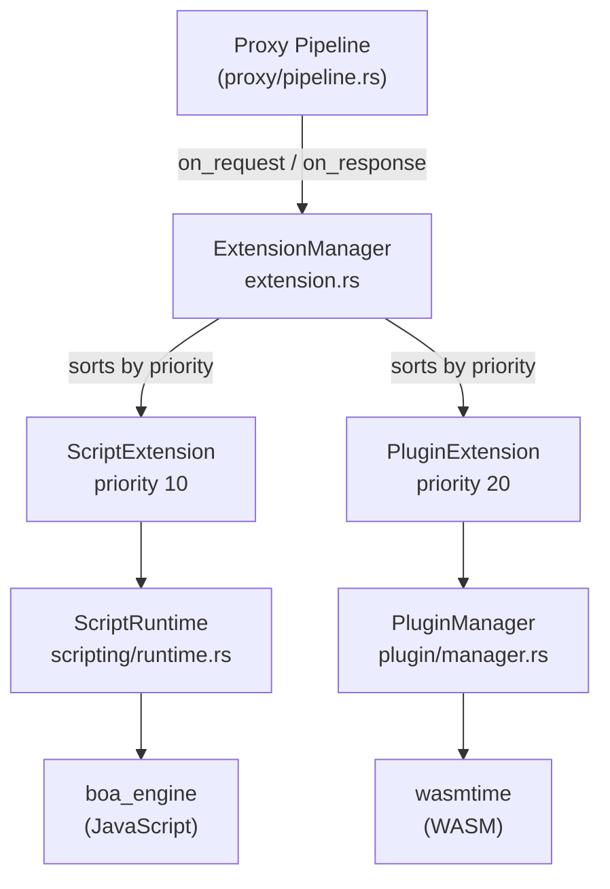
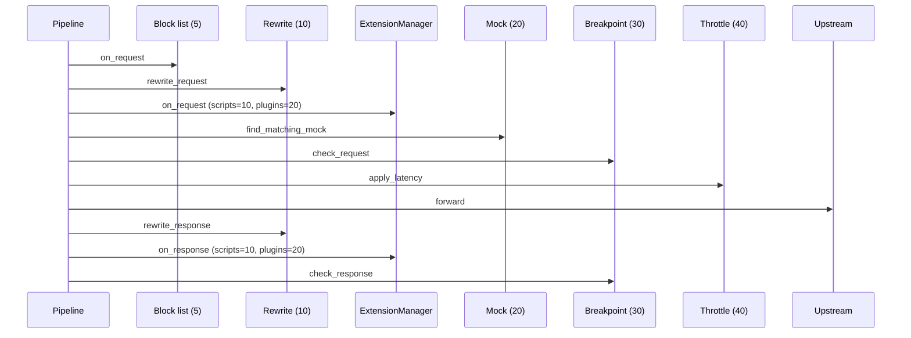

# Extension System

> **Last verified:** 2026-08-12 against Madhyamas `0.1.6`.

## Overview

The extension system is a unified abstraction over Madhyamas's two user-facing
extension mechanisms — JavaScript scripts and WASM plugins. Both expose
`on_request` / `on_response` hooks with nearly identical semantics. The
`Extension` trait and `ExtensionManager` (in
`crates/madhyamas-core/src/extension.rs`) abstract over both so the proxy
pipeline calls a single dispatch point instead of invoking the script runtime
and plugin manager separately.

## Architecture



## The `Extension` Trait

```rust
pub trait Extension: Send + Sync {
    fn name(&self) -> &str;
    fn priority(&self) -> i32 { 0 }
    fn enabled(&self) -> bool { true }
    fn on_request(&self, _ctx: &mut ExtensionContext) -> ExtensionResult {
        ExtensionResult::pass()
    }
    fn on_response(&self, _ctx: &mut ExtensionContext) -> ExtensionResult {
        ExtensionResult::pass()
    }
}
```

- `priority()` — lower numbers run first. Extensions are sorted at registration
  time and invoked in ascending order.
- `enabled()` — if `false`, the extension is skipped entirely.
- `on_request` / `on_response` — receive a mutable `ExtensionContext` and return
  an `ExtensionResult`.

## `ExtensionContext`

The context passed to every hook invocation. It is a superset of the fields
needed by both the script and plugin runtimes.

| Field | Type | Description |
|-------|------|-------------|
| `request_id` | `String` | Generated per pipeline invocation |
| `session_id` | `String` | Active capture session ID |
| `hook` | `&'static str` | `"on_request"` or `"on_response"` |
| `request` | `Option<ExtensionRequest>` | Request data (always present for `on_request`) |
| `response` | `Option<ExtensionResponse>` | Response data (present for `on_response`) |
| `data` | `HashMap<String, serde_json::Value>` | Shared key/value bag across extensions in one invocation |
| `timestamp` | `DateTime<Utc>` | Hook invocation timestamp |

`ExtensionRequest` carries `method`, `url`, `host`, `path`, `headers`, `body`,
and `content_type`. `ExtensionResponse` carries `status_code`, `status_message`,
`headers`, `body`, `content_type`, and `duration_ms`.

## `ExtensionResult`

| Field | Type | Description |
|-------|------|-------------|
| `handled` | `bool` | Whether the extension short-circuited (produced a response) |
| `continue_chain` | `bool` | Whether to continue invoking subsequent extensions |
| `modified` | `bool` | Whether the extension modified the request/response |
| `error` | `Option<String>` | Error message if the extension failed |
| `logs` | `Vec<String>` | Log lines produced by the extension |

## `ExtensionManager`

| Method | Description |
|--------|-------------|
| `new()` | Create an empty manager |
| `register(ext)` | Register an extension; auto-sorts by priority |
| `on_request(ctx) -> bool` | Run `on_request` on all enabled extensions in priority order; returns `true` if any handled |
| `on_response(ctx)` | Run `on_response` on all enabled extensions in priority order |
| `len()` / `is_empty()` | Introspection |

## Built-in Adapters

### `ScriptExtension` (priority 10)

Adapts the `ScriptRuntime` (boa_engine) to the `Extension` trait. Its
`on_request`/`on_response` call `ScriptRuntime::execute_hook`, apply any
modified request/response fields back to the context, and handle short-circuit
responses. Individual script enable/disable is handled internally — the adapter
itself is always `enabled()`.

See [SCRIPTING.md](SCRIPTING.md) for the scripting feature and
[SCRIPTING_API.md](SCRIPTING_API.md) for the JavaScript API.

### `PluginExtension` (priority 20)

Adapts the `PluginManager` (wasmtime) to the `Extension` trait. Its
`on_request`/`on_response` call `PluginManager::execute_hook`, apply modified
fields, and handle custom responses. `enabled()` delegates to
`PluginManager::is_enabled()`.

See [PLUGINS.md](PLUGINS.md) for the plugin feature and
[PLUGIN_API.md](PLUGIN_API.md) for the guest SDK.

## Execution Order in the Proxy Pipeline

The extension manager is called from `proxy/pipeline.rs`:



Key ordering details (verified in `proxy/pipeline.rs`):

1. **Block list** (priority 5) runs first — a blocked request never reaches extensions.
2. **Rewrite request** (priority 10) runs before extensions — rewrites see the original request and modify it for everything downstream.
3. **Extensions** run after rewrites but before mocks — scripts (priority 10) then plugins (priority 20).
4. **Mock** (priority 20) runs after extensions — a matching mock short-circuits.
5. **Breakpoint** (priority 30) runs after mocks — the user is only prompted for non-mocked traffic.
6. **Throttle** (priority 40) applies latency right before forwarding.
7. After the upstream response: **rewrite response** → **extensions on_response** → **breakpoint response**.

> **Note:** The intercept handlers (block list, rewrite, mock, breakpoint,
> throttle) are invoked directly in `proxy/pipeline.rs` with explicit calls,
> not through a generic handler loop. The `InterceptHandler::handlers()` method
> exists but is not currently used by the pipeline. See
> [INTERCEPT_PIPELINE.md](INTERCEPT_PIPELINE.md).

## Adding a New Extension

To add a new extension mechanism:

1. Implement the `Extension` trait in a new module under `madhyamas-core`.
2. Register it with the `ExtensionManager` during startup (in `main.rs`).
3. Choose a `priority()` that places it correctly relative to scripts (10) and
   plugins (20).

The proxy pipeline does not need to change — it only calls the
`ExtensionManager`.

## See Also

- [INTERCEPT_PIPELINE.md](INTERCEPT_PIPELINE.md) — The intercept handler pipeline (block list, rewrites, mocks, breakpoints, throttle)
- [SCRIPTING.md](SCRIPTING.md) — JavaScript scripting system
- [PLUGINS.md](PLUGINS.md) — WASM plugin system
- [ARCHITECTURE.md](ARCHITECTURE.md) — System architecture
