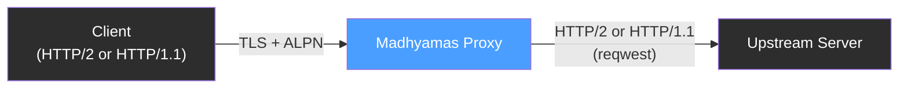
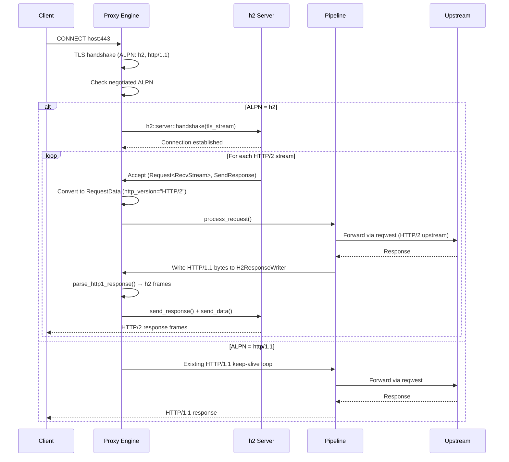

# HTTP/2 Downstream Support

> **Last verified:** 2026-08-12 against Madhyamas `0.1.6`.

Madhyamas supports HTTP/2 on the **downstream** (client-facing) side of the proxy,
enabling interception of HTTP/2 traffic including **gRPC** (which mandates HTTP/2).

## Overview



When HTTP/2 downstream is **enabled**, the proxy advertises both `h2` and
`http/1.1` via [ALPN](https://tools.ietf.org/html/rfc7301) during the TLS
handshake with the client. The negotiated protocol determines how the proxy
parses the client's requests:

| ALPN Result | Handler | `http_version` stored |
|-------------|---------|----------------------|
| `h2` | `h2` crate frame parser | `HTTP/2` |
| `http/1.1` | Existing HTTP/1.1 parser | `HTTP/1.1` |
| *(none)* | HTTP/1.1 fallback | `HTTP/1.1` |

Both paths feed into the **same interception pipeline** (rewrites, mocks,
breakpoints, upstream forwarding, traffic recording), so all features work
identically regardless of protocol.

## Enabling HTTP/2

HTTP/2 downstream is **disabled by default** for safety. Enable it via:

### Web UI

1. Open **Settings** (gear icon)
2. Go to the **General** tab
3. Under **HTTP/2**, toggle **Enable HTTP/2 Downstream**
4. Click **Save**
5. **Restart** the proxy for the change to take effect

### REST API

```bash
# Enable
curl -X PATCH http://127.0.0.1:3001/api/config \
  -H "Content-Type: application/json" \
  -d '{"enable_h2_downstream": true}'

# Verify
curl http://127.0.0.1:3001/api/config | jq .enable_h2_downstream
```

### Configuration File

The setting persists in `~/.madhyamas/config.json` and survives restarts.

> **Restart required:** The ALPN advertisement is baked into the TLS
> `ServerConfig` at startup. Changing the setting via the API or UI updates
> the stored config, but new TLS handshakes will only use the updated ALPN
> list after the proxy is restarted.

## Architecture



### Key Components

| Component | File | Description |
|-----------|------|-------------|
| ALPN negotiation | `crates/madhyamas-core/src/proxy/engine.rs` | `create_tls_server_config()` advertises `h2` + `http/1.1` when enabled |
| h2 connection handler | `crates/madhyamas-core/src/proxy/engine.rs` | `handle_h2_connection()` — h2 handshake + stream accept loop |
| h2 stream processor | `crates/madhyamas-core/src/proxy/engine.rs` | `process_h2_stream()` — converts h2 frames to `RequestData`, runs pipeline |
| H2ResponseWriter | `crates/madhyamas-core/src/proxy/engine.rs` | `AsyncWrite` adapter that buffers HTTP/1.1 bytes and re-encodes as h2 frames |
| HTTP/1.1 response parser | `crates/madhyamas-core/src/proxy/engine.rs` | `parse_http1_response()` — inverse of `build_response_bytes` |
| Config field | `crates/madhyamas-core/src/config.rs` | `ProxyConfig::enable_h2_downstream` |
| DB schema | `crates/madhyamas-core/src/traffic/store.rs` | `http_version` column on `requests` and `responses` tables |

### How It Works

1. **TLS + ALPN**: When a client sends `CONNECT host:443`, the proxy performs
   a TLS handshake. If `enable_h2_downstream` is true, the proxy's
   `ServerConfig` advertises `["h2", "http/1.1"]` via ALPN.

2. **Protocol dispatch**: After the handshake, the proxy inspects the
   negotiated ALPN protocol. If `h2`, it calls `handle_h2_connection()`.
   Otherwise, it falls through to the existing HTTP/1.1 handler.

3. **h2 handshake**: `h2::server::handshake()` performs the HTTP/2 preface
   and settings exchange on the TLS stream.

4. **Stream multiplexing**: The `h2::server::Connection` implements
   `futures::Stream`, yielding `(Request<RecvStream>, SendResponse)` pairs
   for each accepted HTTP/2 stream. Each stream is handled in an independent
   `tokio::spawn` task, enabling concurrent request processing.

5. **Request conversion**: The h2 request's method, URI, headers (excluding
   pseudo-headers), and body are converted into a protocol-agnostic
   `RequestData` with `http_version = "HTTP/2"`.

6. **Pipeline processing**: The `RequestData` runs through the same
   `Pipeline::process_request()` used by HTTP/1.1 — rewrites, mocks,
   breakpoints, upstream forwarding, and traffic recording all work
   identically.

7. **Response translation**: The pipeline serializes the response as
   HTTP/1.1 bytes (its existing contract) into `H2ResponseWriter`.
   `H2ResponseWriter::finalize()` parses those bytes back into
   `(status, headers, body)` and sends them as HTTP/2 frames via
   `SendResponse::send_response()` + `SendStream::send_data()`.

8. **Flow control**: Request body chunks are consumed with
   `FlowControl::release_capacity()` to prevent flow-control deadlocks on
   large uploads.

## Traffic Display

The **Proto** column in the traffic list shows the negotiated HTTP version:

| Value | Meaning |
|-------|---------|
| `HTTP/2` | Client negotiated HTTP/2 via ALPN |
| `HTTP/1.1` | Client used HTTP/1.1 (ALPN fallback or no ALPN) |
| `HTTP` | Plain HTTP (no TLS) |
| `HTTPS` | HTTPS with no ALPN info (legacy entries) |

The **Traffic Detail** view shows the HTTP version in both the Request and
Response tabs.

## gRPC Support

gRPC mandates HTTP/2, so enabling HTTP/2 downstream is **required** for gRPC
interception. Once enabled:

- gRPC unary calls appear in the traffic list like normal HTTP requests
- gRPC streaming calls (server-streaming, client-streaming, bidi-streaming)
  are captured as individual streams
- The gRPC panel (`/api/grpc/*`) can inspect decoded protobuf frames

## HAR Export

The HAR export includes the actual `httpVersion` field for both requests and
responses, reflecting the negotiated protocol (`HTTP/2` or `HTTP/1.1`).

## Limitations

1. **WebSocket over HTTP/2**: WebSocket upgrades use HTTP/1.1 semantics.
   [RFC 8441](https://tools.ietf.org/html/rfc8441) (WebSocket over HTTP/2
   via extended CONNECT) is not yet supported.

2. **HTTP/2 push**: Server push (`PUSH_PROMISE` frames) from the proxy to
   the client is not implemented.

3. **Trailers**: HTTP/2 trailers (response trailers) are not captured in
   the traffic store. Request trailers are consumed but not stored.

4. **Per-stream priorities**: HTTP/2 stream priorities are not preserved
   when forwarding upstream. The `reqwest` client handles its own
   prioritization.

5. **Restart required**: Changing `enable_h2_downstream` via the API
   requires a proxy restart to take effect (ALPN is set at TLS config
   creation time).

## Backward Compatibility

- Existing databases are automatically migrated: the `http_version` column
  is added with `ALTER TABLE` if it doesn't exist. Old entries have
  `http_version = NULL`, which is displayed as `HTTP/1.1`.
- The `http_version` field in `RequestData`/`ResponseData` uses
  `#[serde(default)]`, so JSON payloads without the field deserialize to
  `None` (treated as `HTTP/1.1`).
- When `enable_h2_downstream` is `false` (the default), the proxy behaves
  exactly as before — only `http/1.1` is advertised via ALPN.

## See Also

- [API_WEBSOCKET_GRPC.md](API_WEBSOCKET_GRPC.md) — gRPC and WebSocket API endpoints
- [PROXY_FLOW.md](PROXY_FLOW.md) — End-to-end proxy flow
- [ARCHITECTURE.md](ARCHITECTURE.md) — System architecture
