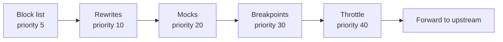
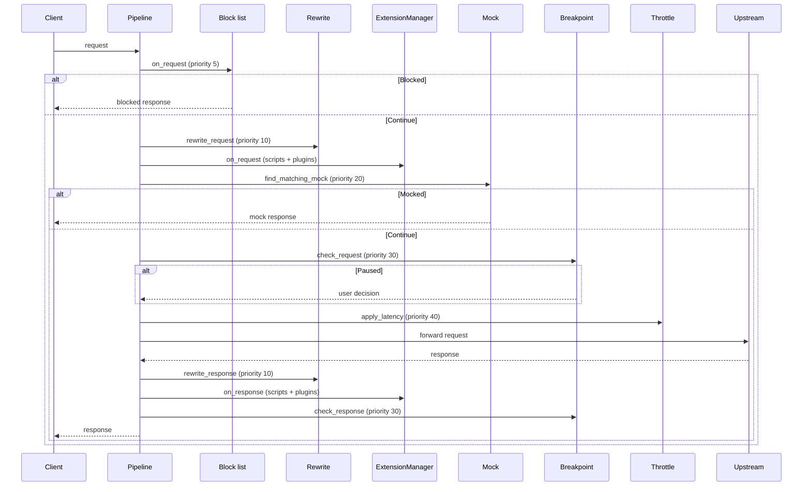

# Intercept Pipeline

> **Last verified:** 2026-08-12 against Madhyamas `0.1.6`.

## Overview

The intercept pipeline modifies, mocks, blocks, or pauses HTTP requests and
responses before they reach upstream or the client. Five handlers run in a
fixed priority order, each with a specific responsibility. The pipeline is
implemented in `crates/madhyamas-core/src/proxy/pipeline.rs` and the handler
trait is defined in `crates/madhyamas-core/src/intercept/handler.rs`.

## The `InterceptHandler` Trait

```rust
#[async_trait::async_trait]
pub trait InterceptHandler: Send + Sync {
    fn name(&self) -> &'static str;
    fn priority(&self) -> u32 { 100 }
    async fn on_request(&self, _request: &mut RequestData) -> InterceptAction {
        InterceptAction::Continue
    }
    async fn on_response(
        &self,
        _request: &RequestData,
        _response: &mut ResponseData,
    ) -> InterceptAction {
        InterceptAction::Continue
    }
}
```

- `priority()` — lower numbers run first. Default is `100`.
- `on_request` — receives a mutable `RequestData`; may modify it in place.
- `on_response` — receives the (immutable) request and a mutable `ResponseData`.

## `InterceptAction`

| Variant | Effect |
|---------|--------|
| `Continue` | Continue processing (request/response may have been modified) |
| `Respond(ResponseData)` | Short-circuit the pipeline and return this response to the client |
| `Abort` | Abort the request entirely (no response sent) |

## Handler Priority Order

Handlers run in ascending priority order. The values below are verified against
the source.



| Priority | Handler | Source | `on_request` | `on_response` |
|----------|---------|--------|--------------|---------------|
| 5 | Block list | `intercept/block_list.rs:427` | Checks host against enabled entries; returns `Respond` with configured status/body if matched | (no-op) |
| 10 | Rewrites | `intercept/handler.rs:93` | Calls `rewrite_request` to modify the request in place; returns `Continue` | Calls `rewrite_response` to modify the response in place |
| 20 | Mocks | `intercept/handler.rs:120` | Finds a matching mock; if found, builds a mock response (with configured delay) and returns `Respond` | (no-op) |
| 30 | Breakpoints | `intercept/handler.rs:143` | Checks for a matching rule; if found, pauses and waits for a user decision, then converts it to an action | Checks for a matching rule on the response; pauses and waits if matched |
| 40 | Throttle | `intercept/handler.rs:208` | Calls `apply_latency().await` to sleep for the configured latency; returns `Continue` | (no-op) |

## Full Request/Response Flow

The pipeline in `proxy/pipeline.rs` invokes handlers directly (not via a generic
loop). The exact order:



### Why this order?

- **Block list first (5)** — a blocked request should never reach upstream or
  waste cycles on rewrites/mocks.
- **Rewrites before mocks (10 < 20)** — rewrites can change the URL/headers so
  that a mock matches (or doesn't).
- **Mocks before breakpoints (20 < 30)** — a mocked request is fully
  short-circuited; the user should not be prompted for traffic that will never
  reach upstream.
- **Throttle last before forwarding (40)** — latency should be applied right
  before the actual upstream call, not before earlier handlers (which would
  delay mock responses and breakpoint prompts).

## Relationship to the Extension System

The intercept handlers and the extension system are two separate layers:

- **Intercept handlers** (`InterceptHandler`) — the built-in pipeline (block
  list, rewrites, mocks, breakpoints, throttle). Invoked directly in
  `proxy/pipeline.rs`.
- **Extensions** (`Extension`) — user-supplied scripts and plugins. Invoked via
  the `ExtensionManager` between rewrites and mocks. See
  [EXTENSION_SYSTEM.md](EXTENSION_SYSTEM.md).

The `InterceptHandler::handlers()` method exists to return a sorted list of
handlers, but the pipeline currently invokes each handler directly with
explicit calls. This keeps the flow readable and allows handler-specific
short-circuit logic.

## Adding a New Intercept Handler

1. Implement `InterceptHandler` in a new file under
   `crates/madhyamas-core/src/intercept/`.
2. Choose a `priority()` that places your handler correctly in the order above.
   Do not blindly append at the end — insert at the right priority.
3. Wire the handler into `proxy/pipeline.rs` at the correct position in the
   request/response flow.
4. Add API endpoints in `madhyamas-api` if the handler needs runtime
   configuration (see [API_INTERCEPT.md](API_INTERCEPT.md)).
5. Add a CLI subcommand and MCP tool if the feature is AI-agent-facing.

## See Also

- [EXTENSION_SYSTEM.md](EXTENSION_SYSTEM.md) — Unified scripting/plugin extension model
- [API_INTERCEPT.md](API_INTERCEPT.md) — Intercept API endpoints
- [BLOCK_LIST.md](BLOCK_LIST.md) — Block list feature
- [REWRITE_TEMPLATES.md](REWRITE_TEMPLATES.md) — Built-in rewrite templates
- [ARCHITECTURE.md](ARCHITECTURE.md) — System architecture
