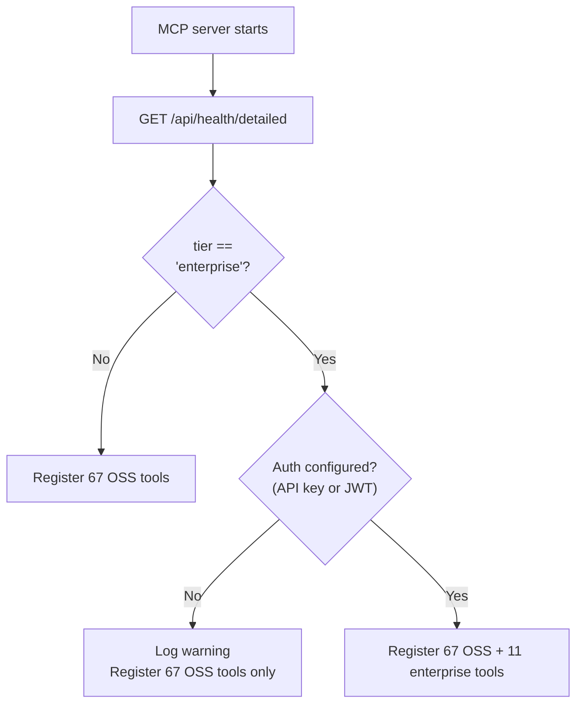

# Madhyamas MCP Integration Guide

This guide explains how to integrate Madhyamas with AI assistants like Windsurf, Claude Desktop, and other MCP-compatible tools.

## What is MCP?

The Model Context Protocol (MCP) is a standard that allows AI assistants to interact with external tools and services. Madhyamas provides an MCP server that exposes proxy functionality to AI assistants.

## Available MCP Tools

The Madhyamas MCP server provides 67 tools covering traffic inspection, mocking, breakpoints, rewrites, throttling, replay, sessions, gRPC, scripting, and plugins. In enterprise mode, 11 additional tools are registered for user management, audit, license, metrics, and config operations. Key tools include:

| Tool | Description |
|------|-------------|
| `madhyamas_get_traffic` | Get captured HTTP/HTTPS traffic with filtering |
| `madhyamas_get_traffic_entry` | Get detailed information about a specific request |
| `madhyamas_search_traffic` | Search traffic by content (headers, bodies, URLs) |
| `madhyamas_get_traffic_count` | Get total count of captured requests |
| `madhyamas_clear_traffic` | Clear all captured traffic |
| `madhyamas_get_config` | Get current proxy configuration |
| `madhyamas_update_config` | Update runtime configuration |
| `madhyamas_get_capture_status` | Check if traffic capture is enabled |
| `madhyamas_toggle_capture` | Enable/disable traffic capture |
| `madhyamas_create_mock` | Create a mock response rule |
| `madhyamas_list_mocks` | List all mock rules |
| `madhyamas_delete_mock` | Delete a mock rule |
| `madhyamas_toggle_mock` | Enable/disable a mock rule |
| `madhyamas_create_breakpoint` | Create a breakpoint rule |
| `madhyamas_list_breakpoints` | List all breakpoint rules |
| `madhyamas_delete_breakpoint` | Delete a breakpoint rule |
| `madhyamas_replay_request` | Replay a captured request |
| `madhyamas_save_request` | Save a request for later replay |
| `madhyamas_list_saved_requests` | List all saved requests |
| `madhyamas_list_sessions` | List all sessions |
| `madhyamas_create_session` | Create a new session |
| `madhyamas_export_session` | Export a session as HAR |
| `madhyamas_import_session` | Import a session from HAR |
| `madhyamas_switch_session` | Switch to a different session |
| `madhyamas_export_curl` | Export a request as a cURL command |
| `madhyamas_get_throttle` | Get current throttle settings |
| `madhyamas_set_throttle` | Set throttle profile |
| `madhyamas_toggle_throttle` | Enable/disable throttling |
| `madhyamas_list_rewrites` | List all rewrite rules |
| `madhyamas_create_rewrite` | Create a rewrite rule |
| `madhyamas_get_grpc_connections` | List gRPC connections |
| `madhyamas_list_scripts` | List all scripts |
| `madhyamas_list_plugins` | List all plugins |

For the complete list of all 67 tools with full parameter schemas, see the [skills package reference](../skills/madhyamas/references/mcp-tools.md).

## Setup Options

### Option 1: Build from Source (Recommended for Development)

```bash
# Build the unified binary
cargo build --release -p madhyamas

# Run as MCP server: target/release/madhyamas mcp
```

### Option 2: Use Docker

```bash
# Build the Docker image
docker compose build madhyamas

# The binary inside the container is at /usr/local/bin/madhyamas
# Run MCP mode: docker run --rm madhyamas:latest mcp
```

## Windsurf Integration

### Step 1: Locate Your MCP Config File

Windsurf stores MCP configuration in:
- **macOS**: `~/.codeium/windsurf/mcp_config.json`
- **Linux**: `~/.config/windsurf/mcp_config.json`
- **Windows**: `%APPDATA%\windsurf\mcp_config.json`

### Step 2: Add Madhyamas MCP Server

Edit your `mcp_config.json` file and add the Madhyamas server:

```json
{
  "mcpServers": {
    "madhyamas": {
      "command": "/absolute/path/to/madhyamas",
      "args": ["mcp"],
      "env": {
        "MADHYAMAS_API_URL": "http://localhost:3001"
      }
    }
  }
}
```

**Example for this project:**

```json
{
  "mcpServers": {
    "madhyamas": {
      "command": "/path/to/madhyamas/target/release/madhyamas",
      "args": ["mcp"],
      "env": {
        "MADHYAMAS_API_URL": "http://localhost:3001"
      }
    }
  }
}
```

### Step 3: Start Madhyamas

Make sure Madhyamas is running before using the MCP tools:

```bash
# Using Docker
./startup.sh

# Or run locally
cargo run --release
```

### Step 4: Restart Windsurf

Restart Windsurf to load the new MCP configuration.

### Step 5: Verify Integration

In Windsurf, you should now see Madhyamas tools available. Try asking:
- "Show me the recent HTTP traffic captured by Madhyamas"
- "What's the current Madhyamas configuration?"
- "Create a mock response for /api/test that returns 200 OK"

## Claude Desktop Integration

### Step 1: Locate Config File

Claude Desktop stores MCP configuration in:
- **macOS**: `~/Library/Application Support/Claude/claude_desktop_config.json`
- **Windows**: `%APPDATA%\Claude\claude_desktop_config.json`

### Step 2: Add Madhyamas Server

```json
{
  "mcpServers": {
    "madhyamas": {
      "command": "/absolute/path/to/madhyamas",
      "args": ["mcp"],
      "env": {
        "MADHYAMAS_API_URL": "http://localhost:3001"
      }
    }
  }
}
```

### Step 3: Restart Claude Desktop

Restart the application to load the new configuration.

## Environment Variables

| Variable | Default | Description |
|----------|---------|-------------|
| `MADHYAMAS_API_URL` | `http://127.0.0.1:3001` | Madhyamas API endpoint |
| `MADHYAMAS_TIMEOUT` | `30` | Request timeout in seconds |
| `RUST_LOG` | - | Set to `debug` for verbose logging |

## Docker with MCP

If running Madhyamas in Docker, the MCP server needs to connect to the Docker container's API:

```json
{
  "mcpServers": {
    "madhyamas": {
      "command": "/path/to/madhyamas",
      "args": ["mcp"],
      "env": {
        "MADHYAMAS_API_URL": "http://localhost:3001"
      }
    }
  }
}
```

Since Docker exposes port 3001 to localhost, the MCP server running on your host can connect to `http://localhost:3001`.

## Troubleshooting

### MCP Server Not Connecting

1. Verify Madhyamas is running: `curl http://localhost:3001/api/health`
2. Check the MCP binary path is correct and executable
3. Check Windsurf/Claude logs for errors

### Tools Not Appearing

1. Restart your AI assistant after config changes
2. Verify JSON syntax in config file
3. Check that the binary has execute permissions: `chmod +x madhyamas`

### Permission Denied

```bash
chmod +x /path/to/madhyamas
```

### Connection Refused

Make sure Madhyamas is running and the API port (3001) is accessible:

```bash
# Check if Madhyamas is running
curl http://localhost:3001/api/health

# If using Docker, check container status
docker compose ps
```

## Example Usage with AI Agents

Once configured, AI agents can use Madhyamas to:

- **Debug API issues**: "Show me all failed requests to /api/users in the last 10 minutes"
- **Create mocks**: "Mock all requests to /api/auth to return a valid token"
- **Replay requests**: "Replay the login request with different credentials"
- **Analyze patterns**: "What are the most common API endpoints being called?"
- **Export for sharing**: "Export the last 50 requests as HAR format"

## CLI for AI Agents

Madhyamas also provides a comprehensive CLI for AI agents that prefer shell commands:

```bash
# View captured traffic
madhyamas traffic list
madhyamas traffic get <id>
madhyamas traffic search "api.example.com"
madhyamas traffic count
madhyamas traffic clear

# Manage mocks
madhyamas mock list
madhyamas mock create --url "*/api/*" --status 200 --body '{"ok":true}'
madhyamas mock delete <id>
madhyamas mock toggle <id> --enabled true

# Manage breakpoints
madhyamas breakpoint list
madhyamas breakpoint create --url "*/auth*" --direction request
madhyamas breakpoint delete <id>

# Manage sessions
madhyamas session list
madhyamas session create --name "debug-auth"
madhyamas session switch <id>
madhyamas session export <id> --format har
```

All commands support `--json` flag for machine-readable output.

## AI Agent Skills

Madhyamas ships with a comprehensive skills package that gives AI agents procedural knowledge on how to use the proxy, CLI, and REST API. The skills are built on the [Agent Skills standard](https://agentskills.io) and support multiple AI agent harnesses.

### What's Included

- **67 MCP tools** with full parameter schemas and examples
- **58 CLI subcommands** with all flags and options
- **130+ REST API endpoints** with curl examples
- **18 workflow guides** covering traffic inspection, mocking, breakpoints, rewrites, throttling, replay, sessions, gRPC, scripting, plugins, WebSockets, export/import, troubleshooting, and harness setup

### Installing Skills

#### Via skills.sh (recommended)

Install directly from GitHub using the `skills` CLI — works across Claude Code, Cursor, Windsurf, Codex, and other supported agents:

```bash
# Install to all detected agents (interactive)
npx skills add ShristiLabs/madhyamas --skill madhyamas

# Install to a specific agent
npx skills add ShristiLabs/madhyamas --skill madhyamas -a claude-code
npx skills add ShristiLabs/madhyamas --skill madhyamas -a cursor
npx skills add ShristiLabs/madhyamas --skill madhyamas -a windsurf

# Install globally (user-level, not project-level)
npx skills add ShristiLabs/madhyamas --skill madhyamas --global

# Non-interactive (CI/CD)
npx skills add ShristiLabs/madhyamas --skill madhyamas -y

# List available skills in the repo without installing
npx skills add ShristiLabs/madhyamas --list
```

#### Via npm

```bash
# Install globally
npm install -g @madhyamas/skill

# Or as a project dev dependency
npm install --save-dev @madhyamas/skill
```

#### Via build scripts (from source)

The skills package includes build and install scripts that generate harness-specific formats:

```bash
# 1. Build skills for all target harnesses (outputs to dist/)
bash skills/madhyamas/scripts/build.sh

# 2. Install for your harness (project-level)
bash skills/madhyamas/scripts/install.sh claude      # Claude Code
bash skills/madhyamas/scripts/install.sh devin       # Devin CLI
bash skills/madhyamas/scripts/install.sh windsurf    # Windsurf
bash skills/madhyamas/scripts/install.sh cursor      # Cursor
bash skills/madhyamas/scripts/install.sh opencode    # OpenCode
bash skills/madhyamas/scripts/install.sh commandcode # CommandCode
bash skills/madhyamas/scripts/install.sh agents      # Universal (Agent Skills standard)

# Or install globally (--global flag)
bash skills/madhyamas/scripts/install.sh claude --global

# Or install to all harnesses at once
bash skills/madhyamas/scripts/install.sh all
```

After installation, restart your AI agent to load the skill.

### Supported Harnesses

| Harness | Install Target | Format |
|---------|---------------|--------|
| Agent Skills (universal) | `agents` | `.agents/skills/madhyamas/SKILL.md` |
| Claude Code | `claude` | `.claude/skills/madhyamas/SKILL.md` |
| Devin CLI | `devin` | `.devin/skills/madhyamas/SKILL.md` |
| Windsurf | `windsurf` | `.windsurf/skills/madhyamas/SKILL.md` |
| Cursor | `cursor` | `.cursor/rules/madhyamas.mdc` (flattened) |
| OpenCode | `opencode` | `.opencode/skills/madhyamas/SKILL.md` |
| CommandCode | `commandcode` | `.commandcode/skills/madhyamas/SKILL.md` |

### MCP Configuration

Use the provided config templates in `skills/madhyamas/assets/` to configure the MCP server:

```json
{
  "mcpServers": {
    "madhyamas": {
      "command": "madhyamas",
      "args": ["mcp"],
      "env": { "MADHYAMAS_API_URL": "http://127.0.0.1:3001" }
    }
  }
}
```

See `skills/madhyamas/references/harness-setup.md` for harness-specific setup instructions.

### Validating Skills

```bash
# Validate the skill package (checks structure, frontmatter, links, tool counts)
bash skills/madhyamas/scripts/validate.sh

# Preview build without writing files
bash skills/madhyamas/scripts/build.sh --dry-run
```

### Skills Directory Structure

```
skills/madhyamas/
├── SKILL.md                    # Entry point (always loaded when skill triggers)
├── references/                 # 18 detailed reference files (loaded on demand)
├── scripts/                    # build.sh, install.sh, validate.sh, pre-commit.sh
└── assets/                     # MCP config templates for each harness
```

## Enterprise MCP Tools

When the MCP server connects to an enterprise backend (detected via
`GET /api/health/detailed` returning `tier: "enterprise"`), 11 additional
tools are registered. These tools require authentication via API key or JWT.

### Authentication

Configure the MCP server with enterprise credentials:

```json
{
  "mcpServers": {
    "madhyamas": {
      "command": "madhyamas",
      "args": ["mcp"],
      "env": {
        "MADHYAMAS_API_URL": "http://localhost:3001",
        "MADHYAMAS_API_KEY": "mad_abc123..."
      }
    }
  }
}
```

Alternatively, use a JWT token via `MADHYAMAS_TOKEN`.

### Tool Registration Flow



### Enterprise Tool Reference

Source: `crates/madhyamas-mcp/src/tools/enterprise.rs`

| Tool | Annotation | Permission | Description |
|------|------------|------------|-------------|
| `madhyamas_list_users` | `read_only` | `users:read` | List all registered users |
| `madhyamas_create_user` | — | `users:write` | Create a new user (username, email, password, role) |
| `madhyamas_delete_user` | `destructive` | `users:write` | Delete a user by ID |
| `madhyamas_update_user_role` | `idempotent` | `users:write` | Update a user's role |
| `madhyamas_get_audit_events` | `read_only` | `audit:read` | Query audit events with filters |
| `madhyamas_export_audit` | `read_only` | `audit:export` | Export all audit events as JSON |
| `madhyamas_get_license_info` | `read_only` | — | Get license status and seat usage |
| `madhyamas_get_metrics` | `read_only` | — | Get performance metrics |
| `madhyamas_get_health` | `read_only` | — | Get detailed health status |
| `madhyamas_export_config` | `read_only` | `config:read` | Export full configuration as JSON |
| `madhyamas_import_config` | `idempotent` | `config:write` | Import configuration from JSON |

### Tool Annotations

Each enterprise tool includes annotations for agent safety:

| Annotation | Meaning | Tools |
|------------|---------|-------|
| `read_only` | No side effects; safe to call freely | list_users, get_audit_events, export_audit, get_license_info, get_metrics, get_health, export_config |
| `destructive` | Permanently deletes data; confirm before calling | delete_user |
| `idempotent` | Repeated calls produce the same result | update_user_role, import_config |
| `required_permission` | RBAC permission required | All tools except health/license/metrics |

### RBAC Enforcement

Enterprise MCP tools are subject to the same RBAC as interactive users. The
API key or JWT determines what the agent can do. Create API keys with only
the scopes the agent needs (principle of least privilege).

See [ENTERPRISE_API_INTEGRATION.md](ENTERPRISE_API_INTEGRATION.md) for the
trait abstractions and [API_ENTERPRISE.md](API_ENTERPRISE.md) for the
endpoint reference.

See [skills/README.md](../skills/README.md) for complete documentation.
