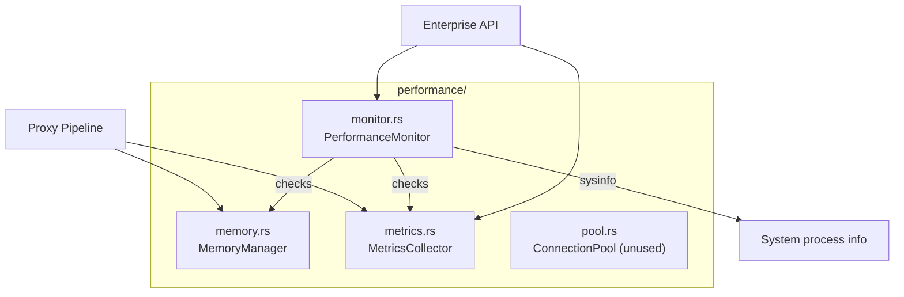

# Performance Monitoring

> **Last verified:** 2026-08-12 against Madhyamas `0.1.6`.

## Overview

The performance module (`crates/madhyamas-core/src/performance/`) provides
memory tracking, metrics collection, alerting, and a connection pool. It is
exposed via the enterprise endpoints `/metrics`, `/performance`, and
`/health/detailed` (see [API_ENTERPRISE.md](API_ENTERPRISE.md)).

## Memory Manager (`memory.rs`)

`MemoryManager` tracks bytes and entry counts against configurable limits using
atomic counters.

| Limit | Default |
|-------|---------|
| `max_memory_bytes` | 500 MB |
| `max_entries` | 100,000 |

### Pressure detection

- `is_under_pressure()` returns `true` when usage exceeds **80%** of either limit.
- `check_memory()` returns a `MemoryPressure` value:
  - `Normal` — within limits
  - `Pressure` — above 80% but no specific cleanup target
  - `Cleanup { target_bytes }` — over the limit; free at least `target_bytes`

### Garbage collection

`GarbageCollectionConfig`:

| Field | Default | Description |
|-------|---------|-------------|
| `min_interval` | 60s | Minimum time between GC runs |
| `target_usage_percent` | 70 | Target usage after GC |
| `aggressiveness` | 5 (1-10) | How aggressively to evict |
| `preserve_recent_secs` | 300 | Don't evict entries newer than this |

GC triggers are time-based (`min_interval`) or pressure-based. After GC,
`gc_completed(freed_bytes, freed_entries)` updates the counters.

`MemoryStats` exposes: `used_bytes`, `max_bytes`, `usage_percent`,
`entry_count`, `max_entries`, `entry_usage_percent`, `is_under_pressure`,
`auto_gc_enabled`, and a `format_bytes()` helper.

## Metrics Collector (`metrics.rs`)

`MetricsCollector` tracks 16 metrics via atomic counters:

| Metric | Description |
|--------|-------------|
| `request_count` / `response_count` / `error_count` | Request lifecycle counts |
| `bytes_received` / `bytes_sent` | Total bytes transferred |
| `total_latency_ns` / `avg_latency_ms` | Latency tracking |
| `active_connections` | Current HTTP connections |
| `websocket_connections` | Current WebSocket connections |
| `grpc_streams` | Current gRPC streams |
| `breakpoint_hits` / `mock_hits` / `rewrite_applications` | Intercept feature usage |
| `script_executions` / `plugin_invocations` | Extension usage |
| `requests_per_second` | Throughput (computed in `snapshot()`) |

### Latency histogram

Exponential buckets (ms): 1, 5, 10, 25, 50, 100, 250, 500, 1000, 2500, 5000,
10000+. Stored as `HashMap<u64, u64>` (bucket upper bound → count).

`Metrics` (the snapshot type) includes all of the above plus `uptime_secs` and
the latency histogram. `PerformanceStats` bundles `Metrics` + `MemoryInfo` +
`PoolStats`.

## Performance Monitor (`monitor.rs`)

`PerformanceMonitor` runs a background task that periodically checks metrics and
memory, emitting alerts when thresholds are crossed.

### Alert configuration (`AlertConfig`)

| Field | Default | Description |
|-------|---------|-------------|
| `enabled` | true | Enable alerting |
| `memory_threshold` | 85.0% | Memory usage alert threshold |
| `error_rate_threshold` | 10.0% | Error rate alert threshold |
| `latency_threshold_ms` | 1000 | Average latency alert threshold |
| `throughput_threshold` | 10.0 req/s | Low-throughput alert threshold |
| `cooldown_period_secs` | 300 | Per-alert-kind cooldown to prevent flooding |

### Alert kinds and levels

Kinds: `HighLatency`, `HighErrorRate`, `LowThroughput`, `HighMemory`.
Levels: `Info`, `Warning`, `Critical`.

Alerts are appended to a log (max 200, FIFO eviction). `get_health()` derives a
`HealthStatus` (`Healthy`, `Warning`, `Critical`, `Unknown`) from the highest
alert level.

### Health checks

`system_health()` uses the `sysinfo` crate for real process memory (RSS) and
returns a `HealthCheck` with: `healthy`, `version`, `uptime_secs`,
`memory_usage_mb`, `active_connections`, and additional details.

## Connection Pool (`pool.rs`)

`ConnectionPool` is **implemented but intentionally unused**. The proxy engine
relies on reqwest's internal connection pool for HTTP/HTTPS, and WebSocket
connections are long-lived (not poolable). The module is retained for future
use if the engine changes. `PooledConnection` only tracks metadata, not actual
sockets.

## See Also

- [API_ENTERPRISE.md](API_ENTERPRISE.md) — `/metrics`, `/performance`, `/health/detailed` endpoints
- [ENTERPRISE.md](ENTERPRISE.md) — Enterprise feature overview
- [RECORDING_LIMITS.md](RECORDING_LIMITS.md) — Recording size limits (related to memory management)
- [ARCHITECTURE.md](ARCHITECTURE.md) — System architecture
