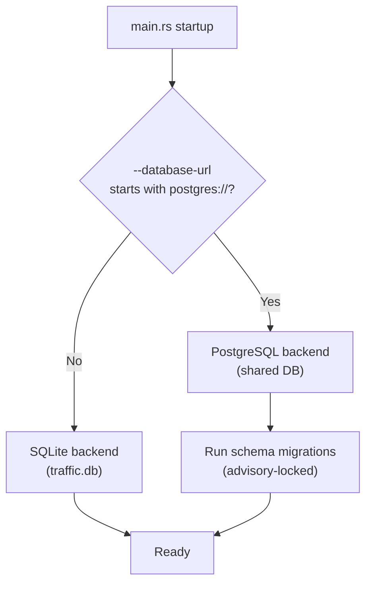
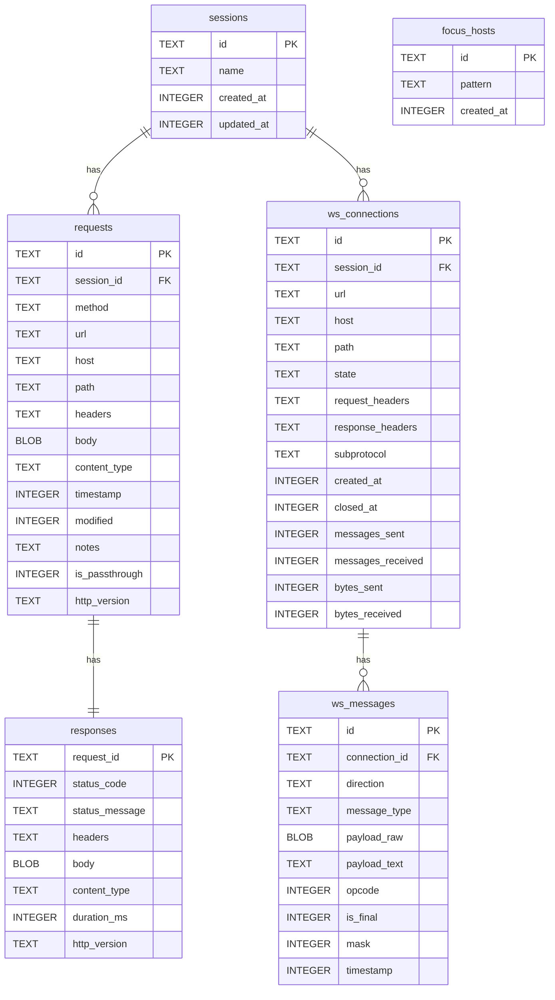
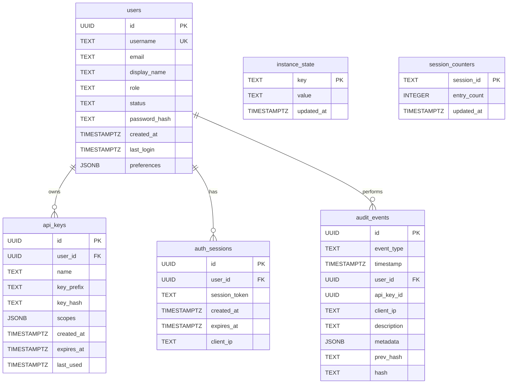

# Persistence Layer

> **Last verified:** 2025-01 against Madhyamas `0.1.6` (PostgreSQL backend implemented).

## Overview

Madhyamas persists traffic, sessions, intercept rules, scripts, and plugins to
SQLite (OSS) or PostgreSQL (enterprise). The persistence layer is split across
three stores:

- **Traffic store** — `crates/madhyamas-core/src/traffic/store.rs` (SQLite) or `crates/madhyamas-core/src/storage/postgres/traffic.rs` (PostgreSQL)
- **Intercept store** — `crates/madhyamas-core/src/storage/sqlite/intercept.rs` (SQLite) or `crates/madhyamas-core/src/storage/postgres/intercept.rs` (PostgreSQL)
- **Config store** — `crates/madhyamas-core/src/persistence/config_store.rs`

The `Persistable` trait (`persistence/mod.rs`) defines a common interface for
in-memory state that can be saved/loaded.

### Backend Selection



The backend is selected automatically based on `--database-url`. SQLite is the
default (no flag needed); PostgreSQL requires `--database-url postgres://...`.

## SQLite Schema



### PRAGMA settings

- `synchronous=NORMAL` — safe with WAL mode, faster than FULL.
- `cache_size=-64000` — 64 MB page cache for read performance.

## Traffic Store (`traffic/store.rs`)

Tables: `sessions`, `requests`, `responses`, `ws_connections`, `ws_messages`,
`focus_hosts`. Relationships:

- `sessions` 1:N `requests`
- `requests` 1:1 `responses`
- `sessions` 1:N `ws_connections`
- `ws_connections` 1:N `ws_messages`

Indexes optimize the common query patterns: per-session lookups, URL/method
filtering, and timestamp ordering.

## Intercept Store (`storage/sqlite/intercept.rs`)

Stores the five intercept rule types plus the throttle profile. Each rule table
includes `enabled`, `priority`, `hit_count`, and timestamps.

| Table | Key columns | Notes |
|-------|-------------|-------|
| `mock_rules` | `id`, `name`, `condition` (JSON), `response_config` (JSON), `enabled`, `priority`, `hit_count`, `collection_id`, `tags` | Indexes on `enabled` and `priority`; schema migration for old 8-column format |
| `rewrite_rules` | `id`, `name`, `condition` (JSON), `direction` (JSON), `rewrites` (JSON), `enabled`, `priority`, `hit_count` | Indexes on `enabled` and `priority` |
| `breakpoint_rules` | `id`, `name`, `condition` (JSON), `direction` (JSON), `enabled`, `priority` | Index on `enabled` |
| `throttle_profile` | `id` (single-row, `CHECK (id = 1)`), `download_bps`, `upload_bps`, `latency_ms`, `jitter_ms`, `packet_loss_percent`, `enabled` | Singleton row |
| `block_list_entries` | `id`, `pattern`, `note`, `enabled`, `hit_count`, `status_code`, `response_body`, `content_type` | Index on `enabled` |

`export_all()` and `import_all()` serialize all rules to/from a single JSON
bundle (exposed via `/api/persistence/export` and `/api/persistence/import`).

## Config Store (`persistence/config_store.rs`)

A simple key-value store backed by a single table:

```sql
CREATE TABLE IF NOT EXISTS config (
    key TEXT PRIMARY KEY,
    value TEXT NOT NULL
)
```

Values are JSON-serialized. `PersistedConfig` is the typed wrapper for the
common config keys (proxy/api addresses, cert/data dirs, log level, theme,
window size, column widths, custom settings).

## `Persistable` Trait

```rust
pub trait Persistable {
    fn save(&self) -> Result<()>;
    fn load(&self) -> Result<()>;
    fn clear(&self) -> Result<()>;
    fn size(&self) -> usize;
}
```

Implemented by `ReplayManager`, `WsManager`, and `GrpcManager`. Note: the
current implementations are in-memory no-ops — these managers keep state in
memory for the lifetime of the process.

## Session Model (`session.rs`)

`SessionManager` wraps `TrafficStore` to provide session CRUD, export/import,
and presets:

- `SessionMetadata` / `SessionSummary` — session descriptors with request counts.
- `SessionExport` — versioned export format (currently `"1.0"`) containing the
  session metadata and all traffic entries.
- `SessionPreset` — built-in presets: "API Debugging", "Mobile App",
  "Performance Testing" (auto-clears entries older than 24h).

## Data Directory

All SQLite databases live under `~/.madhyamas/` (certs, logs, `traffic.db`,
plugins). The path can be overridden via configuration.

## PostgreSQL Schema (Enterprise)

When `--database-url` points to PostgreSQL, the same core tables are created
with PostgreSQL-specific types and optimizations. Enterprise-only tables are
also created for users, audit, API keys, and multi-instance coordination.

### Core Tables (PostgreSQL)

The PostgreSQL implementation mirrors the SQLite schema but uses:
- `UUID` instead of `TEXT` for IDs
- `TIMESTAMPTZ` instead of `INTEGER` for timestamps
- `JSONB` instead of `TEXT` for headers and metadata
- `BYTEA` instead of `BLOB` for bodies
- `GIN` indexes on `JSONB` columns for fast header/metadata queries
- `BRIN` indexes on `TIMESTAMPTZ` columns for time-range queries
- `pg_trgm` trigram indexes for fast `LIKE`/regex URL matching

### Enterprise Tables



| Table | Purpose |
|-------|---------|
| `users` | User accounts with Argon2id password hashes |
| `api_keys` | API keys for automation (hashed storage, prefix for display) |
| `auth_sessions` | JWT refresh token sessions |
| `audit_events` | Tamper-evident audit log with SHA-256 hash chain |
| `instance_state` | Shared key-value store for multi-instance coordination |
| `session_counters` | O(1) entry count lookups (avoids `COUNT(*)` on large tables) |

### Advisory Locks

PostgreSQL advisory locks serialize concurrent operations across instances:

| Lock Key | Purpose |
|----------|---------|
| `pg_advisory_xact_lock(1)` | Schema migrations (CREATE TABLE/EXTENSION) |
| `pg_advisory_xact_lock(2)` | Entry limit enforcement (atomic prune) |
| `pg_advisory_xact_lock(3)` | Audit hash chain insertion |

### Multi-Instance State

The `instance_state` table stores shared key-value pairs that all instances
read and write:

| Key | Value | Purpose |
|-----|-------|---------|
| `current_session_id` | UUID | Active session across instances |
| `capture_enabled` | `true`/`false` | Capture state synchronized across instances |
| `config_version` | integer | Monotonic config version for change detection |

Instances periodically call `sync_current_session()` to stay in sync.

## See Also

- [API_CONFIG.md](API_CONFIG.md) — Persistence API endpoints
- [ARCHITECTURE.md](ARCHITECTURE.md) — System architecture
- [RECORDING_LIMITS.md](RECORDING_LIMITS.md) — Recording size limits and FIFO pruning
- [HAR_IMPORT.md](HAR_IMPORT.md) — HAR import/export
- [STORAGE_BACKEND_GUIDE.md](STORAGE_BACKEND_GUIDE.md) — Implementing custom storage backends
- [ENTERPRISE_CRATE_GUIDE.md](ENTERPRISE_CRATE_GUIDE.md) — Enterprise crate structure
- [ENTERPRISE_MULTI_INSTANCE.md](ENTERPRISE_MULTI_INSTANCE.md) — Multi-instance deployment
