# Madhyamas — Proxy Flow & Internals

This document explains in detail how the Madhyamas proxy works end‑to‑end:
how connections are accepted, how TLS/HTTPS interception is performed, how
certificates are generated and used, how traffic is stored, and how it is
displayed in the web UI. Mermaid diagrams are used throughout.

> Source references use `<ref_file />` / `<ref_snippet />` tags so you can
> jump directly to the relevant code.

---

## 1. High‑Level Architecture

Madhyamas is a single unified binary that runs three cooperating subsystems
inside one process:

1. **Proxy engine** (`madhyamas-core::proxy`) — listens on the proxy port
   (default `8888`), accepts TCP connections, performs TLS interception, and
   forwards traffic to upstream servers.
2. **API + Web UI server** (`madhyamas-api`) — listens on the API port
   (default `3001`), serves the embedded React SPA, exposes the REST API,
   and pushes real‑time traffic updates over a WebSocket.
3. **Traffic store** (`madhyamas-core::traffic`) — a SQLite database that
   persists every captured request/response.

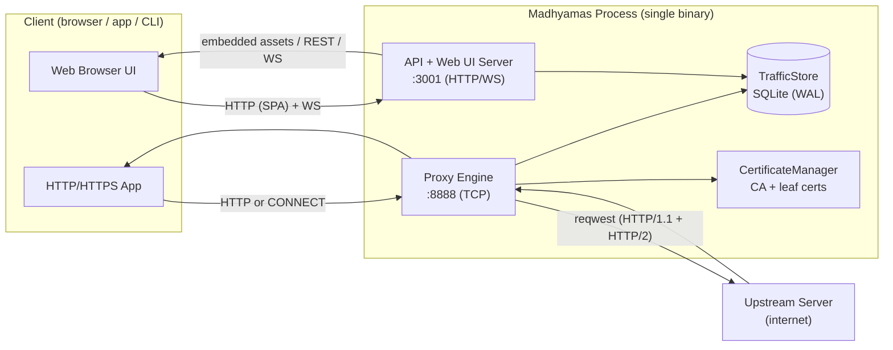

The binary entry point wires everything together in `run_proxy_server`:
<ref_snippet file="/Users/harikiranbavineni/madhyamas/crates/madhyamas/src/main.rs" lines="225-364" />

---

## 2. Connection Lifecycle (HTTP vs HTTPS)

When a client connects to the proxy port, the engine peeks the first bytes
to decide whether this is a plain HTTP request or an HTTPS `CONNECT`
tunnel. The two paths then diverge.

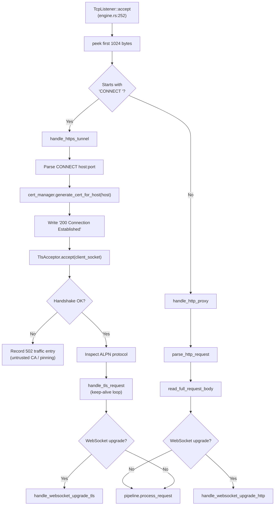

Source: <ref_file file="/Users/harikiranbavineni/madhyamas/crates/madhyamas-core/src/proxy/engine.rs" />

The peek/branch logic lives in `handle_connection`:
<ref_snippet file="/Users/harikiranbavineni/madhyamas/crates/madhyamas-core/src/proxy/engine.rs" lines="275-320" />

---

## 3. Certificate Management & TLS Handshake

HTTPS interception requires a man‑in‑the‑middle TLS termination. Madhyamas
generates a per‑host leaf certificate signed by a locally‑generated CA. The
user installs this CA into their system/browser trust store once; afterwards
the proxy can present valid‑looking certificates for any HTTPS host.

### 3.1 CA Certificate Lifecycle

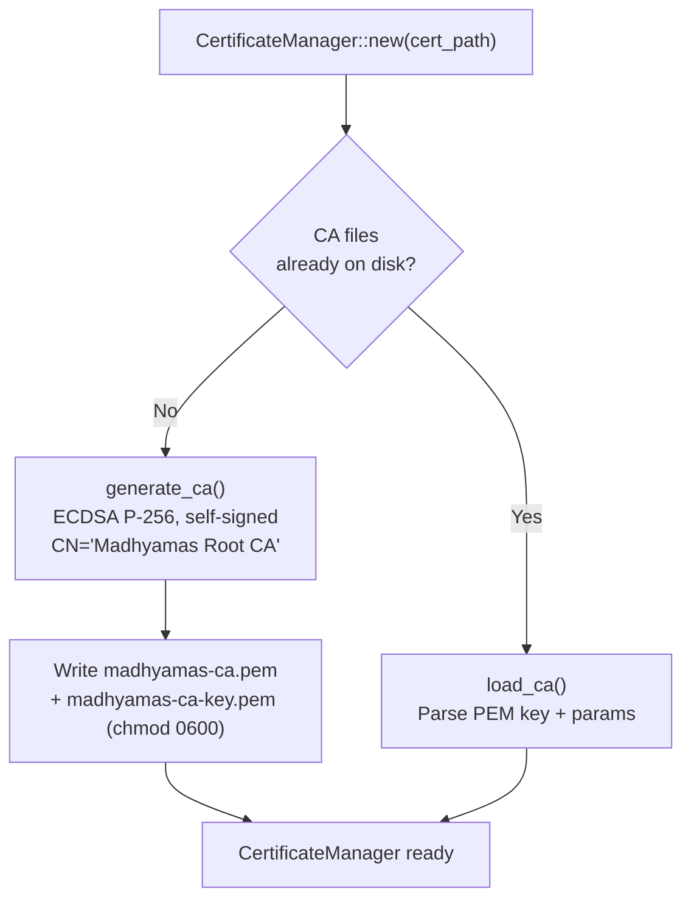

The CA is generated once using `rcgen` with ECDSA‑P256‑SHA256 and stored in
`~/.madhyamas/certs/`. The private key is locked to `0600` on Unix.
<ref_snippet file="/Users/harikiranbavineni/madhyamas/crates/madhyamas-core/src/tls/certificate.rs" lines="47-159" />

### 3.2 Per‑Host Leaf Certificate Generation

For every distinct HTTPS host the proxy signs a leaf certificate on demand.
Certificates are cached in memory with a 24h TTL and a 10 000‑entry LRU
cap to avoid re‑signing on every request.

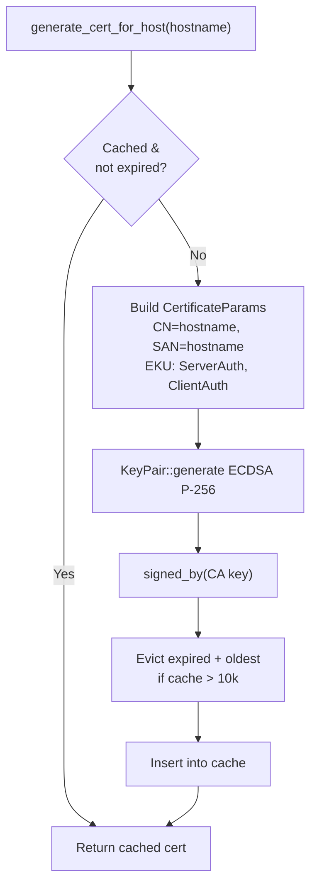

<ref_snippet file="/Users/harikiranbavineni/madhyamas/crates/madhyamas-core/src/tls/certificate.rs" lines="170-252" />

### 3.3 TLS Handshake with the Client (Downstream)

Once the `CONNECT` request is parsed and a leaf cert is generated, the
proxy:

1. Sends `HTTP/1.1 200 Connection Established\r\n\r\n` to the client.
2. Builds a `rustls::ServerConfig` with the leaf cert chain + private key.
3. **Advertises only `http/1.1` via ALPN** (not `h2`) — the proxy cannot
   yet parse HTTP/2 frames on the downstream side. Forcing HTTP/1.1 here
   avoids binary garbage and 502 errors, while the **upstream** leg can
   still negotiate HTTP/2 via `reqwest`.
4. Runs `TlsAcceptor::accept`. If it fails (typical cause: the client
   does not trust the CA — common with Android cert pinning), a 502
   traffic entry is recorded so the failed attempt is visible in the UI.

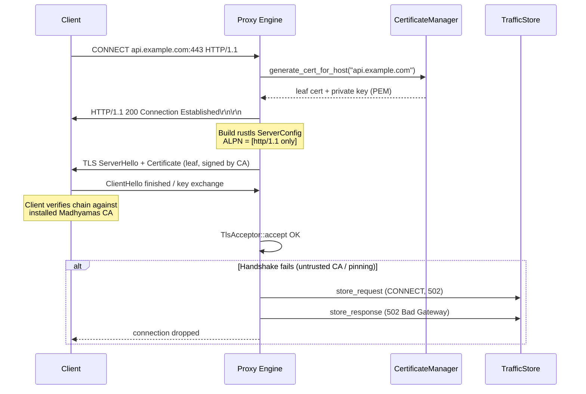

Source for the handshake and ALPN policy:
<ref_snippet file="/Users/harikiranbavineni/madhyamas/crates/madhyamas-core/src/proxy/engine.rs" lines="322-448" />

### 3.4 TLS to the Upstream Server

When forwarding to an HTTPS upstream, the proxy uses `reqwest`, which
performs its own ALPN negotiation (HTTP/1.1 or HTTP/2) with the real
server. For raw WebSocket upgrades the engine builds a
`rustls::ClientConfig` with a `SkipServerVerification` verifier (it must
trust the upstream cert without relying on the system root store because
the proxy itself is the MITM).
<ref_snippet file="/Users/harikiranbavineni/madhyamas/crates/madhyamas-core/src/proxy/engine.rs" lines="634-642" />

### 3.5 Trust Model Summary

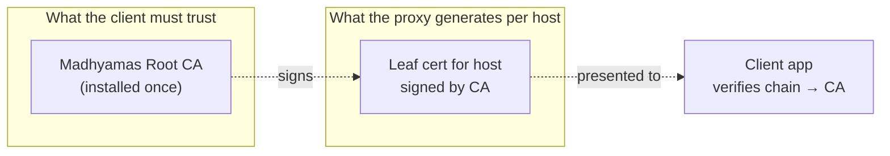

> **Important**: Without installing the CA, every HTTPS site will fail with
> a TLS handshake error. The proxy records these as 502 entries so they are
> visible in the UI rather than silently dropped.

---

## 4. Request Processing Pipeline

Both the HTTP and HTTPS paths converge on a shared `Pipeline::process_request`
which runs the full interception chain. The pipeline borrows the various
managers from the engine for the lifetime of one (or many, on keep‑alive)
requests.

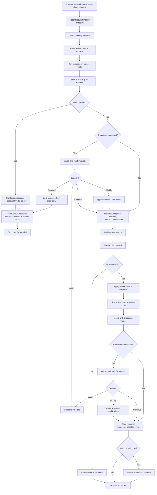

Source: <ref_file file="/Users/harikiranbavineni/madhyamas/crates/madhyamas-core/src/proxy/pipeline.rs" />

Key entry point: <ref_snippet file="/Users/harikiranbavineni/madhyamas/crates/madhyamas-core/src/proxy/pipeline.rs" lines="226-496" />

### 4.1 Upstream Forwarding (`reqwest`)

The proxy does **not** manually open a TCP socket to the upstream. Instead
it builds a `reqwest::Client` per request with:

- `redirect(Policy::none())` — the proxy must return 3xx to the client
  unchanged.
- `no_proxy()` — prevents a feedback loop if the host has system proxy
  env vars.
- `gzip/deflate/brotli = false` — the **raw compressed body** is stored
  and the `Content-Encoding` header is preserved, so the web UI can
  toggle between compressed and decompressed views. The client receives
  the original compressed bytes and decompresses normally.
- HTTP/1.1 **and** HTTP/2 enabled — ALPN picks the best protocol with the
  upstream.

Hop‑by‑hop headers (`Connection`, `Keep-Alive`, `Transfer-Encoding`,
`Upgrade`, `Proxy-Connection`, `TE`, `Host`, `Content-Length`) are stripped
before forwarding; `Host` is omitted because `reqwest` sets `:authority`
from the URL (sending both causes HTTP/2 PROTOCOL_ERROR resets).

<ref_snippet file="/Users/harikiranbavineni/madhyamas/crates/madhyamas-core/src/proxy/pipeline.rs" lines="688-827" />

### 4.2 Self‑Exclusion (Feedback Loop Prevention)

The pipeline skips capturing requests whose `Host` ends with `:api_port`
or whose URL contains `:{api_port}/api/` — this prevents the web UI's own
API calls from appearing in the traffic list.
<ref_snippet file="/Users/harikiranbavineni/madhyamas/crates/madhyamas-core/src/proxy/pipeline.rs" lines="136-153" />

---

## 5. Traffic Storage (SQLite)

All captured traffic is persisted in a single SQLite database at
`~/.madhyamas/traffic.db` (configurable via `--db-path`).

### 5.1 Database Schema

```mermaid
erDiagram
    sessions ||--o{ requests : has
    requests ||--o| responses : has
    sessions ||--o{ ws_connections : has
    ws_connections ||--o{ ws_messages : has

    sessions {
        TEXT id PK
        TEXT name
        INTEGER created_at
        INTEGER updated_at
    }
    requests {
        TEXT id PK
        TEXT session_id FK
        TEXT method
        TEXT url
        TEXT host
        TEXT path
        TEXT headers "JSON"
        BLOB body
        TEXT content_type
        INTEGER timestamp
        INTEGER modified
        TEXT notes
    }
    responses {
        TEXT request_id PK_FK
        INTEGER status_code
        TEXT status_message
        TEXT headers "JSON"
        BLOB body
        TEXT content_type
        INTEGER duration_ms
    }
    ws_connections {
        TEXT id PK
        TEXT session_id FK
        TEXT url
        TEXT host
        TEXT path
        TEXT state
        TEXT request_headers
        TEXT response_headers
        TEXT subprotocol
        INTEGER created_at
        INTEGER closed_at
        INTEGER messages_sent
        INTEGER messages_received
        INTEGER bytes_sent
        INTEGER bytes_received
    }
    ws_messages {
        TEXT id PK
        TEXT connection_id FK
        TEXT direction
        TEXT message_type
        BLOB payload_raw
        TEXT payload_text
        INTEGER opcode
        INTEGER is_final
        INTEGER mask
        INTEGER timestamp
    }
```

Schema creation: <ref_snippet file="/Users/harikiranbavineni/madhyamas/crates/madhyamas-core/src/traffic/store.rs" lines="82-187" />

### 5.2 SQLite Pragmas (Performance)

The store tunes SQLite for a high‑write proxy workload:

| Pragma | Value | Why |
|--------|-------|-----|
| `journal_mode` | `WAL` | Concurrent readers + single writer, no reader/writer blocking |
| `synchronous` | `NORMAL` | Safe with WAL, much faster than FULL |
| `busy_timeout` | `5000ms` | Avoids "database is locked" under burst writes |
| `cache_size` | `-64000` (64 MB) | Larger page cache for faster reads |

<ref_snippet file="/Users/harikiranbavineni/madhyamas/crates/madhyamas-core/src/traffic/store.rs" lines="82-101" />

### 5.3 Write Path (Request → Response)

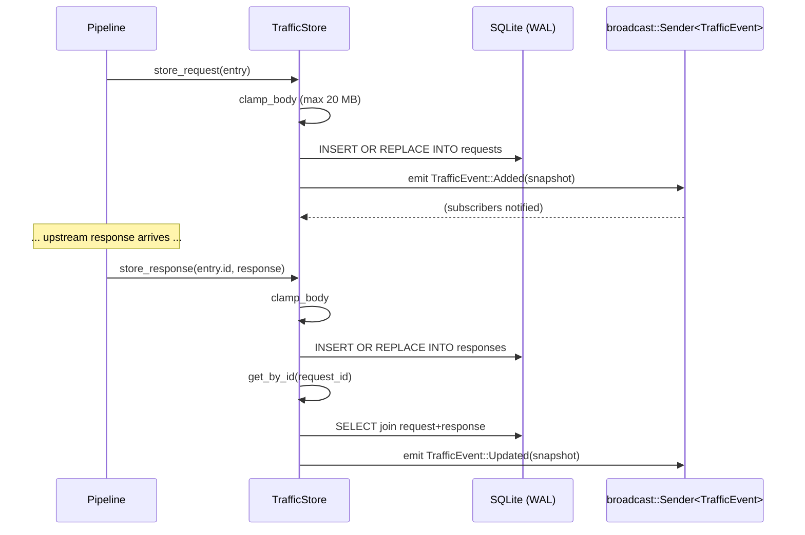

- **Capture toggle**: if `capture_enabled == false`, both `store_request`
  and `store_response` return early (passthrough mode).
- **Body truncation**: bodies larger than `max_body_size` (default 20 MB)
  are truncated before being written.
- **Snapshots**: events carry a `TrafficEntrySnapshot` that **excludes**
  the body bytes — only metadata + sizes — to keep WebSocket messages
  small. The full body is fetched on demand via `GET /api/traffic/{id}`.

<ref_snippet file="/Users/harikiranbavineni/madhyamas/crates/madhyamas-core/src/traffic/store.rs" lines="269-350" />

### 5.4 Read Path (Query / Filter)

`get_traffic` builds a parameterized SQL query against `requests LEFT JOIN
responses`, applying optional filters: `url_pattern`, `method`, status
range, `search`, `file_type`, `header`, `cookie`, `limit`, `offset`.
Results are ordered by `timestamp DESC`.

<ref_snippet file="/Users/harikiranbavineni/madhyamas/crates/madhyamas-core/src/traffic/store.rs" lines="353-506" />

---

## 6. Real‑Time Display (WebSocket + React UI)

### 6.1 Two‑Channel Update Model

The web UI receives traffic updates through **two** cooperating channels:

1. **REST** (`GET /api/traffic`, `GET /api/traffic/{id}`) — used for the
   initial list, filtering, and fetching full bodies on demand.
2. **WebSocket** (`GET /api/ws`) — used for live, push‑based updates as
   traffic is captured.

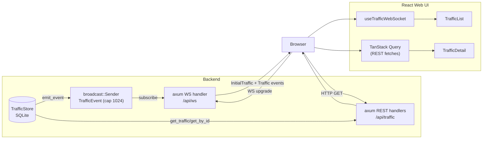

### 6.2 WebSocket Message Protocol

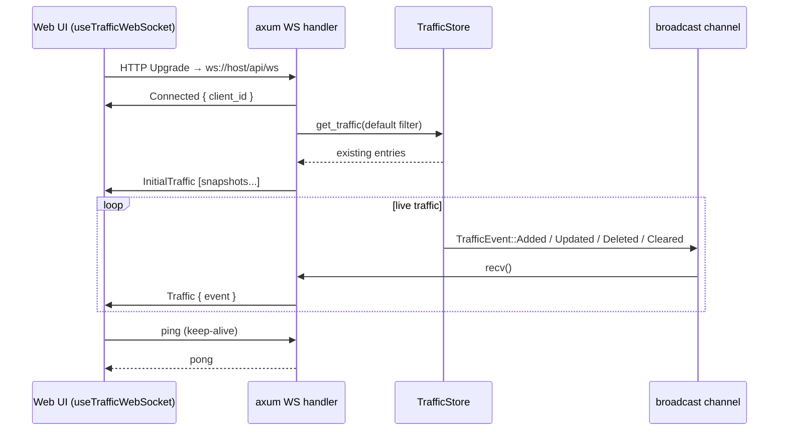

Server‑side message types (`WsServerMessage`):
<ref_snippet file="/Users/harikiranbavineni/madhyamas/crates/madhyamas-core/src/traffic/events.rs" lines="80-114" />

The axum handler subscribes to the store's broadcast channel, sends the
initial traffic snapshot, then forwards every subsequent event to the
client. Lagged receivers (slow clients) log a warning and keep going.
<ref_file file="/Users/harikiranbavineni/madhyamas/crates/madhyamas-api/src/ws.rs" />

### 6.3 Frontend State Machine

The React hook `useTrafficWebSocket` drives the in‑memory traffic list:

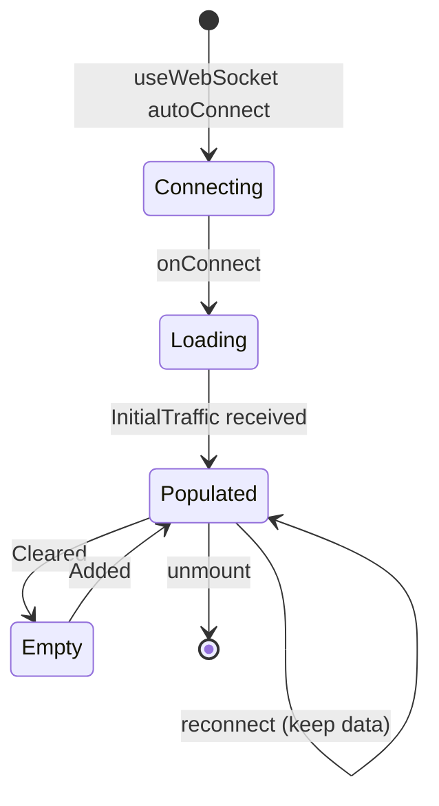

<ref_file file="/Users/harikiranbavineni/madhyamas/web/src/hooks/useTrafficWebSocket.ts" />

When the user clicks a row, `TrafficDetail` fetches the **full** entry
(including bodies) via `GET /api/traffic/{id}` and renders headers, body
(JSON/formatted), and timing. The list view only ever holds the
lightweight `TrafficEntrySnapshot` (no body bytes), keeping memory and
bandwidth low.

---

## 7. End‑to‑End Sequence (HTTPS Request)

The following sequence ties everything together for a single HTTPS request
from a configured client to an upstream server, with capture enabled and no
mocks/breakpoints matching.

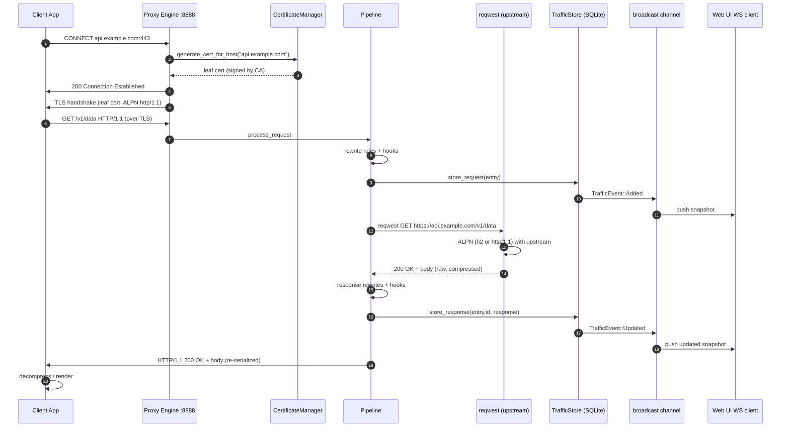

---

## 8. Component Map (Crate Level)

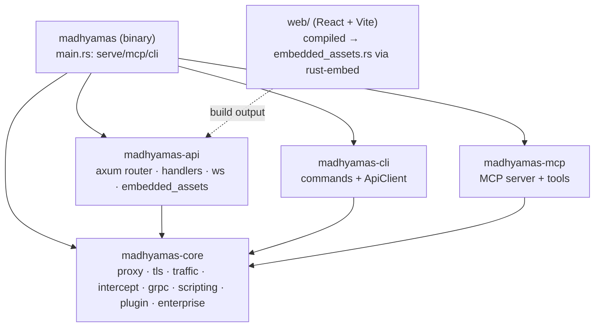

The web UI is built with Vite (`cd web && npm run build`) and the resulting
`web/dist/` is embedded into the `madhyamas-api` crate at compile time via
`rust-embed`, so the released binary is fully self‑contained. A
`MADHYAMAS_WEB_DIR` env var can override to serve from disk for dev.
<ref_file file="/Users/harikiranbavineni/madhyamas/crates/madhyamas-api/src/embedded_assets.rs" />

---

## 9. Key Design Decisions Recap

| Decision | Rationale |
|----------|-----------|
| **Per‑host leaf certs signed by a local CA** | Allows transparent HTTPS interception without per‑site setup; user installs CA once. |
| **ALPN advertises only `http/1.1` downstream** | Proxy cannot parse HTTP/2 frames on the client side yet; forcing HTTP/1.1 avoids 502 garbage. Upstream still uses HTTP/2 via `reqwest`. |
| **`reqwest` for upstream forwarding** | Handles HTTP/2, chunked encoding, connection pooling, and proper header handling without reimplementing HTTP. |
| **No auto‑decompression in `reqwest`** | Preserves the raw compressed body + `Content-Encoding` so the UI can toggle views and the client gets the original bytes. |
| **SQLite + WAL** | High‑write proxy workload with concurrent readers; WAL avoids reader/writer blocking. |
| **Snapshot vs full entry over WS** | WebSocket pushes metadata only (no bodies); full bodies are fetched on demand via REST, keeping live updates cheap. |
| **Self‑exclusion of `:api_port` requests** | Prevents the web UI's own API calls from creating a feedback loop in the traffic list. |
| **TLS handshake failures recorded as 502** | Makes failed interception attempts (e.g. cert pinning) visible in the UI instead of silently dropping them. |
| **Embedded web assets (`rust-embed`)** | Single self‑contained binary; no external file dependencies at runtime. |
