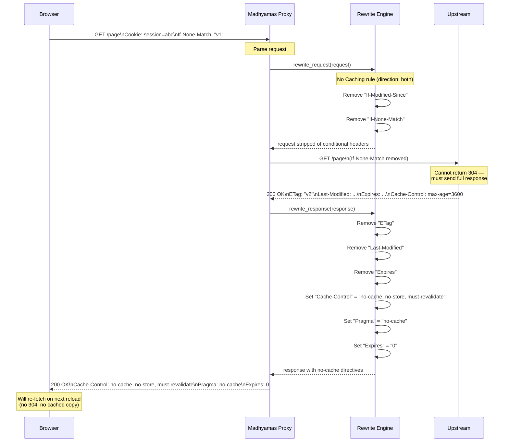
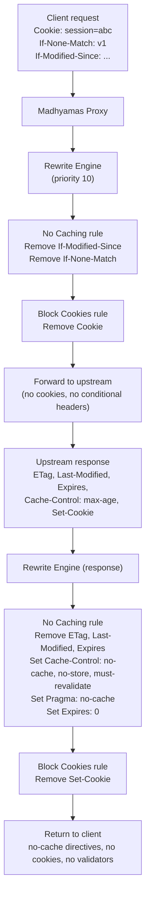

# Rewrite Templates

> **Last verified:** 2026-08-12 against Madhyamas `0.1.6`.

Rewrite templates are pre-built rewrite rules that solve common debugging
scenarios with a single click. Instead of manually configuring individual
header manipulations, you pick a template and Madhyamas creates a fully
configured rewrite rule for you. You can then customize the rule (for example,
restrict it to specific hosts) or use it as-is.

This guide documents all available templates, with detailed coverage of the
**No Caching** and **Block Cookies** tools.

---

## Available Templates

| Template | Direction | Actions | Use Case |
|----------|-----------|---------|----------|
| Add CORS Headers | Response | 3 | Add `Access-Control-Allow-*` headers to responses |
| HTTP to HTTPS | Request | 1 | Redirect HTTP requests to HTTPS |
| Add Auth Header | Request | 1 | Add a `Authorization: Bearer ...` header to requests |
| Remove Security Headers | Response | 2 | Strip CSP / `X-Frame-Options` for testing |
| **No Caching** | Both | 8 | Disable all client/intermediary caching |
| **Block Cookies** | Both | 2 | Strip cookies from requests and responses |

Templates are available from three places:

- **Web UI** — *Rewrites* panel → *Create* → *Quick Templates* picker
- **REST API** — `GET /api/rewrites/templates`
- **Programmatic** — `madhyamas_core::intercept::RewriteTemplates` in Rust

---

## Where Templates Fit in the Pipeline

Rewrite rules run at **priority 10** in the intercept pipeline — after the
block list (5) but before mocks (20), breakpoints (30), and throttle (40).
Templates with `direction: both` apply actions on both the request and the
response.

```mermaid
flowchart LR
    subgraph RequestSide["Request path (priority order)"]
        direction TB
        R1["Block List<br/>(priority 5)"] --> R2["Rewrites ← templates apply here<br/>(priority 10)"]
        R2 --> R3["Mocks<br/>(priority 20)"]
        R3 --> R4["Breakpoints<br/>(priority 30)"]
        R4 --> R5["Throttle<br/>(priority 40)"]
    end
    R5 --> UP["Forward to upstream"]
    UP --> RESP["Response from upstream"]
    subgraph ResponseSide["Response path (reverse priority)"]
        direction TB
        S5["Throttle"] --> S4["Breakpoints"]
        S4 --> S3["Mocks"]
        S3 --> S2["Rewrites ← templates apply here<br/>(priority 10)"]
        S2 --> S1["Block List (no-op on responses)"]
    end
    RESP --> S5
    S1 --> CLIENT["Return to client"]
```



---

## No Caching Tool

### What it does

The **No Caching** template prevents clients and intermediary caches from
serving stale content. It ensures every request through the proxy reaches
the upstream server and returns the latest response — essential when you
are debugging and need to see fresh data on every reload.

Without this tool, browsers and HTTP caches can return `304 Not Modified`
responses or serve cached copies, hiding changes you made on the server.

### How it works

The template creates a single rewrite rule with `direction: both` (applies
to both requests and responses) containing **8 actions**:

**On requests** — strip conditional request headers so the server cannot
answer `304 Not Modified`:

| # | Action | Header | Effect |
|---|--------|--------|--------|
| 1 | Remove | `If-Modified-Since` | Server can't compare modification time |
| 2 | Remove | `If-None-Match` | Server can't compare ETag |

**On responses** — remove validators/expiration hints and add explicit
no-cache directives so the browser never serves a cached copy:

| # | Action | Header | Value | Effect |
|---|--------|--------|-------|--------|
| 3 | Remove | `ETag` | — | No validator for future conditional requests |
| 4 | Remove | `Last-Modified` | — | No validator for future conditional requests |
| 5 | Remove | `Expires` | — | Remove old expiration hint |
| 6 | Set | `Cache-Control` | `no-cache, no-store, must-revalidate` | Strong no-cache directive |
| 7 | Set | `Pragma` | `no-cache` | HTTP/1.0 fallback no-cache directive |
| 8 | Set | `Expires` | `0` | Expire immediately |

### Request/Response flow



### When to use it

- **Debugging server changes** — see your latest code changes on every reload
  without hard-refreshing or clearing the cache
- **Testing cache-related bugs** — verify how a client behaves when content
  is always fresh
- **API development** — ensure you always hit the real backend, not a cache
- **Performance testing** — measure true upstream latency without cache hits

### How to apply it

**Web UI:**
1. Open the **Rewrites** panel
2. Click **Create**
3. In the **Quick Templates** row, click **No Caching**
4. (Optional) Add a URL pattern to restrict it to specific hosts
5. Click **Create** — the rule is active immediately

**REST API:**
```bash
# Create the rule from the template definition
curl -X POST http://localhost:3001/api/rewrites \
  -H "Content-Type: application/json" \
  -d '{
    "name": "No Caching",
    "condition": {"type": "all"},
    "direction": "both",
    "rewrites": [
      {"type": "remove_header", "name": "If-Modified-Since"},
      {"type": "remove_header", "name": "If-None-Match"},
      {"type": "remove_header", "name": "ETag"},
      {"type": "remove_header", "name": "Last-Modified"},
      {"type": "remove_header", "name": "Expires"},
      {"type": "set_header", "name": "Cache-Control", "value": "no-cache, no-store, must-revalidate"},
      {"type": "set_header", "name": "Pragma", "value": "no-cache"},
      {"type": "set_header", "name": "Expires", "value": "0"}
    ],
    "enabled": true
  }'
```

**Rust (programmatic):**
```rust
use madhyamas_core::intercept::RewriteTemplates;

let rule = RewriteTemplates::no_caching();
manager.add_rule(rule);
```

### Customizing

The template uses `MatchCondition::All` by default (applies to every request).
To restrict it to a specific host or pattern, edit the rule's condition after
creating it:

```bash
# Restrict No Caching to only api.example.com
curl -X PUT http://localhost:3001/api/rewrites/{id} \
  -H "Content-Type: application/json" \
  -d '{
    "name": "No Caching (api only)",
    "condition": {"type": "url_pattern", "pattern": ".*api\\.example\\.com.*"},
    "direction": "both",
    "rewrites": [ ...same 8 actions... ],
    "enabled": true
  }'
```

---

## Block Cookies Tool

### What it does

The **Block Cookies** template strips cookies from both directions of
traffic. The client never sends cookies to the server, and the server never
sets cookies on the client. This effectively makes every request look like
it comes from an anonymous, first-time visitor.

### How it works

The template creates a single rewrite rule with `direction: both` containing
**2 actions**:

| # | Direction | Action | Header | Effect |
|---|-----------|--------|--------|--------|
| 1 | Request | Remove | `Cookie` | Client can't send session/auth cookies |
| 2 | Response | Remove | `Set-Cookie` | Server can't set new cookies |

### Request/Response flow

```mermaid
sequenceDiagram
    participant Browser
    participant Proxy as Madhyamas Proxy
    participant Rewrites as Rewrite Engine
    participant Upstream

    Browser->>Proxy: GET /dashboard\nCookie: session=abc123; theme=dark
    Note over Proxy: Parse request

    Proxy->>Rewrites: rewrite_request(request)
    Note over Rewrites: Block Cookies rule (direction: both)
    Rewrites->>Rewrites: Remove "Cookie" header
    Rewrites-->>Proxy: request without Cookie header

    Proxy->>Upstream: GET /dashboard\n(no Cookie header)
    Note over Upstream: Sees an anonymous visitor —<br/>no session, no auth
    Upstream-->>Proxy: 200 OK\nSet-Cookie: session=xyz; Path=/\nSet-Cookie: tracking=abc

    Proxy->>Rewrites: rewrite_response(response)
    Rewrites->>Rewrites: Remove "Set-Cookie" header
    Rewrites-->>Proxy: response without Set-Cookie

    Proxy-->>Browser: 200 OK\n(no Set-Cookie)
    Note over Browser: No cookies stored —<br/>next request is also anonymous
```

### When to use it

- **Anonymous visitor testing** — see how your site looks to a first-time
  user with no stored session, preferences, or auth
- **Login flow debugging** — test the login flow from a clean state on every
  request without clearing cookies manually
- **Cookie-related bug hunting** — isolate whether a bug is caused by a
  stale or malformed cookie
- **GDPR/privacy testing** — verify your site degrades gracefully without
  cookies (e.g., no infinite redirect loops)
- **A/B test isolation** — ensure cookie-based A/B test buckets don't
  influence your debugging

### How to apply it

**Web UI:**
1. Open the **Rewrites** panel
2. Click **Create**
3. In the **Quick Templates** row, click **Block Cookies**
4. (Optional) Add a URL pattern to restrict it to specific hosts
5. Click **Create** — the rule is active immediately

**REST API:**
```bash
curl -X POST http://localhost:3001/api/rewrites \
  -H "Content-Type: application/json" \
  -d '{
    "name": "Block Cookies",
    "condition": {"type": "all"},
    "direction": "both",
    "rewrites": [
      {"type": "remove_header", "name": "Cookie"},
      {"type": "remove_header", "name": "Set-Cookie"}
    ],
    "enabled": true
  }'
```

**Rust (programmatic):**
```rust
use madhyamas_core::intercept::RewriteTemplates;

let rule = RewriteTemplates::block_cookies();
manager.add_rule(rule);
```

### Note on multiple Set-Cookie headers

HTTP responses can contain multiple `Set-Cookie` headers. Madhyamas stores
headers in a `HashMap<String, String>`, so `RemoveHeader` removes the entire
`Set-Cookie` key — effectively blocking **all** cookies in one action. If you
need to block only specific cookies (e.g., block `tracking` but keep
`session`), create a custom rule using `HeaderRewrite` with a regex pattern
instead of the template.

### Customizing

To block cookies only for a specific domain:

```bash
curl -X POST http://localhost:3001/api/rewrites \
  -H "Content-Type: application/json" \
  -d '{
    "name": "Block Cookies (ads only)",
    "condition": {"type": "host", "pattern": "*.ads.example.com"},
    "direction": "both",
    "rewrites": [
      {"type": "remove_header", "name": "Cookie"},
      {"type": "remove_header", "name": "Set-Cookie"}
    ],
    "enabled": true
  }'
```

---

## Using Both Templates Together

No Caching and Block Cookies are independent and can be enabled
simultaneously. When both are active, the request will have conditional
headers **and** cookies stripped, and the response will have cache headers
replaced **and** `Set-Cookie` removed.



---

## Managing Template Rules

Once created from a template, a rule behaves like any other rewrite rule.
You can:

| Action | Web UI | API | CLI |
|--------|--------|-----|-----|
| List rules | Rewrites panel | `GET /api/rewrites` | `madhyamas rewrites list` |
| Toggle on/off | Switch toggle | `POST /api/rewrites/{id}/toggle` | `madhyamas rewrites toggle {id}` |
| Delete | Delete menu item | `DELETE /api/rewrites/{id}` | `madhyamas rewrites remove {id}` |
| Edit | Edit menu item | `PUT /api/rewrites/{id}` | — |
| Enable/Disable all | Bulk → Enable/Disable All | `POST /api/rewrites/batch-toggle` | — |
| Export | Bulk → Export | `GET /api/rewrites` (JSON) | — |

### Toggle behavior

Disabling a rule (via the switch toggle or API) leaves it in place but
stops it from applying. This is useful for A/B comparison: enable No Caching,
reload to see fresh content, then disable it and reload to see cached
behavior.

---

## Technical Reference

### Template definitions (Rust)

```rust
// crates/madhyamas-core/src/intercept/rewrite.rs

impl RewriteTemplates {
    pub fn no_caching() -> RewriteRule { /* 8 actions, direction: Both */ }
    pub fn block_cookies() -> RewriteRule { /* 2 actions, direction: Both */ }
}
```

### API endpoint

```
GET /api/rewrites/templates
```

Returns a JSON array of template objects, each with `name`, `description`,
and `template` (containing `direction` and `rewrites`).

### Rule structure

```json
{
  "id": "uuid",
  "name": "No Caching",
  "condition": {"type": "all"},
  "direction": "both",
  "rewrites": [ /* RewriteAction[] */ ],
  "enabled": true,
  "priority": 100,
  "created_at": "2026-08-01T...",
  "hit_count": 0
}
```

### RewriteAction variants used by templates

| Variant | Fields | Used by |
|---------|--------|---------|
| `set_header` | `name`, `value` | No Caching (Cache-Control, Pragma, Expires) |
| `remove_header` | `name` | No Caching (If-Modified-Since, If-None-Match, ETag, Last-Modified, Expires), Block Cookies (Cookie, Set-Cookie) |

---

## Troubleshooting

### The template doesn't seem to work

- **Check the rule is enabled** — the switch toggle in the Rewrites panel
  must be on. Use `GET /api/rewrites` to verify `enabled: true`.
- **Check the direction** — both No Caching and Block Cookies use
  `direction: both`. If you manually changed it to `request` or `response`,
  only one side will be affected.
- **Check the condition** — `MatchCondition::All` matches everything. If
  you added a URL pattern, verify it actually matches your traffic.
- **Check pipeline order** — rewrites run at priority 10. If a block list
  entry (priority 5) matches the same host, the request is blocked before
  rewrites run.

### Cookies still appear

- The `Cookie`/`Set-Cookie` header names are case-insensitive in HTTP, but
  Madhyamas matches them case-sensitively in the `HashMap`. The template
  uses the canonical casing (`Cookie`, `Set-Cookie`). If a server sends an
  unusual casing, create a custom rule with the exact header name.

### Caching still happens

- Some clients cache based on heuristics even without explicit cache headers.
  The `Cache-Control: no-cache, no-store, must-revalidate` directive should
  prevent this in standards-compliant clients.
- Service workers and `Cache` API (in browsers) operate outside HTTP
  caching and are not affected by header manipulation. Clear them manually
  in the browser if needed.

---

## See Also

- [Rewrites workflow](https://github.com/madhyamas/madhyamas) — full rewrite
  rule documentation in the madhyamas skill
- [Block List Tool](BLOCK_LIST.md) — domain/pattern-based request blocking
- [Architecture](ARCHITECTURE.md) — intercept pipeline and priority order
- [API Reference](API.md) — full REST API documentation
