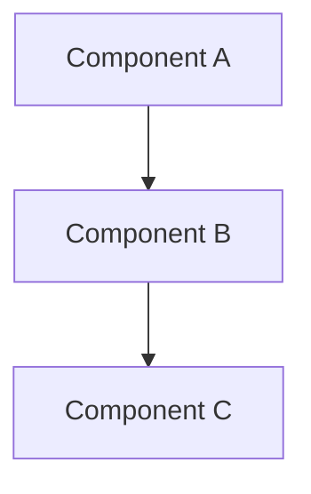

# Template: Feature/Module Documentation

Use this structure when creating a new `docs/` reference page. Copy this file,
rename it to `UPPER_SNAKE_CASE.md`, and fill in the sections.

> **Audience:** `docs/` is for developers (how it works). `docs-site/` is for
> end users (how to use it). Do not duplicate content between the two.
> **Diagrams:** Prefer mermaid wherever a visual aids understanding.
> **No emojis** in prose, headings, or code.

---

# [Feature Name]

## Overview

One-paragraph summary of what this feature/module does and why it exists.

## Architecture

Mermaid diagram showing the components and their relationships.



## How It Works

### [Subsection: key type/trait/flow]

Describe the core types, traits, or data flow. Include code signatures where
helpful.

```rust
pub trait MyTrait: Send + Sync {
    fn name(&self) -> &str;
    fn priority(&self) -> u32 { 100 }
    async fn on_request(&self, request: &mut RequestData) -> Action;
}
```

### [Subsection: configuration/options]

Document configuration options, env vars, CLI flags, or API endpoints relevant
to this feature.

| Option | Default | Description |
|--------|---------|-------------|
| `option_name` | `default` | What it controls |

## API

Link to the relevant API domain page(s) and list key endpoints if applicable.

| Method | Endpoint | Description |
|--------|----------|-------------|
| GET | `/api/example` | Description |

See [API_*.md](API.md) for the full endpoint reference.

## CLI

Key CLI subcommands if applicable (see [MCP-INTEGRATION.md](MCP-INTEGRATION.md)
for the MCP tool surface).

## Web UI

Brief description of the frontend panel if applicable. See
[WEB_FRONTEND.md](WEB_FRONTEND.md) for frontend architecture.

## Examples

Concrete usage examples (API calls, CLI commands, or config snippets).

```bash
madhyamas example --flag value
```

## See Also

- [RELATED_DOC.md](RELATED_DOC.md) — Brief description of relationship
- [ARCHITECTURE.md](ARCHITECTURE.md) — System architecture
