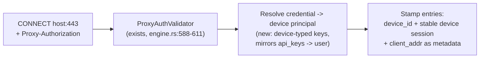
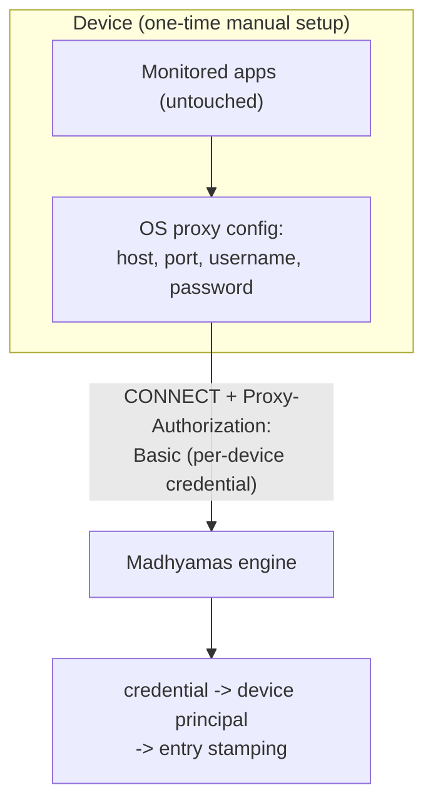
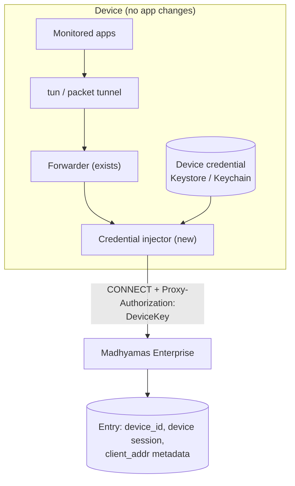
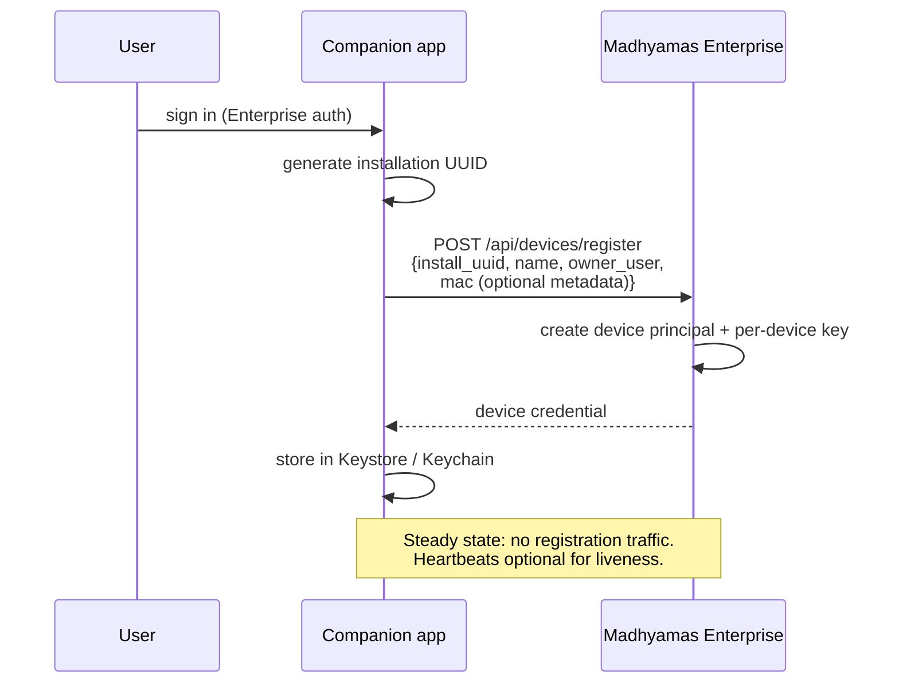

# Per-Device Traffic Scoping and Device Identity (Analysis Document)

Status: draft for maintainer review
Roadmap items: supports
  [Per-app traffic scoping](https://shristilabs.github.io/madhyamas/roadmap#per-app-traffic-scoping)
  and
  [Per-user traffic scoping](https://shristilabs.github.io/madhyamas/roadmap#per-user-traffic-scoping)
  — the device is the third capture principal between them
Origin: design discussion, 2026-09 (maintainer proposal + analysis)
Tracking issue: none yet

## Summary

When several devices (phones, tablets, desktops) share one Madhyamas
instance, their entries are indistinguishable: `client_addr` is dropped at
the accept loop (`crates/madhyamas-core/src/proxy/engine.rs:500`), and the
active session is a single global per instance (`traffic/store.rs:33`). This
document analyses how to identify **which device** produced each entry and
scope **sessions per device**, under one hard constraint: **no changes to
the monitored apps**.

Two findings drive the recommendation:

1. **Identity and steering are orthogonal.** *Identity* (attributing a
   connection to a device) should travel inside the connection as a
   credential. *Steering* (getting device traffic to the proxy) is a
   separate choice — manual proxy configuration or a companion VPN app —
   and both modes can carry the same credential.
2. **Out-of-band correlation (publishing IP/MAC and matching traffic by
   source address) is rejected** — it fails precisely in the cloud/k8s
   deployments this feature targets (NAT/CGNAT) and fragments sessions on
   IP rotation. See the next section.

## Considered and rejected: IP + MAC publishing (out-of-band correlation)

The original proposal: a companion app authenticates to Madhyamas
Enterprise and publishes the device MAC plus its current **public IP**
whenever the IP changes; the proxy attributes connections by source IP;
a new session is created per IP change.

| Failure mode | Why it breaks |
|---|---|
| NAT (cloud/k8s deployment) | The proxy sees the **router's** public IP — phone, laptop, and TV on one home network are indistinguishable. One IP bucket, N devices. |
| CGNAT (mobile data) | Thousands of unrelated carrier customers share one egress IP — attribution is not just ambiguous, it is wrong across tenants. |
| LAN vs published value mismatch | In LAN deployments the proxy sees the **private** IP; a published *public* IP is the wrong key. |
| Session churn | Carriers rotate IPs every few minutes; a 30-minute debugging run fragments into dozens of "sessions". The session stops meaning a debugging timeline and becomes a network lease. |
| Race window | Between the device's IP actually changing and the proxy processing the update, new-IP traffic is unattributed; long-lived connections (WebSockets, TLS sessions) still arrive from the **old** IP, so "current IP" matching misattributes in-flight traffic. A correct version needs timestamped mapping history — still heuristic. |
| MAC as key | MACs never cross routers (invisible to the proxy), are randomized per network by iOS/Android private-address features, and are trivially spoofable. Fine as metadata; useless as the matching key. |

**Verdict:** the proxy sees *connections*, and the only per-connection
identity signal that is exact is one the connection carries itself. An
installation UUID (companion-generated) identifies the device; a credential
derived from it authenticates each connection.

## Identity mechanism: per-device credentials on the proxy protocol

Madhyamas **already parses and validates proxy credentials on every
CONNECT** — `Proxy-Authorization` (Basic/Bearer) and `X-API-Key` at
`engine.rs:588-611`, via `ProxyCredentials` (`engine.rs:62`) and
`ProxyAuthValidator`. Today the identity is validated for access control
and then **discarded**. The change is to stop discarding it:

- **Device principals**: enterprise `api_keys` (`madhyamas-enterprise/src/auth.rs:82-102`)
  already map a key to a user; add device-typed credentials
  (device belongs to a user, may hold its own key). Manual-config devices
  get a username/password pair; companions get a long-lived API key.
- **Stable per-device sessions**: the session survives network changes;
  an IP change is recorded as a metadata event *inside* the session
  ("device moved WiFi -> 4G"), which is more useful for debugging than a
  session boundary.
- **Enforcement as a feature**: requiring proxy auth (`require_proxy_auth`
  policy, per-user doc Stage 2) rejects unconfigured devices — visible
  407s instead of silent mixing. Misconfiguration fails loudly.

## Steering mode 1: manual proxy configuration (no companion)

Per-device credential entered once in the OS WiFi proxy settings. The
monitored apps are untouched; the OS attaches the credential to proxied
requests.

**Where it is enough:** controlled/lab WiFi, proxy-aware apps, iOS devices
(iOS manual proxy supports authentication properly).

**Limits:** per-WiFi-network scope (mobile data gets no proxy at all);
stock Android WiFi proxy exposes no username/password fields (OEM skins
such as Samsung One UI / MIUI add them); non-proxy-aware stacks (some
native libs, Flutter's default HTTP client) never reach the proxy.

## Steering mode 2: companion VPN app

The Android companion already owns a `VpnService` tunnel whose one job is
steering device traffic to the proxy. The extension: a **credential
injector** on the forwarding path — because the companion re-originates the
TCP connections to the proxy, it authors the CONNECT itself and can attach
`Proxy-Authorization` from the device credential (stored in the Android
Keystore). Apps that ignore system proxy settings are covered too, since
tun capture is transparent. **Shipped (issue #111)**: the
`madhyamas://connect` deep link (QR pairing), the enrollment-token
exchange, Android-Keystore-sealed credential storage, per-CONNECT
credential injection with a 407 circuit breaker, and `tls=1` honored for
the proxy connection. Remaining follow-up: the per-app scoping end state
from
[TRAFFIC_SCOPING_PER_APP.md](TRAFFIC_SCOPING_PER_APP.md) Option C.

**One-time pairing** (the surviving part of the original proposal —
authenticated companion publishing to Enterprise, once instead of
continuously):

## Platform capability matrix

| Capability | Android | iOS |
|---|---|---|
| Full-device tunnel | `VpnService` tun — current companion basis | `NEPacketTunnelProvider` — **feasible** (Surge / Shadowrocket / HTTP Catcher prove the model on the App Store) |
| One-time user consent | VPN permission dialog | VPN profile approval in Settings |
| Per-app routing | Native (`addAllowedApplication` / `addDisallowedApplication`) | **MDM only** (per-app VPN on supervised devices) — no consumer equivalent |
| Programmatic WiFi proxy config | No public API; auth fields OEM-dependent | **No public API**; MDM can push global HTTP proxy on supervised devices |
| Manual WiFi proxy + auth | OEM-dependent | Works well (fallback path) |
| Distribution | Sideload APK freely | NetworkExtension entitlement + TestFlight / enterprise certificate; dev tools typically stay out of the App Store |
| Tunnel process memory | Generous | **~50 MB hard cap** on NetworkExtension providers |
| Concurrent VPNs | One active VPN | One active VPN — collides with corporate VPN profiles on managed devices |

**iOS notes.**

- The 50 MB NetworkExtension cap is the main engineering constraint. It is
  *favorable* for this design versus on-device inspectors (HTTP Catcher
  et al.): the companion only shuttles bytes to Madhyamas — bodies are
  stored server-side — so resident memory stays small. Still needs a spike
  to validate sustained throughput.
- Certificate pinning is orthogonal to identity/steering: pinned apps
  reject MITM on every platform regardless of attribution (see
  [CERT_PINNING_OVERRIDES.md](CERT_PINNING_OVERRIDES.md)). iOS also
  requires the Madhyamas CA profile to be manually trusted
  (Settings > General > About > Certificate Trust Settings).

## How it composes with the other scoping work

| Document | Relationship |
|---|---|
| [TRAFFIC_SCOPING_PER_USER.md](TRAFFIC_SCOPING_PER_USER.md) | Stage 2 (proxy-auth -> user attribution) is the **same hook** as this document's identity mechanism; device principals extend it (device belongs to a user). Build once, use for both. |
| [TRAFFIC_SCOPING_PER_APP.md](TRAFFIC_SCOPING_PER_APP.md) | Option B (`client_addr`/`listener`/`sni` metadata) is the shared prerequisite; the companion's per-app routing is that document's Option C, now carrying device identity for free. |
| [CERT_PINNING_OVERRIDES.md](CERT_PINNING_OVERRIDES.md) | Pairs well in mobile workflows: device identity (whose traffic) + pinned-identity override (can we see it at all). |

## Recommended approach

**Build the attribution once; offer both steering modes.** Credential
identity and its enforcement are **Enterprise-tier only** (they matter
when multiple users share an instance — see
[CREDENTIAL_ONBOARDING.md](CREDENTIAL_ONBOARDING.md) *Tier placement*);
the underlying primitives (attribution context, `client_addr`/`device_id`
persistence) land in core, inert in OSS.

1. **Core (shared with per-user Stage 2 / per-app Option B):** stop
   discarding proxy credentials at CONNECT; resolve to a principal (user or
   device); persist `client_addr` as metadata; stable per-device session
   stamping.
2. **Device principals (enterprise):** device registration + per-device
   credentials (username/password for manual config, API key for
   companions); `require_proxy_auth` policy toggle.
3. **Android companion:** pairing flow + Keystore + credential injection
   on the existing forwarding path (flagship for mobile/k8s scenarios:
   mobile data, whole-device coverage).
4. **iOS companion (spike first):** `NEPacketTunnelProvider` +
   injection; validate the 50 MB budget; decide distribution
   (TestFlight vs enterprise cert). Until then iOS uses manual proxy
   credentials.
5. **Never build:** IP/MAC correlation, MAC-as-key, session-per-IP-change
   (rejected above).

## Open questions (maintainers)

1. Model: extend `api_keys` with a device type, or a dedicated `devices`
   table with (install_uuid, owner_user, credentials, name, mac?)?
2. Are per-device sessions the **default** session mode on enterprise
   instances, or opt-in per deployment?
3. Should unauthenticated devices be rejected (`require_proxy_auth` on by
   default) or captured into an admin-visible "unattributed" scope?
4. iOS distribution route for the companion, and is the NE memory budget
   acceptable for debug-scale (not load-test-scale) traffic?
5. Pairing UX: admin pre-issues credentials (device list in the web UI)
   vs companion-initiated registration requests requiring approval?

## Follow-up issues (not yet created)

1. "Persist client_addr + principal stamping at CONNECT" — shared
   foundation (per-user Stage 2, per-app Option B, this document).
2. "Device principals + per-device credentials (enterprise)" —
   registration API, credential issuance, audit events.
3. "Android companion: pairing + credential injection".
4. "iOS companion spike: NEPacketTunnelProvider + injection + memory
   validation".
5. "Docs: per-device onboarding" — end-user guide for both steering modes;
   roadmap update when stages land.

## See also

- [CREDENTIAL_ONBOARDING.md](CREDENTIAL_ONBOARDING.md) — the end-to-end
  UX that provisions these credentials (login, QR, per-device traffic
  view, agent keys)
- [TRAFFIC_SCOPING_PER_USER.md](TRAFFIC_SCOPING_PER_USER.md) — user
  visibility scoping; shares the proxy-auth attribution hook
- [TRAFFIC_SCOPING_PER_APP.md](TRAFFIC_SCOPING_PER_APP.md) — app-level
  scoping; shares the metadata prerequisite and companion routing option
- [ENTERPRISE_AUTH_RBAC.md](ENTERPRISE_AUTH_RBAC.md) — API keys and
  principals today
- [android/README.md](../android/README.md) — current companion VPN app
- [CERT_PINNING_OVERRIDES.md](CERT_PINNING_OVERRIDES.md) — the orthogonal
  "can we decrypt it at all" question for pinned apps
