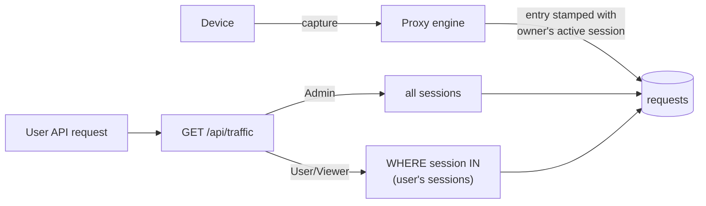

# Per-User Traffic Scoping (Analysis Document)

Status: draft for maintainer review
Roadmap item: "Per-user traffic scoping (Enterprise)" — Planned
  ([public roadmap](https://shristilabs.github.io/madhyamas/roadmap))
Tracking issue: none yet

## Summary

When several people share one Madhyamas Enterprise instance, they all see the
same captured traffic. Roles (Admin, User, Viewer) gate which *actions* a user
may take, but not which *traffic* is visible: any authenticated user can browse
everything the instance captured. This document analyses the options for
per-user traffic visibility, their tradeoffs, and recommends a staged approach
built on the existing session model.

## Problem statement

- **Visibility is all-or-nothing.** `GET /api/traffic` returns every entry in
  the store regardless of who asks. There is no ownership concept anywhere on
  the capture path or in the query path.
- **Compliance exposure.** In team debugging, one engineer's device traffic
  (which may include personal accounts, tokens, push payloads) is browsable by
  every colleague with a login.
- **Multi-device users.** A single user may capture from a phone, a tablet,
  and a desktop simultaneously; the scoping unit must not be "the device".
- **OSS must be unaffected.** The OSS tier has no users; any schema or config
  change must be inert without the enterprise tier.

## Current-state inventory

| Concern | Where it lives today | Notes |
|---|---|---|
| `Session` struct | `crates/madhyamas-core/src/traffic/types.rs:286-295` | `id` (UUIDv4), `name`, `created_at`, `updated_at`. **No owner field.** |
| Active-session selection | `TrafficStore::current_session_id: Mutex<String>` (`crates/madhyamas-core/src/traffic/store.rs:33`) | Exactly **one** active capture session per instance (global mutex). |
| Entry stamping | `engine.rs:682`, `engine.rs:793`, `proxy/pipeline.rs:238,417`, `proxy/socks.rs:625` | Every captured entry gets the global current session ID. |
| Session lifecycle | `create_session` / `switch_session` (`store.rs:~1300-1349`) | Switch validates existence, swaps the mutex, persists to `instance_state` key `current_session_id` (`store.rs:1346`). |
| Cross-instance sync | `sync_current_session()` (`store.rs:1386-1394`) | Other instances adopt the persisted current session — a *global* switch today. |
| Auto-save / rotation | `crates/madhyamas-core/src/auto_save.rs:37-42` (uses `current_session_id` at `:169,:241`) | Assumes the single global current session. |
| Sessions REST | `GET/POST /sessions`, `POST /sessions/{id}/switch`, … (`crates/madhyamas-api/src/routes.rs:34-40`) | `get_sessions` (`handlers.rs:233-243`) is **stubbed** — it returns one hardcoded "Default Session" for the current ID. |
| Sessions UI / clients | `web/src/features/sessions/SessionsPanel.tsx`, `web/src/lib/api/sessions.ts:44-104`, MCP `tools/sessions.rs`, CLI `commands/sessions.rs` | Full create/switch/export surface already built on the API. |
| `TrafficEntry` / `RequestData` | `types.rs:210-242` / `:68-93` | No `client_ip`, `user_id`, `api_key_id`, `listener`, or `sni` fields — no attribution data is persisted. |
| Storage schema | SQLite DDL `SCHEMA_CORE` (`store.rs:69-167`); PostgreSQL mirror (`storage/postgres/traffic.rs:58-103`) | `requests.session_id` FK (indexed). Same columns both backends. |
| Enterprise web auth | `madhyamas-enterprise/src/auth.rs` (JWT `JwtClaims` `:219-236`, API keys `:82-102`), `middleware.rs` `AuthUser` `:358-371` | User identity exists **only** in the axum API router. `AuthUser { user_id, role, key_id, scopes, … }`. |
| Proxy-side auth | `ProxyCredentials` (`engine.rs:62`), validated at CONNECT (`engine.rs:588-611`) | `Proxy-Authorization` / `X-API-Key` are checked against a `ProxyAuthValidator`, then **discarded** — the identity never reaches `TrafficEntry`. |
| Traffic filtering | `TrafficFilter` (`types.rs:358-379`) → SQL in `TrafficStore::get_traffic` (`store.rs:987`) | Supports url/method/status/search/header/cookie/file_type/pagination. **No owner or session filter.** |
| Multi-instance config | PostgreSQL authoritative + Redis pub/sub (`redis_state.rs:124-231`); see [ENTERPRISE_MULTI_INSTANCE.md](ENTERPRISE_MULTI_INSTANCE.md) | `instance_state` table already syncs `current_session_id`; general config propagation still partially planned. |

**Two structural gaps follow from this inventory:**

1. The session is 90% of a per-user scope unit, but it is **globally switched**
   (one mutex per instance) and **unowned** (no user binding).
2. The only place a *device* could announce a user identity — proxy
   credentials at CONNECT — validates and throws the identity away.

## Options considered

### Option A — Session ownership (bind sessions to users)

Add `owner_user_id` (nullable) to `sessions`. Each user gets their own active
session (`current_session_id` becomes a per-user map, persisted in
`instance_state`). Non-admin traffic queries are automatically scoped to
sessions owned by the caller (SQL join through the existing
`requests.session_id` FK). Admins see everything.

**Pros**

- Smallest schema change: one nullable column; entries need no new fields
  (they already carry `session_id`).
- Matches the existing mental model and UI — the session list becomes "my
  sessions" for non-admins.
- Cross-instance story reuses `instance_state` (one key per user instead of
  one global key).
- OSS untouched: owner stays `NULL`, global current session remains the
  default when no users exist.

**Cons**

- Per-user active-session map changes `current_session_id` semantics
  everywhere it is read (`engine.rs`, `pipeline.rs`, `socks.rs`,
  `auto_save.rs` — each needs the calling user's device context, which the
  capture path does not have; see Option B interplay).
- `AutoSaveManager` and the stubbed `get_sessions` endpoint need rework.
- A device capturing without proxy auth cannot be attributed to a user, so
  the "which user's session gets the entry" question needs a policy (see
  Open questions).

### Option B — Per-entry user attribution (stamp `user_id` on requests)

Thread an identity from the CONNECT/accept point into every `TrafficEntry`
and store `requests.user_id`. Identity sources: proxy credentials (already
parsed at `engine.rs:588-611`; enterprise API keys map to users via the
`api_keys` table, `auth.rs:82-102`) or the authenticated API user for
API-originated captures.

**Pros**

- Attribution is exact per entry; survives session switching mid-capture.
- Handles multi-device users and (with proxy auth) multi-user devices
  cleanly.
- Query-time scoping is a single indexed `WHERE user_id = ?`.

**Cons**

- **Useless without proxy-side auth being mandatory**: if devices do not
  present `Proxy-Authorization`/`X-API-Key`, everything lands in an
  "unattributed" bucket. That is a deployment/UX policy change, not just code.
- Schema change on the hot write path, in both SQLite and PostgreSQL
  (`store.rs:849-869`, `storage/postgres/traffic.rs`), plus migration for
  existing rows.
- capture-path signatures churn: `handle_connection` (`engine.rs:511`) and
  the pipeline entry constructors (`pipeline.rs:239,594`) would carry a new
  context value end-to-end.

### Option C — Deployment-level isolation (instance per user)

What the roadmap lists as today's workaround: one Madhyamas instance (with
its own SQLite store) per user.

**Pros**: zero code; strongest isolation; already supported.

**Cons**: operational cost linear in users; enterprise license seats count
instances, so it is also a *cost* workaround; mocks/rewrite rules/config are
not shared; no single fleet view for an admin.

### Option D — Query parameter only (`?session=` filter, no ownership)

Add a `session` filter to `TrafficFilter`/`TrafficQuery` without any user
binding.

**Pros**: trivial (one filter field end-to-end); independently useful for
support workflows ("show me session X").

**Cons**: **no enforcement whatsoever** — any user can query any session ID.
This is a UX nicety, not scoping. It is a stepping stone, never the answer.

## Tradeoff matrix

| Criterion | A: session ownership | B: entry attribution | C: instance/user | D: param only |
|---|---|---|---|---|
| Schema change | 1 nullable column (`sessions`) | column on hot path (`requests`) + migration | none | none |
| Capture-path change | session-id resolution only | new context threaded through engine/pipeline/socks | none | none |
| Enforcement (server-side) | yes (API layer) | yes (API layer) | physical | **no** |
| Multi-device per user | yes | yes | yes (same instance: no) | n/a |
| Works without proxy auth | yes (falls back to unowned bucket) | degraded (unattributed bucket) | yes | n/a |
| Multi-instance readiness | `instance_state` per-user keys | trivial (rows carry user) | n/a | n/a |
| OSS impact | none (NULL owner) | none if column unused | none | none |
| Effort | medium | medium-large | none | small |

## Recommended approach

**Stage A+B, in that order.** Options A and B are complementary, not
competing: A defines the *scope unit and enforcement*, B provides the
*capture-time binding* that makes A airtight on shared instances.

1. **Stage 1 — ownership and enforcement (Option A, plus D).**
   - `sessions.owner_user_id` (NULL = unowned/OSS).
   - Non-admin `GET /api/traffic` scoping in both backends
     (`WHERE session_id IN (SELECT id FROM sessions WHERE owner_user_id = ?)`);
     admins unscoped.
   - `?session=` explicit filter (Option D rides along — same code path).
   - Enterprise session create/switch becomes per-user active session;
     `get_sessions` stops being a stub and lists the caller's sessions
     (admins get all).
   - Unowned sessions (incl. all OSS data): visible to admins only.
   - Audit events for visibility changes (enterprise audit sink already
     exists — [ENTERPRISE.md](ENTERPRISE.md)).
2. **Stage 2 — capture-time attribution (Option B).**
   - Resolve `Proxy-Authorization`/`X-API-Key` at CONNECT
     (`engine.rs:588-611`) to a user via the enterprise API-key store;
     stamp subsequent entries with that user's active session (and
     `user_id`).
   - The same hook resolves **device** principals (a device belongs to a
     user): build the resolution once and use it for both — see
     [TRAFFIC_SCOPING_PER_DEVICE.md](TRAFFIC_SCOPING_PER_DEVICE.md).
   - Policy switch: `require_proxy_auth` (enterprise) — unauthenticated
     devices either land in an admin-visible "unattributed" scope or are
     rejected, per deployment config.
3. **Not recommended now**: changing `AutoSaveManager` beyond reading the
   per-user session; revisit after Stage 1 lands.

**Why this order.** Stage 1 delivers the compliance property (my traffic is
mine) with a small, join-based change and no hot-path churn — the session
machinery is already built and stamped on every entry. Stage 2 then closes
the shared-device/shared-instance hole that Stage 1 alone leaves open
(devices capturing without proxy credentials). Attempting B first would
require the proxy-auth policy decision up front and buys enforcement that
A already provides.

## Explicitly rejected

| Idea | Why rejected |
|---|---|
| Per-user encrypted stores in one process | Key management and store sprawl for no property that row-scoping does not already give; breaks single-store features (global search, admin fleet view). |
| Row-level security (PostgreSQL RLS) | Backend-specific; SQLite deployments would need a parallel mechanism; RLS adds operational fragility for a filter the API layer can apply uniformly. |
| Client-side filtering only | Cosmetic — repeats the existing Focus/filter situation the roadmap explicitly calls out as "per-viewer and cosmetic". |

## Open questions (maintainers)

1. Should sessions be shareable (team debugging on one capture), or is a
   session always personal? If shareable, an ACL table replaces the simple
   owner column.
2. Default visibility of **unattributed** traffic on instances that do not
   require proxy auth: admin-only, or all-users (status quo semantics)?
3. When an admin switches a *user's* session (support workflow), does that
   force-switch the user's devices mid-capture?
4. Does per-user switching need a rate limit / confirmation to avoid two
   users flip-flopping one device in a shared-device lab?

## Follow-up issues (not yet created)

1. "Sessions: add `owner_user_id` + per-user active sessions (enterprise)" —
   schema, store, switch semantics, `instance_state` keys.
2. "Traffic API: owner-scoped queries + `?session=` param" — `TrafficFilter`,
   both backends, `TrafficQuery`, web `useTraffic.ts`.
3. "`get_sessions` endpoint: replace stub with real session list" —
   independent of scoping, found during this analysis.
4. "Proxy-auth → user attribution at CONNECT (enterprise)" — Stage 2,
   `ProxyAuthValidator` extension + entry stamping.

## See also

- [PERSISTENCE.md](PERSISTENCE.md) — sessions/requests schema and the
  `instance_state` sync mechanism
- [ENTERPRISE.md](ENTERPRISE.md) / [ENTERPRISE_AUTH_RBAC.md](ENTERPRISE_AUTH_RBAC.md) —
  users, roles, API keys
- [ENTERPRISE_MULTI_INSTANCE.md](ENTERPRISE_MULTI_INSTANCE.md) — Redis/PG
  state sync that per-user active sessions must ride on
- [TRAFFIC_SCOPING_PER_APP.md](TRAFFIC_SCOPING_PER_APP.md) — the orthogonal
  device-side scoping problem
- [TRAFFIC_SCOPING_PER_DEVICE.md](TRAFFIC_SCOPING_PER_DEVICE.md) — device
  identity via per-device credentials; shares the Stage 2 attribution hook
- [GATEWAY_SCOPING.md](GATEWAY_SCOPING.md) — decision-document format
  precedent and the capability-scoping sibling analysis
