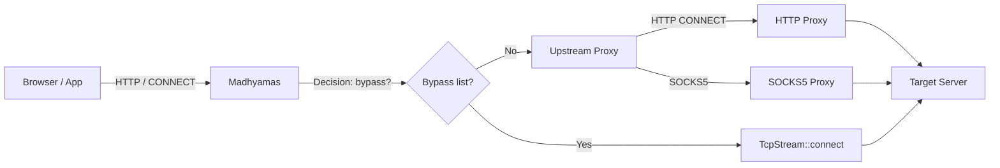
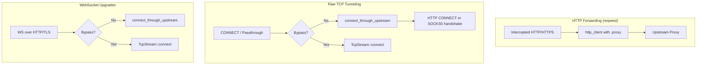
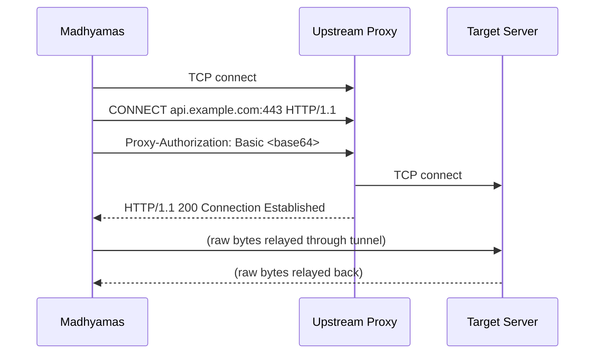
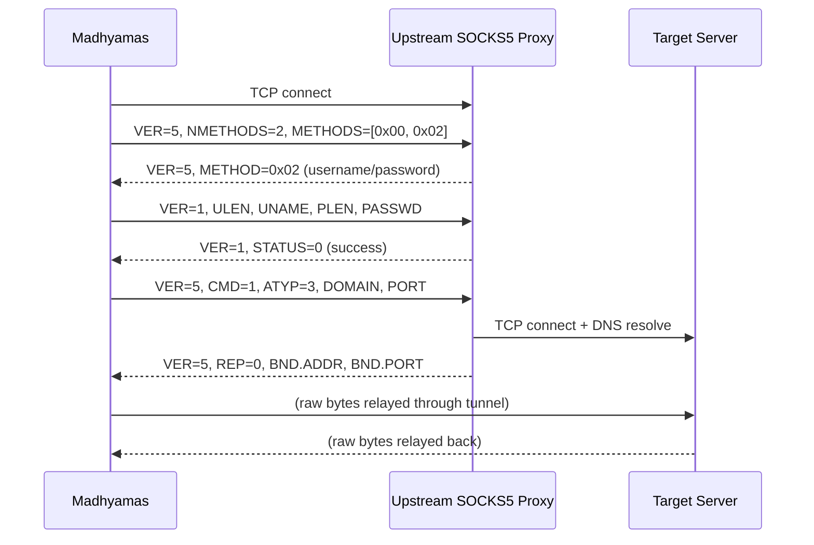

# Upstream Proxy Chaining

Madhyamas can route all outbound traffic through a configurable upstream
(external) proxy. This is essential for corporate networks with a mandatory
egress proxy, for geo-routing through remote proxies, or for chaining
multiple debugging proxies together.

## Supported Protocols

| Protocol | HTTP forwarding (reqwest) | Raw TCP tunneling (CONNECT / passthrough / WebSocket) |
|----------|---------------------------|-------------------------------------------------------|
| `http`   | Yes                       | Yes (HTTP CONNECT)                                    |
| `https`  | Yes (TLS-wrapped CONNECT) | No — use `http` or `socks5` for tunnel paths          |
| `socks5` | Yes                       | Yes (SOCKS5 CONNECT, RFC 1928/1929)                   |

> **Note on `https` upstream proxies:** HTTPS upstream proxies work for the
> HTTP forwarding path (reqwest handles TLS internally) but **not** for raw
> TCP tunneling (CONNECT/passthrough), because the TLS layer cannot be
> returned as a plain `TcpStream`. If you need to tunnel HTTPS traffic
> (CONNECT/passthrough) through an upstream proxy, use `http` or `socks5`.

## Quick Start

### CLI

```bash
# HTTP upstream proxy
madhyamas \
  --upstream-proxy-enabled \
  --upstream-proxy corp-proxy.example.com:8080 \
  --upstream-protocol http

# SOCKS5 upstream proxy with auth
madhyamas \
  --upstream-proxy-enabled \
  --upstream-proxy socks.example.com:1080 \
  --upstream-protocol socks5 \
  --upstream-auth alice:secret

# With a bypass list (don't proxy internal traffic)
madhyamas \
  --upstream-proxy-enabled \
  --upstream-proxy corp-proxy.example.com:8080 \
  --upstream-no-proxy "localhost,127.0.0.0/8,*.internal.corp"
```

### Environment Variables

```bash
export MADHYAMAS_UPSTREAM_PROXY_ENABLED=true
export MADHYAMAS_UPSTREAM_PROXY=corp-proxy.example.com:8080
export MADHYAMAS_UPSTREAM_PROTOCOL=http
export MADHYAMAS_UPSTREAM_AUTH=alice:secret
export MADHYAMAS_UPSTREAM_NO_PROXY="localhost,127.0.0.0/8"
madhyamas
```

### Web UI

Open the Config dialog → **Upstream Proxy** tab. Toggle "Enable Upstream
Proxy", fill in the host/port/protocol, and click **Save Changes**. The
settings are persisted to the config file and survive restarts.

### REST API

```bash
# Get current upstream proxy config
curl http://127.0.0.1:3001/api/config | jq .upstream_proxy

# Enable upstream proxy
curl -X PATCH http://127.0.0.1:3001/api/config \
  -H 'Content-Type: application/json' \
  -d '{
    "upstream_proxy": {
      "enabled": true,
      "protocol": "http",
      "host": "corp-proxy.example.com",
      "port": 8080,
      "auth_username": "alice",
      "auth_password": "secret",
      "no_proxy_hosts": ["localhost", "127.0.0.0/8"]
    }
  }'

# Disable upstream proxy
curl -X PATCH http://127.0.0.1:3001/api/config \
  -H 'Content-Type: application/json' \
  -d '{"upstream_proxy": {"enabled": false}}'
```

> **Security:** The `auth_password` field is write-only — it is never
> returned in `GET /config` responses to avoid leaking credentials.

## CLI Flags

| Flag | Env var | Description |
|------|---------|-------------|
| `--upstream-proxy-enabled` | `MADHYAMAS_UPSTREAM_PROXY_ENABLED` | Enable upstream proxy chaining |
| `--upstream-proxy <host:port>` | `MADHYAMAS_UPSTREAM_PROXY` | Upstream proxy address |
| `--upstream-protocol <http\|https\|socks5>` | `MADHYAMAS_UPSTREAM_PROTOCOL` | Proxy protocol (default: `http`) |
| `--upstream-auth <user:pass>` | `MADHYAMAS_UPSTREAM_AUTH` | Basic-auth (HTTP) or username/password (SOCKS5) |
| `--upstream-no-proxy <list>` | `MADHYAMAS_UPSTREAM_NO_PROXY` | Comma-separated bypass list |

## Bypass List (`no_proxy_hosts`)

The bypass list specifies hosts/CIDRs that should **skip** the upstream
proxy and connect directly. Matching is case-insensitive and supports:

| Pattern | Example | Matches |
|---------|---------|---------|
| Exact hostname | `localhost` | `localhost`, `api.localhost` (suffix match) |
| Suffix match | `example.com` | `example.com`, `api.example.com` |
| Wildcard suffix | `*.internal.corp` | `anything.internal.corp` |
| IPv4 CIDR | `127.0.0.0/8` | `127.0.0.1`, `127.255.255.255` |
| IPv6 CIDR | `::1/128` | `::1` |

## How It Works

### Architecture



### Traffic Paths

Madhyamas has three outbound traffic paths, each handled differently:



1. **HTTP forwarding (reqwest):** Intercepted HTTP/HTTPS requests use the
   shared `reqwest::Client`, which is configured with `.proxy()` at engine
   startup. This path supports `http`, `https`, and `socks5` upstream
   protocols. **Changing the upstream proxy protocol/host/port requires a
   restart** for this path to pick up the new proxy (the reqwest client is
   built once at startup).

2. **Raw TCP tunneling (CONNECT / SSL passthrough):** The
   `connect_through_upstream()` function in
   `crates/madhyamas-core/src/proxy/upstream_proxy.rs` performs the
   HTTP CONNECT or SOCKS5 client handshake. This path reads the live config
   on each connection, so **bypass list and auth credential changes take
   effect immediately** for new connections.

3. **WebSocket upgrades:** Both HTTP and TLS WebSocket upgrade paths check
   the bypass list and tunnel through the upstream proxy when appropriate.

### HTTP CONNECT Handshake



### SOCKS5 Handshake



## Configuration Reference

### `UpstreamProxyConfig` struct

```rust
pub struct UpstreamProxyConfig {
    pub enabled: bool,
    pub protocol: String,        // "http", "https", "socks5"
    pub host: String,
    pub port: u16,
    pub auth_username: Option<String>,
    pub auth_password: Option<String>,
    pub no_proxy_hosts: Vec<String>,
}
```

### API response shape (`GET /api/config`)

```json
{
  "upstream_proxy": {
    "enabled": true,
    "protocol": "http",
    "host": "corp-proxy.example.com",
    "port": 8080,
    "auth_enabled": true,
    "auth_username": "alice",
    "no_proxy_hosts": ["localhost", "127.0.0.0/8"]
  }
}
```

> `auth_password` is never included in GET responses.

### API patch shape (`PATCH /api/config`)

All fields are optional — only provided fields are mutated:

```json
{
  "upstream_proxy": {
    "enabled": true,
    "protocol": "socks5",
    "host": "socks.example.com",
    "port": 1080,
    "auth_username": "alice",
    "auth_password": "secret",
    "no_proxy_hosts": ["localhost", "10.0.0.0/8"]
  }
}
```

To clear credentials, set `auth_username` and `auth_password` to `null`.

## Implementation Details

### Files Modified

| File | Change |
|------|--------|
| `crates/madhyamas-core/src/config.rs` | `UpstreamProxyConfig` struct, helpers (`proxy_url`, `auth_enabled`, `should_bypass`), `ProxyConfig::upstream_proxy_active()` / `should_bypass_upstream()` |
| `crates/madhyamas-core/src/lib.rs` | Re-export `UpstreamProxyConfig` |
| `crates/madhyamas-core/src/proxy/mod.rs` | Register `upstream_proxy` module |
| `crates/madhyamas-core/src/proxy/upstream_proxy.rs` | **New** — client-side HTTP CONNECT and SOCKS5 handshake |
| `crates/madhyamas-core/src/proxy/engine.rs` | `http_client` proxy config, `handle_passthrough_tunnel` + WebSocket upgrades tunnel through upstream |
| `crates/madhyamas-api/src/handlers.rs` | `get_config` / `patch_config` expose upstream proxy fields |
| `crates/madhyamas/src/main.rs` | CLI flags, `build_upstream_proxy_config()` helper, startup logging |
| `Cargo.toml` (workspace) | Enable `socks` feature for `reqwest` |
| `web/src/features/config/ConfigDialog.tsx` | `UpstreamProxyTab` loads/saves via API instead of localStorage |

### Testing

The pure protocol functions are unit-tested without any I/O:

```bash
# Config struct + bypass list + proxy URL
cargo test -p madhyamas-core --lib config::

# HTTP CONNECT request building + response parsing
# SOCKS5 greeting / auth / connect request building + reply parsing
cargo test -p madhyamas-core --lib upstream_proxy

# CLI flag parsing helpers
cargo test -p madhyamas
```

71 new unit tests cover:
- `UpstreamProxyConfig` serialization/deserialization roundtrips
- `proxy_url()` for http/https/socks5 protocols
- `should_bypass()` for exact, suffix, wildcard, CIDR (IPv4/IPv6) matching
- `build_http_connect_request()` with/without auth
- `parse_http_connect_response()` success, failure, incomplete, malformed
- `build_socks5_greeting()`, `build_socks5_auth_request()`, `build_socks5_connect_request()`
- `parse_socks5_method_reply()`, `parse_socks5_auth_reply()`, `parse_socks5_connect_reply()`
- CLI `parse_host_port()` and `parse_auth_credentials()` helpers

## Limitations & Future Work

- **HTTPS upstream proxy for tunneling:** Not supported for raw TCP
  tunneling (CONNECT/passthrough) because the TLS layer cannot be returned
  as a plain `TcpStream`. Use `http` or `socks5` for tunnel paths. A future
  improvement could use a type-erased `Box<dyn AsyncRead + AsyncWrite>` to
  support TLS-wrapped tunnels.
- **reqwest client rebuild:** Changing the upstream proxy protocol/host/port
  via the API requires a restart for the HTTP forwarding path to pick up
  the new proxy. The bypass list and auth credentials are read live.
- **PAC/WPAD:** Proxy auto-config (PAC) files are not supported. The
  upstream proxy must be specified explicitly.
- **NTLM/Kerberos auth:** Only Basic auth (HTTP) and username/password
  (SOCKS5) are supported. NTLM and Kerberos are not implemented.
