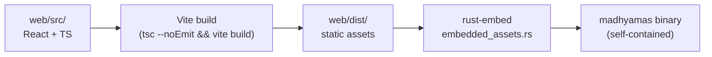
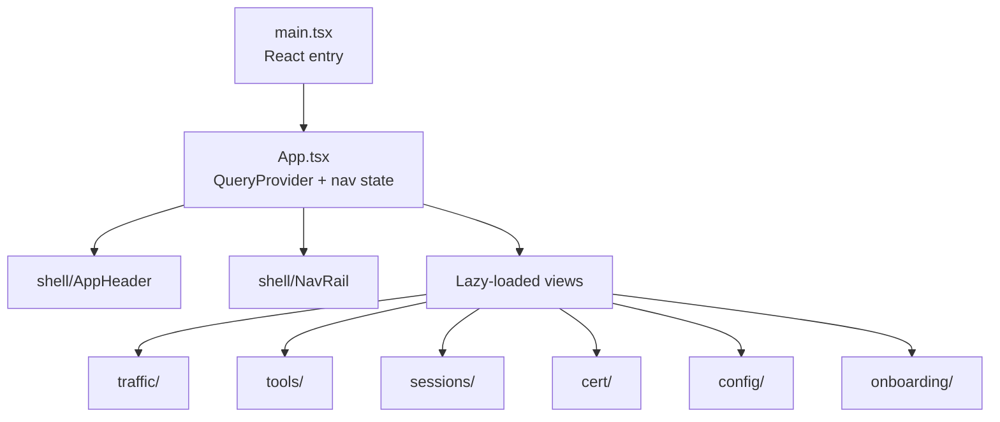

# Web Frontend

> **Last verified:** 2026-08-12 against Madhyamas `0.1.6`.

## Overview

The Madhyamas web UI is a React 18 + TypeScript single-page application built
with Vite. It is embedded into the Rust binary at compile time via `rust-embed`,
so the release binary is fully self-contained. The frontend lives in `web/`.

## Tech Stack

| Layer | Technology |
|-------|-----------|
| Framework | React 18 |
| Language | TypeScript |
| Build tool | Vite 5 |
| Styling | Tailwind CSS 3 |
| Component library | shadcn/ui (Radix UI primitives) |
| Server state | TanStack Query 5 |
| Virtualization | @tanstack/react-virtual |
| Icons | lucide-react |
| Code editor | react-ace / ace-builds |
| JSON viewer | react-json-view-lite |
| Syntax highlighting | prismjs |
| Query languages | jmespath, jsonpath-plus |
| QR codes | qrcode.react |

> **Note:** State management uses TanStack Query for server state and React
> hooks (`useState`/`useEffect`) for local component state. There is no Zustand
> store — custom hooks handle domain-specific state.

## Build Flow



1. `npm run build` runs `tsc --noEmit` (type-check) then `vite build`.
2. Vite outputs hashed assets to `web/dist/` with manual chunks for vendors
   (`react-vendor`, `radix-vendor`, `icons`, `json-view`, `qrcode`, `ace-editor`).
3. `crates/madhyamas-api/src/embedded_assets.rs` embeds `web/dist/` at compile
   time via `#[derive(RustEmbed)]`.
4. At runtime, `embedded_fallback` serves embedded assets with SPA fallback to
   `index.html`, immutable cache headers for hashed assets, and MIME detection
   via `mime_guess`.
5. **Dev override**: set `MADHYAMAS_WEB_DIR` to serve assets from disk instead
   of the embedded bundle (for frontend development without rebuilding Rust).

### Vite dev server

- Port: `5174`
- Proxies `/api` → `http://127.0.0.1:3001` (backend API)
- WebSocket proxy enabled for real-time updates

## Application Structure



There is **no client-side router**. Navigation is state-based via an
`activeView` string (default: `"traffic"`). All tool panels are lazy-loaded via
`React.lazy()` for code splitting.

### Views

`traffic`, `breakpoints`, `blocklist`, `throttle`, `mocks`, `rewrites`,
`replay`, `mirror`, `grpc`, `scripts`, `plugins`, `sessions`.

## Feature Modules (`web/src/features/`)

| Module | Key components | Purpose |
|--------|----------------|---------|
| `traffic/` | `TrafficView`, `TrafficList`, `TrafficTimeline`, `TrafficDetail`, `TrafficToolbar`, `FilterBuilder`, `FocusPanel`, `RequestEditor`, `JsonView` | Traffic inspection (list + waterfall timeline), filtering, focus, edit-then-repeat |
| `tools/` | `BreakpointsPanel`, `BlockListPanel`, `ThrottlePanel`, `MocksPanel`, `MockEditDialog`, `RewritesPanel`, `ReplayPanel`, `MirrorPanel`, `GrpcPanel`, `ScriptsPanel`, `ScriptCodeEditor`, `ScriptGuide`, `PluginsPanel`, `PluginInstallDialog`, `PluginRegistryBrowser`, `PluginSettingsForm`, `PluginLogs` | All intercept and extension tool panels |
| `sessions/` | `SessionsPanel` | Session list, create/delete/switch, import/export |
| `cert/` | `CertificatePanel`, `CertificateHelper` | CA certificate download and install guidance |
| `config/` | `ConfigDialog` | Multi-tab config (Runtime, Upstream Proxy, Capture, Appearance, Auto Save, Mirror) |
| `onboarding/` | `OnboardingWizard` | First-time setup flow |
| `shell/` | `AppHeader`, `NavRail` | App shell (top bar + left nav) |

## API Client (`web/src/lib/api/`)

The frontend uses the native `fetch` API (no axios) with typed helpers in
`web/src/lib/api/client.ts`:

| Helper | Description |
|--------|-------------|
| `apiGet<T>(path)` | GET with JSON response |
| `apiGetText(path)` | GET with text response |
| `apiGetRaw(path)` | GET with raw `Response` (for blobs) |
| `apiPost<T>(path, body)` | POST with JSON body |
| `apiPostVoid(path, body)` | POST without parsing response |
| `apiPut<T>(path, body)` | PUT with JSON body |
| `apiPatch<T>(path, body)` | PATCH with JSON body |
| `apiDelete<T>(path)` | DELETE with JSON response |
| `apiDeleteVoid(path)` | DELETE without parsing response |

Base URL: `/api` (relative). Custom `ApiError` class carries `status` and
`body`. API modules are split by domain: `intercept.ts`, `tools.ts`,
`sessions.ts`, `cert.ts`, `autosave.ts`, `mirror.ts`.

## State Management

### TanStack Query

Configured with `refetchOnWindowFocus: false` and `staleTime: 1000ms`. Query
keys are domain-scoped, e.g. `['traffic']`, `['mocks']`, `['scripts']`,
`['plugins']`, `['sessions']`, `['grpc-frames']`, `['plugin-registry']`.

### Custom hooks (`web/src/hooks/`)

| Hook | Purpose |
|------|---------|
| `useTraffic` | Traffic data fetching (WebSocket or polling mode) |
| `useTrafficWebSocket` | WebSocket connection for real-time traffic updates |
| `useWebSocket` | Generic WebSocket hook with exponential backoff reconnection (1s → 30s, 10 attempts) |
| `useCaptureStats` | Recording quota statistics |

## WebSocket Client

`useTrafficWebSocket` connects to `/api/ws` (auto-detects `ws`/`wss`) and
handles all `WsServerMessage` variants:

| Message | Handling |
|---------|----------|
| `InitialTraffic` | Populate initial traffic list on connect |
| `Traffic.Added` | Append new entry |
| `Traffic.Updated` | Update existing entry |
| `Traffic.Deleted` | Remove entries |
| `Traffic.Cleared` | Clear all entries |
| `Traffic.CountUpdate` | Update count |
| `Connected` | Store client ID |
| `Error` / `Pong` | Error handling / heartbeat |

Local traffic state is held in an in-memory array within the hook. See
[API_WEBSOCKET_GRPC.md](API_WEBSOCKET_GRPC.md) for the message schema.

## Component Library (`web/src/components/`)

shadcn/ui components (built on Radix UI + Tailwind) in `web/src/components/ui/`:
`accordion`, `badge`, `button`, `card`, `checkbox`, `dialog`,
`dropdown-menu`, `input`, `label`, `popover`, `scroll-area`, `select`,
`separator`, `slider`, `switch`, `tabs`, `textarea`, `toast`/`toaster`/
`use-toast`, `tooltip`.

Custom: `ErrorBoundary.tsx`.

## Types (`web/src/types/`)

| File | Key types |
|------|-----------|
| `traffic.ts` | `RequestData`, `ResponseData`, `TrafficEntry`, `HttpMethod`, `TrafficFilter`, `Session`, `FocusHost` |
| `websocket.ts` | `TrafficEntrySnapshot`, `TrafficEvent`, `WsServerMessage`, `WsClientMessage`, `TrafficSubscriptionFilter`, `WsConnectionState`, `WsConnectionInfo` |
| `filters.ts` | `FilterCategory`, `FilterOperator`, `FilterFieldDef`, `ActiveFilter`, `FILTER_FIELDS` (16 filterable fields), `matchesFilter()`, `applyFilters()` |

## Development

```bash
cd web
npm install
npm run dev        # Vite dev server on :5174 (proxies /api to :3001)
npm run build      # tsc --noEmit && vite build → web/dist/
npm run build:fast # vite build (skip type-check)
npm run typecheck  # tsc --noEmit
npm run lint       # ESLint
```

> **Important:** The frontend must be built (`npm run build`) before rebuilding
> the Rust binary, because assets are embedded at compile time. For live
> frontend development without rebuilding Rust, set `MADHYAMAS_WEB_DIR=web/dist`
> and run the Rust binary separately.

## See Also

- [ARCHITECTURE.md](ARCHITECTURE.md) — System architecture
- [API.md](API.md) — API reference
- [API_WEBSOCKET_GRPC.md](API_WEBSOCKET_GRPC.md) — WebSocket message schema
- [DEVELOPMENT.md](DEVELOPMENT.md) — Development workflow
- [TIMELINE_VIEW.md](TIMELINE_VIEW.md) — Waterfall timeline view
